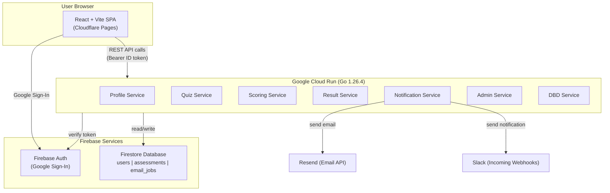

# Architecture

## Design Principles

- Use only free tiers from GCP and Cloudflare as much as possible.
- Keep each domain capability as an independent serverless microservice.
- Monorepo with Makefile for unified builds, linting, and testing across frontend and backend.

## Monorepo Layout

```
factory-sync-solutions/
├── apps/
│   ├── web/                  # React + Vite SPA
│   │   ├── src/
│   │   ├── e2e/
│   │   ├── package.json
│   │   └── vite.config.ts
│   └── api/                  # Go backend services
│       ├── services/
│       │   ├── profile/
│       │   ├── quiz/
│       │   ├── scoring/
│       │   ├── result/
│       │   ├── notification/
│       │   ├── admin/
│       │   └── dbd/              # DBD DataWarehouse company lookup
│       ├── go.mod
│       └── main.go
├── Makefile
├── package.json
└── docs/
```

## Platform Split

| Concern | Platform |
|---------|----------|
| Frontend SPA hosting | Cloudflare Pages |
| DNS / CDN / WAF | Cloudflare |
| Authentication | Firebase Authentication (Google Sign-In) |
| Core data store | Firestore (Spark/free-tier limits) |
| Containerized APIs | Google Cloud Run with Go 1.26.4 (Docker) |
| Monorepo | Makefile (previously Turborepo) |
| Source control | GitHub |
| CI/CD | GitHub Actions |
| Slack notifications | Slack Incoming Webhooks |
| Async/background tasks | Cloud Tasks or Cloud Scheduler (if needed) |
| File/report artifacts (future) | Cloud Storage |

## Microservices

Logical service boundaries:

| Service | Responsibility |
|---------|---------------|
| `profile-service` | User/company profile create/update/read |
| `quiz-service` | Questionnaire definition and answer submission |
| `scoring-service` | Compute dimension scores, strengths, weaknesses, final diagnosis |
| `result-service` | Persist and fetch result summaries |
| `notification-service` | Send result email and Slack notifications after submission |
| `admin-service` | Admin analytics queries and management endpoints (role-protected) |
| `dbd-service` | Thai DBD DataWarehouse company lookup by registration ID |

## MVP Integration Flow

1. SPA authenticates user with Firebase Google Sign-In.
2. Role is resolved (`user` or `admin`) via Firebase custom claims and/or profile record.
3. User must complete registration profile; if incomplete, force redirect to `/register`.
4. Registered users send quiz answers to `quiz-service`.
5. `scoring-service` computes diagnosis payload.
6. `result-service` stores result in Firestore.
7. `notification-service` sends email to authenticated user email.
8. `notification-service` sends Slack notification to configured channel.
9. Admin flow: `/admin` calls `admin-service` for filtered metrics and result views.

## Route Access Policy

| Route | Access Level |
|-------|-------------|
| `/` | Public |
| `/register` | Authenticated only |
| `/quiz`, `/results` | Authenticated + registered |
| `/profile` | Authenticated + registered |
| `/admin` | Authenticated + admin role |

## GA4 Event Tracking

- `sign_in_google_success`
- `registration_completed`
- `quiz_started`
- `quiz_submitted`
- `result_viewed`
- `result_email_sent`

## Admin Dashboard (MVP Scope)

- Same frontend application, separate protected route group (`/admin`).
- Access allowed only for users with admin role.
- Initial admin capabilities:
  - View submissions and diagnosis results
  - Filter by industry and company size
  - View basic summary charts
  - CSV export (optional)
- All admin APIs must enforce role checks server-side (do not rely on frontend checks only).

## Admin Analytics & BI (Phase 2)

MVP admin charts are served from Firestore + Cloud Functions at low cost. BigQuery + Looker become valuable when larger-scale analysis is needed.

**Phase 1 (MVP)**: Admin dashboard reads operational data from Firestore via `admin-service`.

**Phase 2 (BI)**: Export Firestore/events to BigQuery, build curated tables, connect Looker Studio dashboards.

Phase 2 outputs:
- Industry benchmark dashboards
- Funnel and cohort analysis
- Time-based trends (weekly/monthly health score movement)
- Cross-company and segment comparison for management reporting

## Architecture Diagram



## API Authentication & CORS

### Authentication Flow

1. SPA authenticates user with Firebase Google Sign-In and obtains a Firebase ID token.
2. For every API call, the SPA sends the ID token in the `Authorization` header: `Bearer <firebase-id-token>`.
3. The Go Cloud Run service verifies the token using the Firebase Admin SDK (`auth.VerifyIDToken`).
4. The verified `uid` is used to scope data access and enforce role-based permissions.

### CORS

Go API endpoints must allow cross-origin requests from the SPA:
- **Allowed origins**: `https://factory-sync-solutions.pages.dev`, `https://factory-sync-solutions-staging.pages.dev`, `http://localhost:5173` (dev)
- **Allowed methods**: `GET`, `POST`, `PUT`, `DELETE`, `OPTIONS`
- **Allowed headers**: `Authorization`, `Content-Type`
- **Credentials**: `true` (for cookie-based sessions if needed)

### Rate Limiting

Apply rate limiting on Go API endpoints to prevent abuse:
- **Per-instance in-memory limiter**: 10 requests/second burst per IP (defense-in-depth)
- Use Cloudflare WAF rate limiting rules as the primary layer for global rate limiting. See [security-guide.md](security-guide.md#rate-limiting) for details.

### Cloudflare Turnstile (Bot Protection)

Used on the registration form to prevent bot signups:
- Frontend renders the Turnstile widget using `VITE_CF_TURNSTILE_SITE_KEY`.
- On form submit, the Turnstile token is sent to the Go backend.
- Backend verifies the token with the Cloudflare Turnstile API using a server-side secret.

## API Documentation (Swagger/OpenAPI)

> **Status**: Not yet implemented. Swagger annotations exist in handler code but swaggo is not installed and the Swagger UI route is commented out in `main.go`. See [swagger-openapi.md](swagger-openapi.md) for the planned setup.

When implemented:
- Auto-generate from Go source code using `swaggo/swag`
- Serve Swagger UI at `/api/v1/swagger/` in non-production environments
- Regenerate in CI before each build

## Quiz Data Source

Quiz questions are stored as a **static JSON/YAML config** bundled with the Go backend (not in Firestore). This allows:
- Version-controlled question changes via Git
- Easy review in PRs before deployment
- No Firestore read costs for question definitions

Location: `apps/api/config/questions.json`

Future: Admin UI for managing questions (Phase 2), which would migrate to Firestore.

## Email Service

**Chosen**: Resend (free tier: 3,000 emails/month)
- Simple REST API, modern DX
- React Email for template authoring (optional)
- HTML email template with responsive design
- Content: Overall score, dimension breakdown, strengths/weaknesses, summary

## Email Result Flow (MVP)

After quiz submission:
1. Generate a concise result summary payload (overall score + dimension scores + strengths + weaknesses).
2. Persist submission/result.
3. Trigger email delivery to the authenticated user's email.
4. Show success/failure toast for email dispatch status.

## Slack Notifications

Slack Incoming Webhooks are used to send real-time notifications to a designated Slack channel.

### Notification Events

| Event | Trigger | Channel | Payload |
|-------|---------|---------|---------|
| New user registration | User completes registration form | `#registrations` | Name, company, industry, timestamp |
| Quiz result submitted | Scoring completes after quiz submission | `#quiz-results` | Company name, overall score, diagnosis category |
| CI/CD pipeline status | GitHub Actions workflow completes | `#ci-cd` | Branch, workflow name, status (pass/fail), commit link |
| Server status | Cloud Function health check or error threshold | `#server-status` | Service name, status, error details (if any) |

### Implementation

**Application events** (registration, quiz results): Sent from the Go `notification-service` via Slack Incoming Webhook API after the corresponding action completes.

**CI/CD events**: Sent from GitHub Actions workflows using the `slackapi/slack-github-action` action at the end of each pipeline.

**Server status**: Sent from Cloud Monitoring alerts or a scheduled health-check Cloud Function that pings each service endpoint.

### Environment Variables

```bash
SLACK_WEBHOOK_REGISTRATION=     # Webhook URL for #registrations channel
SLACK_WEBHOOK_QUIZ_RESULT=      # Webhook URL for #quiz-results channel
```

## Implemented Features (beyond MVP)

- **Multi-language support (TH/EN)**: Language switcher in header, `useLocale()` hook, bilingual quiz config (`textTh`/`textEn`, `nameTh`/`nameEn`)
- **DBD company lookup**: Auto-prefill company info from Thai DBD DataWarehouse via `dbd-service`
- **Profile management**: Editable company profile page at `/profile`

## Future Enhancements

- Persistent result history per company (partially done — previous assessments shown)
- PDF export for diagnosis report
- Benchmark comparison by industry/size
- Theme support: dark mode and light mode

## Next Phase: Legal & Compliance

Add legal pages and consent controls before broader production rollout:
- Terms & Conditions page (`/terms`)
- Privacy Policy page (`/privacy`)
- Cookie Consent banner/preferences center

Initial legal implementation scope:
- Block non-essential analytics cookies until consent is granted.
- Store consent state with timestamp and policy version.
- Allow users to update/revoke cookie preferences.
- Add footer links to legal pages from all public/auth pages.

---

## Changelog

| Version | Date | Description |
|---------|------|-------------|
| 1.0.0 | 2026-03-06 | Initial version |
| 1.1.0 | 2026-03-07 | Updated: Cloud Functions -> Cloud Run, added DBD service, fixed rate limiting values, fixed webhook var names, updated Swagger status, added i18n as implemented feature |
