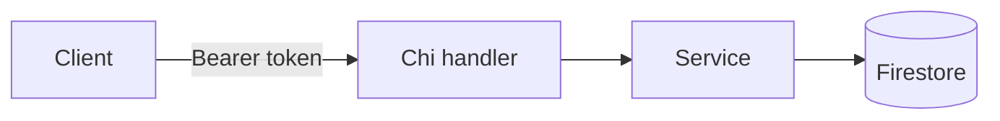

<!--
  FEATURE SPEC TEMPLATE (the index for a feature folder).
  Modeled on docs/product/quiz/ and docs/product/shortlink/.

  How to use:
  1. Copy this whole _template/ folder to docs/product/<feature>/.
  2. Replace every <placeholder>. Delete sections that don't apply (don't leave empty headings).
  3. README.md = the design index. status.md = the live progress tracker.
     feature-spec.md (the ISO 29110 SRS) is the formal requirements doc — copy it from
     docs/iso29110/srs-template.md and fill it in BEFORE writing code (dev-process.md § SI.2).
     This README links to it; it does NOT replace it.
     user-journeys.md = per-app user flows (copy it for any user-facing feature).
     Add one sub-doc per non-trivial component (copy component-spec.md).
  4. Keep the Table of Contents in sync with the headings.
  5. Every *.md ends with the Version + Last-updated footer.
  6. Diagrams use Mermaid blocks, never image links. Docs use pseudocode/contracts, never real code.
  Remove this comment block before committing.
-->

# <Feature Name> — Feature Spec

**Status:** <emoji> <one-line status — what's implemented vs. planned>

---

## Table of Contents

1. [App surfaces](#app-surfaces)
2. [Summary](#summary)
3. [Goals & Non-Goals](#goals--non-goals)
4. [Current State](#current-state)
5. [Design Overview](#design-overview)
6. [Build Sequence](#build-sequence)
7. [Security Invariants](#security-invariants)
8. [Acceptance Criteria](#acceptance-criteria)
9. [Testing](#testing)
10. [Open Items & Future Work](#open-items--future-work)
11. [References](#references)

---

> One-paragraph overview of what this feature is and the problem it solves. Name the
> service(s) it touches, the primary actors (factory operator, backoffice staff, super
> admin), and any external standards/services it builds on (DBD API, Firebase, Resend, …).
> Keep it to 4–6 lines.

This README is the design index for the <Feature Name> feature. The formal requirements
live in the ISO 29110 SRS — see [feature-spec.md](./feature-spec.md). Each non-trivial
component is documented in a dedicated sub-document; see [References](#references).

---

## App surfaces

<!-- Which app surfaces this feature touches. The repo has three apps:
     web-app (authenticated React app — includes backoffice routes),
     web-official (public Astro marketing site), backend (Go API).
     Drop a column the feature never touches; delete the whole section for a backend-only feature.
     Legend: ✅ built · 📋 planned · ⬩ indirect (backend-only / shared context, no UI) · — n/a -->

| web-app | web-official | backend |
|:----------:|:---------------:|:----------:|
| <✅/📋/⬩/—> | <✅/📋/⬩/—> | <✅/📋/⬩/—> |

Per-app flows for each surface above live in [user-journeys.md](./user-journeys.md).

---

## Summary

<!-- A scannable table is the usual format. For phased features, include a Phase column. -->

| Component | Description | Phase |
|-----------|-------------|-------|
| **<Component>** | <what it does> | Phase 1 — MVP |
| **<Component>** | <what it does> | Phase 2 |

---

## Goals & Non-Goals

### Goals

- <Specific, verifiable goal>
- <Specific, verifiable goal>

### Non-Goals

- <Explicitly out of scope — this is what stops scope creep; be concrete>
- <Explicitly out of scope>

---

## Current State

See [status.md](./status.md) for the per-component implementation checklist (shipped vs.
planned, and which phase each item belongs to). [Build Sequence](#build-sequence) below has
the file-level task breakdown for everything not yet started.

---

## Design Overview

<!-- The architectural heart of the spec. Backend contract first, then UI
     (per .claude/rules/dev-process.md). Link to sub-docs rather than duplicating.
     Use Mermaid for flows and data models. -->

### Data model

<!-- Firestore collections. Document IDs and field names in camelCase; booleans use Is*/Has*.
     Note any composite indexes needed in firestore.indexes.json. -->

| Collection | Document ID | Key fields | Notes |
|------------|-------------|------------|-------|
| `<collection>` | `<userID>` / `<assessmentID>` | `field: type` | <index?> |

### API contract

<!-- Endpoints: method + path + auth/role guard. Responses ALWAYS via pkg.RespondJSON /
     pkg.RespondList / pkg.RespondError — never raw JSON. UID from middleware.GetUID(r),
     never the body or path. Sentinel errors are domain-specific (ErrXxxNotFound). -->

| Method | Path | Auth / Role | Purpose |
|--------|------|-------------|---------|
| `POST` | `/api/v1/<...>` | Bearer | <purpose> |
| `GET`  | `/api/v1/<...>` | Bearer · `backoffice` | <purpose> |

---

## Build Sequence

<!-- Numbered, file-level task list — the implementation order. Group by phase if phased.
     Each row names the file(s) so the work is unambiguous. status.md tracks these. -->

### Phase 1 — MVP

| # | Task | File(s) |
|---|------|---------|
| 1 | <task> | `apps/backend/services/<name>/models.go` |
| 2 | <task> | `apps/backend/services/<name>/service.go` |
| 3 | <task> | `apps/backend/services/<name>/handler.go` |
| 4 | <task> | `apps/web-app/src/store/<feature>Slice.ts` |
| 5 | <task> | `apps/web-app/src/pages/<Page>.tsx` |

---

## Security Invariants

<!-- Per-feature security contract. Cross-check against .claude/rules/go.md and CLAUDE.md:
     Firebase token verified, UID from middleware.GetUID(r) only, role claims checked
     server-side before mutations, errors wrapped, no secrets in source. -->

| Invariant | Where enforced |
|-----------|----------------|
| UID taken from `middleware.GetUID(r)`, never the request body/path | `services/<name>/handler.go` |
| <role>-gated endpoint verifies the Firebase custom claim server-side | `middleware/` + `handler.go` |
| <invariant> | `<file / layer>` |

---

## Acceptance Criteria

<!-- Group by component/phase. Each item is testable as written — include the deny path
     (401/403/404/409), not just the happy path. Link to the relevant sub-doc. -->

**<Component> (Phase 1)** — see [<sub-doc>.md](./<sub-doc>.md)
- [ ] Given <precondition>, when <action>, then <observable result>.
- [ ] Given <no/invalid token>, when <action>, then `401 UNAUTHENTICATED`.
- [ ] Given <wrong role>, when <action>, then `403 FORBIDDEN`.

---

## Testing

<!-- Map each package/file to what it covers. Backend coverage target ≥ 80% for critical
     services (CLAUDE.md / dev-process.md). Table-driven tests; assert error paths. -->

| Package | Target | Phase | Notes |
|---------|--------|-------|-------|
| `services/<name>/service_test.go` | <funcs under test> | 1 | <mocks / cases> |
| `services/<name>/handler_test.go` | <handlers> | 1 | <deny-path cases> |

Coverage target: critical `services/` ≥ 80% (`go test ./... -cover`).

---

## Open Items & Future Work

### Blocked on other features

| # | Area | Description |
|---|------|-------------|
| 1 | <area> | <what's needed and from where> |

### Open decisions

| # | Decision | Resolution |
|---|----------|------------|
| 1 | <decision> | **Open**: <leaning / default until decided> |

---

## References

### Sub-documents

| Doc | Covers |
|-----|--------|
| [feature-spec.md](./feature-spec.md) | ISO 29110 SRS — formal requirements (copy from `docs/iso29110/srs-template.md`) |
| [status.md](./status.md) | Current implementation status per component |
| [user-journeys.md](./user-journeys.md) | Per-app user flows (drop if no user-facing surface) |
| [<sub-doc>.md](./<sub-doc>.md) | <what it specifies> |
| [mockups/<surface>.md](./mockups/<surface>.md) | ASCII UI wireframes per app surface (drop if no UI) |

### ISO 29110 artifacts

- Test plan: copy `docs/iso29110/test-plan-template.md` → [test-plan.md](./test-plan.md)
- Design (non-trivial): copy `docs/iso29110/sdd-template.md` → `docs/architecture/<feature>-design.md`
- Log scope changes in [docs/iso29110/change-request-log.md](../../iso29110/change-request-log.md)
- New risks → [docs/iso29110/risk-register.md](../../iso29110/risk-register.md)

### Cross-references

- [Architecture overview](../../architecture/overview.md) · [Database](../../architecture/database.md) · [Decisions](../../architecture/decisions.md)
- [<Related feature>](../<feature>/README.md)

### External standards

- <Standard / RFC / vendor doc>: <url>

---

*Version: 0.1.0*
*Last updated: <DD Month YYYY>*
