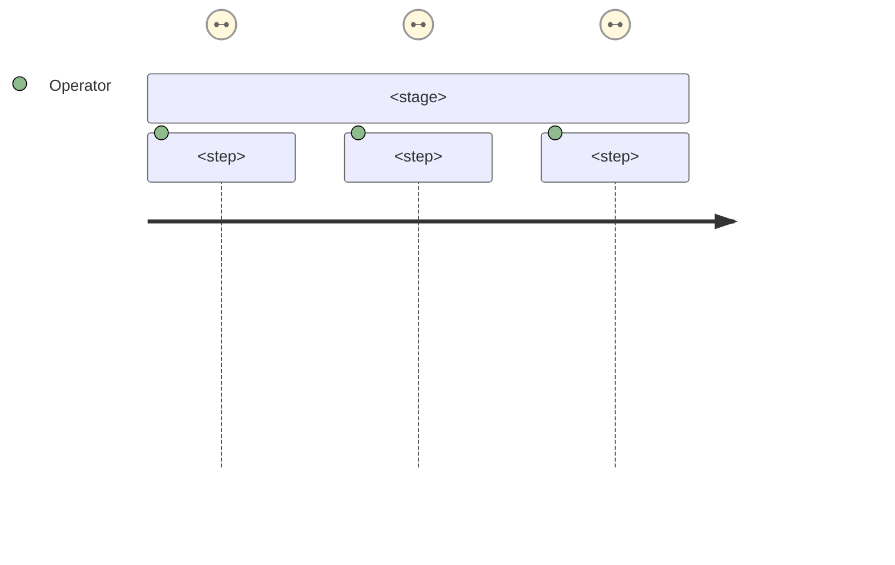
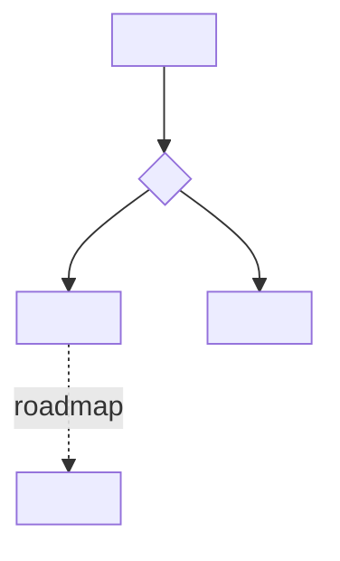
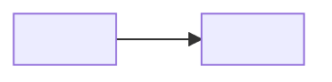

<!--
  USER-JOURNEYS TEMPLATE — per-app user flows for one feature.

  How to use:
  1. Copy into the feature folder alongside README.md and status.md.
  2. Replace every <placeholder>. Keep ONLY the apps/actors this feature actually touches —
     delete the rest (don't leave empty headings).
     Apps: web-app (authenticated React app + backoffice routes), web-official (public Astro).
     Actors: factory operator · backoffice staff · super admin.
  3. One journey per app surface or actor. Use a Mermaid `journey` block for satisfaction-style
     step flows, or `flowchart` for branching/decision paths. Diagrams only — no image links.
  4. Add a status blockquote up top: reflect what is BUILT today; mark roadmap steps dashed
     (`-.->`) and call them out inline. Keep it honest.
  5. Keep the Table of Contents in sync. End with the Version + Last-updated footer.
  Remove this comment block before committing.
-->

# <Feature Name> — User Journeys

How each app's users move through <feature>. See [README.md](./README.md) for the design
spec and [feature-spec.md](./feature-spec.md) for the formal requirements.

> Reflects what is **built today** — <one line: what's implemented vs. roadmap>. Roadmap
> steps are shown dashed.

---

## Table of Contents

- [Factory operator — <journey name>](#)
- [Backoffice staff — <journey name>](#)

---

## Factory operator — <journey name>

<One line framing who this is and what they're trying to do.>

<!-- Or, for branching/decision flows: -->

**Guard(s):** <auth / role claim that gates this route, and where it's enforced>. Detail in
[<sub-doc>.md](./<sub-doc>.md).

---

## Backoffice staff — <journey name>

<Repeat per surface/actor. Delete this whole block if the feature has only one journey.>

**Guard(s):** requires the `backoffice` role claim (and `superadmin` for <...>).

---

*See [README.md](./README.md) for the feature spec.*

---

*Version: 0.1.0*
*Last updated: <DD Month YYYY>*
