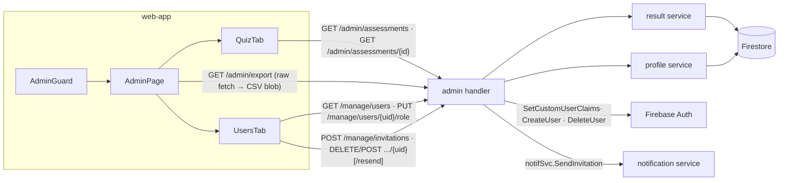

# Admin Dashboard — Feature Spec

**Status:** ✅ Shipped, including a later member-invitation workflow addition; known gaps tracked in [Open Items](#open-items--future-work) (duplicated CSV export logic, no pagination, `/admin` vs `/manage` route overlap).

---

## Table of Contents

1. [App surfaces](#app-surfaces)
2. [Summary](#summary)
3. [Goals & Non-Goals](#goals--non-goals)
4. [Current State](#current-state)
5. [Design Overview](#design-overview)
6. [Security Invariants](#security-invariants)
7. [Acceptance Criteria](#acceptance-criteria)
8. [Testing](#testing)
9. [Open Items & Future Work](#open-items--future-work)
10. [References](#references)

---

> Role-gated operations page for administrators inside `web-app`. Two tabs: **Assessments**
> (all user submissions with stat cards, working filters, inline dimension detail, CSV
> export) and **Users** (registered + pending profiles with a detail dialog, promote/
> demote role management across four roles, and member invitations). Backed by ten
> endpoints across `/api/v1/admin/`, `/api/v1/manage/`, and one shared authenticated route
> — see [App surfaces](#app-surfaces) below for the two different guards involved.
> Bilingual TH/EN via `useLocale()`.

> **Scope note:** this is the *end-user* admin surface (`/admin` in `web-app`, claim
> `role == "admin"`). FactorySync internal staff use the separate backoffice portal
> (`web-backoffice`, claim `backofficeRole`) — new admin capabilities should go there
> unless they are specific to end-user administration. See
> [backoffice/feature-spec.md](../backoffice/feature-spec.md).

This README is the design index for the Admin Dashboard feature. The formal requirements
live in the ISO 29110 SRS — see [feature-spec.md](./feature-spec.md). Each non-trivial
component is documented in a dedicated sub-document; see [References](#references).

---

## App surfaces

| web-app | web-official | backend |
|:-------:|:------------:|:-------:|
| ✅ | — | ✅ |

`web-app` renders the `/admin` page (guarded by `AdminGuard`); the backend serves the admin
endpoints under `/api/v1/admin/` and `/api/v1/manage/`. Per-app flows live in
[user-journeys.md](./user-journeys.md).

---

## Summary

| Component | Description |
|-----------|-------------|
| **`AdminPage`** (web-app) | Page shell: header with CSV export, shadcn `Tabs` (`quiz` default) hosting the two tabs — see [admin-page.md](./admin-page.md) |
| **`QuizTab`** (web-app) | Assessment table with stat cards, working industry/size filters, expandable inline detail rows — see [admin-page.md](./admin-page.md) |
| **`UsersTab`** (web-app) | User table (registered + pending invitations) with client-side role filter/search, `UserDetailDialog`, `RoleChangeDialog` (4-role promote/demote), `InviteMemberDialog`, `PermissionsDialog` — see [admin-page.md](./admin-page.md) |
| **Admin API** (backend) | Assessment + legacy user/role endpoints under `/api/v1/admin/`, gated by `RequireAdmin` — see [admin-api.md](./admin-api.md) |
| **Manage API** (backend) | User/role + invitation endpoints under `/api/v1/manage/`, gated by `RequireFirestoreRole` — see [admin-api.md](./admin-api.md) |
| **`AdminGuard`** (web-app) | Route guard: users without user-management permission navigating to `/admin` are redirected to `/` |

---

## Goals & Non-Goals

### Goals

- Show all assessments enriched with company profile data (company name, industry, size, contact).
- Provide stat cards: total submissions, average score, diagnosis distribution.
- Industry and company-size filter controls in the assessments tab (server-applied).
- Expandable assessment row that fetches full dimension scores, strengths, and weaknesses on demand.
- CSV export of all assessments (up to 10,000 rows).
- List all registered users (and pending invitations) with company info and current role.
- Promote / demote a user across four roles (`user` / `manager` / `system_admin` / `owner`) via a confirmation dialog.
- Invite a new member by email + role, and resend/cancel a pending invitation.
- Bilingual (TH/EN) via `useLocale()`; track key admin actions via analytics.

### Non-Goals

- Pagination (all data returned in one request — see [Open Items](#open-items--future-work) for the known limits).
- Editing assessment data or deleting records.
- Server-side row-level permissions beyond `RequireAdmin` / `RequireFirestoreRole`.

---

## Current State

See [status.md](./status.md) for the per-component implementation checklist. Everything in
scope is shipped, including a member-invitation workflow added after the original ship
date. The remaining gaps are the `/admin` vs `/manage` route overlap for `ListUsers`/
`SetUserRole` and the still-in-memory (not Firestore-native) industry/size filter — see
[Open Items](#open-items--future-work).

---

## Design Overview

The admin service owns no Firestore collection for assessments/profiles, but does own the
`invitations` collection directly (via the injected `*firestore.Client`) for the invite
workflow. It reads assessments through the result service and profiles through the
profile service, joining them into `enrichedAssessment`/`enrichedUser` responses (batched
`GetProfilesByUIDs` / `GetUsers` — one lookup per request, not per row). Role changes
dual-write Firestore + Firebase custom claims, claims-first. Contract detail in
[admin-api.md](./admin-api.md).

### API contract

| Method | Path | Auth / Role | Purpose |
|--------|------|-------------|---------|
| `GET` | `/api/v1/admin/assessments` | Bearer · `role=="admin"` claim | List assessments enriched with profile data, `industryType`/`companySize` filters applied (`limit` default 100, max 500) |
| `GET` | `/api/v1/admin/assessments/{assessmentId}` | Bearer · `role=="admin"` claim | Single assessment with `scores`, `strengths`, `weaknesses` (UUIDv4-validated, direct Firestore `Get`) |
| `GET` | `/api/v1/admin/export` | Bearer · `role=="admin"` claim | Stream all assessments as CSV (`text/csv`, up to 10,000 rows) |
| `GET` `/PUT` | `/api/v1/admin/users`, `/api/v1/admin/users/{uid}/role` | Bearer · `role=="admin"` claim | Legacy path — same handlers as the `/manage` equivalents below |
| `GET` | `/api/v1/manage/users` | Bearer · Firestore role ∈ {owner, system_admin, admin} | List registered profiles + pending invitations (`limit` default 200, max 500) |
| `PUT` | `/api/v1/manage/users/{uid}/role` | Bearer · Firestore role ∈ {owner, system_admin, admin} | Promote/demote — dual-writes Firebase claims (first) + Firestore profile |
| `POST` | `/api/v1/manage/invitations` | Bearer · Firestore role ∈ {owner, system_admin, admin} | Invite a new member by email + role |
| `DELETE` | `/api/v1/manage/invitations/{uid}` | Bearer · Firestore role ∈ {owner, system_admin, admin} | Cancel a pending invitation |
| `POST` | `/api/v1/manage/invitations/{uid}/resend` | Bearer · Firestore role ∈ {owner, system_admin, admin} | Resend a pending invitation |
| `POST` | `/api/v1/invitations/accept` | Bearer (any authenticated user, no role check) | Invited user accepts and creates their profile |

List responses use the standard envelope `{"success": true, "data": [...], "count": N}`;
errors use `{"success": false, "error": {"code", "message"}}`. The CSV export is the one
deliberate exception — raw `text/csv` with `Content-Disposition: attachment`.

---

## Security Invariants

| Invariant | Where enforced |
|-----------|----------------|
| `/admin/*` requires a valid Firebase token and `role == "admin"` custom claim (401 / 403 otherwise) | `middleware/` `FirebaseAuth` + `RequireAdmin` |
| `/manage/*` requires a valid Firebase token and a Firestore-backed role ∈ {owner, system_admin, admin} (401 / 403 otherwise) | `middleware/` `FirebaseAuth` + `RequireFirestoreRole` |
| `/invitations/accept` requires only a valid Firebase token — no role check, since an invited user has no profile/role yet | `middleware/` `FirebaseAuth` |
| `SetUserRole` reads the target `uid` from the path param — the caller's UID is never used as the target (self-demotion is allowed) | `services/admin/handler.go` |
| `assessmentId` is validated against a UUIDv4 regex before any Firestore read | `services/admin/handler.go` |
| `role` body value must be one of `"user"`, `"manager"`, `"system_admin"`, `"owner"` — anything else is 400 | `services/admin/handler.go` |
| `CancelInvitation` verifies a matching `invitations` document exists (404 otherwise) before deleting the Firebase Auth user, so it can't be used to delete an arbitrary UID | `services/admin/handler.go` |
| CSV export streams from Firestore — no temp files written to disk | `services/admin/handler.go` |
| `AdminGuard` (client) mirrors the permission model (`canManageUsers()`), not just the admin claim — but it is convenience only; the backend checks are authoritative | `components/guards/AdminGuard.tsx` |

---

## Acceptance Criteria

Mirrors [feature-spec.md § 14](./feature-spec.md#14-acceptance-criteria):

**Route guard + Assessments tab** — see [admin-page.md](./admin-page.md)
- [x] Non-admin users navigating to `/admin` are redirected to `/` by `AdminGuard`.
- [x] Admin users see the Assessments tab by default on page load.
- [x] Stat cards show correct Total Submissions, Average Score, and Diagnosis Distribution for the loaded data.
- [x] Clicking an assessment row expands an inline detail panel; clicking again collapses it.
- [x] Expanding a row without pre-loaded scores triggers `GET /admin/assessments/{id}`; expanding again uses the cached data.
- [x] CSV Export button triggers a file download named `assessments-YYYY-MM-DD.csv`.

**Users tab** — see [admin-page.md](./admin-page.md)
- [x] Users tab lists all registered users plus pending invitations.
- [x] Role filter and search narrow the displayed rows client-side.
- [x] Clicking a registered user's row opens `UserDetailDialog` with all profile fields.
- [x] Clicking the role edit action opens `RoleChangeDialog` (roles: user / manager / system_admin / owner).
- [x] Confirming a role change calls `PUT /manage/users/{uid}/role` and refreshes the table via query invalidation.
- [x] A success toast appears after a role change; an error toast appears on failure.
- [x] "Invite Member" opens `InviteMemberDialog`; submitting calls `POST /manage/invitations` and a pending row appears on success.
- [x] A pending invitation row exposes Resend (`POST /manage/invitations/{uid}/resend`) and Cancel (`DELETE /manage/invitations/{uid}`) actions.

**Cross-cutting**
- [x] All text renders in the active locale (TH/EN).
- [ ] `make lint-web` and `make test-api` pass — the spec defines the intended test coverage (§ 15) but does not record suite status; see [status.md](./status.md).

---

## Testing

From [feature-spec.md § 15](./feature-spec.md#15-testing) — intended coverage:

| Level | Target | Cases |
|-------|--------|-------|
| Unit (Vitest — `AdminPage`) | Stat card calculations · `getScoreColor` thresholds | `totalSubmissions` / `avgScore` / `diagnosisCounts` from fixtures; ≥4 emerald · ≥3 blue · ≥2 amber · <2 red |
| Unit (Go) | `parseLimit` | default, max-clamp, invalid string, negative value |
| Integration (`service_test.go`) | Deny paths | 403 for non-admin token; 400 for invalid role value; 404 for unknown UUIDv4 |
| E2E (Playwright) | Full page flows | guard redirect, table visible, row expand, CSV download, users tab, detail dialog |

Verification commands: `make lint-web` · `make test-api`.

---

## Open Items & Future Work

From [feature-spec.md § 11](./feature-spec.md#11-known-issues--open-tasks). Items 1, 2,
and 5 below were previously tracked as open and have since been fixed (filters now
applied, `GetAssessment` now a direct `Get`, dual write reversed to claims-first) —
removed from this table; see [status.md](./status.md) for what changed.

| # | Area | Description |
|---|------|-------------|
| 1 | Duplicated export logic | `handleExport` is copy-pasted in `AdminPage` (header) and `QuizTab` (mobile); extract a shared helper |
| 2 | No pagination | Both list endpoints cap at 500 and return everything in one response; add cursor-based pagination (`StartAfter`) |
| 3 | `/admin` vs `/manage` route overlap | `ListUsers` and `SetUserRole` are reachable under both `/admin/*` (`RequireAdmin` claim) and `/manage/*` (`RequireFirestoreRole`) — same handlers, two different auth checks. Frontend only calls `/manage/*`; the `/admin/*` copies are unused by the app but still live. Reconcile to one path/guard |
| 4 | In-memory filtering | `industryType`/`companySize` filtering on `ListAssessments` happens after a full unfiltered `ListResults` read, in memory — correct, but not Firestore-native. Move server-side once assessment volume grows |

### Open decisions

None — feature is shipped; changes go through a new CR.

---

## References

### Sub-documents

| Doc | Covers |
|-----|--------|
| [feature-spec.md](./feature-spec.md) | ISO 29110 SRS — formal requirements, full endpoint + i18n detail |
| [status.md](./status.md) | Current implementation status per component |
| [user-journeys.md](./user-journeys.md) | Per-actor flows (admin · non-admin) |
| [admin-page.md](./admin-page.md) | `AdminPage` + tabs + dialogs (web-app) |
| [admin-api.md](./admin-api.md) | Admin endpoints, profile enrichment, CSV export (backend) |
| [mockups/app.md](./mockups/app.md) | ASCII wireframes — both tabs + dialogs (web-app) |

### ISO 29110 artifacts

- Feature predates per-feature test plans; intended coverage is in [feature-spec.md § 15](./feature-spec.md#15-testing).
- Scope changes → [docs/iso29110/change-request-log.md](../../iso29110/change-request-log.md)
- New risks → [docs/iso29110/risk-register.md](../../iso29110/risk-register.md)

### Cross-references

- [Auth](../auth/feature-spec.md) — `RequireAdmin` middleware and custom claims
- [Result](../result/feature-spec.md) — assessment model the admin views are built on
- [Backoffice](../backoffice/feature-spec.md) — the separate staff portal (`backofficeRole`)
- [Architecture overview](../../architecture/overview.md)

---

*Version: 2.0.0*
*Last updated: 5 July 2026*
