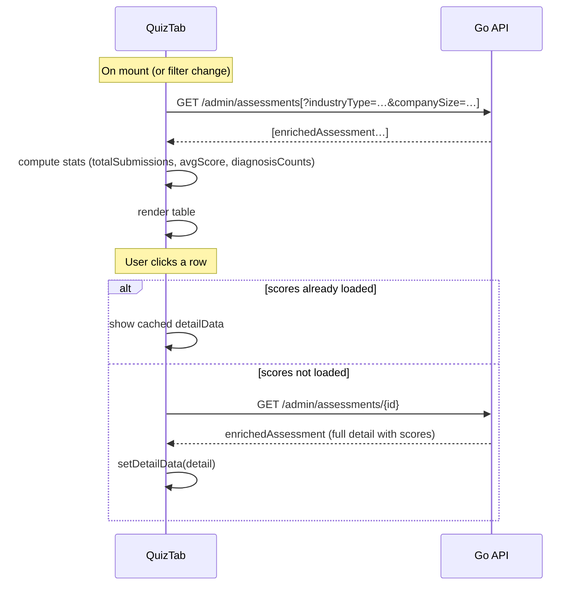
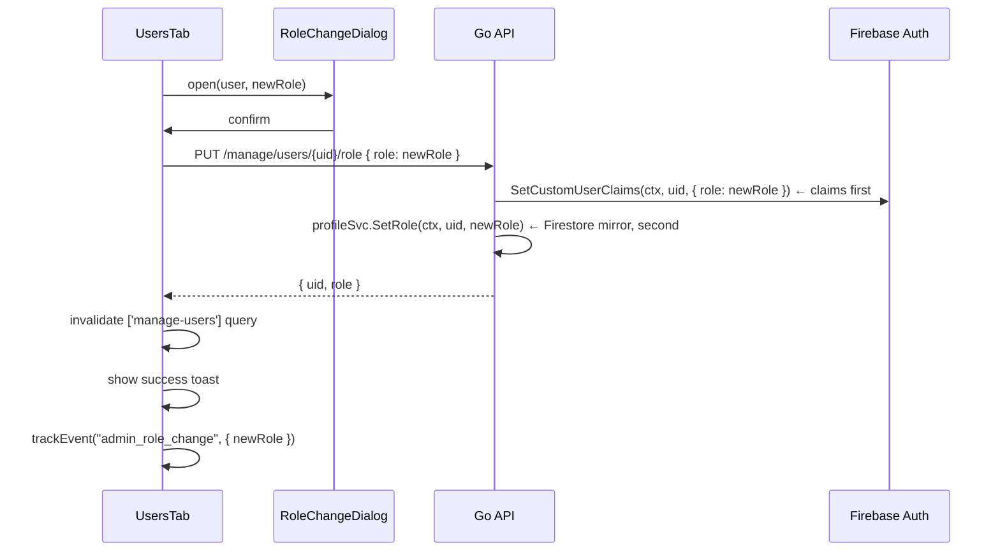
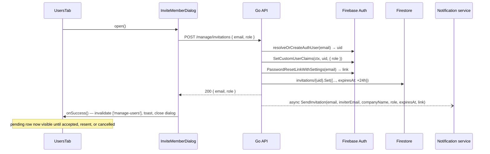

# Admin Dashboard — Feature Spec

> Role-gated operations page for administrators. Two tabs: **Assessments** (all
> user submissions with stat cards, working filters, inline dimension detail, and
> CSV export) and **Users** (registered + pending profiles with 4-role management,
> a detail dialog, and member invitations). Backed by ten endpoints across
> `/api/v1/admin/` (`FirebaseAuth` + `RequireAdmin`), `/api/v1/manage/`
> (`FirebaseAuth` + `RequireFirestoreRole`), and one shared authenticated route.

> **Scope note — two separate admin surfaces exist:**
>
> | Surface | App | Actor | Auth claim |
> |---------|-----|-------|-----------|
> | `/admin` page (this spec) | `web-app` | End-users with the `role: "admin"` claim | `role == "admin"` |
> | Backoffice portal | `web-backoffice` | FactorySync internal staff | `backofficeRole ∈ {"staff","superadmin"}` |
>
> These are different actor groups. **New admin capabilities should go into
> `web-backoffice`** unless they are specific to end-user administration.
> See [backoffice/feature-spec.md](../backoffice/feature-spec.md) for the staff portal spec.

---

## 1. Summary

`/admin` is accessible to users who pass `canManageUsers()` — either the Firebase
`role == "admin"` custom claim, or a Firestore-backed role of `owner` /
`system_admin` (or a per-user `permissions.canManageUsers` grant). It gives
operators a complete view of platform activity without touching Firestore
directly.

The page is split into two tabs:

| Tab | Data source | Key actions |
|-----|-------------|-------------|
| **Assessments** (`quiz`) | `GET /admin/assessments` | Filter by industry/size (server-applied), expand row for dimension detail, export CSV |
| **Users** (`users`) | `GET /manage/users` | Filter by role/search, view full profile in dialog, promote/demote across 4 roles, invite/resend/cancel member invitations |

Server state is owned by **TanStack Query** (`useQuery`/`useMutation`), not local
`useState` + `useEffect` — this is the project-wide standard (CR-003, see
`.claude/rules/react.md`). Client state (open dialogs, filters, search text)
stays in local component state. All API calls use the `api` helper which
attaches the Firebase ID token automatically.

---

## 2. Goals & Non-Goals

### Goals

- Show all assessments enriched with company profile data (company name, industry,
  size, contact).
- Provide stat cards: total submissions, average score, diagnosis distribution.
- Industry and company-size filter controls in the assessments tab, applied server-side.
- Expandable assessment row that fetches full dimension scores, strengths, and
  weaknesses on demand.
- CSV export of all assessments (up to 10,000 rows).
- List all registered users (and pending invitations) with company info and current role.
- Promote / demote a user across four roles (`user` / `manager` / `system_admin` / `owner`) via a confirmation dialog.
- Invite a new member by email + role; resend or cancel a pending invitation.
- Bilingual (TH/EN) via `useLocale()`.
- Track key admin actions via analytics.

### Non-Goals

- Pagination (all data returned in one request — see §11 for known limits).
- Editing assessment data or deleting records.
- Server-side row-level permissions beyond `RequireAdmin` / `RequireFirestoreRole`.

---

## 3. Current State

| Component | Location | Status |
|-----------|----------|--------|
| Admin page | `apps/web-app/src/pages/AdminPage.tsx` | ✅ Built |
| `QuizTab` | Inline in `AdminPage.tsx`, TanStack Query | ✅ Built |
| `UsersTab` | Inline in `AdminPage.tsx`, TanStack Query | ✅ Built |
| `UserDetailDialog` | Inline in `AdminPage.tsx` | ✅ Built |
| `RoleChangeDialog` | Inline in `AdminPage.tsx` | ✅ Built |
| `InviteMemberDialog` | Inline in `AdminPage.tsx` | ✅ Built |
| `PermissionsDialog` (static role/feature matrix) | Inline in `AdminPage.tsx` | ✅ Built |
| Backend handler (`/admin` + `/manage` + invitation flow) | `apps/backend/services/admin/handler.go` | ✅ Built |
| Route guard | `AdminGuard` in `apps/web-app/src/components/guards/AdminGuard.tsx` — `canManageUsers()`, not a bare claim check | ✅ Built |
| Backend route registration | `main.go` (`/admin`, `/manage`, `/invitations/accept`) | ✅ Built |
| Server-side industry/size filter | `admin/handler.go` `ListAssessments` | ✅ Fixed — in-memory filter applied post-enrichment (see §11) |
| Direct `GetAssessment` lookup | `admin/handler.go` — `resultSvc.GetResultByID` | ✅ Fixed — was O(n) scan (see §11) |
| Claims-first dual write | `admin/handler.go` `SetUserRole` | ✅ Fixed — was Firestore-first (see §11) |

---

## 4. UI Layout

### Assessments tab

```
┌──────────────────────────────────────────────────────────────┐
│  Admin Dashboard        [Export CSV ↓]  ← header             │
│  Manage users and assessments                                 │
├──────────────────────────────────────────────────────────────┤
│  [Assessments] [Users]   ← shadcn Tabs                       │
├──────────────────────────────────────────────────────────────┤
│  ┌──────────────┐  ┌──────────────┐  ┌──────────────────┐    │
│  │ 42           │  │ 3.24         │  │ • Established: 18│    │
│  │ Total        │  │ Avg Score    │  │ • Advanced: 12   │    │
│  │ Submissions  │  │ /5.00        │  │ • Developing: 8  │    │
│  └──────────────┘  └──────────────┘  │ • Beginning: 4   │    │
│                                      └──────────────────────┘    │
├──────────────────────────────────────────────────────────────┤
│  [Industry ▾ All]  [Size ▾ All]  [Export CSV ↓] ←mobile only │
├──────────────────────────────────────────────────────────────┤
│  ID        Company         Quiz    Score  Diagnosis  Date     │
│  a1b2c3d4… Acme Co.     [shindan] 3.47  [Established] ...    │
│  ├─ expanded detail row ──────────────────────────────────── │
│  │  Company · Industry · Size · Contact Name · Contact Email │
│  │  Dimension scores grid (2-col)                            │
│  │  Strengths panel | Weaknesses panel                       │
│  └───────────────────────────────────────────────────────── │
│  f7e8d9c0… Beta Ltd.    [factory]  4.12  [Advanced]   ...    │
└──────────────────────────────────────────────────────────────┘
```

### Users tab

```
┌──────────────────────────────────────────────────────────────────────────┐
│  [All] [Owner] [System Admin] [Manager] [User]  [Search…]  [Invite Member]│
├───┬───────────┬───────────────┬───────────┬───────────┬──────────┬───────┤
│   │ Name      │ Email(desktop)│ Company   │ Role      │Registered│       │
│ ◍ │ Jane D.   │ jane@…        │ Acme Co.  │ [Owner]   │ 10 มิ.ย. │  [✎]  │
│ ◍ │ John S.   │ john@…        │ Beta Ltd. │ [Manager] │ 09 มิ.ย. │  [✎]  │
│ ◍ │ Somchai P.│ somchai@…     │ Gamma Co. │ [Pending] │ invited  │[↻][✕] │
└───┴───────────┴───────────────┴───────────┴───────────┴──────────┴───────┘
```

Clicking a *registered* user's row opens `UserDetailDialog` with all profile
fields in a 2-col grid. The pencil action opens `RoleChangeDialog` for
confirmation across the four roles. A *pending* row (from an unaccepted
invitation) shows Resend/Cancel actions instead and has no detail dialog. The
list excludes legacy `admin`/`superadmin` role accounts. "Invite Member" opens
`InviteMemberDialog`.

---

## 5. Component Breakdown

### `AdminPage`

Top-level page. Renders:
- Page header (title, subtitle, desktop CSV export button via direct `fetch`).
- shadcn `Tabs` with `quiz` as the default tab.
- `<QuizTab />` and `<UsersTab />`.

### `QuizTab`

Local UI state: `industryFilter`, `sizeFilter`, `selectedId`. Server state via
TanStack Query.

`useQuery(['admin-assessments', industryFilter, sizeFilter])` re-fetches
`GET /admin/assessments[?industryType=&companySize=]` whenever either filter
changes — each combination is cached independently, and the backend now applies
both filters. Computes three stats from the loaded array (no extra API call).

The table is rendered through the shared `DataTable` (`@tanstack/react-table`),
not hand-rolled `<tr>` elements, with `renderExpandedRow` for the detail panel.
Clicking a row toggles the inline detail panel:
- If `a.scores` is already populated (from a previous expand), it reuses that
  data without a network call.
- Otherwise a second `useQuery` (`enabled: !!selectedId && !hasInlineScores`)
  fetches `GET /admin/assessments/{id}` to get the full detail.

### `UsersTab`

Local UI state: `roleFilter`, `search`, `toast`, `roleDialog`, `detailUser`,
`inviteOpen`, `permissionsOpen`. Server state via TanStack Query.

`useQuery(['manage-users'])` fetches `GET /manage/users` once (registered
profiles + pending invitations merged server-side), filtering out
`admin`/`superadmin` role rows via `select`. `roleFilter` and `search` narrow the
already-loaded array **client-side** — no re-fetch. Stat chips (owner /
system_admin / manager / user counts) are derived the same way.

`roleMutation` (`useMutation`) calls `PUT /manage/users/{uid}/role` and, on
success, invalidates the `['manage-users']` query (rather than hand-rolling an
optimistic array update) and shows a success/error toast plus an analytics
event. `cancelInvitationMutation` / `resendInvitationMutation` call
`DELETE /manage/invitations/{uid}` / `POST /manage/invitations/{uid}/resend`
the same way.

### `UserDetailDialog`

shadcn `Dialog` (max-w-lg). Renders a 2-col grid of all user profile fields.
Opens when any user table row is clicked; closes via `onClose` (X button or
backdrop).

### `RoleChangeDialog`

shadcn `Dialog` (max-w-md). Confirmation step before committing a role change
across the four roles (`user` / `manager` / `system_admin` / `owner`) — not a
binary admin/user toggle.
- **Promote**: violet confirm button.
- **Demote**: default/outline confirm button.

i18n message uses `t("admin.confirmPromote").replace("{name}", dialogName)` —
the display name comes from `contactName || displayName || email`.

### `InviteMemberDialog`

shadcn `Dialog` (max-w-sm). `@tanstack/react-form` + Zod email validation.
Submits `POST /manage/invitations { email, role }`. Server errors map to
inline messages: `409` → "this email already has an account", `403` → "you do
not have permission to invite members", other `400` → the server's message,
else a generic retry message.

### `PermissionsDialog`

shadcn `Dialog` (max-w-2xl). A static reference table — not a `DataTable`, no
fetch/sort/filter — showing which of the four roles (user / manager /
system_admin / owner) can take an assessment, view own/team/all results, manage
members, invite members, edit roles, and export CSV. Purely explanatory.

### `RoleToggleButton`

Inline pencil-icon "edit role" action in the users table for registered rows.
Prevents event propagation so clicking it doesn't also open the detail dialog.
For a pending-invitation row, this slot instead renders Resend and Cancel icon
buttons.

---

## 6. Data Flow

### Assessments tab



### Role change flow



### Invite member flow



---

## 7. Backend API

All endpoints require `Authorization: Bearer {firebase-id-token}`. Two different
role checks are in play:

| Group | Guard |
|-------|-------|
| `/api/v1/admin/*` | `RequireAdmin` — Firebase custom claim `role == "admin"` |
| `/api/v1/manage/*` | `RequireFirestoreRole(fsClient, "owner", "system_admin", "admin")` — reads the profile's Firestore `role` field |
| `/api/v1/invitations/accept` | `FirebaseAuth` only — no role check (invitee has no profile yet) |

`ListUsers` and `SetUserRole` are registered under **both** `/admin` and `/manage`
(same handler methods). The frontend calls the `/manage/*` paths exclusively;
the `/admin/*` copies remain live but unused by the app — see §11.4.

---

### GET `/api/v1/admin/assessments`

List all assessments, enriched with matching profile data.

**Query params**

| Param | Default | Max | Notes |
|-------|---------|-----|-------|
| `limit` | 100 | 500 | Parsed by `parseLimit` |
| `industryType` | — | — | Applied as an **in-memory filter after enrichment** (see §11) |
| `companySize` | — | — | Applied as an **in-memory filter after enrichment** (see §11) |

**Response — 200**
```jsonc
{
  "success": true,
  "data": [
    {
      "id": "uuid-v4",
      "uid": "firebase-uid",
      "quizId": "shindan",
      "overallScore": 3.47,
      "diagnosis": "Established",
      "submittedAt": "2026-06-10T09:00:00Z",
      "companyName": "Acme Co.",
      "industryType": "manufacturing",
      "companySize": "medium",
      "contactName": "Jane Doe",
      "contactEmail": "jane@acme.com"
    }
  ],
  "count": 42
}
```

**Errors**

| HTTP | Code | Condition |
|------|------|-----------|
| 401 | `UNAUTHORIZED` | Missing/invalid token |
| 403 | `FORBIDDEN` | Token valid but not admin |
| 500 | `INTERNAL_ERROR` | Firestore read failed |

---

### GET `/api/v1/admin/assessments/{assessmentId}`

Get a single assessment enriched with profile data.

**Path param:** `assessmentId` — validated against `^[0-9a-fA-F]{8}-…$` (UUIDv4
pattern). Returns 400 on mismatch.

**Response — 200:** same shape as one item from the list above, plus `scores`,
`strengths`, `weaknesses` arrays (sourced from the `Assessment` struct).

**Errors**

| HTTP | Code | Condition |
|------|------|-----------|
| 400 | `BAD_REQUEST` | `assessmentId` is not a valid UUIDv4 |
| 401 | `UNAUTHORIZED` | Missing/invalid token |
| 403 | `FORBIDDEN` | Not admin |
| 404 | `NOT_FOUND` | No assessment with that ID |

Calls `resultSvc.GetResultByID(ctx, assessmentID)` — a direct Firestore `Get` by
document ID. (Previously fetched all assessments via `ListResults` and
linear-scanned for the matching ID — fixed, see §11.)

---

### GET `/api/v1/admin/export`

Stream all assessments as a CSV file. Does not use `pkg.RespondJSON` — returns
raw `text/csv` with `Content-Disposition: attachment; filename=assessments.csv`.

**Limit:** up to 10,000 rows (`maxExportRows = 10000`).

**CSV columns (in order)**

| Column | Source |
|--------|--------|
| ID | `assessment.ID` |
| UID | `assessment.UID` |
| Company Name | enriched from profile |
| Industry Type | enriched from profile |
| Company Size | enriched from profile |
| Contact Name | enriched from profile |
| Contact Email | enriched from profile |
| Overall Score | `%.2f` formatted |
| Diagnosis | `assessment.Diagnosis` |
| Submitted At | `assessment.SubmittedAt` (ISO 8601) |

**Errors** — JSON error body if Firestore read fails before writing begins;
truncated output if error occurs mid-stream.

---

### GET `/api/v1/manage/users` (also registered at `/api/v1/admin/users`)

List all registered user profiles, plus pending (unaccepted) invitations merged
in from the `invitations` collection. Guarded by `RequireFirestoreRole` at the
`/manage` path (`RequireAdmin` at the legacy `/admin` path).

**Query params**

| Param | Default | Max |
|-------|---------|-----|
| `limit` | 200 | 500 |

**Response — 200**
```jsonc
{
  "success": true,
  "data": [
    {
      "uid": "firebase-uid",
      "email": "jane@acme.com",
      "displayName": "Jane Doe",
      "photoURL": "https://...",
      "companyName": "Acme Co.",
      "companyRegId": "0123456789012",
      "industryType": "manufacturing",
      "companySize": "medium",
      "contactName": "Jane Doe",
      "contactEmail": "jane@acme.com",
      "contactPhone": "0812345678",
      "role": "owner",
      "createdAt": "2026-06-01T08:00:00Z",
      "updatedAt": "2026-06-10T09:00:00Z"
    },
    {
      "uid": "firebase-uid-2",
      "email": "somchai@gamma.co",
      "role": "manager",
      "isPending": true,
      "invitedAt": "2026-07-04T10:00:00Z"
    }
  ],
  "count": 46
}
```

`photoURL` is populated via a batched `authClient.GetUsers` lookup (chunked at
100 UIDs per call). Pending rows carry only the fields snapshotted at invite
time — `uid`, `email`, `role`, `isPending: true`, `invitedAt`.

---

### PUT `/api/v1/manage/users/{uid}/role` (also registered at `/api/v1/admin/users/{uid}/role`)

Promote or demote a user. Writes to both Firebase custom claims and the
Firestore profile document.

**Path param:** `uid` — validated: non-empty, max 128 chars.

**Request body**
```json
{ "role": "manager" }
```
`role` must be one of `"user"`, `"manager"`, `"system_admin"`, `"owner"` — any other value returns 400.

**Dual write order (claims-first):**
1. `authClient.SetCustomUserClaims(ctx, uid, { role })` — updates Firebase (authoritative source for `RequireAdmin`)
2. `profileSvc.SetRole(ctx, uid, role)` — mirrors to Firestore

If step 2 fails after step 1 succeeds, the Firestore profile's `role` field lags
the token claims until the next successful call — a lower-impact residual than
the original Firestore-first order, since `RequireAdmin`/`RequireFirestoreRole`
don't rely on a cached profile snapshot for the acting admin's own access.

**Response — 200**
```json
{ "uid": "firebase-uid", "role": "manager" }
```

**Errors**

| HTTP | Code | Condition |
|------|------|-----------|
| 400 | `BAD_REQUEST` | `uid` invalid or `role` not one of the four valid values |
| 401 | `UNAUTHORIZED` | Missing/invalid token |
| 403 | `FORBIDDEN` | Not admin / not an allowed Firestore role |
| 500 | `INTERNAL_ERROR` | Firestore or Firebase SDK error |

---

### POST `/api/v1/manage/invitations`

Invite a new member by email and role. Guarded by `RequireFirestoreRole`.

**Request body**
```json
{ "email": "somchai@gamma.co", "role": "manager" }
```

**Behavior:**
1. `resolveOrCreateAuthUser(email)` — reuses an existing pending/orphaned
   Firebase Auth user, or creates a new one; returns 409 if the email already
   has a completed Firestore profile.
2. `SetCustomUserClaims(uid, { role })`.
3. Generates a branded password-setup link (`PasswordResetLinkWithSettings` +
   `pkg.BuildPasswordResetActionURL`) — requires the `APP_URL` env var; 500 if unset.
4. Snapshots the inviter's company fields (name, reg ID, industry, size) into a
   new `invitations/{uid}` Firestore document with a 24-hour `expiresAt`.
5. Sends the invite email asynchronously via `notifSvc.SendInvitation`.

**Response — 200**
```json
{ "email": "somchai@gamma.co", "role": "manager" }
```

**Errors**

| HTTP | Code | Condition |
|------|------|-----------|
| 400 | `VALIDATION_ERROR` | Invalid email or role |
| 403 | `FORBIDDEN` | Not an allowed Firestore role |
| 409 | `CONFLICT` | Email already has a completed profile |
| 500 | `INTERNAL_ERROR` | Firebase/Firestore/link-generation failure |

---

### DELETE `/api/v1/manage/invitations/{uid}`

Cancel a pending invitation. Verifies the `invitations/{uid}` document exists
(404 if not) before deleting anything — this prevents the endpoint from being
used to delete an arbitrary Firebase Auth user. Deletes the Firebase Auth user
first (so the Firestore doc survives as a tombstone if that step fails), then
deletes the Firestore invitation document.

**Response — 200** `{ "uid": "firebase-uid" }`

---

### POST `/api/v1/manage/invitations/{uid}/resend`

Re-send the invite email for an existing pending invitation with a fresh
24-hour expiry. Regenerates the password-setup link and updates `invitedAt` /
`expiresAt` on the invitation document.

**Response — 200** `{ "uid": "firebase-uid", "email": "somchai@gamma.co" }`

---

### POST `/api/v1/invitations/accept`

The invited user (already Firebase-authenticated via the password-setup link,
but with no Firestore profile yet) accepts their invitation. No role check —
gated only by `FirebaseAuth`.

**Request body (optional)**
```json
{ "contactName": "Somchai P.", "contactPhone": "0891234567" }
```

**Behavior:** fetches `invitations/{uid}` by the caller's own UID (404 if none,
410 `INVITATION_EXPIRED` if past `expiresAt`), creates the Firestore profile via
`profileSvc.CreateInvitedProfile` (409 `CONFLICT` if a race double-creates it),
best-effort deletes the invitation document, and fires
`notifSvc.NotifyRegistration` asynchronously.

**Response — 200:** the created `Profile`.

---

## 8. Profile Enrichment (`enrichedAssessment`)

The backend joins assessment data with profile data before returning it to
admin consumers. This avoids separate API calls from the frontend.

```go
type enrichedAssessment struct {
    result.Assessment                        // embeds all base assessment fields
    CompanyName  string `json:"companyName"`
    IndustryType string `json:"industryType"`
    CompanySize  string `json:"companySize"`
    ContactName  string `json:"contactName"`
    ContactEmail string `json:"contactEmail"`
}
```

Profile lookup is batched: `profileSvc.GetProfilesByUIDs(ctx, uids)` is called
once per request with all unique UIDs from the result set, not N times per
assessment.

If profile lookup fails (Firestore error), the handler logs the error and returns
assessments with empty profile fields — it does not abort the request.

---

## 9. CSV Export — Frontend Implementation

The export button bypasses `api.get` and uses raw `fetch` to receive the binary
blob:

```ts
const res = await fetch(apiUrl("/admin/export"), {
  headers: { Authorization: `Bearer ${await auth.currentUser?.getIdToken()}` },
})
const blob = await res.blob()
const url = URL.createObjectURL(blob)
const a = document.createElement("a")
a.href = url
a.download = `assessments-${new Date().toISOString().slice(0, 10)}.csv`
a.click()
URL.revokeObjectURL(url)
```

The same handler logic is duplicated in both `AdminPage` (header button) and
`QuizTab` (mobile-only button) — see §11.

---

## 10. i18n Key Map (Admin namespace)

| Key | TH (approx.) | EN |
|-----|-------------|----|
| `admin.title` | แดชบอร์ดผู้ดูแลระบบ | Admin Dashboard |
| `admin.subtitle` | จัดการผู้ใช้และผลการประเมิน | Manage users and assessments |
| `admin.tabQuiz` | ผลการประเมิน | Assessments |
| `admin.tabUsers` | ผู้ใช้ | Users |
| `admin.totalSubmissions` | จำนวนการส่งทั้งหมด | Total Submissions |
| `admin.avgScore` | คะแนนเฉลี่ย | Average Score |
| `admin.distribution` | การกระจาย | Distribution |
| `admin.industry` | อุตสาหกรรม | Industry |
| `admin.allIndustries` | ทุกอุตสาหกรรม | All Industries |
| `admin.companySize` | ขนาดบริษัท | Company Size |
| `admin.allSizes` | ทุกขนาด | All Sizes |
| `admin.exportCsv` | ส่งออก CSV | Export CSV |
| `admin.id` | รหัส | ID |
| `admin.company` | บริษัท | Company |
| `admin.score` | คะแนน | Score |
| `admin.diagnosis` | ผลวินิจฉัย | Diagnosis |
| `admin.date` | วันที่ | Date |
| `admin.noAssessments` | ไม่มีผลการประเมิน | No assessments |
| `admin.noDetail` | ไม่มีรายละเอียด | No detail available |
| `admin.contactName` | ชื่อผู้ติดต่อ | Contact Name |
| `admin.accountEmail` | อีเมลบัญชี | Account Email |
| `admin.contactEmail` | อีเมลผู้ติดต่อ | Contact Email |
| `admin.phone` | โทรศัพท์ | Phone |
| `admin.regId` | เลขนิติบุคคล | Registration ID |
| `admin.role` | สิทธิ์ | Role |
| `admin.registered` | วันที่ลงทะเบียน | Registered |
| `admin.lastUpdated` | แก้ไขล่าสุด | Last Updated |
| `admin.allRoles` | ทุกสิทธิ์ | All Roles |
| `admin.filterAdmin` | แอดมิน | Admin |
| `admin.filterUser` | ผู้ใช้ | User |
| `admin.roleAdmin` | Admin | Admin |
| `admin.roleUser` | User | User |
| `admin.users` | ผู้ใช้ | Users |
| `admin.noUsers` | ไม่มีผู้ใช้ | No users |
| `admin.userDetail` | รายละเอียดผู้ใช้ | User Detail |
| `admin.promoteAdmin` | เลื่อนตำแหน่งเป็น Admin | Promote to Admin |
| `admin.demoteUser` | ลดตำแหน่งเป็น User | Demote to User |
| `admin.confirmPromote` | ยืนยันการเลื่อนตำแหน่ง {name} | Confirm promoting {name} |
| `admin.confirmDemote` | ยืนยันการลดตำแหน่ง {name} | Confirm demoting {name} |
| `admin.cancel` | ยกเลิก | Cancel |
| `admin.roleUpdated` | อัปเดตสิทธิ์สำเร็จ | Role updated successfully |
| `admin.roleError` | อัปเดตสิทธิ์ไม่สำเร็จ | Failed to update role |
| `admin.roleOwner` | เจ้าของ | Owner |
| `admin.roleSystemAdmin` | ผู้ดูแลระบบ | System Admin |
| `admin.roleManager` | ผู้จัดการ | Manager |
| `admin.editRole` | แก้ไขบทบาท | Edit Role |
| `admin.allUsers` | ทั้งหมด | All |
| `admin.inviteMember` | เชิญสมาชิก | Invite Member |
| `admin.inviteMemberTitle` | เชิญสมาชิกใหม่ | Invite a New Member |
| `admin.inviteMemberDesc` | สมาชิกจะได้รับอีเมลพร้อมลิงก์ตั้งรหัสผ่านและเข้าสู่ระบบ | Member will receive an email with a link to set a password and sign in |
| `admin.inviteEmail` | อีเมล | Email |
| `admin.inviteRole` | บทบาท | Role |
| `admin.inviteSend` | ส่งคำเชิญ | Send Invite |
| `admin.inviteSending` | กำลังส่ง... | Sending... |
| `admin.inviteSent` | ส่งคำเชิญเรียบร้อย | Invitation sent |
| `admin.inviteError` | ส่งคำเชิญไม่สำเร็จ กรุณาลองอีกครั้ง | Failed to send invite. Please try again. |
| `admin.inviteAlreadyExists` | อีเมลนี้มีบัญชีในระบบแล้ว | This email already has an account. |
| `admin.inviteForbidden` | คุณไม่มีสิทธิ์เชิญสมาชิก กรุณาตรวจสอบบทบาทของคุณ | You do not have permission to invite members. Check your role. |
| `admin.inviteResent` | ส่งคำเชิญอีกครั้งแล้ว | Invitation resent |
| `admin.resendInvite` | ส่งคำเชิญอีกครั้ง | Resend Invite |
| `admin.cancelInvite` | ยกเลิกคำเชิญ | Cancel Invite |
| `admin.pendingInvite` | รอตอบรับ | Pending Invite |
| `permissions.title` | สิทธิ์การใช้งาน | Permissions |
| `permissions.desc` | สิทธิ์การเข้าถึงฟีเจอร์ตามบทบาท: User < Manager < System Admin < Owner | Feature access by role: User < Manager < System Admin < Owner |
| `permissions.manageUsers` | จัดการสมาชิก | Manage members |
| `permissions.inviteMembers` | เชิญสมาชิกใหม่ | Invite new members |
| `permissions.editRoles` | แก้ไขบทบาทสมาชิก | Edit member roles |
| `permissions.viewAllAssessments` | ดูผลการประเมินทั้งหมด (ทุกบริษัท) | View all assessments (all companies) |

---

## 11. Known Issues / Open Tasks

Items 11.1, 11.2, and 11.5 below were open at the time of the original ship and
have since been fixed; kept here (marked ✅) for traceability. 11.3, 11.4, and the
new 11.6 remain open.

### 11.1 ✅ Fixed — backend filters now applied

`ListAssessments` now reads `industryType` and `companySize` from the query
string and applies them as an in-memory filter after profile enrichment (they
can't be pushed into the Firestore `assessments` query directly since those
fields live on the joined profile, not the assessment document). Every filter
change re-fetches and narrows the result — no longer a no-op. See 11.6 for the
remaining efficiency note.

### 11.2 ✅ Fixed — `GetAssessment` is now a direct lookup

`GetAssessment` now calls `resultSvc.GetResultByID(ctx, assessmentID)` — a
direct Firestore `Get` by document ID — instead of scanning `ListResults`.

### 11.3 CSV export logic duplicated

The `handleExport` function is copy-pasted verbatim in both `AdminPage` (header
button) and `QuizTab` (mobile button). The only difference is one call passes
an analytics count param.

**Fix:** Extract to a shared `exportAssessmentsCsv(count?: number)` helper
inside `AdminPage.tsx`.

### 11.4 No pagination

Both `ListUsers` (cap: 500) and `ListAssessments` (cap: 500) return all records
in a single response. At scale this will slow page load.

**Fix:** Implement cursor-based pagination using Firestore's `StartAfter` — add
`cursor` query param to both endpoints and paginate the table.

### 11.5 ✅ Fixed — dual-write order reversed (claims-first)

`SetUserRole` now writes Firebase custom claims **before** the Firestore
mirror — the fix originally proposed here. Residual risk: if the Firestore
write fails after claims succeed, the profile's `role` field lags the token
claims until the next successful call; lower-impact than the original ordering
since neither `RequireAdmin` nor `RequireFirestoreRole` depend on a cached
profile snapshot for the acting admin.

### 11.6 `/admin` vs `/manage` route overlap

`ListUsers` and `SetUserRole` are registered under both `/api/v1/admin/*`
(`RequireAdmin` claim) and `/api/v1/manage/*` (`RequireFirestoreRole`) — same
handlers, two different guards, two different paths. The frontend only calls
`/manage/*`; the `/admin/*` copies are unused by the app but remain reachable.
Also, `industryType`/`companySize` filtering (11.1) is correct but still reads
the full unfiltered result set into memory before filtering — fine at current
volume, worth moving server-side if the assessments collection grows large.

**Fix:** Pick one path/guard for `ListUsers`/`SetUserRole` and remove the other
registration; consider a Firestore-native filter query once volume warrants it.

---

## 12. Security

- `/admin/*` sits behind `FirebaseAuth` + `RequireAdmin`; `/manage/*` behind
  `FirebaseAuth` + `RequireFirestoreRole` — authenticated but unauthorized users
  receive 403, unauthenticated requests receive 401.
- `/invitations/accept` requires only a valid Firebase token — no role check,
  since the invitee has no profile/role until this call creates one.
- `SetUserRole` reads `uid` from the path param (not body) and the target is the
  user being modified, not the caller — the caller's UID is never used here.
  Admins **can** modify their own role (self-demotion is allowed).
- `GetAssessment` validates `assessmentId` against a UUIDv4 regex before any
  Firestore read — prevents path traversal or injection via the ID param.
- `CancelInvitation` confirms an `invitations/{uid}` document exists before
  deleting the corresponding Firebase Auth user — prevents the endpoint from
  deleting an arbitrary UID that never went through the invite flow.
- CSV export streams directly from Firestore — no temp files written to disk.
- `AdminGuard` (client) mirrors the permission model via `canManageUsers()` but
  is convenience only; `RequireAdmin`/`RequireFirestoreRole` (server) are
  authoritative.

---

## 13. Analytics Events

| Event | Trigger | Properties |
|-------|---------|------------|
| `admin_export_csv` | CSV download button clicked (header) | `count: assessments.length` (QuizTab only) |
| `admin_export_csv_error` | Download fetch fails | — |
| `admin_role_change` | Role change confirmed and API returns 200 | `{ newRole }` |
| `admin_role_change_error` | Role change API call fails | `{ newRole }` |

---

## 14. Acceptance Criteria

- [x] Users without user-management permission navigating to `/admin` are redirected to `/` by `AdminGuard`.
- [x] Admin users see the Assessments tab by default on page load.
- [x] Stat cards show correct Total Submissions, Average Score, and Diagnosis Distribution for the loaded data.
- [x] Clicking an assessment row expands an inline detail panel; clicking again collapses it.
- [x] Expanding a row without pre-loaded scores triggers `GET /admin/assessments/{id}`; expanding again uses the cached data.
- [x] Changing the industry/size filter re-fetches and narrows the assessment table server-side.
- [x] CSV Export button triggers a file download named `assessments-YYYY-MM-DD.csv`.
- [x] Users tab lists all registered users plus pending invitations.
- [x] Role filter and search narrow the displayed rows client-side.
- [x] Clicking a registered user's row opens `UserDetailDialog` with all profile fields.
- [x] Clicking the edit-role action opens `RoleChangeDialog` (4 roles: user/manager/system_admin/owner).
- [x] Confirming a role change calls `PUT /manage/users/{uid}/role` and updates the role badge in the table.
- [x] A success toast appears after a role change; an error toast appears on failure.
- [x] "Invite Member" opens `InviteMemberDialog`; a successful submission shows a pending row.
- [x] A pending row's Resend/Cancel actions call the corresponding `/manage/invitations/{uid}` endpoints.
- [x] All text renders in the active locale (TH/EN).
- [ ] `make lint-web` and `make test-api` pass — not recorded in this spec; see [status.md](./status.md).

---

## 15. Testing

- **Existing (`apps/backend/services/admin/handler_test.go`, 9 test functions):**
  input-validation coverage for `SetUserRole` (uid/role validation),
  `GetAssessment` (UUID validation), `CancelInvitation` / `ResendInvitation`
  (uid validation, boundary at 128 chars), `AcceptInvitation` (auth-before-
  fsClient-check ordering), and `InviteMember` (email/role validation). These
  are pure input-validation tests (deps are `nil`, some assert on a recovered
  panic to confirm validation passed) — they do not exercise Firestore/Firebase
  behavior or the `RequireAdmin`/`RequireFirestoreRole` deny paths.
- **Still intended, not yet written:**
  - **Unit (Vitest — AdminPage):** stat card calculations
    (`totalSubmissions`, `avgScore`, `diagnosisCounts`); `getScoreColor`
    threshold boundaries (≥4 → emerald, ≥3 → blue, ≥2 → amber, <2 → red).
  - **Unit (Go):** `parseLimit` — default, max-clamp, invalid string, negative value.
  - **Integration:** 403 for a non-admin/non-Firestore-role token on `/admin/*` and `/manage/*`; 400 for `role: "superuser"` on `PUT /manage/users/{uid}/role`; 404 for a valid UUIDv4 with no matching document on `GET /admin/assessments/{id}`; 409 on `POST /manage/invitations` for an already-registered email; 410 on `POST /invitations/accept` for an expired invitation.
  - **E2E (Playwright):** guard redirect for a non-permitted user; assessment table + filter behavior; row expand; CSV download; Users tab with pending rows; invite → accept round trip.

---

## 16. References

- Admin page: [AdminPage.tsx](../../../apps/web-app/src/pages/AdminPage.tsx)
- Backend handler: [handler.go](../../../apps/backend/services/admin/handler.go)
- Admin guard: [guards/AdminGuard.tsx](../../../apps/web-app/src/components/guards/AdminGuard.tsx)
- Result service (used by admin): [result/service.go](../../../apps/backend/services/result/service.go)
- Profile service (used by admin): [profile/service.go](../../../apps/backend/services/profile/service.go)
- Auth feature (RequireAdmin, custom claims): [auth/feature-spec.md](../auth/feature-spec.md)
- Result feature (assessment model): [result/feature-spec.md](../result/feature-spec.md)

---

*Version: 2.0.0*
*Last updated: 5 July 2026*
