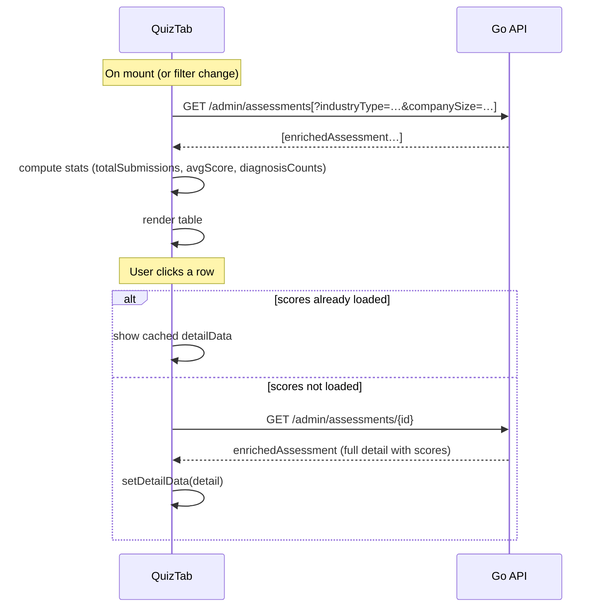
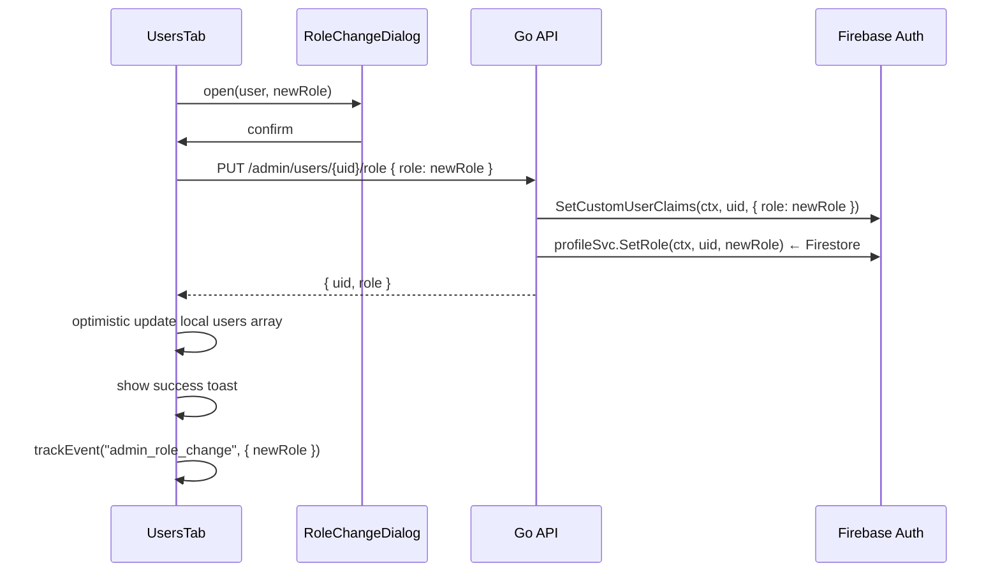

# Admin Dashboard — Feature Spec

> Role-gated operations page for administrators. Two tabs: **Assessments** (all
> user submissions with stat cards, filters, inline dimension detail, and CSV
> export) and **Users** (registered profile list with role management and a
> detail dialog). Backed by five endpoints under `/api/v1/admin/`, all protected
> by `FirebaseAuth` + `RequireAdmin`.

> **Scope note — two separate admin surfaces exist:**
>
> | Surface | App | Actor | Auth claim |
> |---------|-----|-------|-----------|
> | `/admin` page (this spec) | `web-app` | End-users with the `role: "admin"` claim | `role == "admin"` |
> | Backoffice portal | `web-backoffice` | FactorySync internal staff | `backofficeRole ∈ {"staff","superadmin"}` |
>
> These are different actor groups. **New admin capabilities should go into
> `web-backoffice`** unless they are specific to end-user administration.
> See [backoffice/feature-spec.md](../backoffice/feature-spec.md) for the staff portal spec.

---

## 1. Summary

`/admin` is accessible only to users with `role == "admin"` in their Firebase
custom claims. It gives operators a complete view of platform activity without
touching Firestore directly.

The page is split into two tabs:

| Tab | Data source | Key actions |
|-----|-------------|-------------|
| **Assessments** (`quiz`) | `GET /admin/assessments` | Filter by industry/size, expand row for dimension detail, export CSV |
| **Users** (`users`) | `GET /admin/users` | Filter by role, view full profile in dialog, promote/demote admin |

Both tabs use local component state — no Redux. All API calls use `api.get` /
`api.put` which attach the Firebase ID token automatically.

---

## 2. Goals & Non-Goals

### Goals

- Show all assessments enriched with company profile data (company name, industry,
  size, contact).
- Provide stat cards: total submissions, average score, diagnosis distribution.
- Industry and company-size filter controls in the assessments tab.
- Expandable assessment row that fetches full dimension scores, strengths, and
  weaknesses on demand.
- CSV export of all assessments (up to 10,000 rows).
- List all registered users with company info and current role.
- Promote / demote user to/from admin via a confirmation dialog.
- Bilingual (TH/EN) via `useLocale()`.
- Track key admin actions via analytics.

### Non-Goals

- Pagination (all data returned in one request — see §11 for known limits).
- Editing assessment data or deleting records.
- Creating users (registration is user-initiated via the app).
- Server-side row-level permissions beyond `RequireAdmin`.

---

## 3. Current State

| Component | Location | Status |
|-----------|----------|--------|
| Admin page | `apps/web-app/src/pages/AdminPage.tsx` | ✅ Built |
| `QuizTab` | Inline in `AdminPage.tsx` | ✅ Built |
| `UsersTab` | Inline in `AdminPage.tsx` | ✅ Built |
| `UserDetailDialog` | Inline in `AdminPage.tsx` | ✅ Built |
| `RoleChangeDialog` | Inline in `AdminPage.tsx` | ✅ Built |
| Backend handler | `apps/backend/services/admin/handler.go` | ✅ Built |
| Route guard | `AdminGuard` in `apps/web-app/src/components/guards/AdminGuard.tsx` | ✅ Built |
| Backend route registration | `main.go` | ✅ Built |
| Server-side industry/size filter | `admin/handler.go` `ListAssessments` | ⚠️ Not implemented (see §11) |

---

## 4. UI Layout

### Assessments tab

```
┌──────────────────────────────────────────────────────────────┐
│  Admin Dashboard        [Export CSV ↓]  ← header             │
│  Manage users and assessments                                 │
├──────────────────────────────────────────────────────────────┤
│  [Assessments] [Users]   ← shadcn Tabs                       │
├──────────────────────────────────────────────────────────────┤
│  ┌──────────────┐  ┌──────────────┐  ┌──────────────────┐    │
│  │ 42           │  │ 3.24         │  │ • Established: 18│    │
│  │ Total        │  │ Avg Score    │  │ • Advanced: 12   │    │
│  │ Submissions  │  │ /5.00        │  │ • Developing: 8  │    │
│  └──────────────┘  └──────────────┘  │ • Beginning: 4   │    │
│                                      └──────────────────────┘    │
├──────────────────────────────────────────────────────────────┤
│  [Industry ▾ All]  [Size ▾ All]  [Export CSV ↓] ←mobile only │
├──────────────────────────────────────────────────────────────┤
│  ID        Company         Quiz    Score  Diagnosis  Date     │
│  a1b2c3d4… Acme Co.     [shindan] 3.47  [Established] ...    │
│  ├─ expanded detail row ──────────────────────────────────── │
│  │  Company · Industry · Size · Contact Name · Contact Email │
│  │  Dimension scores grid (2-col)                            │
│  │  Strengths panel | Weaknesses panel                       │
│  └───────────────────────────────────────────────────────── │
│  f7e8d9c0… Beta Ltd.    [factory]  4.12  [Advanced]   ...    │
└──────────────────────────────────────────────────────────────┘
```

### Users tab

```
┌──────────────────────────────────────────────────────────────┐
│  [Role ▾ All]   12 / 45 users                                │
├──────────────────────────────────────────────────────────────┤
│  Name         Email (desktop)  Company   Role     Registered │
│  Jane D.      jane@…           Acme Co.  [admin]  10 มิ.ย.  [Demote] │
│  John S.      john@…           Beta Ltd. [user]   09 มิ.ย.  [Promote Admin] │
└──────────────────────────────────────────────────────────────┘
```

Clicking a user row opens `UserDetailDialog` with all profile fields in a 2-col
grid. The role toggle button opens `RoleChangeDialog` for confirmation.

---

## 5. Component Breakdown

### `AdminPage`

Top-level page. Renders:
- Page header (title, subtitle, desktop CSV export button via direct `fetch`).
- shadcn `Tabs` with `quiz` as the default tab.
- `<QuizTab />` and `<UsersTab />`.

### `QuizTab`

Local state: `assessments`, `loading`, `industryFilter`, `sizeFilter`,
`selectedId`, `detailLoading`, `detailData`.

Fetches `GET /admin/assessments` on mount and whenever `industryFilter` or
`sizeFilter` changes (via `useEffect` dependency array). Computes three stats
from the loaded array (no extra API call).

Table rows are `<tr>` elements. Clicking one toggles the inline detail panel:
- If `a.scores` is already populated (from a previous expand), it reuses that
  data without a network call.
- Otherwise it fetches `GET /admin/assessments/{id}` to get the full detail.

### `UsersTab`

Local state: `users`, `loading`, `updatingUid`, `toast`, `roleDialog`,
`detailUser`, `roleFilter`.

Fetches `GET /admin/users` once on mount. `roleFilter` is applied **client-side**
— no re-fetch when it changes.

`confirmRoleChange` calls `PUT /admin/users/{uid}/role`, optimistically updates
the local `users` array on success, and shows a success/error toast.

### `UserDetailDialog`

shadcn `Dialog` (max-w-lg). Renders a 2-col grid of all user profile fields.
Opens when any user table row is clicked; closes via `onClose` (X button or
backdrop).

### `RoleChangeDialog`

shadcn `Dialog` (max-w-md). Confirmation step before committing a role change.
- **Promote to admin**: violet confirm button.
- **Demote to user**: default/outline confirm button.

i18n message uses `t("admin.confirmPromote").replace("{name}", dialogName)` —
the display name comes from `contactName || displayName || email`.

### `RoleToggleButton`

Inline component for the role action in the users table. Prevents event
propagation so clicking the button doesn't also open the detail dialog.

---

## 6. Data Flow

### Assessments tab



### Role change flow



---

## 7. Backend API

All endpoints require `Authorization: Bearer {firebase-id-token}` and
`role == "admin"` custom claim (enforced by `RequireAdmin` middleware).

---

### GET `/api/v1/admin/assessments`

List all assessments, enriched with matching profile data.

**Query params**

| Param | Default | Max | Notes |
|-------|---------|-----|-------|
| `limit` | 100 | 500 | Parsed by `parseLimit` |
| `industryType` | — | — | Sent by frontend but **not applied** on the backend (see §11) |
| `companySize` | — | — | Sent by frontend but **not applied** on the backend (see §11) |

**Response — 200**
```jsonc
{
  "success": true,
  "data": [
    {
      "id": "uuid-v4",
      "uid": "firebase-uid",
      "quizId": "shindan",
      "overallScore": 3.47,
      "diagnosis": "Established",
      "submittedAt": "2026-06-10T09:00:00Z",
      "companyName": "Acme Co.",
      "industryType": "manufacturing",
      "companySize": "medium",
      "contactName": "Jane Doe",
      "contactEmail": "jane@acme.com"
    }
  ],
  "count": 42
}
```

**Errors**

| HTTP | Code | Condition |
|------|------|-----------|
| 401 | `UNAUTHORIZED` | Missing/invalid token |
| 403 | `FORBIDDEN` | Token valid but not admin |
| 500 | `INTERNAL_ERROR` | Firestore read failed |

---

### GET `/api/v1/admin/assessments/{assessmentId}`

Get a single assessment enriched with profile data.

**Path param:** `assessmentId` — validated against `^[0-9a-fA-F]{8}-…$` (UUIDv4
pattern). Returns 400 on mismatch.

**Response — 200:** same shape as one item from the list above, plus `scores`,
`strengths`, `weaknesses` arrays (sourced from the `Assessment` struct).

**Errors**

| HTTP | Code | Condition |
|------|------|-----------|
| 400 | `BAD_REQUEST` | `assessmentId` is not a valid UUIDv4 |
| 401 | `UNAUTHORIZED` | Missing/invalid token |
| 403 | `FORBIDDEN` | Not admin |
| 404 | `NOT_FOUND` | No assessment with that ID |

> **Known limitation:** The handler fetches all assessments via `ListResults`
> then linear-scans for the matching ID — O(n). Should use a direct Firestore
> `Get` by document ID (see §11).

---

### GET `/api/v1/admin/export`

Stream all assessments as a CSV file. Does not use `pkg.RespondJSON` — returns
raw `text/csv` with `Content-Disposition: attachment; filename=assessments.csv`.

**Limit:** up to 10,000 rows (`maxExportRows = 10000`).

**CSV columns (in order)**

| Column | Source |
|--------|--------|
| ID | `assessment.ID` |
| UID | `assessment.UID` |
| Company Name | enriched from profile |
| Industry Type | enriched from profile |
| Company Size | enriched from profile |
| Contact Name | enriched from profile |
| Contact Email | enriched from profile |
| Overall Score | `%.2f` formatted |
| Diagnosis | `assessment.Diagnosis` |
| Submitted At | `assessment.SubmittedAt` (ISO 8601) |

**Errors** — JSON error body if Firestore read fails before writing begins;
truncated output if error occurs mid-stream.

---

### GET `/api/v1/admin/users`

List all registered user profiles.

**Query params**

| Param | Default | Max |
|-------|---------|-----|
| `limit` | 200 | 500 |

**Response — 200**
```jsonc
{
  "success": true,
  "data": [
    {
      "uid": "firebase-uid",
      "email": "jane@acme.com",
      "displayName": "Jane Doe",
      "companyName": "Acme Co.",
      "companyRegId": "0123456789012",
      "industryType": "manufacturing",
      "companySize": "medium",
      "contactName": "Jane Doe",
      "contactEmail": "jane@acme.com",
      "contactPhone": "0812345678",
      "role": "admin",
      "createdAt": "2026-06-01T08:00:00Z",
      "updatedAt": "2026-06-10T09:00:00Z"
    }
  ],
  "count": 45
}
```

---

### PUT `/api/v1/admin/users/{uid}/role`

Promote or demote a user. Writes to both Firestore (profile document) and
Firebase custom claims (authoritative source for `RequireAdmin` checks).

**Path param:** `uid` — validated: non-empty, max 128 chars.

**Request body**
```json
{ "role": "manager" }
```
`role` must be one of `"user"`, `"manager"`, `"system_admin"`, `"owner"` — any other value returns 400.

**Dual write order:**
1. `profileSvc.SetRole(ctx, uid, role)` — updates Firestore
2. `authClient.SetCustomUserClaims(ctx, uid, { role })` — updates Firebase

If step 2 fails after step 1 succeeds, the Firestore profile and Firebase custom
claims will be out of sync until the next successful `SetUserRole` call.

**Response — 200**
```json
{ "uid": "firebase-uid", "role": "manager" }
```

**Errors**

| HTTP | Code | Condition |
|------|------|-----------|
| 400 | `BAD_REQUEST` | `uid` invalid or `role` not one of the four valid values |
| 401 | `UNAUTHORIZED` | Missing/invalid token |
| 403 | `FORBIDDEN` | Not admin |
| 500 | `INTERNAL_ERROR` | Firestore or Firebase SDK error |

---

## 8. Profile Enrichment (`enrichedAssessment`)

The backend joins assessment data with profile data before returning it to
admin consumers. This avoids separate API calls from the frontend.

```go
type enrichedAssessment struct {
    result.Assessment                        // embeds all base assessment fields
    CompanyName  string `json:"companyName"`
    IndustryType string `json:"industryType"`
    CompanySize  string `json:"companySize"`
    ContactName  string `json:"contactName"`
    ContactEmail string `json:"contactEmail"`
}
```

Profile lookup is batched: `profileSvc.GetProfilesByUIDs(ctx, uids)` is called
once per request with all unique UIDs from the result set, not N times per
assessment.

If profile lookup fails (Firestore error), the handler logs the error and returns
assessments with empty profile fields — it does not abort the request.

---

## 9. CSV Export — Frontend Implementation

The export button bypasses `api.get` and uses raw `fetch` to receive the binary
blob:

```ts
const res = await fetch(apiUrl("/admin/export"), {
  headers: { Authorization: `Bearer ${await auth.currentUser?.getIdToken()}` },
})
const blob = await res.blob()
const url = URL.createObjectURL(blob)
const a = document.createElement("a")
a.href = url
a.download = `assessments-${new Date().toISOString().slice(0, 10)}.csv`
a.click()
URL.revokeObjectURL(url)
```

The same handler logic is duplicated in both `AdminPage` (header button) and
`QuizTab` (mobile-only button) — see §11.

---

## 10. i18n Key Map (Admin namespace)

| Key | TH (approx.) | EN |
|-----|-------------|----|
| `admin.title` | แดชบอร์ดผู้ดูแลระบบ | Admin Dashboard |
| `admin.subtitle` | จัดการผู้ใช้และผลการประเมิน | Manage users and assessments |
| `admin.tabQuiz` | ผลการประเมิน | Assessments |
| `admin.tabUsers` | ผู้ใช้ | Users |
| `admin.totalSubmissions` | จำนวนการส่งทั้งหมด | Total Submissions |
| `admin.avgScore` | คะแนนเฉลี่ย | Average Score |
| `admin.distribution` | การกระจาย | Distribution |
| `admin.industry` | อุตสาหกรรม | Industry |
| `admin.allIndustries` | ทุกอุตสาหกรรม | All Industries |
| `admin.companySize` | ขนาดบริษัท | Company Size |
| `admin.allSizes` | ทุกขนาด | All Sizes |
| `admin.exportCsv` | ส่งออก CSV | Export CSV |
| `admin.id` | รหัส | ID |
| `admin.company` | บริษัท | Company |
| `admin.score` | คะแนน | Score |
| `admin.diagnosis` | ผลวินิจฉัย | Diagnosis |
| `admin.date` | วันที่ | Date |
| `admin.noAssessments` | ไม่มีผลการประเมิน | No assessments |
| `admin.noDetail` | ไม่มีรายละเอียด | No detail available |
| `admin.contactName` | ชื่อผู้ติดต่อ | Contact Name |
| `admin.accountEmail` | อีเมลบัญชี | Account Email |
| `admin.contactEmail` | อีเมลผู้ติดต่อ | Contact Email |
| `admin.phone` | โทรศัพท์ | Phone |
| `admin.regId` | เลขนิติบุคคล | Registration ID |
| `admin.role` | สิทธิ์ | Role |
| `admin.registered` | วันที่ลงทะเบียน | Registered |
| `admin.lastUpdated` | แก้ไขล่าสุด | Last Updated |
| `admin.allRoles` | ทุกสิทธิ์ | All Roles |
| `admin.filterAdmin` | แอดมิน | Admin |
| `admin.filterUser` | ผู้ใช้ | User |
| `admin.roleAdmin` | Admin | Admin |
| `admin.roleUser` | User | User |
| `admin.users` | ผู้ใช้ | Users |
| `admin.noUsers` | ไม่มีผู้ใช้ | No users |
| `admin.userDetail` | รายละเอียดผู้ใช้ | User Detail |
| `admin.promoteAdmin` | เลื่อนตำแหน่งเป็น Admin | Promote to Admin |
| `admin.demoteUser` | ลดตำแหน่งเป็น User | Demote to User |
| `admin.confirmPromote` | ยืนยันการเลื่อนตำแหน่ง {name} | Confirm promoting {name} |
| `admin.confirmDemote` | ยืนยันการลดตำแหน่ง {name} | Confirm demoting {name} |
| `admin.cancel` | ยกเลิก | Cancel |
| `admin.roleUpdated` | อัปเดตสิทธิ์สำเร็จ | Role updated successfully |
| `admin.roleError` | อัปเดตสิทธิ์ไม่สำเร็จ | Failed to update role |

---

## 11. Known Issues / Open Tasks

### 11.1 Backend filters not applied — assessment tab filter UI is cosmetic

`ListAssessments` sends query params `industryType` and `companySize` from the
frontend but the backend always uses `filters := map[string]string{}` (empty).
The handler does not read `r.URL.Query().Get("industryType")` at all, so every
filter change re-fetches **all** assessments and the filter has no effect.

**Fix:** Either apply filters server-side in `ListAssessments` (add them to the
`filters` map and handle in `result.Service.ListResults`) **or** apply them
client-side on the already-loaded `assessments` array (avoids extra Firestore
reads, acceptable at current data volume).

### 11.2 `GetAssessment` is O(n)

`GetAssessment` fetches all results via `ListResults(ctx, nil, 0)` and linearly
scans for the matching ID. For large datasets this is slow and wastes Firestore
reads.

**Fix:** Add a `GetByID` method to `result.Service` that does a direct Firestore
document `Get` using the assessment ID as the document key.

### 11.3 CSV export logic duplicated

The `handleExport` function is copy-pasted verbatim in both `AdminPage` (header
button) and `QuizTab` (mobile button). The only difference is one call passes
an analytics count param.

**Fix:** Extract to a shared `exportAssessmentsCsv(count?: number)` helper
inside `AdminPage.tsx`.

### 11.4 No pagination

Both `ListAssessments` (cap: 500) and `ListUsers` (cap: 500) return all records
in a single response. At scale this will slow page load.

**Fix:** Implement cursor-based pagination using Firestore's `StartAfter` — add
`cursor` query param to both endpoints and paginate the table.

### 11.5 Dual-write risk on `SetUserRole`

If Firestore write succeeds but the Firebase custom claims update fails, the
profile document and the ID token claims diverge. `RequireAdmin` reads claims
from the token — so a demoted user whose token hasn't refreshed yet can still
access admin routes until their token expires (~1 hour).

**Mitigation (current):** Firebase ID tokens expire in 1 hour; worst-case window
for stale admin access is 1 hour after a failed claims revocation.

**Future fix:** Add a retry or idempotent reconciliation job; or reverse the
write order (claims first, Firestore second) and accept that Firestore may lag.

---

## 12. Security

- All five endpoints sit behind `FirebaseAuth` + `RequireAdmin` — authenticated
  non-admin users receive 403, unauthenticated requests receive 401.
- `SetUserRole` reads `uid` from the path param (not body) and the target is the
  user being modified, not the caller — the caller's UID is never used here.
  Admins **can** modify their own role (self-demotion is allowed).
- `GetAssessment` validates `assessmentId` against a UUIDv4 regex before any
  Firestore read — prevents path traversal or injection via the ID param.
- CSV export streams directly from Firestore — no temp files written to disk.

---

## 13. Analytics Events

| Event | Trigger | Properties |
|-------|---------|------------|
| `admin_export_csv` | CSV download button clicked (header) | `count: assessments.length` (QuizTab only) |
| `admin_export_csv_error` | Download fetch fails | — |
| `admin_role_change` | Role change confirmed and API returns 200 | `{ newRole }` |
| `admin_role_change_error` | Role change API call fails | `{ newRole }` |

---

## 14. Acceptance Criteria

- [ ] Non-admin users navigating to `/admin` are redirected to `/` by `AdminGuard`.
- [ ] Admin users see the Assessments tab by default on page load.
- [ ] Stat cards show correct Total Submissions, Average Score, and Diagnosis Distribution for the loaded data.
- [ ] Clicking an assessment row expands an inline detail panel; clicking again collapses it.
- [ ] Expanding a row without pre-loaded scores triggers `GET /admin/assessments/{id}`; expanding again uses the cached data.
- [ ] CSV Export button triggers a file download named `assessments-YYYY-MM-DD.csv`.
- [ ] Users tab lists all registered users.
- [ ] Role filter (All / Admin / User) narrows the displayed rows client-side.
- [ ] Clicking a user row opens `UserDetailDialog` with all profile fields.
- [ ] Clicking "Promote Admin" / "Demote User" opens `RoleChangeDialog`.
- [ ] Confirming a role change calls `PUT /admin/users/{uid}/role` and updates the role badge in the table.
- [ ] A success toast appears after a role change; an error toast appears on failure.
- [ ] All text renders in the active locale (TH/EN).
- [ ] `make lint-web` and `make test-api` pass.

---

## 15. Testing

- **Unit (Vitest — AdminPage):**
  - Stat card calculations: `totalSubmissions`, `avgScore`, `diagnosisCounts` from a fixture array.
  - `getScoreColor` threshold boundaries (≥4 → emerald, ≥3 → blue, ≥2 → amber, <2 → red).
  - `parseLimit` (Go): unit-testable pure function — default, max-clamp, invalid string, negative value.
- **Integration (service_test.go):**
  - `GET /admin/assessments` returns 403 for a non-admin token.
  - `PUT /admin/users/{uid}/role` returns 400 for `role: "superuser"`.
  - `GET /admin/assessments/{id}` returns 404 for a valid UUIDv4 with no matching document.
- **E2E (Playwright):**
  - Non-admin user navigating to `/admin` → assert redirect to `/`.
  - Admin user → `/admin` → assert `data-testid="admin-assessment-table"` visible.
  - Click first table row → assert detail panel visible.
  - Click "Export CSV" → assert file download initiated (check network request for `Content-Disposition`).
  - Switch to Users tab → assert `data-testid="admin-users-table"` visible.
  - Click a user row → assert `UserDetailDialog` opens.

---

## 16. References

- Admin page: [AdminPage.tsx](../../../apps/web-app/src/pages/AdminPage.tsx)
- Backend handler: [handler.go](../../../apps/backend/services/admin/handler.go)
- Admin guard: [guards/AdminGuard.tsx](../../../apps/web-app/src/components/guards/AdminGuard.tsx)
- Result service (used by admin): [result/service.go](../../../apps/backend/services/result/service.go)
- Profile service (used by admin): [profile/service.go](../../../apps/backend/services/profile/service.go)
- Auth feature (RequireAdmin, custom claims): [auth/feature-spec.md](../auth/feature-spec.md)
- Result feature (assessment model): [result/feature-spec.md](../result/feature-spec.md)

---

*Version: 1.1.0*
*Last updated: 3 July 2026*
