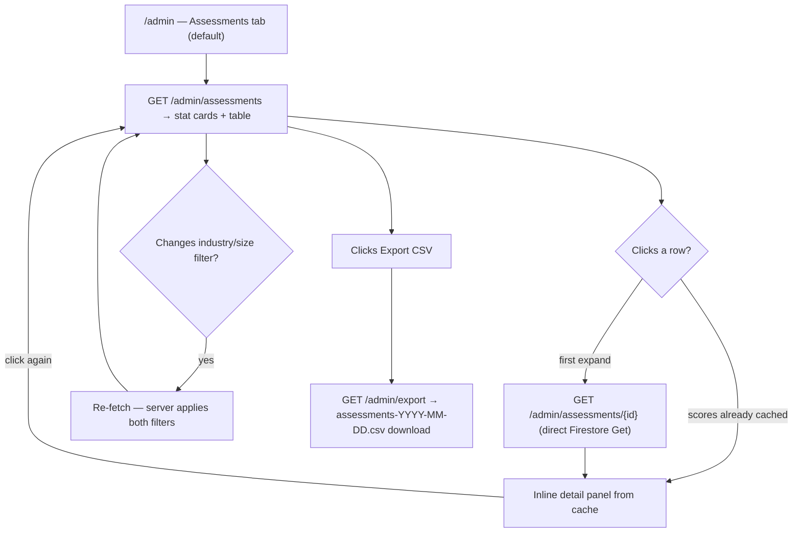
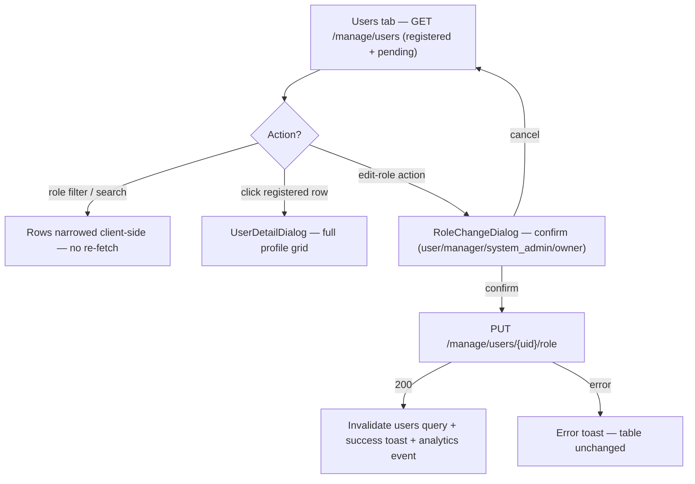
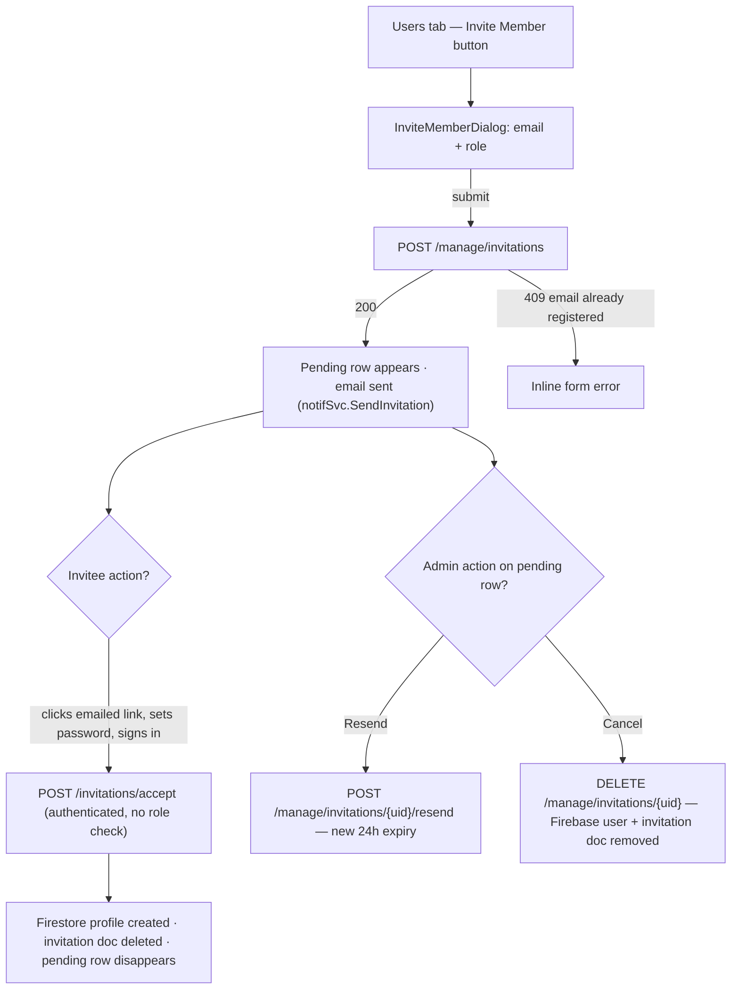
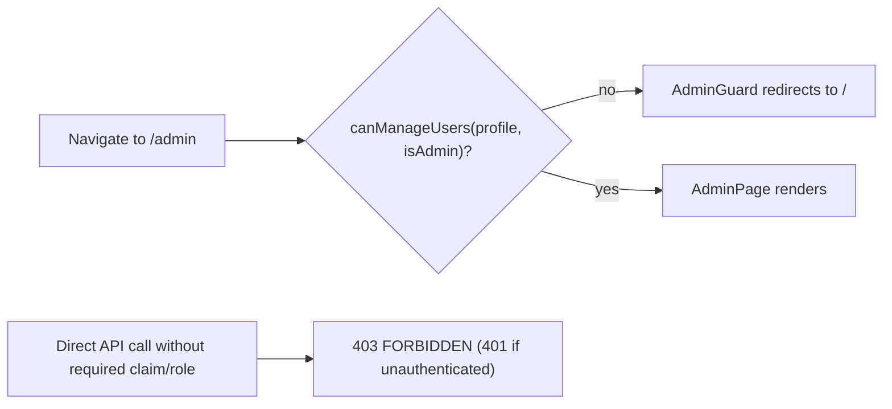

# Admin Dashboard — User Journeys

How each actor moves through the `/admin` page. See [README.md](./README.md) for the
design spec and [feature-spec.md](./feature-spec.md) for the formal requirements.

> Reflects what is **built today**. The assessments industry/size filter is now applied
> server-side (in-memory, post-enrichment) — no longer cosmetic. See
> [status.md](./status.md) for what changed since the original ship date.

---

## Table of Contents

- [Admin — reviewing assessments](#admin--reviewing-assessments)
- [Admin — managing user roles](#admin--managing-user-roles)
- [Admin — inviting a member](#admin--inviting-a-member)
- [Non-admin — guard redirect](#non-admin--guard-redirect)

---

## Admin — reviewing assessments

An admin lands on `/admin` (Assessments tab is the default), scans the stat cards, drills
into a submission's dimension detail, and exports everything as CSV.

**Guard(s):** `AdminGuard` on the route; every API call requires a Bearer token with the
`role == "admin"` custom claim (`FirebaseAuth` + `RequireAdmin`). Detail in
[admin-page.md](./admin-page.md) and [admin-api.md](./admin-api.md).

---

## Admin — managing user roles

An admin switches to the Users tab, inspects a profile, and promotes or demotes a user
through a confirmation dialog.

**Guard(s):** same as above — `AdminGuard` + backend `RequireFirestoreRole` on
`/manage/*` (owner / system_admin / admin). The backend dual-writes Firebase custom
claims first, then the Firestore profile. Detail in [admin-api.md](./admin-api.md).

---

## Admin — inviting a member

An admin invites a new user by email, the invitee receives a password-setup email, and
the pending invite is visible (and manageable) in the Users tab until accepted.

**Guard(s):** `/manage/invitations*` requires `RequireFirestoreRole` (owner /
system_admin / admin); `/invitations/accept` requires only a valid Firebase token — the
invitee has no profile or role yet when they accept. Detail in
[admin-api.md](./admin-api.md).

---

## Non-admin — guard redirect

Any authenticated user without user-management permission who navigates to `/admin` is
bounced by the route guard; direct API calls are refused by the backend independently.

**Guard(s):** `AdminGuard` (client) is convenience only — `RequireAdmin` /
`RequireFirestoreRole` (server) is authoritative.

---

*See [README.md](./README.md) for the feature spec.*

---

*Version: 2.0.0*
*Last updated: 5 July 2026*
