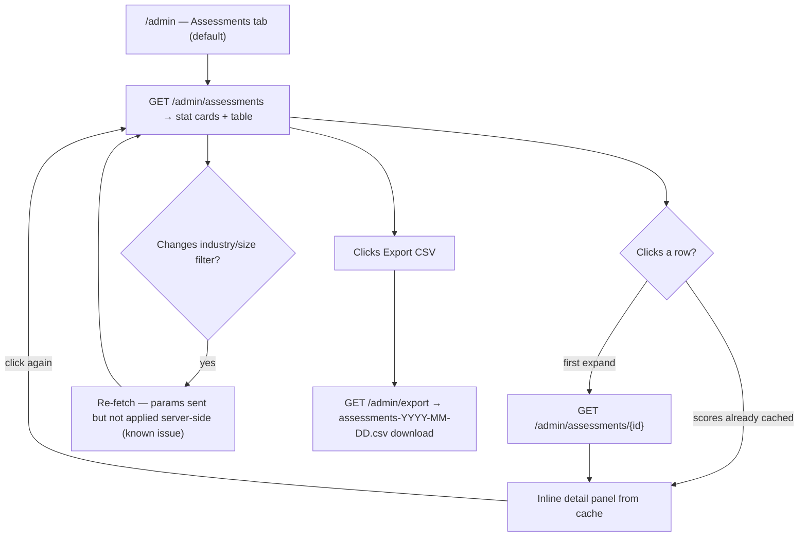
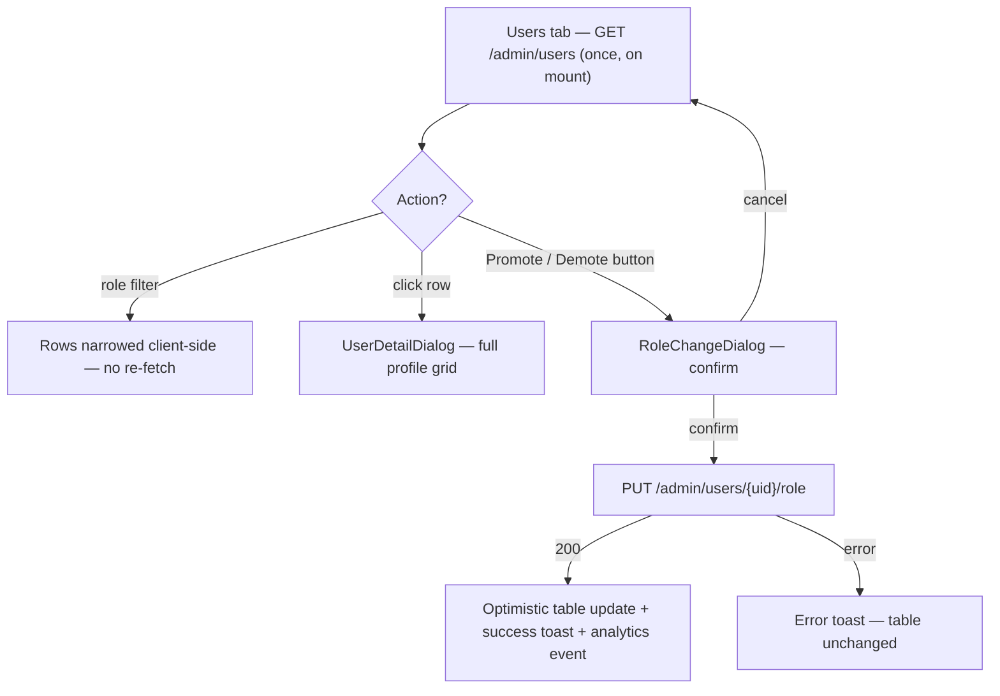
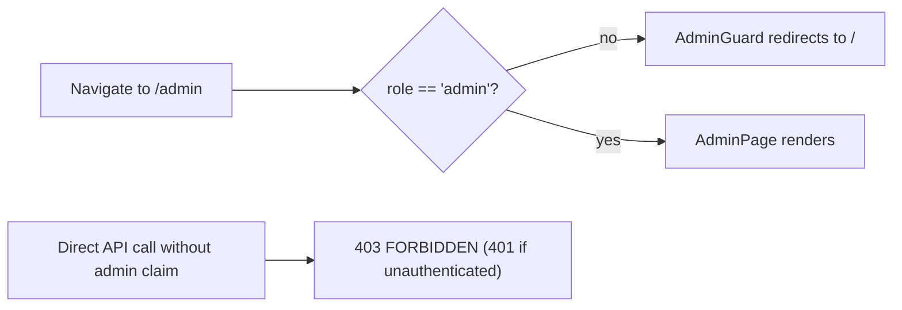

# Admin Dashboard — User Journeys

How each actor moves through the `/admin` page. See [README.md](./README.md) for the
design spec and [feature-spec.md](./feature-spec.md) for the formal requirements.

> Reflects what is **built today** — all journeys below are fully shipped. The only caveat:
> the assessments industry/size filter re-fetches but does not actually narrow results
> (backend ignores the params — see [status.md](./status.md)).

---

## Table of Contents

- [Admin — reviewing assessments](#admin--reviewing-assessments)
- [Admin — managing user roles](#admin--managing-user-roles)
- [Non-admin — guard redirect](#non-admin--guard-redirect)

---

## Admin — reviewing assessments

An admin lands on `/admin` (Assessments tab is the default), scans the stat cards, drills
into a submission's dimension detail, and exports everything as CSV.

**Guard(s):** `AdminGuard` on the route; every API call requires a Bearer token with the
`role == "admin"` custom claim (`FirebaseAuth` + `RequireAdmin`). Detail in
[admin-page.md](./admin-page.md) and [admin-api.md](./admin-api.md).

---

## Admin — managing user roles

An admin switches to the Users tab, inspects a profile, and promotes or demotes a user
through a confirmation dialog.

**Guard(s):** same as above — `AdminGuard` + `RequireAdmin`. The backend dual-writes the
Firestore profile and Firebase custom claims; a demoted user's existing token stays valid
up to ~1 hour. Detail in [admin-api.md](./admin-api.md).

---

## Non-admin — guard redirect

Any authenticated user without the `role == "admin"` claim who navigates to `/admin` is
bounced by the route guard; direct API calls are refused by the backend independently.

**Guard(s):** `AdminGuard` (client) is convenience only — `RequireAdmin` (server) is
authoritative.

---

*See [README.md](./README.md) for the feature spec.*

---

*Version: 1.0.0*
*Last updated: 3 July 2026*
