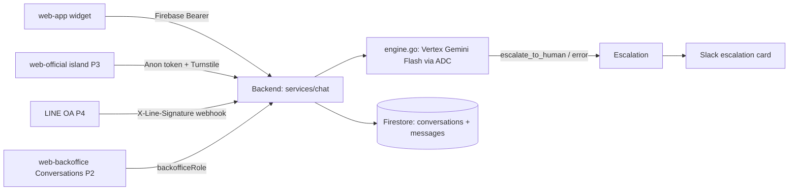

# AI Customer Support Chatbot

**Status:** In progress — Phase 1 built on `feature/chatbot-core` · [feature-spec.md](./feature-spec.md) ·
CR-004 in [change-request-log.md](../../iso29110/change-request-log.md)

An AI-first customer support chatbot that answers customer questions (services,
health-check quizzes, pricing inquiries, how-to) in Thai and English across every customer
touchpoint — a chat bubble in **web-app** and **web-official**, and a **LINE Official
Account** — and escalates to the human support team via **Slack** and a **backoffice
Conversations page** when the AI cannot help or the customer asks for a person.

## Table of Contents

1. [App surfaces](#app-surfaces)
2. [Summary](#summary)
3. [Goals & non-goals](#goals--non-goals)
4. [Current state](#current-state)
5. [Design overview](#design-overview)
6. [Build sequence](#build-sequence)
7. [Security invariants](#security-invariants)
8. [Acceptance criteria](#acceptance-criteria)
9. [Testing](#testing)
10. [Open items & future work](#open-items--future-work)
11. [References](#references)

## App surfaces

| web-app | web-official | web-backoffice | backend |
|:-------:|:------------:|:--------------:|:-------:|
| ✅ P1 | ✅ P3 | ✅ P2 | ✅ P1 |

Plus two external channels: **LINE OA** (P4) and **Slack** (escalation card in P1,
two-way relay in P5). The widget itself is a shared component in
`packages/shared/ui/chat-widget/`.

## Summary

| Component | Description | Phase |
|-----------|-------------|-------|
| **Chat core + AI engine** | `services/chat/` — conversations, messages, status machine, Vertex Gemini Flash engine with `escalate_to_human` tool + canned bilingual fallback, one-way Slack escalation card | P1 ✅ |
| **web-app widget** | `ChatWidget` from `packages/shared` mounted in `Layout.tsx` — history, polling, typing state, TH/EN | P1 ✅ |
| **Backoffice console** | Conversations list + transcript, takeover / agent reply / hand-back / close | P2 |
| **web-official widget** | Astro island (`client:visible`), Firebase Anonymous Auth on open, Turnstile-gated | P3 |
| **LINE OA channel** | `/webhooks/line` signature verify + idempotency, reply-token/push delivery | P4 |
| **Slack two-way relay** | `/webhooks/slack` Events API, thread bridge, agent-reply relay, loop prevention | P5 |
| **Agentic tools (ADK-Go) / RAG** | Result lookup + booking tools, then RAG over the CMS Knowledge Hub | Roadmap (separate CRs) |

## Goals & non-goals

### Goals

- Give customers an in-product support channel on every touchpoint (web-app,
  web-official, LINE) with grounded bilingual answers from a curated knowledge file.
- Escalate cleanly to humans: `bot → escalated → human → closed`, Slack alerts, and a
  backoffice console for takeover — the bot never replies over an agent.
- Degrade gracefully: an AI/Slack/LINE failure must never fail the customer-facing
  request (canned bilingual apology + auto-escalate).

### Non-goals

- Voice/phone support, attachments in chat, CSAT surveys, SLA dashboards, support analytics.
- Facebook Messenger / WhatsApp / other channels.
- RAG over the CMS Knowledge Hub (MVP uses `config/chatbot-knowledge.md`; RAG is roadmap
  Phase 7) and agentic tools beyond escalation (ADK-Go migration comes with them, Phase 6).
- Proactive outbound campaigns (LINE broadcasts).

## Current state

**Phase 1 is implemented** on `feature/chatbot-core` (commit `456d179`): the `chat`
service (models, repository, service, handlers, engine, Slack card) with unit/handler
tests, the shared `ChatWidget` mounted in web-app, Firestore rules + indexes, and the
knowledge file. Not yet merged to `develop` or released — staging verification is blocked
on the unprovisioned prerequisites listed under [Open items](#open-items--future-work).
Phases 2–5 are not started. Progress is tracked in [status.md](./status.md).

## Design overview

| Endpoint | Method | Auth | Phase |
|----------|--------|------|:-----:|
| `/api/v1/chat/conversations` | `POST` | Firebase Bearer (anon allowed for web-official) + Turnstile (web-official) | P1 |
| `/api/v1/chat/conversations/current` | `GET` | Firebase Bearer | P1 |
| `/api/v1/chat/conversations/{conversationID}/messages` | `POST` / `GET` | Firebase Bearer (owner) | P1 |
| `/api/v1/backoffice/chat/conversations*` | `GET` / `POST` / `PATCH` | `backofficeRole` | P2 |
| `/api/v1/webhooks/line` | `POST` | Public + `X-Line-Signature` | P4 |
| `/api/v1/webhooks/slack` | `POST` | Public + Slack signing secret | P5 |

Conversation status machine: `bot → escalated → human → closed` (`closed` reachable from
any state; closed conversations transparently start a fresh conversation on the next
customer message).

## Build sequence

Each phase is its own `feature/*` branch + PR into `develop`, released independently
(SDD §2.3). The [test-plan](./test-plan.md) gains a section per phase before that phase's
implementation.

| # | Phase (branch) | Delivers | SRS |
|---|---------------|----------|-----|
| 1 ✅ | Core + web-app bubble (`feature/chatbot-core`) | `services/chat/*`, `engine.go`, knowledge file, Slack card, `ChatWidget` in web-app, rules + indexes | FR-001–007, FR-010, FR-014 |
| 2 | Backoffice console (`feature/chatbot-backoffice`) | Conversations pages, takeover/reply/close, `/backoffice/chat/*` routes (incl. wiring the existing `UpdateStatus` service method), deferred `chat.conversation.escalated` domain events | FR-012, FR-013 |
| 3 | Public-site widget (`feature/chatbot-official`) | Astro island (`client:visible`), anonymous sign-in, Turnstile gate, per-conversation rate limit | FR-015 |
| 4 | LINE OA channel (`feature/chatbot-line`) | `/webhooks/line`, signature verify, idempotency, async ACK, reply/push delivery | FR-008, FR-009 |
| 5 | Slack two-way relay (`feature/chatbot-slack-relay`) | `/webhooks/slack`, thread bridge, agent-reply relay, loop prevention | FR-011 |

## Security invariants

| Invariant | Where enforced |
|-----------|----------------|
| Conversation ownership and actor IDs come from `middleware.GetUID(r)` only — including web-official anonymous sessions | `services/chat/handler.go` |
| Foreign conversations return **not-found**, never forbidden (no existence leak) | `services/chat/service.go` (`ErrConversationNotFound`) |
| LINE webhook verifies `X-Line-Signature` (HMAC-SHA256); Slack events verify signing secret + timestamp (> 5 min stale ⇒ 401) | channel adapters (P4/P5) |
| web-official conversation creation gated by Turnstile | `pkg/turnstile.go` + handler |
| Backoffice chat endpoints behind `RequireBackofficeRole("superadmin", "staff")` | middleware chain (P2) |
| LLM auth via service-account ADC — no API key secret; channel secrets via env vars only | `engine.go`, runtime config |
| Prompt-injection containment: scoped system prompt; the bot has no tools that read other users' data | `engine.go` + knowledge file |
| Transcripts contain PII → Firestore collections are backend-only (`allow read, write: if false`) | `firestore.rules` |
| Per-conversation rate limit (10 msg/min) on top of global IP rate limiting | `services/chat/service.go` |

## Acceptance criteria

- A customer message in a `bot` conversation stores the message and returns an AI reply;
  in `escalated`/`human` status no AI reply is generated.
- Thai questions get Thai answers grounded on the knowledge file; out-of-scope questions
  get "I don't know" + escalation offer — never fabricated pricing or commitments.
- "Talk to a human" (TH/EN) escalates with a bilingual handoff message; repeated triggers
  do not duplicate Slack alerts; Vertex unconfigured/down ⇒ canned apology + auto-escalate
  with the API call still succeeding.
- Empty or > 4,000-char messages return `400 VALIDATION_ERROR`; the 11th message in a
  minute returns `429`.
- Widget chrome is bilingual via `useLocale()`, keyboard operable with a focus trap, and
  polls (≥ 3s) only while the panel is open.

## Testing

| Package / suite | Target | Notes |
|-----------------|--------|-------|
| `services/chat/service_test.go` + `service_errors_test.go` | ≥ 80% | domain logic, status machine, ownership, limits |
| `services/chat/engine_test.go` | ≥ 80% (logic paths) | stubbed `modelClient`: replies, tool call, fallbacks, windowing |
| `services/chat/handler_test.go` + `handler_errors_test.go` | ≥ 60% | contracts, auth, validation, rate limit |
| `packages/shared` chat-widget tests | key paths | widget + `useChatSession` (UT-F01…F08) |
| Playwright e2e | — | deferred until the widget is on staging |

Full cases in [test-plan.md](./test-plan.md). Run:
`cd apps/backend && go test -v -race -cover ./services/chat/...` ·
`pnpm --filter @repo/shared test`

## Open items & future work

### Unprovisioned prerequisites (block staging verification)

| # | Prerequisite | Needed for |
|---|--------------|-----------|
| 1 | Vertex/platform API enabled + `roles/aiplatform.user` on the Cloud Run SA + GCP budget alert | Phase 1 exit |
| 2 | Env: `CHATBOT_MODEL`, `VERTEX_LOCATION`, `SLACK_WEBHOOK_SUPPORT` | Phase 1 exit |
| 3 | Firebase Anonymous Auth provider enabled + web-official Turnstile site key | Phase 3 |
| 4 | LINE OA + Messaging API channel (secret/token, webhook URL registered) | Phase 4 |
| 5 | Slack app installed (bot token `chat:write`, `channels:history`; signing secret) | Phase 5 |

### Deferred to Phase 2

- Wire the `UpdateStatus` handler route (service method exists and is tested).
- Publish `chat.conversation.escalated` domain events via `pkg/events`.

### Roadmap (separate CRs)

- **Phase 6** — agentic tools (result lookup, consultation booking) + ADK-Go migration
  behind the engine interface.
- **Phase 7** — RAG over the CMS Knowledge Hub (Vertex embeddings + Firestore native
  vector search).

## References

- [feature-spec.md](./feature-spec.md) — SRS, requirements (SI.O1)
- [test-plan.md](./test-plan.md) — test cases (SI.O4/O5)
- [status.md](./status.md) — build progress tracker
- [ai-chatbot-design.md](../../architecture/ai-chatbot-design.md) — SDD, phases + component design
- CR-004 in [change-request-log.md](../../iso29110/change-request-log.md)
- [chatbot-knowledge.md](../../../apps/backend/config/chatbot-knowledge.md) — curated knowledge file
- [LINE Messaging API](https://developers.line.biz/en/docs/messaging-api/) · [Slack Events API](https://api.slack.com/apis/events-api) · [Vertex AI Gemini](https://cloud.google.com/vertex-ai/generative-ai/docs)

*Version: 0.1.0*
*Last updated: 3 July 2026*
