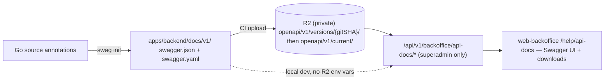

# API Docs Publishing — Feature Spec

**Status:** ✅ Implemented — Swagger generation active, CI publishes to private R2, superadmin-only viewer live at `/help/api-docs` in `web-backoffice`.

---

## Table of Contents

1. [App surfaces](#app-surfaces)
2. [Summary](#summary)
3. [Goals & Non-Goals](#goals--non-goals)
4. [Current State](#current-state)
5. [Design Overview](#design-overview)
6. [Security Invariants](#security-invariants)
7. [Acceptance Criteria](#acceptance-criteria)
8. [Testing](#testing)
9. [Open Items & Future Work](#open-items--future-work)
10. [References](#references)

---

> Controlled documentation pipeline for the backend API: `swaggo/swag` generates versioned
> Swagger/OpenAPI artifacts from Go annotations (`apps/backend/docs/v1/`), CI uploads them
> to a private Cloudflare R2 bucket per environment, and superadmin-only backend endpoints
> under `/api/v1/backoffice/api-docs/*` serve them to a Swagger UI Help page in
> `web-backoffice`. Staff and end users have no access; generated artifacts stay out of
> source control.

This README is the design index for the API Docs Publishing feature. The formal
requirements live in the ISO 29110 SRS — see [feature-spec.md](./feature-spec.md). Each
non-trivial component is documented in a dedicated sub-document; see
[References](#references).

---

## App surfaces

| web-backoffice | backend |
|:--------------:|:-------:|
| ✅ | ✅ |

Neither `web-app` nor `web-official` is touched. `web-backoffice` renders the
superadmin-only `/help/api-docs` viewer; the backend generates the docs (annotations) and
serves them from R2 (or local filesystem in dev). CI (GitHub Actions) does the publishing.
Per-actor flows live in [user-journeys.md](./user-journeys.md).

---

## Summary

| Component | Description |
|-----------|-------------|
| **Docs pipeline** (CLI + CI) | `swaggo/swag` generation (`make docs-api`) + CI upload of versioned/current artifacts to private R2 — see [docs-pipeline.md](./docs-pipeline.md) |
| **API docs read service** (backend) | Four superadmin-only endpoints under `/api/v1/backoffice/api-docs/*` reading from R2 or local disk — see [api-docs-service.md](./api-docs-service.md) |
| **Help / API Docs page** (web-backoffice) | `/help/api-docs` behind `SuperAdminGuard`: Swagger UI viewer, version selector, metadata, JSON/YAML downloads — see [help-page.md](./help-page.md) |

---

## Goals & Non-Goals

### Goals

- Generate Swagger/OpenAPI docs from source annotations using `swaggo/swag`.
- Publish generated docs to Cloudflare R2 for `staging` and `production`.
- Support API documentation versioning, starting with `v1` and allowing future versions such as `v2`.
- Keep the published docs superadmin-only: `SuperAdminGuard` on the frontend, `RequireBackofficeRole(..., "superadmin")` on the backend.
- Show API docs in `web-backoffice` under a superadmin-only Help route.
- Show doc metadata: environment, API version, OpenAPI version, generated time, source commit SHA, and download links.
- Ensure CI fails when docs cannot be generated or uploaded.
- Keep generated files out of normal source review.

### Non-Goals

- Public Swagger UI for customers.
- Editing OpenAPI documents by hand.
- Generating SDK clients from the OpenAPI document.
- Replacing existing Markdown API docs in `docs/api/`.
- Public or staff-level access to API docs.
- Adding R2 credentials to frontend apps.

---

## Current State

See [status.md](./status.md) for the per-component implementation checklist. All five
implementation phases are live; remaining items are the open questions in
[Open Items](#open-items--future-work).

---

## Design Overview

### Artifact storage (R2)

One private bucket per environment; no public `r2.dev` access, no public custom domain.

| Environment | R2 bucket |
|-------------|-----------|
| Staging | `apidoc-factorysyncsolutions-com-staging` |
| Production | `apidoc-factorysyncsolutions-com` |

Layout per bucket: `openapi/{apiVersion}/current/{metadata.json, swagger.json, swagger.yaml}`
plus `openapi/{apiVersion}/versions/{gitSHA}/{...}` for traceability. CI writes the
versioned copy first, then updates `current/` after a successful upload. Metadata fields:
`environment`, `apiVersion`, `gitSHA`, `generatedAt` (ISO 8601 UTC), `openapiVersion`
(v1 emits Swagger 2.0), `jsonKey`, `yamlKey`.

### API contract

All endpoints are guarded by Firebase Auth + `RequireBackofficeRole(authClient, "superadmin")`
and use the standard response helpers (never raw JSON):

| Method | Path | Auth / Role | Purpose |
|--------|------|-------------|---------|
| `GET` | `/api/v1/backoffice/api-docs/versions` | Bearer · superadmin | List available API doc versions (`data.versions[]` with `apiVersion`, `label`, `isCurrent`) |
| `GET` | `/api/v1/backoffice/api-docs/{apiVersion}/metadata` | Bearer · superadmin | Artifact metadata for the version |
| `GET` | `/api/v1/backoffice/api-docs/{apiVersion}/openapi.json` | Bearer · superadmin | OpenAPI document inside `data.spec` — frontend passes it to Swagger UI |
| `GET` | `/api/v1/backoffice/api-docs/{apiVersion}/openapi.yaml` | Bearer · superadmin | YAML text inside `data.yaml` — powers the download button |

Missing artifacts map the sentinel `ErrAPIDocsNotFound` to 404; unsupported `apiVersion`
values are rejected against the supported-version list. Full request/response shapes in
[api-docs-service.md](./api-docs-service.md) and
[feature-spec.md § 7](./feature-spec.md#7-interface-requirements).

---

## Security Invariants

| Invariant | Where enforced |
|-----------|----------------|
| API docs buckets are private — no `r2.dev` access, no public custom domain | R2 bucket config (CI-provisioned) |
| No R2 secret is exposed to Vite, React, or Cloudflare Pages — the backend reads objects with server-side credentials only | backend env (`API_DOCS_R2_*`) |
| Endpoints require `RequireBackofficeRole(authClient, "superadmin")`; staff receive 403 before any R2 read | backoffice route group + middleware |
| The frontend route is behind `SuperAdminGuard`, but the backend remains authoritative | `web-backoffice` router + backend middleware |
| Error responses never reveal bucket names, credentials, or full object keys to unauthorized callers | api-docs handlers |
| The generated spec must contain no secrets, service-account paths, or example bearer tokens | generation review (TC-012) |
| CI secrets live in GitHub Actions secrets, not repository files | deploy workflows |

---

## Acceptance Criteria

Mirrors [feature-spec.md § 6](./feature-spec.md#6-functional-requirements) (feature status: Implemented):

**FR-001 — Generate Swagger artifacts** — see [docs-pipeline.md](./docs-pipeline.md)
- [x] Running the docs generation command from repo root creates both JSON and YAML artifacts (entry point `apps/backend/main.go`).
- [x] Generated artifacts include all routed `/api/v1` services and declare `apiVersion: "v1"`.
- [x] Generation fails the command when annotations are invalid.

**FR-002 / FR-003 — Publish artifacts + metadata to R2** — see [docs-pipeline.md](./docs-pipeline.md)
- [x] Staging and production deploys upload to their environment's bucket: `versions/{gitSHA}/` then `current/`.
- [x] Upload failure fails the CI job before the release is considered complete.
- [x] `metadata.json` is published alongside the spec with environment, apiVersion, gitSHA, generatedAt, openapiVersion, and object keys.

**FR-004 — Backoffice API endpoints** — see [api-docs-service.md](./api-docs-service.md)
- [x] Endpoints require Firebase Auth + `backofficeRole == "superadmin"`; staff get 403 with no R2 read.
- [x] Unsupported API versions return a controlled error via `pkg.RespondError`; missing docs map `ErrAPIDocsNotFound` → 404.
- [x] Handlers use the response helpers; R2 read failures are wrapped with `fmt.Errorf("context: %w", err)`.

**FR-005 — Backoffice Help page** — see [help-page.md](./help-page.md)
- [x] `/help/api-docs` nested under `SuperAdminGuard`; sidebar Help item visible to superadmins only.
- [x] Swagger UI renders from the authenticated JSON endpoint; Download JSON/YAML buttons work.
- [x] shadcn `Select` for the API version, `useLocale()` text, `formatDateTime()` dates, loading/empty/error states, usable at 320px.

**FR-006 — Local development**
- [x] A local command generates OpenAPI files into `apps/backend/docs/`; the backend serves them from disk when R2 env vars are absent (same version path shape).
- [x] Missing local artifacts show a clear backoffice error naming the generation command.

**FR-007 — Documentation links**
- [x] [docs/api/swagger.md](../../api/swagger.md), [docs/operations/env-variables.md](../../operations/env-variables.md), and [docs/operations/deployment.md](../../operations/deployment.md) document the active workflow, env vars, and CI upload step.

---

## Testing

Test plan from [feature-spec.md § 10](./feature-spec.md#10-test-plan):

| Case | Requirement | Type | Expected |
|------|-------------|------|----------|
| TC-001/002 | FR-001 | CLI | Generation creates JSON + YAML; invalid annotations fail |
| TC-003 | FR-002 | CI | Staging upload writes versioned + current R2 objects |
| TC-004 | FR-003 | Backend unit | Metadata endpoint returns expected fields via `pkg.RespondJSON` |
| TC-005–007 | FR-004 | Backend unit | Missing artifact → 404; staff → 403 before any R2 read; unsupported version → controlled error |
| TC-008–010 | FR-005 | Frontend unit | Superadmin page renders; staff see no Help item; localized error state on failed fetch |
| TC-011 | FR-006 | Manual local | Filesystem mode renders docs without R2 env vars |
| TC-012 | Security | Review | Generated spec contains no secrets or private credentials |

Backend tests are table-driven (superadmin success, staff forbidden, unsupported version,
missing artifact, R2 read failure).

---

## Open Items & Future Work

Open questions from [feature-spec.md § 11](./feature-spec.md#11-open-questions):

| # | Decision | Resolution |
|---|----------|------------|
| 1 | Run docs generation in every test workflow, or only deploy workflows? | **Open** |
| 2 | Should production `current/` track the latest `main` tag or the latest successful production deploy? | **Open** |
| 3 | Should the backoffice Help section later include Markdown runbooks from `docs/operations/`? | **Open** — v1 is API docs only |
| 4 | When `v2` exists, do older versions stay visible indefinitely or follow a retention period? | **Open** |

v1 decisions already locked (serve via backend not signed R2 URLs; superadmin-only; publish
`current/` + `versions/{gitSHA}/`; artifacts out of source control; Swagger 2.0 for v1) are
recorded in [feature-spec.md § 12](./feature-spec.md#12-decisions-for-v1).

---

## References

### Sub-documents

| Doc | Covers |
|-----|--------|
| [feature-spec.md](./feature-spec.md) | ISO 29110 SRS — formal requirements, full endpoint shapes and env vars |
| [status.md](./status.md) | Current implementation status per component |
| [user-journeys.md](./user-journeys.md) | Per-actor flows (superadmin · staff · developer/CI) |
| [docs-pipeline.md](./docs-pipeline.md) | Generation (`swaggo/swag`) + CI publishing to R2 |
| [api-docs-service.md](./api-docs-service.md) | Backend read endpoints (R2 / filesystem source) |
| [help-page.md](./help-page.md) | `/help/api-docs` viewer page (web-backoffice) |
| [mockups/backoffice.md](./mockups/backoffice.md) | ASCII wireframes — Help / API Docs page |

### ISO 29110 artifacts

- Test plan is embedded in the SRS ([feature-spec.md § 10](./feature-spec.md#10-test-plan)); no separate test-plan.md.
- Scope changes → [docs/iso29110/change-request-log.md](../../iso29110/change-request-log.md)
- New risks → [docs/iso29110/risk-register.md](../../iso29110/risk-register.md)

### Cross-references

- [docs/api/swagger.md](../../api/swagger.md) — generation + publishing workflow (source of truth)
- [docs/operations/env-variables.md](../../operations/env-variables.md) — R2 docs variables
- [docs/operations/deployment.md](../../operations/deployment.md) — CI upload step
- [Backoffice](../backoffice/feature-spec.md) — the portal hosting the Help route

---

*Version: 1.0.0*
*Last updated: 3 July 2026*
