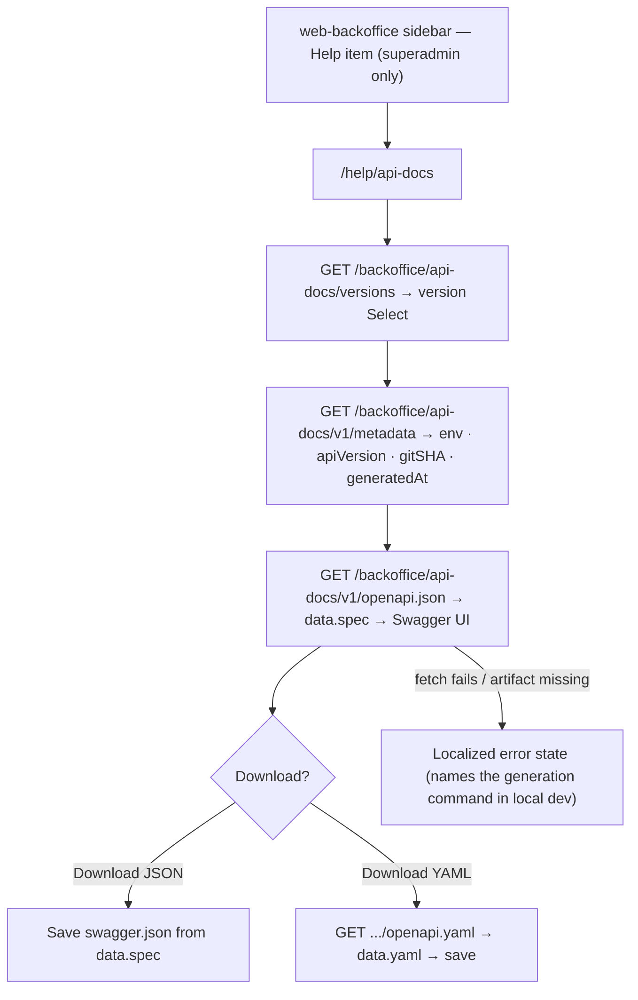
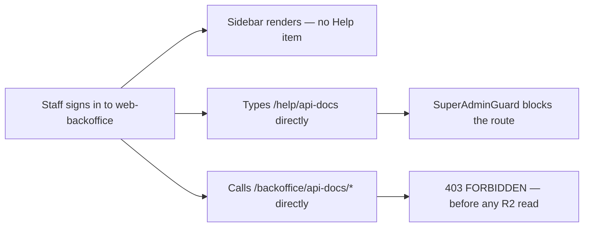
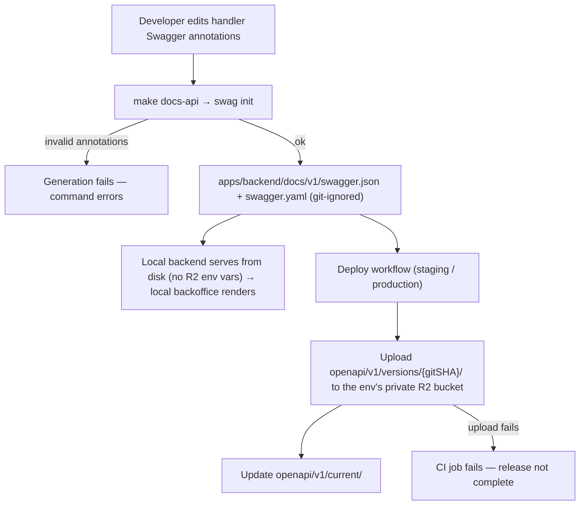

# API Docs Publishing — User Journeys

How each actor moves through the API docs pipeline and viewer. See
[README.md](./README.md) for the design spec and [feature-spec.md](./feature-spec.md) for
the formal requirements.

> Reflects what is **built today** — all journeys below are fully shipped. End users and
> staff have **no** journey here by design (docs are superadmin-only).

---

## Table of Contents

- [Super admin — inspecting the API docs](#super-admin--inspecting-the-api-docs)
- [Backoffice staff — denied by design](#backoffice-staff--denied-by-design)
- [Developer / CI — generating and publishing docs](#developer--ci--generating-and-publishing-docs)

---

## Super admin — inspecting the API docs

A FactorySync superadmin (`backofficeRole == "superadmin"`) opens the Help page in
`web-backoffice` to verify what the deployed API actually exposes.

**Guard(s):** `BackofficeGuard` + `SuperAdminGuard` on the route; every endpoint checks
`RequireBackofficeRole(authClient, "superadmin")` server-side. Detail in
[help-page.md](./help-page.md) and [api-docs-service.md](./api-docs-service.md).

---

## Backoffice staff — denied by design

Staff (`backofficeRole == "staff"`) are explicitly out of scope for Swagger/OpenAPI
access — there is no degraded view, only denial.

**Guard(s):** sidebar visibility + `SuperAdminGuard` (client) and
`RequireBackofficeRole(..., "superadmin")` (server, authoritative).

---

## Developer / CI — generating and publishing docs

Developers generate locally; GitHub Actions publishes on deploy.

**Guard(s):** CI uses dedicated API-docs R2 credentials from GitHub Actions secrets
(read/write, scoped to the target docs bucket); the backend runtime uses read-only
credentials. Detail in [docs-pipeline.md](./docs-pipeline.md).

---

*See [README.md](./README.md) for the feature spec.*

---

*Version: 1.0.0*
*Last updated: 3 July 2026*
