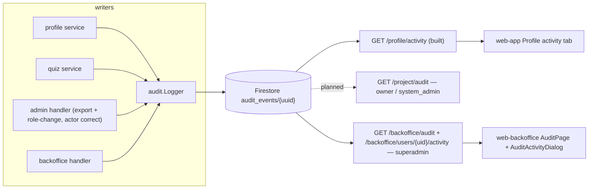

# Audit Logging — Feature Spec

**Status:** ⚠️ Partially built — logger, personal activity (web-app Profile tab), and backoffice audit (web-backoffice + superadmin API) shipped; only project-owner-scoped audit is planned.

---

## Table of Contents

1. [App surfaces](#app-surfaces)
2. [Summary](#summary)
3. [Goals & Non-Goals](#goals--non-goals)
4. [Current State](#current-state)
5. [Design Overview](#design-overview)
6. [Security Invariants](#security-invariants)
7. [Acceptance Criteria](#acceptance-criteria)
8. [Testing](#testing)
9. [Open Items & Future Work](#open-items--future-work)
10. [References](#references)

---

> Structured audit events written to the Firestore collection `audit_events` by a shared
> logger (`services/audit/audit.go`), wired into the profile, quiz, admin, and backoffice
> services. Three read surfaces: every user reviews their own activity in `web-app`,
> FactorySync superadmins audit all user/staff/project CRUD in `web-backoffice` (built),
> and project owners / system admins will review their company's activity (planned).
> Audit write failures must never break the primary business operation.

This README is the design index for the Audit Logging feature. The formal requirements
live in the ISO 29110 SRS — see [feature-spec.md](./feature-spec.md). Each non-trivial
component is documented in a dedicated sub-document; see [References](#references).

---

## App surfaces

| web-app | web-official | web-backoffice | backend |
|:-------:|:------------:|:--------------:|:-------:|
| ✅ | — | ✅ | ✅ |

`web-app` has the Profile activity tab (built; a project-audit tab for owners/system
admins is planned); `web-backoffice` has the Audit page, "View Activity" on users, and
staff activity, all superadmin-gated; the backend has the logger, personal activity, and
backoffice query endpoints built, with the project-owner query endpoint planned. Per-app
flows live in [user-journeys.md](./user-journeys.md).

---

## Summary

| Component | Description | Phase |
|-----------|-------------|-------|
| **`audit.Logger`** (backend) | `Log` writes timestamped documents to `audit_events/{uuid}`; nil-client no-op; failures never break the caller — see [audit-logger.md](./audit-logger.md) | Built |
| **Personal activity** (backend + web-app) | `GET /profile/activity` + ProfilePage Activity tab — see [audit-query-api.md](./audit-query-api.md) | Built |
| **Project audit** (backend + web-app) | `GET /project/audit` for `owner` / `system_admin`, project-scoped events | Planned |
| **Backoffice audit** (backend + web-backoffice) | `GET /backoffice/audit` search + `GET /backoffice/users/{uid}/activity`, superadmin-only UI (`AuditPage.tsx`, `AuditActivityDialog`) — see [audit-query-api.md](./audit-query-api.md) | Built |
| **Event taxonomy** | Personal (`user.*`, `assessment.*`, `admin.export`) and backoffice (`backoffice.*`) constants built; most project (`project.*`) constants built, but `member_invited`/`member_joined`/`ownership_transferred`/`invitation_revoked`/`active_switched` are not yet defined | Mixed |

---

## Goals & Non-Goals

### Goals

- Record who did what, to which resource, and when, for every meaningful mutation.
- Store enough context to answer both actor-centric ("what did this user do?") and target-centric ("what happened to this user/staff member/project?") questions.
- Scope project/company events to `projectID` so customer admins only see their own company's activity.
- Expose personal activity through `GET /api/v1/profile/activity`.
- Expose project/company activity through `GET /api/v1/project/audit`.
- Expose superadmin audit search through `/api/v1/backoffice/audit` and `/api/v1/backoffice/users/{uid}/activity`.
- Render activity in `web-app` Profile and in `web-backoffice` user/staff audit views.
- Degrade gracefully when Firestore audit writes fail.

### Non-Goals

- Compliance-grade immutability (Firestore service accounts can still edit documents unless additional controls are added).
- Auditing every read operation — export/download operations are audited, ordinary `GET` page reads are not.
- Full SIEM integration or long-term archival in this phase.

---

## Current State

See [status.md](./status.md) for the per-component implementation checklist. Built:
logger, full event model (including `targetUID`/`projectID`/actor snapshot), profile/quiz
write call sites, `GET /profile/activity`, the ProfilePage activity tab, `admin.export`,
`admin.SetUserRole` actor correctness, backoffice event constants and writer injection,
`GET /backoffice/audit`, `GET /backoffice/users/{uid}/activity`, and the web-backoffice
Audit page / "View Activity" UI. Not built: the five `project.*` member/ownership event
constants listed above, the owner/`system_admin`-scoped `GET /project/audit` endpoint,
and the optional web-app project-audit tab.

---

## Design Overview

### Data model

| Collection | Document ID | Key fields | Notes |
|------------|-------------|------------|-------|
| `audit_events` | `{uuid}` | `actorUID` · `actorEmail?` · `actorName?` · `eventType` · `resourceType` · `resourceID` · `targetUID?` · `projectID?` · `metadata?` · `createdAt` (RFC3339 UTC) | All fields, including `targetUID` / `projectID`, are on the built model; composite indexes below |

Event taxonomy ([feature-spec.md § 5](./feature-spec.md#5-event-types)): personal
(`user.login`, `user.registered`, `user.profile_updated`, `user.role_changed`,
`assessment.submitted`, `admin.export`), project (`project.created` … `project.active_switched`),
and backoffice (`backoffice.user_deleted` … `backoffice.project_member_removed`).
Backoffice events may intentionally duplicate project events — the project event answers
"what happened in this company", the backoffice event answers "what did FactorySync staff do".

Required composite indexes (`firestore.indexes.json`): `actorUID+createdAt`,
`targetUID+createdAt`, `projectID+createdAt`, `eventType+createdAt`,
`resourceType+createdAt` (each `ASC, DESC`).

### API contract

| Method | Path | Auth / Role | Purpose | Status |
|--------|------|-------------|---------|--------|
| `GET` | `/api/v1/profile/activity` | Bearer | Caller's own events (`actorUID` or `targetUID` == caller); `limit` ≤ 100, `before` cursor, `eventType` filter | ✅ Built |
| `GET` | `/api/v1/project/audit` | Bearer · `owner` / `system_admin` | Active project's events; `limit` ≤ 200, `before`, `eventType`, `actorUID`, `targetUID` | 📋 Planned |
| `GET` | `/api/v1/backoffice/audit` | Bearer · `backofficeRole == "superadmin"` | Platform-wide search; `limit` ≤ 500, `before`, `eventType`, `actorUID`, `targetUID`, `projectID`, `resourceType` | ✅ Built |
| `GET` | `/api/v1/backoffice/users/{uid}/activity` | Bearer · `backofficeRole == "superadmin"` | Actor + target timeline for one user/staff member | ✅ Built |

Query detail in [audit-query-api.md](./audit-query-api.md).

---

## Security Invariants

| Invariant | Where enforced |
|-----------|----------------|
| `actorUID` is always the authenticated UID from `middleware.GetUID(r)`, never the request body | every write call site |
| Superadmin audit endpoints check the Firebase custom claim `backofficeRole == "superadmin"` | backoffice route group (built) |
| Project audit verifies `owner` or `system_admin` for the **active** project; never returns another project's events | project audit handler (planned) |
| No secrets, ID tokens, full request bodies, or PII-heavy payloads in `metadata` — field names and old/new role/status values only | write call sites |
| Audit write failure never fails the primary business operation | `audit.Logger` callers (log-and-continue) |

---

## Acceptance Criteria

Mirrors [feature-spec.md § 10](./feature-spec.md#10-acceptance-criteria). Checked = the
spec's Current State marks the underlying component built.

**Existing personal events** — see [audit-logger.md](./audit-logger.md)
- [x] Login creates `user.login` for the caller.
- [x] Registration creates `user.registered` with `projectID` (`req.CompanyRegID`) — `profile/service.go`.
- [x] Profile update creates `user.profile_updated` with changed field names.
- [ ] Quiz submission creates `assessment.submitted` with `projectID`, quiz ID, score, and diagnosis — quiz ID/score/diagnosis are written, but `projectID` is still missing from the `quiz.Service` audit call — `apps/backend/services/quiz/service.go:116`.
- [x] `GET /profile/activity` returns only the caller's own actor/target events.
- [x] Profile Activity UI formats dates with `formatDateTime()`.

**Project / company events** — mostly built via the backoffice handler; the owner-scoped endpoint is not
- [x] Project create/update/deactivate/reactivate write project-scoped events — `apps/backend/services/backoffice/handler.go`.
- [ ] Member invite/join/role-change/remove write project-scoped events — role-change and remove are wired; invite/join/ownership-transfer/active-switch have no event constants yet.
- [ ] `GET /project/audit` requires `owner` or `system_admin` and never returns events for another project — not started; only the superadmin-gated `/backoffice/audit` exists today.

**Backoffice events** — see [audit-query-api.md](./audit-query-api.md)
- [x] Backoffice user delete and role changes write events with correct actor and target UID.
- [x] Staff role grant/change/revoke writes events with old/new role metadata.
- [x] Backoffice project/member CRUD writes events with `projectID`.
- [x] `GET /backoffice/audit` requires superadmin; `GET /backoffice/users/{uid}/activity` returns actor + target events for that UID.
- [x] Backoffice Audit page is hidden from `staff` users.

---

## Testing

From [feature-spec.md § 11](./feature-spec.md#11-testing) — intended coverage:

| Level | Target | Cases |
|-------|--------|-------|
| Unit (Go) | `audit.Logger` | nil-client no-op behavior |
| Unit (Go) | Query builders | actor, target, project, and backoffice filter combinations |
| Integration (Go) | Every mutation handler that should write an event | event written with correct actor/target/project |
| Frontend (Vitest) | Profile Activity | empty, loading, populated states |
| Frontend (Vitest) | Backoffice Audit | role gating + filter behavior |

Verification commands: `make test-api` · `make lint-web`.

---

## Open Items & Future Work

Everything still "Not implemented" in [feature-spec.md § 3](./feature-spec.md#3-current-state):

| # | Area | Description |
|---|------|-------------|
| 1 | Event constants | Five `project.*` constants — `member_invited`, `member_joined`, `ownership_transferred`, `invitation_revoked`, `active_switched` |
| 2 | Quiz write | Add `projectID` to the `assessment.submitted` audit write in `quiz.Service` |
| 3 | Query endpoint | `GET /project/audit` for `owner` / `system_admin` |
| 4 | web-app | Optional project-audit tab for `owner` / `system_admin` |
| 5 | Test gaps | See [test-plan.md](./test-plan.md) — nil-client unit test, backoffice handler integration tests, and actor-correctness regression test are the priority gaps |

### Open decisions

None recorded in the spec — the phasing above is the plan.

---

## References

### Sub-documents

| Doc | Covers |
|-----|--------|
| [feature-spec.md](./feature-spec.md) | ISO 29110 SRS — formal requirements, full event taxonomy |
| [status.md](./status.md) | Current implementation status per component |
| [user-journeys.md](./user-journeys.md) | Per-actor flows (user · owner/system admin · superadmin) |
| [audit-logger.md](./audit-logger.md) | `audit.Logger`, event schema, write call sites |
| [audit-query-api.md](./audit-query-api.md) | The four query endpoints (built + planned) |
| [mockups/app.md](./mockups/app.md) | ASCII wireframes — Profile activity tab (web-app) and Audit page (web-backoffice) |
| [test-plan.md](./test-plan.md) | SI.O4/O5 unit + integration test cases and current coverage gaps |

### ISO 29110 artifacts

- Test plan: [test-plan.md](./test-plan.md) — see it for the priority coverage gaps.
- Scope changes → [docs/iso29110/change-request-log.md](../../iso29110/change-request-log.md)
- New risks → [docs/iso29110/risk-register.md](../../iso29110/risk-register.md)

### Cross-references

- [Backoffice](../backoffice/feature-spec.md) — staff portal that hosts the audit pages
- [Profile](../profile/feature-spec.md) — owns `GET /profile/activity` and the Activity tab
- [Architecture overview](../../architecture/overview.md)

---

*Version: 1.1.0*
*Last updated: 5 July 2026*
