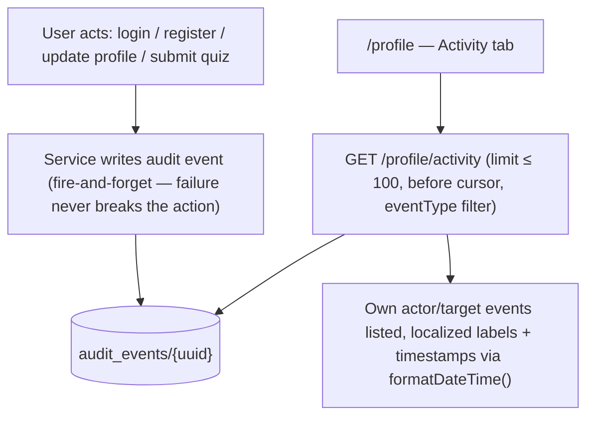
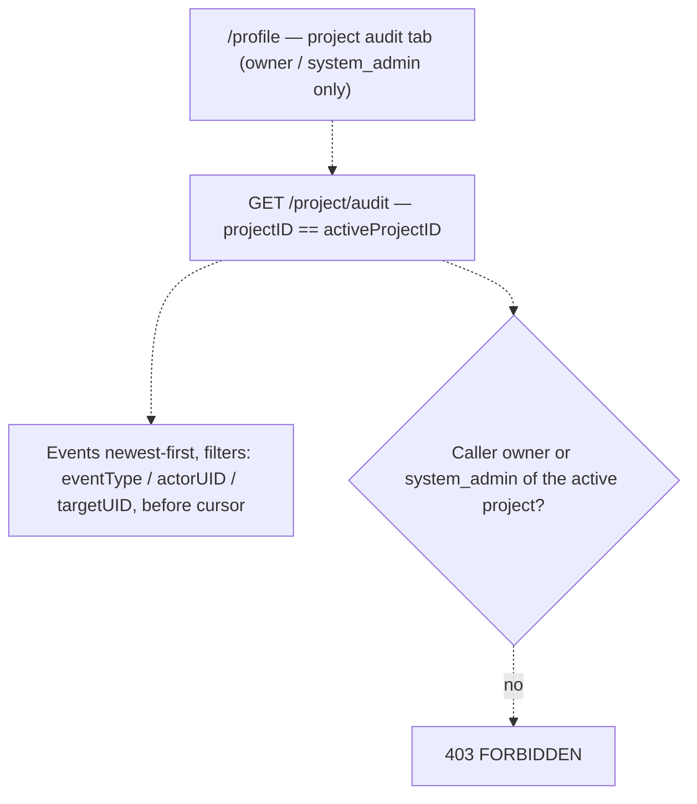
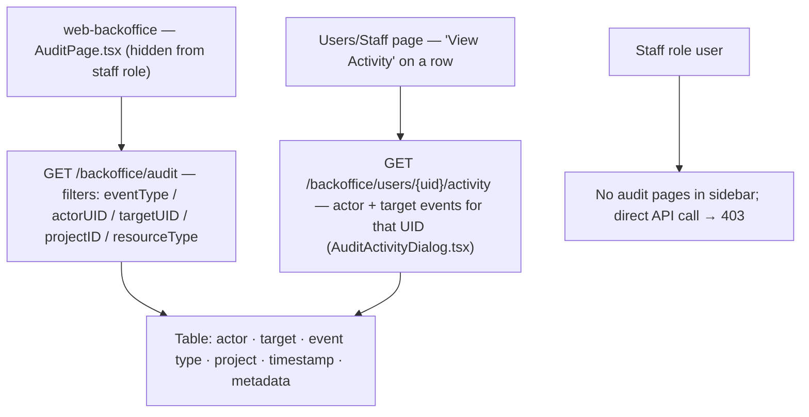

# Audit Logging — User Journeys

How each actor moves through the audit surfaces. See [README.md](./README.md) for the
design spec and [feature-spec.md](./feature-spec.md) for the formal requirements.

> Reflects what is **built today** — the personal-activity and backoffice-audit journeys
> are both shipped (solid arrows). The project-audit journey is still roadmap and shown
> dashed.

---

## Table of Contents

- [Factory operator — reviewing own activity](#factory-operator--reviewing-own-activity)
- [Project owner / system admin — project audit (roadmap)](#project-owner--system-admin--project-audit-roadmap)
- [Super admin — backoffice audit (built)](#super-admin--backoffice-audit-built)

---

## Factory operator — reviewing own activity

An authenticated user checks what has happened on their account: logins, registration,
profile updates, quiz submissions.

**Guard(s):** Bearer token; the handler matches events on the caller's UID from
`middleware.GetUID(r)` only — other users' events are never exposed in the user app.
Detail in [audit-query-api.md](./audit-query-api.md).

---

## Project owner / system admin — project audit (roadmap)

Planned: a company `owner` or `system_admin` reviews everything that happened inside
their active project — member changes, settings, submissions.

**Guard(s):** planned — Bearer token + `owner` / `system_admin` role in the active
project; events are scoped by `projectID`, so another company's events are never returned.
Blocked on the `GET /project/audit` endpoint itself (see [status.md](./status.md)) — the
`projectID` field already exists on the event model.

---

## Super admin — backoffice audit (built)

A FactorySync superadmin searches platform-wide events, or pulls one user's or staff
member's timeline from the Users/Staff pages.

**Guard(s):** Firebase custom claim `backofficeRole == "superadmin"` checked server-side
(`Sidebar.tsx` administratorNavItems + handler auth); `staff` users do not see audit pages
or reach the superadmin audit APIs. Detail in [audit-query-api.md](./audit-query-api.md).

---

*See [README.md](./README.md) for the feature spec.*

---

*Version: 1.1.0*
*Last updated: 5 July 2026*
