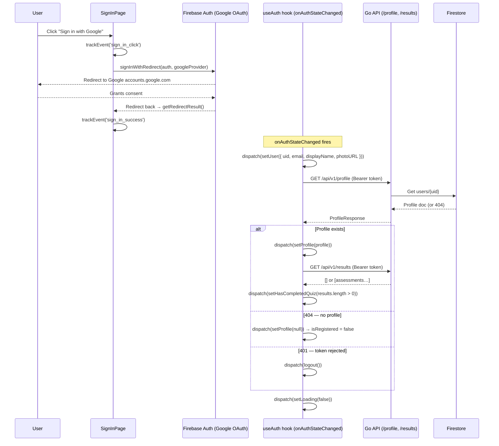
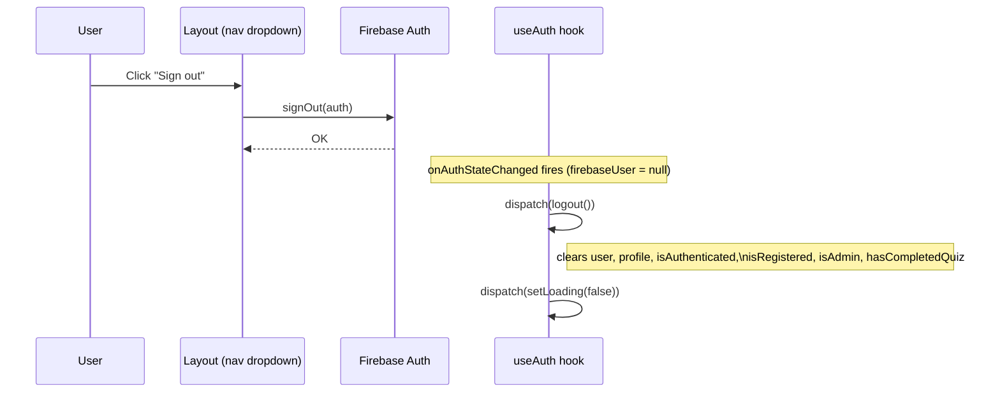
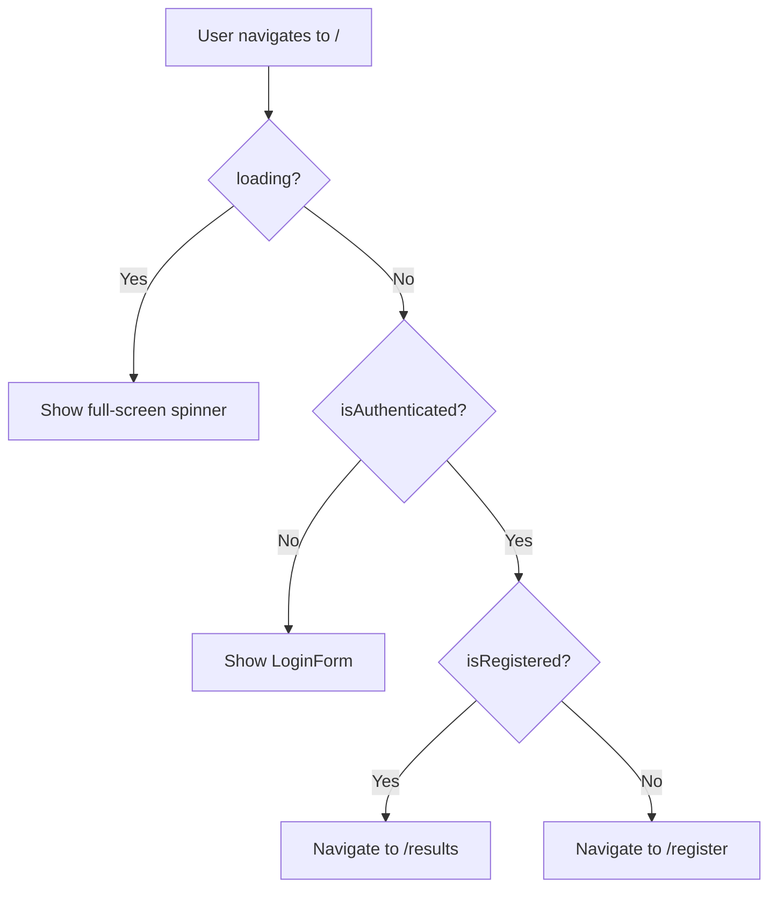

# Authentication & Authorization — Feature Spec

> Firebase Authentication (Google Sign-In) wired to a Go backend via verified
> ID tokens. Redux stores the auth state; three route guards enforce access
> control across the app.

---

## 1. Summary

Authentication is handled entirely by Firebase Auth using Google's OAuth 2.0
redirect flow. The frontend never stores passwords or manages sessions directly
— it holds a short-lived Firebase ID token that refreshes automatically.

Every API request from the frontend attaches the current ID token as a
`Bearer` header. The backend verifies it with the Firebase Admin SDK,
extracts the verified UID/email/displayName into the request context, and
proceeds. No trust is placed on client-supplied user identifiers.

Authorization has three tiers:

| Tier | Guard component | Required condition |
|------|-----------------|--------------------|
| Authenticated | `AuthGuard` | Firebase user exists |
| Registered | `RegisterGuard` | Profile exists in Firestore |
| Admin | `AdminGuard` | Firebase custom claim `role == "admin"` |

---

## 2. Goals & Non-Goals

### Goals

- Google Sign-In only — no email/password, no magic link.
- Single source of auth truth: Firebase Auth + a Firestore profile document.
- Stateless backend — verify the token on every request, extract claims from it.
- Admin elevation via Firebase custom claims (set out-of-band, not by users).
- TH/EN bilingual — all UI copy goes through `useLocale()`.
- Track sign-in events via analytics.

### Non-Goals

- Email/password or social logins other than Google.
- Persistent sessions (Firebase handles token refresh natively).
- Frontend refresh-token management (handled by the Firebase SDK).
- Self-service admin promotion (admin claims are set via Firebase Admin SDK by ops).
- Remember-me / stay-logged-in toggle (Firebase default: session persists until explicit sign-out).

---

## 3. Current State

| Component | Location | Status |
|-----------|----------|--------|
| Firebase client config | `apps/fs-app-web/src/lib/firebase.ts` | ✅ Built |
| API auth helper | `apps/fs-app-web/src/lib/api.ts` | ✅ Built |
| Auth state (Redux) | `apps/fs-app-web/src/store/authSlice.ts` | ✅ Built |
| Auth initializer hook | `apps/fs-app-web/src/hooks/useAuth.ts` | ✅ Built |
| Sign-in page | `apps/fs-app-web/src/pages/SignInPage.tsx` | ✅ Built |
| Login form component | `apps/fs-app-web/src/components/login-form.tsx` | ✅ Built |
| Auth panel (branding) | `apps/fs-app-web/src/components/AuthPanel.tsx` | ✅ Built |
| `AuthGuard` | `apps/fs-app-web/src/components/guards/AuthGuard.tsx` | ✅ Built |
| `RegisterGuard` | `apps/fs-app-web/src/components/guards/RegisterGuard.tsx` | ✅ Built |
| `AdminGuard` | `apps/fs-app-web/src/components/guards/AdminGuard.tsx` | ✅ Built |
| Router (route tree) | `apps/fs-app-web/src/router.tsx` | ✅ Built |
| Sign-out (Layout) | `apps/fs-app-web/src/components/Layout.tsx` | ✅ Built |
| Backend `FirebaseAuth` middleware | `apps/fs-backend/middleware/auth.go` | ✅ Built |
| Backend `RequireAdmin` middleware | `apps/fs-backend/middleware/auth.go` | ✅ Built |
| Context extractors (`GetUID`, `GetEmail`, `GetDisplayName`) | `apps/fs-backend/middleware/auth.go` | ✅ Built |

---

## 4. Sign-In Flow



After `setLoading(false)` the `SignInPage` re-evaluates and either:
- redirects to `/results` (authenticated + registered)
- redirects to `/register` (authenticated, no profile)
- stays on `/` (sign-in error)

---

## 5. Sign-Out Flow



The `logout()` action zeros all auth state. Route guards respond immediately
on the next render cycle: unauthenticated users are redirected to `/`.

---

## 6. Redux Auth State

Slice: `apps/fs-app-web/src/store/authSlice.ts`

```ts
interface AuthState {
  user:              AuthUser | null   // Firebase user (uid, email, displayName, photoURL)
  profile:           Profile | null    // Firestore profile (company + contact data)
  isAuthenticated:   boolean           // user !== null
  isRegistered:      boolean           // profile !== null
  isAdmin:           boolean           // profile.role === "admin"
  hasCompletedQuiz:  boolean           // at least one result exists
  loading:           boolean           // true until onAuthStateChanged resolves
}
```

### Actions

| Action | Effect |
|--------|--------|
| `setUser(user \| null)` | Sets `user` and `isAuthenticated` |
| `setProfile(profile \| null)` | Sets `profile`, `isRegistered`, `isAdmin` |
| `setHasCompletedQuiz(bool)` | Updates quiz-completion flag |
| `setLoading(bool)` | Controls full-screen loading skeleton |
| `logout()` | Resets all fields to initial empty state |

`loading` starts `true` on page load and blocks route guards from redirecting
before Firebase resolves the session. This prevents a flash-of-unauthenticated
redirect on hard refresh.

---

## 7. Token Attachment (API Helper)

Every API call goes through `apps/fs-app-web/src/lib/api.ts`:

```
1. auth.currentUser.getIdToken()  →  fresh Firebase ID token (auto-refreshed if expired)
2. Attach as  Authorization: Bearer <token>
3. Call fetch(API_BASE + path, …)
4. On response:
   - 2xx → unwrap { success, data } → return data
   - non-2xx → parse { error.message } → throw ApiError(status, message)
```

`ApiError` carries the HTTP status code. `useAuth` inspects it:
- `401` → `dispatch(logout())` — token was rejected server-side.
- `404` → `dispatch(setProfile(null))` — user is authenticated but not yet registered.

---

## 8. Backend Middleware

### `FirebaseAuth` — authentication

File: `apps/fs-backend/middleware/auth.go`

Applied to every protected route group in `main.go`.

```
1. Read Authorization header → require "Bearer " prefix
2. VerifyIDToken(token) via Firebase Admin SDK
3. On success → inject into context:
   - uidContextKey       → token.UID
   - emailContextKey     → token.Claims["email"]
   - displayNameContextKey → token.Claims["name"]
4. On failure → 401 UNAUTHORIZED
```

Handlers read these values with:
```go
uid         := middleware.GetUID(r)
email       := middleware.GetEmail(r)
displayName := middleware.GetDisplayName(r)
```

**Security rule:** UID is never read from the request body or path params —
only from the verified context.

### `RequireAdmin` — authorization

Applied only to the `/api/v1/admin/…` route group (layered after `FirebaseAuth`).

```
1. GetUID(r) from context
2. authClient.GetUser(ctx, uid) — fetches Firebase user record
3. Check user.CustomClaims["role"] == "admin"
4. On failure → 403 FORBIDDEN
```

Custom claims are the authoritative source of role truth. They are set
out-of-band via the Firebase Admin SDK by an operator (not by users or the API).

---

## 9. Route Tree & Guards

```
/                     → SignInPage        (no guard)
│
└── AuthGuard         (requires isAuthenticated)
    ├── /register     → RegisterPage
    ├── RegisterGuard (requires isRegistered)
    │   ├── /quiz     → QuizPage
    │   └── /results  → ResultPage
    └── AdminGuard    (requires isAdmin)
        └── /admin    → AdminPage

*             → NotFoundPage             (no guard)
```

### Guard behaviour

| Guard | Loading state | Not satisfied | Satisfied |
|-------|--------------|---------------|-----------|
| `AuthGuard` | Shows skeleton | `<Navigate to="/" />` | `<Outlet />` |
| `RegisterGuard` | — | `<Navigate to="/register" />` | `<Outlet />` |
| `AdminGuard` | — | `<Navigate to="/" />` | `<Outlet />` |

`AuthGuard` is the only guard that handles the `loading` state (it owns the
full-screen skeleton). `RegisterGuard` and `AdminGuard` only render after
`loading` is false, so they never need to show a skeleton themselves.

---

## 10. Sign-In Page Redirect Logic



This prevents an already-authenticated user from seeing the sign-in page on
accidental navigation to `/`.

---

## 11. Admin Role

Admin access is controlled entirely by Firebase custom claims — no separate
Firestore field is needed. An admin user's ID token includes
`{ role: "admin" }` in its claims payload.

**Setting a custom claim (Firebase Admin SDK — ops task):**
```js
admin.auth().setCustomUserClaims(uid, { role: 'admin' });
```

The claim is encoded in the ID token. The frontend reads it from
`profile.role` (the backend copies the role into the Firestore profile at
registration and can re-read it via `GetUser` in `RequireAdmin`). The Redux
slice derives `isAdmin` from `profile.role === "admin"`.

The `AdminGuard` then gates the `/admin` route and the admin nav link only
renders when `isAdmin` is true.

---

## 12. Analytics Events

| Event | Trigger | Properties |
|-------|---------|------------|
| `sign_in_click` | User clicks Sign in with Google | `{ method: 'google' }` |
| `sign_in_success` | `getRedirectResult()` returns a result | `{ method: 'google' }` |
| `sign_in_error` | `getRedirectResult()` rejects | `{ method: 'google' }` |

---

## 13. Environment Variables

| Variable | App | Required | Notes |
|----------|-----|----------|-------|
| `VITE_FIREBASE_API_KEY` | `fs-app-web` | Yes | Firebase project config |
| `VITE_FIREBASE_AUTH_DOMAIN` | `fs-app-web` | Yes | e.g. `project.firebaseapp.com` |
| `VITE_FIREBASE_PROJECT_ID` | `fs-app-web` | Yes | |
| `VITE_FIREBASE_STORAGE_BUCKET` | `fs-app-web` | Yes | |
| `VITE_FIREBASE_MESSAGING_SENDER_ID` | `fs-app-web` | Yes | |
| `VITE_FIREBASE_APP_ID` | `fs-app-web` | Yes | |
| `VITE_API_BASE_URL` | `fs-app-web` | No | Defaults to `/api/v1` |
| `GOOGLE_APPLICATION_CREDENTIALS` | `fs-backend` | Yes | Firebase Admin SDK service account path |

Never commit any of these values. They are git-ignored via `.env*` and
`firebase-sa.json` rules.

---

## 14. Acceptance Criteria

- [ ] Clicking "Sign in with Google" redirects to Google OAuth and returns to the app.
- [ ] A new authenticated user with no profile is redirected to `/register`.
- [ ] A returning registered user is redirected to `/results` (or `/quiz` if quiz not done).
- [ ] On hard refresh, the app shows a loading skeleton until Firebase resolves the session — no flash of unauthenticated redirect.
- [ ] An expired or invalid token causes the frontend to call `logout()` and redirect to `/`.
- [ ] Clicking "Sign out" clears all Redux auth state and redirects to `/`.
- [ ] A non-admin user navigating to `/admin` is redirected to `/`.
- [ ] An admin user sees the admin nav link and can access `/admin`.
- [ ] Every API call attaches a fresh Bearer token; no raw UID is sent in the request body.
- [ ] `sign_in_success` and `sign_in_error` events are tracked correctly.
- [ ] All sign-in UI copy renders in the active locale (TH/EN).
- [ ] `make lint-web` and `make test-web` pass.

---

## 15. Testing

- **Unit (Vitest):** `authSlice` reducers — `setUser`, `setProfile`, `logout`, `setLoading`; verify derived booleans (`isAuthenticated`, `isRegistered`, `isAdmin`) update correctly.
- **Unit (Vitest):** `api.ts` — mock `auth.currentUser.getIdToken()` and `fetch`; assert Bearer header is attached; assert `ApiError` is thrown on non-2xx; assert `data` is unwrapped.
- **Integration (handler_test.go):** All profile/quiz/result/admin handlers return 401 when `Authorization` header is absent; admin endpoints return 403 for non-admin UIDs.
- **E2E (Playwright):**
  - Unauthenticated user navigating to `/quiz` is redirected to `/`.
  - Non-admin authenticated user navigating to `/admin` is redirected to `/`.
  - Hard refresh on `/quiz` while authenticated does not flash to `/` before the skeleton resolves.
  - Sign-out clears state and redirects to `/`.

---

## 16. References

- Firebase client: [firebase.ts](../../../apps/fs-app-web/src/lib/firebase.ts)
- API helper: [api.ts](../../../apps/fs-app-web/src/lib/api.ts)
- Auth slice: [authSlice.ts](../../../apps/fs-app-web/src/store/authSlice.ts)
- Auth hook: [useAuth.ts](../../../apps/fs-app-web/src/hooks/useAuth.ts)
- Sign-in page: [SignInPage.tsx](../../../apps/fs-app-web/src/pages/SignInPage.tsx)
- Router: [router.tsx](../../../apps/fs-app-web/src/router.tsx)
- AuthGuard: [guards/AuthGuard.tsx](../../../apps/fs-app-web/src/components/guards/AuthGuard.tsx)
- RegisterGuard: [guards/RegisterGuard.tsx](../../../apps/fs-app-web/src/components/guards/RegisterGuard.tsx)
- AdminGuard: [guards/AdminGuard.tsx](../../../apps/fs-app-web/src/components/guards/AdminGuard.tsx)
- Backend middleware: [middleware/auth.go](../../../apps/fs-backend/middleware/auth.go)
- User flow: [user-flow.md](../user-flow.md)
- Register feature: [register/feature-spec.md](../register/feature-spec.md)
