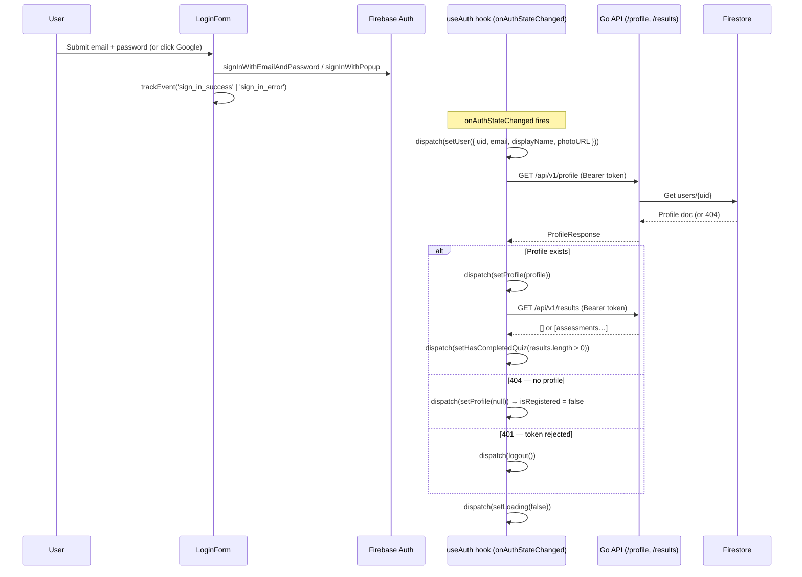
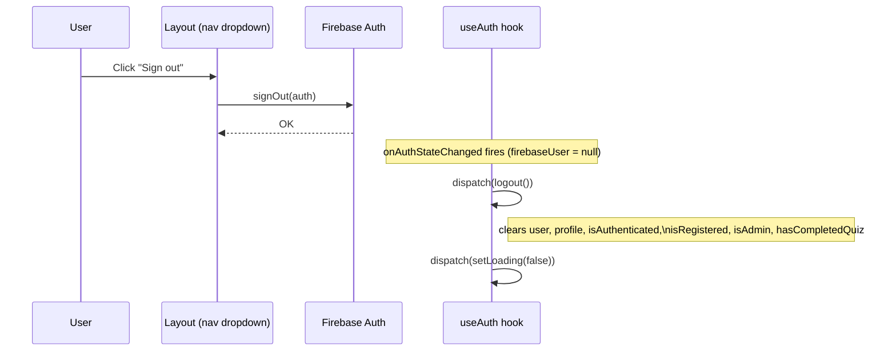
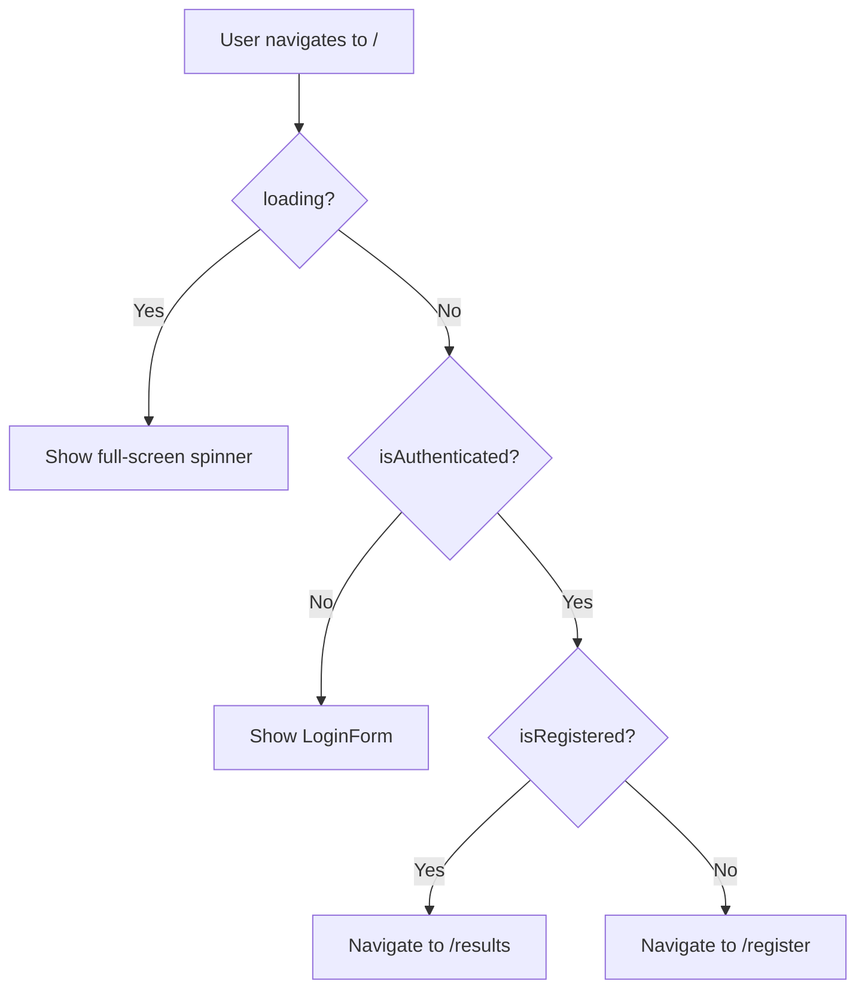

# Authentication & Authorization — Feature Spec

> Firebase Authentication (Google Sign-In + Email/Password) wired to a Go
> backend via verified ID tokens. Redux stores the auth state; three route
> guards enforce access control across the app.

> **Two apps, two auth surfaces.** This spec covers `web-app` (user-facing).
> For `web-backoffice` (FactorySync staff portal), see §11.1 and
> [backoffice/feature-spec.md §7](../backoffice/feature-spec.md).

---

## 1. Summary

Authentication is handled by Firebase Auth supporting two providers:

- **Email/Password** — user enters email + password in the `LoginForm`. New
  users can create an account ("Sign up") and reset their password via email link.
- **Google Sign-In** — OAuth 2.0 popup flow via `signInWithPopup`.

The frontend never manages sessions or stores passwords — it holds a
short-lived Firebase ID token that refreshes automatically. Every API request
attaches the current token as a `Bearer` header. The backend verifies it with
the Firebase Admin SDK, extracts the verified UID/email/displayName into the
request context, and proceeds. No trust is placed on client-supplied user
identifiers. The backend middleware is provider-agnostic — it only verifies
the token, not how the user authenticated.

Authorization has three tiers in `web-app`:

| Tier | Guard component | Required condition |
|------|-----------------|--------------------|
| Authenticated | `AuthGuard` | Firebase user exists |
| Registered | `RegisterGuard` | Profile exists in Firestore |
| Admin | `AdminGuard` | Firebase custom claim `role == "admin"` |

`web-backoffice` uses a separate set of guards based on the `backofficeRole`
custom claim — see §11.1.

---

## 2. Goals & Non-Goals

### Goals

- Email/password + Google Sign-In via Firebase Auth.
- Password reset by email (`sendPasswordResetEmail`).
- Sign-up flow: create Firebase Auth account → redirect to `/register` for profile completion.
- Single source of auth truth: Firebase Auth + a Firestore profile document.
- Stateless backend — verify the token on every request, extract claims from it.
- Admin elevation via Firebase custom claims (set out-of-band, not by users).
- TH/EN bilingual — all UI copy goes through `useLocale()`.
- Track sign-in events via analytics.

### Non-Goals

- Social logins other than Google.
- Magic link / passwordless email sign-in.
- Persistent sessions (Firebase handles token refresh natively).
- Frontend refresh-token management (handled by the Firebase SDK).
- Self-service admin promotion (admin claims are set via Firebase Admin SDK by ops).
- Remember-me / stay-logged-in toggle (Firebase default: session persists until explicit sign-out).

---

## 3. Current State

### `web-app` components

| Component | Location | Status |
|-----------|----------|--------|
| Firebase client config | `apps/web-app/src/lib/firebase.ts` | ✅ Built |
| API auth helper | `apps/web-app/src/lib/api.ts` | ✅ Built |
| Auth state (Redux) | `apps/web-app/src/store/authSlice.ts` | ✅ Built |
| Auth initializer hook | `apps/web-app/src/hooks/useAuth.ts` | ✅ Built |
| Sign-in page | `apps/web-app/src/pages/SignInPage.tsx` | ✅ Built |
| Login form (email/pw + Google + sign-up + reset) | `apps/web-app/src/components/login-form.tsx` | ✅ Built |
| Auth panel (branding) | `apps/web-app/src/components/AuthPanel.tsx` | ✅ Built |
| `AuthGuard` | `apps/web-app/src/components/guards/AuthGuard.tsx` | ✅ Built |
| `RegisterGuard` | `apps/web-app/src/components/guards/RegisterGuard.tsx` | ✅ Built |
| `AdminGuard` | `apps/web-app/src/components/guards/AdminGuard.tsx` | ✅ Built |
| Router (route tree) | `apps/web-app/src/router.tsx` | ✅ Built |
| Sign-out (Layout) | `apps/web-app/src/components/Layout.tsx` | ✅ Built |

### `web-backoffice` components

| Component | Location | Status |
|-----------|----------|--------|
| Firebase client config | `apps/web-backoffice/src/lib/firebase.ts` | ✅ Built |
| API auth helper | `apps/web-backoffice/src/lib/api.ts` | ✅ Built |
| Auth state (Redux) | `apps/web-backoffice/src/store/authSlice.ts` | ✅ Built |
| Auth initializer hook | `apps/web-backoffice/src/hooks/useAuth.ts` | ✅ Built |
| Sign-in page (Google only) | `apps/web-backoffice/src/pages/SignInPage.tsx` | ✅ Built |
| `AuthGuard` | `apps/web-backoffice/src/components/guards/AuthGuard.tsx` | ✅ Built |
| `BackofficeGuard` | `apps/web-backoffice/src/components/guards/BackofficeGuard.tsx` | ✅ Built |
| `SuperAdminGuard` | `apps/web-backoffice/src/components/guards/SuperAdminGuard.tsx` | ✅ Built |
| `UnauthorizedPage` | `apps/web-backoffice/src/pages/UnauthorizedPage.tsx` | ✅ Built |
| Router (route tree) | `apps/web-backoffice/src/router.tsx` | ✅ Built |

### Backend components (shared by both apps)

| Component | Location | Status |
|-----------|----------|--------|
| `FirebaseAuth` middleware | `apps/backend/middleware/auth.go` | ✅ Built |
| `RequireAdmin` middleware | `apps/backend/middleware/auth.go` | ✅ Built |
| `RequireBackofficeRole` middleware | `apps/backend/middleware/auth.go` | ✅ Built |
| Context extractors (`GetUID`, `GetEmail`, `GetDisplayName`) | `apps/backend/middleware/auth.go` | ✅ Built |

---

## 4. Sign-In Flow

`LoginForm` is self-contained — it handles all Firebase calls and exposes three modes:

| Mode | Trigger | Firebase call |
|------|---------|---------------|
| `signin` (default) | Email + password form | `signInWithEmailAndPassword` |
| `signup` | "Sign up" link | `createUserWithEmailAndPassword` |
| `reset` | "Forgot password?" link | `sendPasswordResetEmail` |
| — | Google button | `signInWithPopup(googleProvider)` |

### Invitation Password Setup (`/auth/action`)

Backend invitation emails for customer members and project owners link to the
branded authenticated app route `/auth/action` instead of Firebase's hosted
reset-password page. The page is public, uses the same visual shell as sign-in,
and collects the invited user's setup fields in one flow:

| Field | Validation |
|-------|------------|
| Contact name | Required, 2–100 chars |
| Contact phone | Required, 9–30 chars |
| New password | Required, min 8 chars |
| Confirm password | Must match new password |

On submit, the page verifies the Firebase `oobCode`, sets the password, signs
the invited user in once, updates the Firebase display name, calls
`POST /api/v1/invitations/accept` with `contactName` and `contactPhone`, then
signs the user out and shows the success state. The global auth bootstrap skips
automatic empty-body invitation acceptance while the browser is on `/auth/action`
so this form payload is the source of truth for the new profile's contact fields.



After `setLoading(false)` the `SignInPage` re-evaluates and either:
- redirects to `/results` (authenticated + registered)
- redirects to `/register` (authenticated, no profile — both new email and new Google users land here)
- stays on `/` (sign-in error, shown inline in the form)

### Password Reset sub-flow

When mode is `reset`, the form calls `sendPasswordResetEmail(auth, email)`.
On success it shows a confirmation message in-form — no page navigation.
Firebase sends the reset email; the user clicks the link in their inbox and
sets a new password via Firebase's hosted action handler.

### New email/password user

`createUserWithEmailAndPassword` creates a Firebase Auth account with no
display name. `firebaseUser.displayName` is `null` — `setUser` stores it as
`''`. `onAuthStateChanged` fires, `useAuth` fetches `/profile` → 404 →
`isRegistered = false` → redirect to `/register`. The profile completion
flow is identical to Google sign-in.

---

## 5. Sign-Out Flow



The `logout()` action zeros all auth state. Route guards respond immediately
on the next render cycle: unauthenticated users are redirected to `/`.

---

## 6. Redux Auth State

Slice: `apps/web-app/src/store/authSlice.ts`

```ts
interface AuthState {
  user:              AuthUser | null   // Firebase user (uid, email, displayName, photoURL)
  profile:           Profile | null    // Firestore profile (company + contact data)
  isAuthenticated:   boolean           // user !== null
  isRegistered:      boolean           // profile !== null
  isAdmin:           boolean           // profile.role === "admin"
  hasCompletedQuiz:  boolean           // at least one result exists
  loading:           boolean           // true until onAuthStateChanged resolves
}
```

### Actions

| Action | Effect |
|--------|--------|
| `setUser(user \| null)` | Sets `user` and `isAuthenticated` |
| `setProfile(profile \| null)` | Sets `profile`, `isRegistered`, `isAdmin` |
| `setHasCompletedQuiz(bool)` | Updates quiz-completion flag |
| `setLoading(bool)` | Controls full-screen loading skeleton |
| `logout()` | Resets all fields to initial empty state |

`loading` starts `true` on page load and blocks route guards from redirecting
before Firebase resolves the session. This prevents a flash-of-unauthenticated
redirect on hard refresh.

---

## 7. Token Attachment (API Helper)

Every API call goes through `apps/web-app/src/lib/api.ts`:

```
1. auth.currentUser.getIdToken()  →  fresh Firebase ID token (auto-refreshed if expired)
2. Attach as  Authorization: Bearer <token>
3. Call fetch(API_BASE + path, …)
4. On response:
   - 2xx → unwrap { success, data } → return data
   - non-2xx → parse { error.message } → throw ApiError(status, message)
```

`ApiError` carries the HTTP status code. `useAuth` inspects it:
- `401` → `dispatch(logout())` — token was rejected server-side.
- `404` → `dispatch(setProfile(null))` — user is authenticated but not yet registered.

---

## 8. Backend Middleware

### `FirebaseAuth` — authentication

File: `apps/backend/middleware/auth.go`

Applied to every protected route group in `main.go`.

```
1. Read Authorization header → require "Bearer " prefix
2. VerifyIDToken(token) via Firebase Admin SDK
3. On success → inject into context:
   - uidContextKey       → token.UID
   - emailContextKey     → token.Claims["email"]
   - displayNameContextKey → token.Claims["name"]
4. On failure → 401 UNAUTHORIZED
```

Handlers read these values with:
```go
uid         := middleware.GetUID(r)
email       := middleware.GetEmail(r)
displayName := middleware.GetDisplayName(r)
```

**Security rule:** UID is never read from the request body or path params —
only from the verified context.

### `RequireAdmin` — authorization

Applied only to the `/api/v1/admin/…` route group (layered after `FirebaseAuth`).

```
1. GetUID(r) from context
2. authClient.GetUser(ctx, uid) — fetches Firebase user record
3. Check user.CustomClaims["role"] == "admin"
4. On failure → 403 FORBIDDEN
```

Custom claims are the authoritative source of role truth. They are set
out-of-band via the Firebase Admin SDK by an operator (not by users or the API).

---

## 9. Route Tree & Guards

```
/                     → SignInPage        (no guard)
│
└── AuthGuard         (requires isAuthenticated)
    ├── /register     → RegisterPage
    ├── RegisterGuard (requires isRegistered)
    │   ├── /quiz     → QuizPage
    │   └── /results  → ResultPage
    └── AdminGuard    (requires isAdmin)
        └── /admin    → AdminPage

*             → NotFoundPage             (no guard)
```

### Guard behaviour

| Guard | Loading state | Not satisfied | Satisfied |
|-------|--------------|---------------|-----------|
| `AuthGuard` | Shows skeleton | `<Navigate to="/" />` | `<Outlet />` |
| `RegisterGuard` | — | `<Navigate to="/register" />` | `<Outlet />` |
| `AdminGuard` | — | `<Navigate to="/" />` | `<Outlet />` |

`AuthGuard` is the only guard that handles the `loading` state (it owns the
full-screen skeleton). `RegisterGuard` and `AdminGuard` only render after
`loading` is false, so they never need to show a skeleton themselves.

---

## 10. Sign-In Page Redirect Logic



This prevents an already-authenticated user from seeing the sign-in page on
accidental navigation to `/`.

---

## 11. Admin Role

Admin access is controlled entirely by Firebase custom claims — no separate
Firestore field is needed. An admin user's ID token includes
`{ role: "admin" }` in its claims payload.

**Setting a custom claim (Firebase Admin SDK — ops task):**
```js
admin.auth().setCustomUserClaims(uid, { role: 'admin' });
```

The claim is encoded in the ID token. The frontend reads it from
`profile.role` (the backend copies the role into the Firestore profile at
registration and can re-read it via `GetUser` in `RequireAdmin`). The Redux
slice derives `isAdmin` from `profile.role === "admin"`.

The `AdminGuard` then gates the `/admin` route and the admin nav link only
renders when `isAdmin` is true.

---

## 11.1 Backoffice Role Authorization (`web-backoffice`)

`web-backoffice` uses the same Firebase project but reads a completely
separate custom claim: `backofficeRole`.

| Claim value | Who | Access |
|-------------|-----|--------|
| `"staff"` | FactorySync support / operations | All pages except `/staff` |
| `"superadmin"` | FactorySync CTO / engineering lead | All pages including `/staff` |
| absent / any other | Anyone else | Redirected to `/unauthorized` |

**Setting a backoffice claim (Firebase Admin SDK — ops task):**
```js
admin.auth().setCustomUserClaims(uid, { backofficeRole: 'staff' });
```

### `BackofficeGuard`

Applied to the entire authenticated section of the backoffice router. Reads
`backofficeRole` from `getIdTokenResult(forceRefresh=true)` and redirects to
`/unauthorized` if the claim is absent or unrecognised.

```
onAuthStateChanged
  ↓ user signed in
getIdTokenResult(forceRefresh=true)
  ↓ read claims.backofficeRole
dispatch setBackofficeRole(role)
  ↓
BackofficeGuard: backofficeRole ∈ {"staff","superadmin"}?
  no  → /unauthorized
  yes → render page
```

### `SuperAdminGuard`

Applied only to the `/staff` route. Redirects to `/unauthorized` unless
`backofficeRole === "superadmin"`.

### Key differences from `web-app` auth

| Aspect | `web-app` | `web-backoffice` |
|--------|-------------|---------------------|
| Sign-in methods | Email/password + Google | Google only |
| Registration step | Required (Firestore profile) | None — staff are added by ops |
| Auth claim checked | `role` | `backofficeRole` |
| Unauthenticated redirect | `/` (landing page) | `/sign-in` |
| Unauthorized redirect | `/` | `/unauthorized` |
| Backend middleware | `RequireAdmin` | `RequireBackofficeRole` |

---

## 12. Analytics Events

| Event | Trigger | `method` values |
|-------|---------|-----------------|
| `sign_in_click` | User submits email form or clicks Google | `'email'` · `'email_signup'` · `'google'` |
| `sign_in_success` | Firebase call resolves | same as above |
| `sign_in_error` | Firebase call rejects (not popup-closed) | same as above |

---

## 13. Environment Variables

Both `web-app` and `web-backoffice` connect to the **same Firebase project**.
They share identical `VITE_FIREBASE_*` vars (same values, separate `.env` files).

| Variable | App | Required | Notes |
|----------|-----|----------|-------|
| `VITE_FIREBASE_API_KEY` | `web-app`, `web-backoffice` | Yes | Firebase project config |
| `VITE_FIREBASE_AUTH_DOMAIN` | `web-app`, `web-backoffice` | Yes | e.g. `project.firebaseapp.com` |
| `VITE_FIREBASE_PROJECT_ID` | `web-app`, `web-backoffice` | Yes | |
| `VITE_FIREBASE_STORAGE_BUCKET` | `web-app`, `web-backoffice` | Yes | |
| `VITE_FIREBASE_MESSAGING_SENDER_ID` | `web-app`, `web-backoffice` | Yes | |
| `VITE_FIREBASE_APP_ID` | `web-app`, `web-backoffice` | Yes | |
| `VITE_API_BASE_URL` | `web-app`, `web-backoffice` | No | Defaults to `/api/v1` |
| `GOOGLE_APPLICATION_CREDENTIALS` | `backend` | Yes | Firebase Admin SDK service account path |

Never commit any of these values. They are git-ignored via `.env*` and
`firebase-sa.json` rules.

---

## 14. Acceptance Criteria

- [ ] Clicking "Sign in with Google" opens the Google OAuth popup and signs in.
- [ ] Entering a valid email + password and clicking "Sign In" authenticates the user.
- [ ] Clicking "Sign up" shows the create-account form; submitting creates a Firebase Auth account and redirects to `/register`.
- [ ] Clicking "Forgot password?" switches to the reset form; submitting a known email shows the confirmation message.
- [ ] Invitation password setup links open `/auth/action`, not Firebase's default hosted reset-password page.
- [ ] `/auth/action` requires contact name, contact phone, new password, and matching confirm password before accepting the invitation.
- [ ] Firebase error codes map to human-readable messages (wrong password, weak password, email in use, etc.).
- [ ] "Passwords do not match" error shows if the sign-up confirm field differs.
- [ ] A new authenticated user with no profile is redirected to `/register`.
- [ ] A returning registered user is redirected to `/results`.
- [ ] On hard refresh, the app shows a loading skeleton until Firebase resolves the session — no flash of unauthenticated redirect.
- [ ] An expired or invalid token causes the frontend to call `logout()` and redirect to `/`.
- [ ] Clicking "Sign out" clears all Redux auth state and redirects to `/`.
- [ ] A non-admin user navigating to `/admin` is redirected to `/`.
- [ ] An admin user sees the admin nav link and can access `/admin`.
- [ ] Every API call attaches a fresh Bearer token; no raw UID is sent in the request body.
- [ ] `sign_in_success` and `sign_in_error` events are tracked for both `email` and `google` methods.
- [ ] All sign-in UI copy renders in the active locale (TH/EN).
- [ ] `make lint-web` and `make test-web` pass.

---

## 15. Testing

- **Unit (Vitest):** `authSlice` reducers — `setUser`, `setProfile`, `logout`, `setLoading`; verify derived booleans (`isAuthenticated`, `isRegistered`, `isAdmin`) update correctly.
- **Unit (Vitest):** `api.ts` — mock `auth.currentUser.getIdToken()` and `fetch`; assert Bearer header is attached; assert `ApiError` is thrown on non-2xx; assert `data` is unwrapped.
- **Integration (handler_test.go):** All profile/quiz/result/admin handlers return 401 when `Authorization` header is absent; admin endpoints return 403 for non-admin UIDs.
- **E2E (Playwright):**
  - Unauthenticated user navigating to `/quiz` is redirected to `/`.
  - Non-admin authenticated user navigating to `/admin` is redirected to `/`.
  - Hard refresh on `/quiz` while authenticated does not flash to `/` before the skeleton resolves.
  - Sign-out clears state and redirects to `/`.

---

## 16. References

### `web-app`
- Firebase client: [firebase.ts](../../../apps/web-app/src/lib/firebase.ts)
- API helper: [api.ts](../../../apps/web-app/src/lib/api.ts)
- Auth slice: [authSlice.ts](../../../apps/web-app/src/store/authSlice.ts)
- Auth hook: [useAuth.ts](../../../apps/web-app/src/hooks/useAuth.ts)
- Sign-in page: [SignInPage.tsx](../../../apps/web-app/src/pages/SignInPage.tsx)
- Router: [router.tsx](../../../apps/web-app/src/router.tsx)
- AuthGuard: [guards/AuthGuard.tsx](../../../apps/web-app/src/components/guards/AuthGuard.tsx)
- RegisterGuard: [guards/RegisterGuard.tsx](../../../apps/web-app/src/components/guards/RegisterGuard.tsx)
- AdminGuard: [guards/AdminGuard.tsx](../../../apps/web-app/src/components/guards/AdminGuard.tsx)

### `web-backoffice`
- Auth hook: [useAuth.ts](../../../apps/web-backoffice/src/hooks/useAuth.ts)
- Auth slice: [authSlice.ts](../../../apps/web-backoffice/src/store/authSlice.ts)
- Router: [router.tsx](../../../apps/web-backoffice/src/router.tsx)
- BackofficeGuard: [guards/BackofficeGuard.tsx](../../../apps/web-backoffice/src/components/guards/BackofficeGuard.tsx)
- SuperAdminGuard: [guards/SuperAdminGuard.tsx](../../../apps/web-backoffice/src/components/guards/SuperAdminGuard.tsx)
- UnauthorizedPage: [UnauthorizedPage.tsx](../../../apps/web-backoffice/src/pages/UnauthorizedPage.tsx)
- Backoffice feature spec: [backoffice/feature-spec.md §7](../backoffice/feature-spec.md)

### Backend
- Middleware: [middleware/auth.go](../../../apps/backend/middleware/auth.go)

### Cross-cutting
- User flow: [user-flow.md](../user-flow.md)
- Register feature: [register/feature-spec.md](../register/feature-spec.md)
