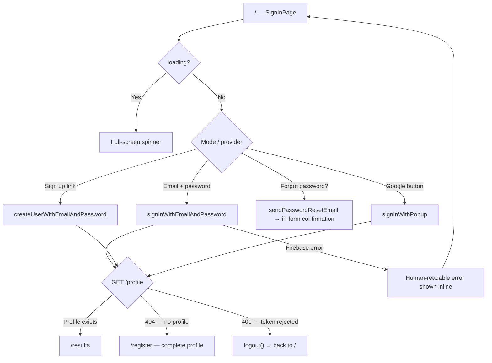
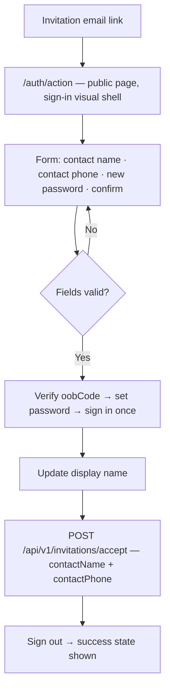
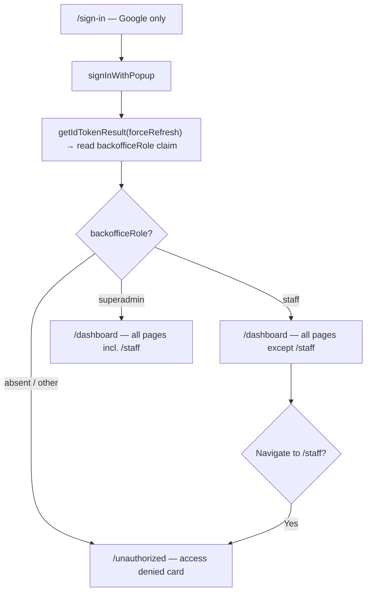
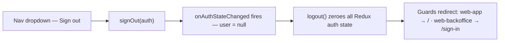

# Authentication & Authorization — User Journeys

How each app's users move through auth. See [README.md](./README.md) for the design spec
and [feature-spec.md](./feature-spec.md) for the formal requirements.

> Reflects what is **built today** — all journeys below are fully shipped; there are no
> roadmap steps in this feature.

---

## Table of Contents

- [Factory operator — sign in on web-app](#factory-operator--sign-in-on-web-app)
- [Invited user — password setup via /auth/action](#invited-user--password-setup-via-authaction)
- [Backoffice staff — sign in on web-backoffice](#backoffice-staff--sign-in-on-web-backoffice)
- [Any user — sign out](#any-user--sign-out)

---

## Factory operator — sign in on web-app

An operator lands on `/`; the `LoginForm` offers email/password (with sign-up and reset
sub-modes) and Google. After Firebase resolves, the profile fetch decides where they land.

**Guard(s):** none on `/` itself; everything past sign-in sits behind `AuthGuard` →
`RegisterGuard` / `AdminGuard`. Detail in [login-form.md](./login-form.md) and
[route-guards.md](./route-guards.md).

---

## Invited user — password setup via /auth/action

Customer members and project owners invited by backoffice staff receive an email linking to
the branded `/auth/action` page (not Firebase's hosted reset page).

**Guard(s):** the page is public (no auth); the `oobCode` from the invitation email is the
credential. The global auth bootstrap skips automatic empty-body invitation acceptance
while on `/auth/action` so this form's payload is the source of truth. Detail in
[login-form.md](./login-form.md).

---

## Backoffice staff — sign in on web-backoffice

Staff sign in with Google only; the `backofficeRole` claim decides access. Cloudflare
Access gates the domain before the app is even reached.

**Guard(s):** `BackofficeGuard` on the whole authenticated section; `SuperAdminGuard` on
`/staff`; backend re-checks the claim via `RequireBackofficeRole`. Detail in
[route-guards.md](./route-guards.md) and [auth-middleware.md](./auth-middleware.md).

---

## Any user — sign out

**Guard(s):** none — sign-out is always allowed; guards react on the next render cycle.

---

*See [README.md](./README.md) for the feature spec.*

---

*Version: 1.0.0*
*Last updated: 3 July 2026*
