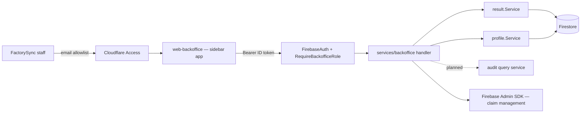

# Backoffice — Feature Spec

**Status:** ⚠️ In progress — scaffold + pages built; audit UI/API planned; invite-owner API client not yet implemented.

---

## Table of Contents

1. [App surfaces](#app-surfaces)
2. [Summary](#summary)
3. [Goals & Non-Goals](#goals--non-goals)
4. [Current State](#current-state)
5. [Design Overview](#design-overview)
6. [Security Invariants](#security-invariants)
7. [Acceptance Criteria](#acceptance-criteria)
8. [Testing](#testing)
9. [Open Items & Future Work](#open-items--future-work)
10. [References](#references)

---

> A separate web app (`apps/web-backoffice`, deployed to `backoffice.factorysync.com`) for
> FactorySync staff to manage the platform: CRUD projects, invite owners, manage project
> members, view all quiz results with CSV export, manage backoffice staff roles, and let
> superadmins audit user/staff activity. Backed by the `/api/v1/backoffice/` route group,
> protected by the `backofficeRole` Firebase custom claim (two roles: `staff` and
> `superadmin`) plus a Cloudflare Access email allowlist at the network layer.

This README is the design index for the Backoffice feature. The formal requirements live in
the ISO 29110 SRS — see [feature-spec.md](./feature-spec.md). Architecture rationale:
[ADR-021](../../architecture/decisions.md#adr-021) (separate app) and
[ADR-022](../../architecture/decisions.md#adr-022) (`backofficeRole` claim).

---

## App surfaces

| web-backoffice | backend |
|:--------------:|:-------:|
| ✅ | ✅ |

The backoffice is its own app — `web-app` and `web-official` are untouched. Scaffold and
pages are built; the audit page and its API are still planned (see
[status.md](./status.md)). It shares the Firebase project and design system (shadcn/ui,
same Tailwind config) with `web-app`. Per-app flows live in
[user-journeys.md](./user-journeys.md).

---

## Summary

| Component | Description |
|-----------|-------------|
| **App shell + auth** (web-backoffice) | Sidebar layout, Google-only sign-in, `BackofficeGuard` / `SuperAdminGuard`, `/unauthorized` deny page — auth detail in [auth/route-guards.md](../auth/route-guards.md) |
| **Dashboard** (`/dashboard`) | Stat cards (projects, users, avg score, staff) + last-10 results table |
| **Projects** (`/projects`, `/projects/:projectID`) | List/create/edit projects; members tab (invite owner, change role, remove); deactivate/reactivate (superadmin) |
| **Users** (`/users`) | List all users, detail dialog, delete account (superadmin) |
| **Results** (`/results`) | All quiz results with filters, inline dimension detail, CSV export |
| **Staff** (`/staff`, superadmin) | Grant/revoke/change `backofficeRole` claims |
| **Audit** (`/audit`, superadmin — planned) | Search platform audit events; per-user activity timeline |
| **Backend service** | `services/backoffice/` behind `RequireBackofficeRole` — see [backoffice-service.md](./backoffice-service.md) |

---

## Goals & Non-Goals

### Goals

- List, create, and edit projects (company workspaces) as a FactorySync operator.
- Deactivate and reactivate projects (superadmin only).
- Invite an owner into any existing project.
- Manage project members (view, change role, remove) from a single place.
- List all users across all projects.
- Remove a user account (superadmin only).
- View all quiz results across all projects with filtering and CSV export.
- Manage backoffice staff — grant / revoke `backofficeRole` claims (superadmin only).
- Let superadmins search the platform audit log.
- Let superadmins view each user's or staff member's own activity timeline.
- Bilingual (TH/EN) via `useLocale()`.
- Consistent design with `web-app` (same shadcn/ui, same Tailwind config).

### Non-Goals

- Self-service claim assignment (claims are set by superadmin only).
- Editing or deleting individual quiz submissions.
- Billing, seat limits, or subscription management.
- SSO / SAML for backoffice login.

---

## Current State

See [status.md](./status.md) for the per-component implementation checklist. Headline:
scaffold and pages are built; the audit UI/API and the `backofficeApi.inviteOwner` client
method are still planned.

---

## Design Overview

### RBAC matrix

| Capability | Super Admin | Staff |
|---|:---:|:---:|
| View / create / edit projects | ✅ | ✅ |
| Deactivate / reactivate project | ✅ | — |
| View members · invite owner · change role · remove member | ✅ | ✅ |
| View all users | ✅ | ✅ |
| Remove user account | ✅ | — |
| Promote / demote `role == "admin"` claim | ✅ | — |
| View all quiz results · export CSV | ✅ | ✅ |
| Staff management (view/grant/revoke/change `backofficeRole`) | ✅ | — |
| View platform audit log · any user's activity timeline | ✅ | — |

Full matrix in [feature-spec.md §3](./feature-spec.md#3-rbac-matrix).

### Data model

The backoffice owns no new Firestore collection — it reads and mutates data owned by other
features (projects/members via the [project](../project/feature-spec.md) feature, profiles
via [profile](../profile/feature-spec.md), results via [result](../result/feature-spec.md),
audit events via [audit](../audit/feature-spec.md)) and manages Firebase custom claims via
the Admin SDK.

### API contract

Route group `/api/v1/backoffice/` — all routes require a Bearer token and
`backofficeRole ∈ {"superadmin","staff"}`; superadmin-only rows nest a second
`RequireBackofficeRole("superadmin")`.

| Method | Path | Role | Purpose |
|--------|------|------|---------|
| `GET` / `POST` | `/backoffice/projects` | staff+ | List / create projects |
| `GET` / `PUT` | `/backoffice/projects/{projectID}` | staff+ | Detail / update (name, industry, size) |
| `POST` | `/backoffice/projects/{projectID}/deactivate` · `/reactivate` | superadmin | Toggle project status |
| `GET` | `/backoffice/projects/{projectID}/members` | staff+ | List members |
| `PUT` | `/backoffice/projects/{projectID}/members/{uid}/role` | staff+ | Change member role |
| `DELETE` | `/backoffice/projects/{projectID}/members/{uid}` | staff+ | Remove member |
| `POST` | `/backoffice/projects/{projectID}/invite-owner` | staff+ | Send owner invitation — backend spec exists; **API client method not yet implemented** |
| `GET` | `/backoffice/users` · `/backoffice/users/{uid}` | staff+ | List / detail users |
| `DELETE` | `/backoffice/users/{uid}` | superadmin | Delete user account |
| `PUT` | `/backoffice/users/{uid}/role` | superadmin | Promote/demote `role` claim (`"admin"` / `"user"`) |
| `GET` | `/backoffice/results` · `/backoffice/results/{assessmentID}` | staff+ | List / detail results (profile-enriched) |
| `GET` | `/backoffice/export` | staff+ | CSV export of all results |
| `GET` / `PUT` / `DELETE` | `/backoffice/staff` · `/backoffice/staff/{uid}` | superadmin | List / set / revoke `backofficeRole` |
| `GET` | `/backoffice/audit` | superadmin | Search platform audit events (planned) |
| `GET` | `/backoffice/users/{uid}/activity` | superadmin | Per-user activity timeline (planned) |
| `GET` | `/backoffice/stats` | staff+ | Aggregate dashboard counts |

Service structure and middleware wiring: [backoffice-service.md](./backoffice-service.md).

---

## Security Invariants

| Invariant | Where enforced |
|-----------|----------------|
| All `/backoffice/` routes: unauthenticated → 401, no claim → 403 | `FirebaseAuth` + `RequireBackofficeRole` in `main.go` route group |
| Destructive routes (deactivate, delete, staff management) require `"superadmin"` | nested `RequireBackofficeRole(authClient, "superadmin")` per route |
| Audit routes require `"superadmin"` — staff cannot query platform-wide activity | route-level middleware |
| Claims set via Firebase Admin SDK server-side only — never from a client request body | `services/backoffice/` + ops process |
| Network-layer gate: only allowlisted FactorySync emails reach the domain | Cloudflare Access on `backoffice.factorysync.com` |
| Mutations write audit events with actor UID from `middleware.GetUID(r)` and target UID from the affected record | backoffice mutation handlers |

---

## Acceptance Criteria

Mirrors [feature-spec.md §10](./feature-spec.md#10-acceptance-criteria) — unchecked in the
spec (feature in progress); tick in [status.md](./status.md) as verified.

**Auth & navigation** — see [auth/route-guards.md](../auth/route-guards.md)
- [ ] Navigating to `backoffice.factorysync.com` without a session redirects to `/sign-in`.
- [ ] Signing in with a Google account that has no `backofficeRole` claim redirects to `/unauthorized`.
- [ ] `/unauthorized` renders the access-denied message and "Back to sign-in" link without requiring auth.
- [ ] `backofficeRole: "staff"` lands on `/dashboard` with the Staff menu item hidden; `"superadmin"` sees it.
- [ ] Sign-out clears Redux auth state and redirects to `/sign-in`.

**Dashboard**
- [ ] Stat cards show correct counts: total projects, total users, average quiz score, staff count.
- [ ] Recent results table renders the last 10 results with company, score, diagnosis, date; clicking a row navigates to `/results` (or expands inline).

**Projects & project detail**
- [ ] Projects list shows company name, reg ID, industry, member count, status badge; search filters rows in real time.
- [ ] "+ New Project" dialog creates the project and adds it to the list.
- [ ] Row action menu offers "View Detail"; "Deactivate" is superadmin-only and hidden for staff.
- [ ] Members tab lists members; "Change Role" and "Remove" dialogs call the member endpoints and update the table.
- [ ] "Invite Owner" button is disabled or hidden until `backofficeApi.inviteOwner` is wired.
- [ ] Settings tab pre-fills name/industry/size; "Save Changes" calls `PUT /backoffice/projects/{id}` with success/error feedback.

**Users**
- [ ] Users list opens a detail dialog per row; "Delete" is superadmin-only with a confirmation dialog.

**Results**
- [ ] Filters (company, project, diagnosis, date range) narrow rows; a row expands inline dimension scores, strengths, weaknesses.
- [ ] "Export CSV" downloads `text/csv` via `GET /backoffice/export`.

**Staff (superadmin only)**
- [ ] `/staff` redirects staff-role users to `/unauthorized`.
- [ ] "+ Add Staff", "Change Role", and "Revoke Access" dialogs call `PUT`/`DELETE /backoffice/staff/{uid}` and update the list; unknown UID shows an inline error.
- [ ] "View Activity" opens the selected staff member's timeline.

**Audit (superadmin only — planned)**
- [ ] `/audit` redirects staff-role users to `/unauthorized`; events render newest first from `GET /backoffice/audit`.
- [ ] Filters cover event type, actor UID, target UID, project ID, resource type.
- [ ] Staff CRUD writes `backoffice.staff_role_granted` / `_changed` / `_revoked`; user CRUD writes `backoffice.user_deleted` / `backoffice.user_role_changed`.
- [ ] Project/member changes include `projectID`, actor UID, target UID, and old/new values in metadata.

**General**
- [ ] All text renders in the active locale (TH/EN) via `useLocale()`.
- [ ] `tsc --noEmit`, `biome check`, and `make test-api` (backoffice route group) pass.

---

## Testing

The spec folds verification into the acceptance criteria:

| Check | Target | Notes |
|-------|--------|-------|
| `tsc --noEmit` + `biome check` | `apps/web-backoffice` | Type + lint gates |
| `make test-api` | `/api/v1/backoffice/` route group | Includes deny paths (401/403) |
| Acceptance criteria walkthrough | both roles (staff, superadmin) | TH + EN |

---

## Open Items & Future Work

| # | Area | Description |
|---|------|-------------|
| 1 | Audit UI/API | `/audit` page, `GET /backoffice/audit`, and `GET /backoffice/users/{uid}/activity` are planned, not built |
| 2 | Invite owner | `POST /backoffice/projects/{id}/invite-owner` backend spec exists; the `backofficeApi.inviteOwner` client method is not implemented — button must stay disabled/hidden until wired |

### Open decisions

None recorded in the spec.

---

## References

### Sub-documents

| Doc | Covers |
|-----|--------|
| [feature-spec.md](./feature-spec.md) | ISO 29110 SRS — formal requirements, full RBAC matrix + endpoint tables |
| [status.md](./status.md) | Current implementation status per component |
| [user-journeys.md](./user-journeys.md) | Per-actor flows (staff · superadmin · unauthorized) |
| [backoffice-service.md](./backoffice-service.md) | Backend `services/backoffice/` structure and wiring |
| [mockups/backoffice.md](./mockups/backoffice.md) | ASCII wireframes — all backoffice pages |

### ISO 29110 artifacts

- Scope changes → [docs/iso29110/change-request-log.md](../../iso29110/change-request-log.md)
- New risks → [docs/iso29110/risk-register.md](../../iso29110/risk-register.md)

### Cross-references

- [Auth](../auth/feature-spec.md) — `backofficeRole` claim + guards (spec §11.1)
- [Admin](../admin/feature-spec.md) — the in-app (`web-app`) admin surface this complements
- [Project & RBAC](../project/feature-spec.md) — project/member model the backoffice manages
- [Audit logging](../audit/feature-spec.md) — event model behind the audit pages
- [ADR-021 · ADR-022](../../architecture/decisions.md#adr-021) — separate app + claim rationale
- Scaffold: `apps/web-backoffice/`

---

*Version: 1.0.0*
*Last updated: 3 July 2026*
