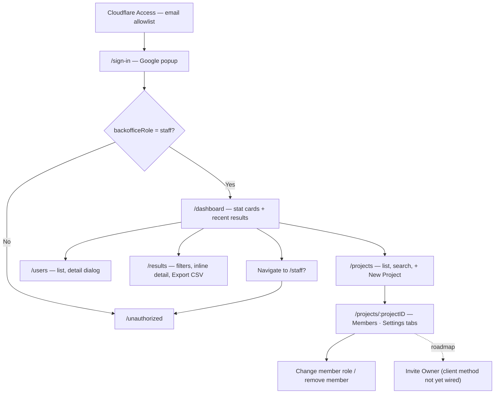
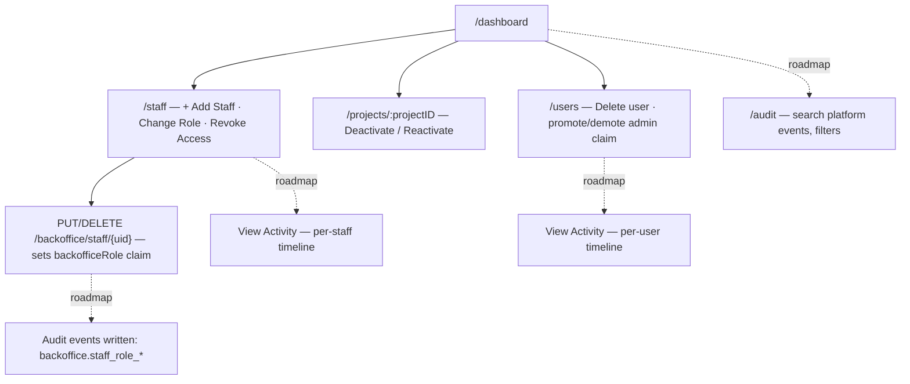
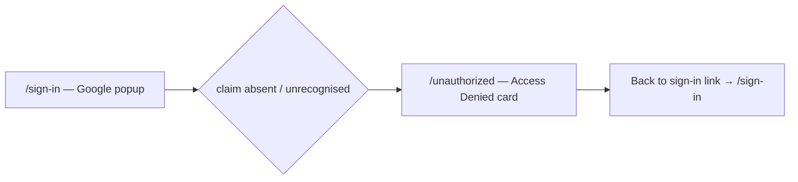

# Backoffice — User Journeys

How FactorySync staff move through the backoffice. See [README.md](./README.md) for the
design spec and [feature-spec.md](./feature-spec.md) for the formal requirements.

> Reflects what is **built today** — scaffold + pages are live; the audit surface and the
> invite-owner client method are roadmap and shown dashed.

---

## Table of Contents

- [Backoffice staff — day-to-day operations](#backoffice-staff--day-to-day-operations)
- [Super admin — staff management and audit](#super-admin--staff-management-and-audit)
- [Unauthorized user — denied access](#unauthorized-user--denied-access)

---

## Backoffice staff — day-to-day operations

A FactorySync support/operations person (`backofficeRole: "staff"`) manages projects,
members, users, and results. The Staff and Audit menu items are hidden for this role.

**Guard(s):** Cloudflare Access (network layer) → `BackofficeGuard`
(`backofficeRole ∈ {staff, superadmin}`) → backend `RequireBackofficeRole` on every
`/api/v1/backoffice/` call. Detail in [auth/route-guards.md](../auth/route-guards.md) and
[backoffice-service.md](./backoffice-service.md).

---

## Super admin — staff management and audit

The CTO / engineering lead (`backofficeRole: "superadmin"`) sees everything staff see, plus
destructive actions and the Staff and Audit pages.

**Guard(s):** `SuperAdminGuard` on `/staff` (and `/audit` when built); superadmin-only
endpoints nest `RequireBackofficeRole(authClient, "superadmin")` server-side. Claims are
set via the Firebase Admin SDK only — never from a client request.

---

## Unauthorized user — denied access

Anyone signed in without a recognised `backofficeRole` claim (including regular `web-app`
users who somehow pass Cloudflare Access).

**Guard(s):** `BackofficeGuard` redirects here; the page itself requires no auth (it must
be reachable without a valid session).

---

*See [README.md](./README.md) for the feature spec.*

---

*Version: 1.0.0*
*Last updated: 3 July 2026*
