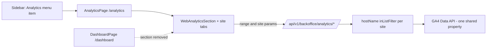

# Backoffice Analytics Menu

**Status:** Implemented ·
[feature-spec.md](./feature-spec.md) · CR-007 in
[change-request-log.md](../../iso29110/change-request-log.md)

Moves the GA4 web-analytics UI (CR-006,
[bo-dashboard-ga4](../bo-dashboard-ga4/README.md)) out of the `/dashboard` page
into a dedicated `/analytics` page with its own **Analytics** sidebar menu item
in `web-backoffice`, and adds per-surface **site tabs** (All / Official website /
Web app) backed by a new `site` query param that filters every GA4 report by
`hostName` — both surfaces stream into the same GA4 property.

## Table of Contents

1. [App surfaces](#app-surfaces)
2. [Summary](#summary)
3. [Design overview](#design-overview)
4. [Security invariants](#security-invariants)
5. [Testing](#testing)
6. [References](#references)

## App surfaces

| web-app | web-official | web-backoffice | backend |
|:-------:|:------------:|:--------------:|:-------:|
| ⬩ | ⬩ | ✅ | ✅ |

## Summary

| Component | Description | Status |
|-----------|-------------|--------|
| **AnalyticsPage** | `/analytics` route (`AuthGuard` → `BackofficeGuard` → `Layout`) — `PageHeader` + hosted `WebAnalyticsSection` | ✅ |
| **Sidebar item** | "Analytics" (`ChartLine` icon) between Dashboard and Projects, active-state highlight | ✅ |
| **Dashboard cleanup** | `WebAnalyticsSection` removed from `DashboardPage` (keeps KPI cards + recent results) | ✅ |
| **i18n** | `nav.analytics`, `analytics.pageTitle`, `analytics.pageSubtitle`, `analytics.site.*` (TH/EN) | ✅ |
| **Site tabs (FR-005)** | All / Official website / Web app tabs in `WebAnalyticsSection`; tab switch refetches all six panels scoped to the surface | ✅ |
| **`site` param (FR-006)** | `site` ∈ `{all, official, app}` on the six data endpoints — GA4 `hostName` `inListFilter` (env-overridable via `GA4_HOSTS_OFFICIAL`/`GA4_HOSTS_APP`), per-site cache keys, `400` on invalid values | ✅ |

## Design overview

Site → hostname mapping (defaults, env-overridable): `official` →
`factorysyncsolutions.com` + `www.factorysyncsolutions.com`; `app` →
`app.factorysyncsolutions.com`; `all` → no filter. Cache keys are
`endpoint:range:site`, so tabs never serve each other's cached data.

Files touched: `apps/web-backoffice/src/` — `pages/AnalyticsPage.tsx` (new),
`pages/AnalyticsPage.test.tsx` (new), `router.tsx`, `components/Sidebar.tsx`,
`components/analytics/WebAnalyticsSection.tsx`, `api/{backoffice,types}.ts`,
`lib/i18n.tsx`, `pages/DashboardPage.tsx`; `apps/backend/services/analytics/` —
`service.go`, `handler.go`, `models.go` + tests.

## Security invariants

| Invariant | Where enforced |
|-----------|----------------|
| `/analytics` sits behind the same guard chain as `/dashboard` (`AuthGuard` → `BackofficeGuard`) | `apps/web-backoffice/src/router.tsx` |
| Data access unchanged: `RequireBackofficeRole("superadmin","staff")` server-side | backend middleware (CR-006, untouched) |
| `site` is allowlist-validated (`all`/`official`/`app`) — arbitrary hostnames cannot be injected into GA4 filters | `resolveSite` in `services/analytics/service.go` |

## Testing

Frontend: 50 tests / 10 files green; type-check and Biome clean. Backend:
`services/analytics` green with `-race`, 87.6% coverage. Cases in
[test-plan.md](./test-plan.md). Run:
`pnpm --filter @repo/web-backoffice test` ·
`cd apps/backend && go test -race -cover ./services/analytics/...`

## References

- [feature-spec.md](./feature-spec.md) · [test-plan.md](./test-plan.md) · [status.md](./status.md)
- [bo-dashboard-ga4](../bo-dashboard-ga4/README.md) — the feature being relocated
- CR-007 in [change-request-log.md](../../iso29110/change-request-log.md)
- [AnalyticsPage](../../../apps/web-backoffice/src/pages/AnalyticsPage.tsx)

*Version: 0.2.0*
*Last updated: 4 July 2026*
