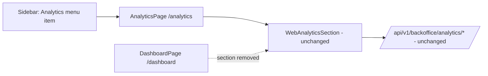

# Backoffice Analytics Menu

**Status:** Implemented ·
[feature-spec.md](./feature-spec.md) · CR-007 in
[change-request-log.md](../../iso29110/change-request-log.md)

Frontend-only change that moves the GA4 web-analytics UI (CR-006,
[bo-dashboard-ga4](../bo-dashboard-ga4/README.md)) out of the `/dashboard` page
into a dedicated `/analytics` page with its own **Analytics** sidebar menu item
in `web-backoffice`. The backend analytics API and the `WebAnalyticsSection`
component are reused untouched.

## Table of Contents

1. [App surfaces](#app-surfaces)
2. [Summary](#summary)
3. [Design overview](#design-overview)
4. [Security invariants](#security-invariants)
5. [Testing](#testing)
6. [References](#references)

## App surfaces

| web-app | web-official | web-backoffice | backend |
|:-------:|:------------:|:--------------:|:-------:|
| ⬩ | ⬩ | ✅ | ⬩ |

## Summary

| Component | Description | Status |
|-----------|-------------|--------|
| **AnalyticsPage** | `/analytics` route (`AuthGuard` → `BackofficeGuard` → `Layout`) — `PageHeader` + hosted `WebAnalyticsSection` | ✅ |
| **Sidebar item** | "Analytics" (`ChartLine` icon) between Dashboard and Projects, active-state highlight | ✅ |
| **Dashboard cleanup** | `WebAnalyticsSection` removed from `DashboardPage` (keeps KPI cards + recent results) | ✅ |
| **i18n** | `nav.analytics`, `analytics.pageTitle`, `analytics.pageSubtitle` (TH/EN) | ✅ |

## Design overview

Files touched (all in `apps/web-backoffice/src/`): `pages/AnalyticsPage.tsx`
(new), `pages/AnalyticsPage.test.tsx` (new), `router.tsx`,
`components/Sidebar.tsx`, `lib/i18n.tsx`, `pages/DashboardPage.tsx`.

## Security invariants

| Invariant | Where enforced |
|-----------|----------------|
| `/analytics` sits behind the same guard chain as `/dashboard` (`AuthGuard` → `BackofficeGuard`) | `apps/web-backoffice/src/router.tsx` |
| Data access unchanged: `RequireBackofficeRole("superadmin","staff")` server-side | backend middleware (CR-006, untouched) |

## Testing

49 tests / 10 files green (47 pre-existing + 2 new `AnalyticsPage` tests);
type-check and Biome clean. Cases in [test-plan.md](./test-plan.md). Run:
`pnpm --filter @repo/web-backoffice test`

## References

- [feature-spec.md](./feature-spec.md) · [test-plan.md](./test-plan.md) · [status.md](./status.md)
- [bo-dashboard-ga4](../bo-dashboard-ga4/README.md) — the feature being relocated
- CR-007 in [change-request-log.md](../../iso29110/change-request-log.md)
- [AnalyticsPage](../../../apps/web-backoffice/src/pages/AnalyticsPage.tsx)

*Version: 0.1.0*
*Last updated: 4 July 2026*
