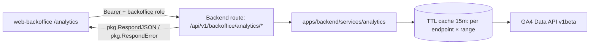

# Backoffice GA4 Analytics Dashboard

**Status:** Phase 1 implemented (E2E + env provisioning pending) ·
[feature-spec.md](./feature-spec.md) · CR-006 in
[change-request-log.md](../../iso29110/change-request-log.md)

Authenticated backoffice enhancement that adds a GA4 Analytics page on
`/analytics` (dedicated sidebar menu item; originally shipped as a `/dashboard`
section) for staff and super-admin users. Data is served by
`/api/v1/backoffice/analytics/*` endpoints (GA4 Data API proxy with TTL cache and
stale-while-error fallback) and rendered through a dedicated `WebAnalyticsSection`
in `web-backoffice` using TH/EN i18n.

## Table of Contents

1. [App surfaces](#app-surfaces)
2. [Summary](#summary)
3. [Goals & non-goals](#goals--non-goals)
4. [Current state](#current-state)
5. [Design overview](#design-overview)
6. [Build sequence](#build-sequence)
7. [Security invariants](#security-invariants)
8. [Acceptance criteria](#acceptance-criteria)
9. [Testing](#testing)
10. [Open items & future work](#open-items--future-work)
11. [References](#references)

## App surfaces

| web-app | web-official | web-backoffice | backend |
|:-------:|:------------:|:--------------:|:-------:|
| ⬩ | ⬩ | ✅ | ✅ |

## Summary

| Component | Description | Status |
|-----------|-------------|--------|
| **Analytics API** | `services/analytics` — seven GA4 proxy endpoints, `RequireBackofficeRole` guard, range validation, 15m TTL cache with stale-while-error | ✅ P1 |
| **Analytics page** | `AnalyticsPage` (`/analytics`, sidebar "Analytics" menu) hosting `WebAnalyticsSection` — range selector (`7d/28d/90d`), `TrafficOverview` cards + series, localized labels, per-panel loading/stale/error/empty states | ✅ P1 |
| **Supporting panels** | `TopPagesTable`, `ChannelsChart`, `AudiencePanel` | ✅ P1 |
| **Engagement (FR-008)** | `/analytics/engagement` + `EngagementPanel` — DAU/WAU/MAU tiles, stickiness (DAU÷MAU), daily series | ✅ added 4 Jul |
| **Sources + GA link (FR-009/010)** | `/analytics/sources` + `SourcesTable` (top 10 source/medium with share); `/analytics/meta` + "Open in Google Analytics" header deep link | ✅ added 4 Jul |
| **Playwright E2E** | Dashboard happy/degradation flows | ⏳ blocked — no Playwright infra in `web-backoffice` |

## Goals & non-goals

### Goals

- Provide backoffice visibility into public site/app traffic without leaving the
  operations toolchain.
- Keep requests protected by backoffice role and centralized response/error helpers.
- Preserve Thai/Buddhist Era and English locale behavior with graceful stale-data
  fallback.

### Non-goals

- Real-time analytics (`runRealtimeReport`) in v1.
- Editing GA4 configuration/events from the backoffice.
- Tenant-level or per-project segmentation beyond the selected GA4 property.

## Current State

Phase 1 is implemented and verified on `feature/bo-dashboard-ga4`, including the
4 July scope additions (FR-008 engagement, FR-009 sources, FR-010 GA deep link).
Recorded coverage after FR-009/010: backend `services/analytics` **87.6%**,
frontend `components/analytics` **97.42%** (47 tests / 9 files);
`sessionSourceMedium` validated against the live GA4 Data API.

GA4 runtime config is provisioned for **local dev** (property `540943523`, Viewer
service account verified 4 July 2026). **Staging and production** still need
`GA4_PROPERTY_ID` / `GA4_SA_CREDENTIALS_JSON` — until then those environments
degrade gracefully (`503 ANALYTICS_UNAVAILABLE`). Playwright E2E remains open;
progress is tracked in [status.md](./status.md).

## Design overview

All routes require `Authorization: Bearer {firebase-id-token}` and
`backofficeRole ∈ {superadmin, staff}`. `range` ∈ `{7d, 28d, 90d}` (default `28d`).
The six data endpoints also accept `site` ∈ `{all, official, app}` (default
`all`) — `official`/`app` filter every report by GA4 `hostName` (see
[bo-analytics-menu](../bo-analytics-menu/README.md), FR-006).

| Endpoint | Method | Purpose |
|----------|--------|---------|
| `/api/v1/backoffice/analytics/overview` | `GET` | totals (active users, sessions, page views, avg engagement time) + daily series |
| `/api/v1/backoffice/analytics/top-pages` | `GET` | top 10 page paths by views |
| `/api/v1/backoffice/analytics/channels` | `GET` | sessions by default channel group |
| `/api/v1/backoffice/analytics/audience` | `GET` | sessions by country (top 10) + device category |
| `/api/v1/backoffice/analytics/engagement` | `GET` | DAU/WAU/MAU (rolling 1/7/28-day active users) + stickiness + daily series |
| `/api/v1/backoffice/analytics/sources` | `GET` | sessions by source/medium (top 10) with share |
| `/api/v1/backoffice/analytics/meta` | `GET` | configured GA4 `propertyID` for console deep-linking (no `range` param) |

All analytics responses include `stale` (boolean) in `data`: `true` means a cached
payload was served because the GA4 upstream failed; a cold-cache failure returns
`503 ANALYTICS_UNAVAILABLE` instead.

## Build sequence

### Phase 1 — MVP (complete except E2E)

| # | Task | File(s) | Done |
|---|------|--------|:----:|
| 1 | Analytics request/response models and service (GA4 client, cache, report definitions) | `apps/backend/services/analytics/models.go`, `service.go` | ✅ |
| 2 | Backoffice analytics handlers + route group with role checks | `apps/backend/services/analytics/handler.go`, `main.go` | ✅ |
| 3 | Unit + handler tests | `apps/backend/services/analytics/service_test.go`, `handler_test.go` | ✅ |
| 4 | Front-end section container + range handling + loading/error states | `apps/web-backoffice/src/pages/AnalyticsPage.tsx`, `components/analytics/WebAnalyticsSection.tsx` | ✅ |
| 5 | Traffic/top-pages/channels/audience panels and i18n copy | `components/analytics/{TrafficOverview,TopPagesTable,ChannelsChart,AudiencePanel}.tsx` | ✅ |
| 6 | Component/unit coverage for critical flows | `apps/web-backoffice/src/**/*.test.tsx` | ✅ |
| 7 | Scope additions: engagement, sources, GA deep link (FR-008/009/010) | `handler.go` + `components/analytics/{EngagementPanel,SourcesTable}.tsx` | ✅ |
| 8 | Playwright coverage for dashboard flows | `apps/web-backoffice` e2e | ⏳ |

## Security invariants

| Invariant | Where enforced |
|-----------|----------------|
| UID is derived from `middleware.GetUID(r)` only | `apps/backend/services/analytics/handler.go` |
| `RequireBackofficeRole("superadmin","staff")` applied server-side before serving analytics payloads | middleware chain in `main.go` |
| All analytics responses use `pkg.RespondJSON` / `pkg.RespondError` helpers | `apps/backend/services/analytics/handler.go` |
| GA4 service-account credentials and property ID are server-side config, never client-supplied or committed | env (`GA4_PROPERTY_ID`, `GA4_SA_CREDENTIALS_JSON`) |
| Returned data is aggregate/non-PII — no user identifiers exposed | GA4 report definitions in `service.go` |

## Acceptance criteria

- Overview cards, time-series, top-pages, channels, audience, engagement, and sources
  panels render with live data when upstream returns success; the GA console deep link
  appears when `/analytics/meta` resolves and is hidden otherwise.
- Invalid `range` values (anything outside `7d/28d/90d`) return `400 VALIDATION_ERROR`.
- GA4 failure with warm cache returns `200` + `stale: true` and the UI shows a
  retry-able warning; cold cache returns `503 ANALYTICS_UNAVAILABLE` with a per-section
  inline error.
- Unauthenticated/unauthorized requests return `401` / `403` and do not leak data.
- All visible UI labels follow `useLocale()` and date output uses `formatDateTime()`.
- Stickiness renders 0% when MAU is zero (no division error).

## Testing

| Package / suite | Target | Recorded | Notes |
|-----------------|--------|----------|-------|
| `apps/backend/services/analytics` | > 70% | **87.6%** (4 Jul 2026) | table-driven service + handler contracts, cache/stale/deny paths |
| `apps/web-backoffice` analytics components | > 70% | **97.42% stmts** (47 tests / 9 files) | success/loading/error + locale + stale states |
| `apps/web-backoffice` Playwright e2e | — | pending | blocked on Playwright infra (E2E-001…005 in test-plan) |

Full cases in [test-plan.md](./test-plan.md). Run:
`cd apps/backend && go test -race -cover ./services/analytics/...` ·
`pnpm --filter @repo/web-backoffice test -- --coverage`

## Open items & future work

Open decisions from the draft phase are **resolved**: analytics scope =
staff + superadmin; cache policy = 15m TTL + stale-while-error, cold-cache → 503.

- Playwright E2E once `apps/web-backoffice` gains Playwright infrastructure.
- Set `GA4_PROPERTY_ID` / `GA4_SA_CREDENTIALS_JSON` in staging and production deploy
  environments (consider a separate SA key per environment).
- Locale switch currently refetches all endpoints (`t` is an effect dependency in
  `WebAnalyticsSection`) — harmless but wasteful; memoize or move error-message
  building out of the effect.

## References

- [feature-spec.md](./feature-spec.md)
- [test-plan.md](./test-plan.md)
- [status.md](./status.md)
- [user-journeys.md](./user-journeys.md)
- [mockups/app.md](./mockups/app.md)
- CR-006 in [change-request-log.md](../../iso29110/change-request-log.md)
- [Analytics page](../../../apps/web-backoffice/src/pages/AnalyticsPage.tsx)
- [GA4 docs](https://developers.google.com/analytics/devguides/reporting/data/v1)

*Version: 0.4.0*
*Last updated: 4 July 2026*
