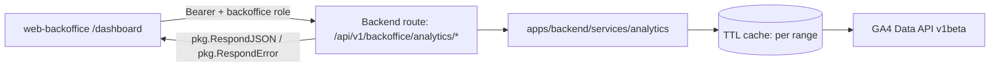

# Backoffice GA4 Analytics Dashboard

**Status:** Draft — not yet implemented · [feature-spec.md](./feature-spec.md)

Authenticated backoffice dashboard enhancement that adds a GA4 Analytics section on
`/dashboard` for staff and super-admin users. Data is provided by new
`/api/v1/backoffice/analytics/*` APIs and rendered through a dedicated
`web-backoffice` widget using TH/EN i18n.

## Table of Contents

1. [App surfaces](#app-surfaces)
2. [Summary](#summary)
3. [Goals & non-goals](#goals--non-goals)
4. [Current state](#current-state)
5. [Design overview](#design-overview)
6. [Build sequence](#build-sequence)
7. [Security invariants](#security-invariants)
8. [Acceptance criteria](#acceptance-criteria)
9. [Testing](#testing)
10. [Open items & future work](#open-items--future-work)
11. [References](#references)

## App surfaces

| web-app | web-official | web-backoffice | backend |
|:-------:|:------------:|:--------------:|:-------:|
| ⬩ | ⬩ | ✅ | ✅ |

## Summary

| Component | Description | Phase |
|-----------|-------------|-------|
| **Analytics API** | Backoffice GA4 proxy endpoints, role guards, input validation, and cache fallback behavior | P1 |
| **Dashboard section** | New `WebAnalyticsSection` with range selector, cards, charts, and localized labels | P1 |
| **Supporting UI** | Top pages table, channels panel, and audience panel, including error/empty states | P1 |

## Goals & non-goals

### Goals

- Provide backoffice visibility into public site/app traffic without leaving the
  operations toolchain.
- Keep requests protected by backoffice role and centralized response/error helpers.
- Preserve Thai/Buddhist Era and English locale behavior with graceful stale-data
  fallback.

### Non-goals

- Real-time analytics (`runRealtimeReport`) in v1.
- Editing GA4 configuration/events from the backoffice.
- Tenant-level or per-project segmentation beyond the selected GA4 property.

## Current State

No implementation has been started yet in this branch. The feature remains at
**Draft** in design and test-planning stage. Work is expected to follow the
phased sequence below, with feature completion tracked in [status.md](./status.md).

## Design overview

| Endpoint | Method | Auth | Purpose |
|----------|--------|------|---------|
| `/api/v1/backoffice/analytics/overview` | `GET` | Bearer + `backofficeRole` | overview metrics + traffic series |
| `/api/v1/backoffice/analytics/top-pages` | `GET` | Bearer + `backofficeRole` | top 10 paths |
| `/api/v1/backoffice/analytics/channels` | `GET` | Bearer + `backofficeRole` | session-by-channel group |
| `/api/v1/backoffice/analytics/audience` | `GET` | Bearer + `backofficeRole` | country + device split |

## Build sequence

### Phase 1 — MVP

| # | Task | File(s) |
|---|------|--------|
| 1 | Add analytics request/response models and service scaffolding | `apps/backend/services/analytics/models.go`, `apps/backend/services/analytics/service.go` |
| 2 | Add backoffice analytics handlers + route group, including middleware/role checks | `apps/backend/services/analytics/handler.go`, `apps/backend/services/analytics/route.go` |
| 3 | Add unit + handler tests | `apps/backend/services/analytics/service_test.go`, `apps/backend/services/analytics/handler_test.go` |
| 4 | Build front-end section container + range handling + loading/error states | `apps/web-backoffice/src/pages/DashboardPage.tsx`, `apps/web-backoffice/src/components/analytics/` |
| 5 | Add top pages/channels/audience components and i18n copy | `apps/web-backoffice/src/components/analytics/*`, `apps/web-backoffice/src/i18n` |
| 6 | Add component/unit + Playwright coverage for critical flows | `apps/web-backoffice/src/**/*.test.tsx`, `apps/web-backoffice/tests/e2e/` |

## Security invariants

| Invariant | Where enforced |
|-----------|----------------|
| UID is derived from `middleware.GetUID(r)` only | `apps/backend/services/analytics/handler.go` |
| Backoffice role guard is applied server-side before serving analytics payloads | `apps/backend/services/analytics/handler.go`, middleware chain |
| All analytics responses use `pkg.RespondJSON` / `pkg.RespondError` helpers | `apps/backend/services/analytics/handler.go` |
| GA4 client credentials remain server-side and secret-bound only | Runtime config + deployment secrets |

## Acceptance criteria

- Overview cards, time-series, top-pages, channels, and audience components render
  with live data when upstream returns success.
- Invalid query ranges return `400 VALIDATION_ERROR`.
- Cache and stale-data warnings are shown for GA4 failures with an available stale payload.
- Unauthenticated/unauthorized requests return `401` / `403` and do not leak tenant data.
- All visible UI labels follow `useLocale()` and date output uses `formatDateTime()`.

## Testing

| Package / suite | Target | Notes |
|-----------------|--------|-------|
| `apps/backend/services/analytics/service_test.go` | > 70% | service behavior + error paths |
| `apps/backend/services/analytics/handler_test.go` | > 70% | API auth, validation, response contracts |
| `apps/web-backoffice` core analytics tests | > 70% | success/loading/error + locale + stale states |
| `apps/web-backoffice` Playwright e2e | — | 401/403, happy path, stale warning, empty states |

## Open items & future work

### Open decisions

| # | Decision | Suggested default |
|---|----------|------------------|
| 1 | Who can see analytics data? | Staff + superadmin (`backofficeRole`) for v1 |
| 2 | GA4 quota fallback strategy | In-memory TTL cache + stale warning in v1 |

## References

- [feature-spec.md](./feature-spec.md)
- [test-plan.md](./test-plan.md)
- [status.md](./status.md)
- [Dashboard page](../../../apps/web-backoffice/src/pages/DashboardPage.tsx)
- [GA4 docs](https://developers.google.com/analytics/devguides/reporting/data/v1)

*Version: 0.1.0*
*Last updated: 2026-07-03*
