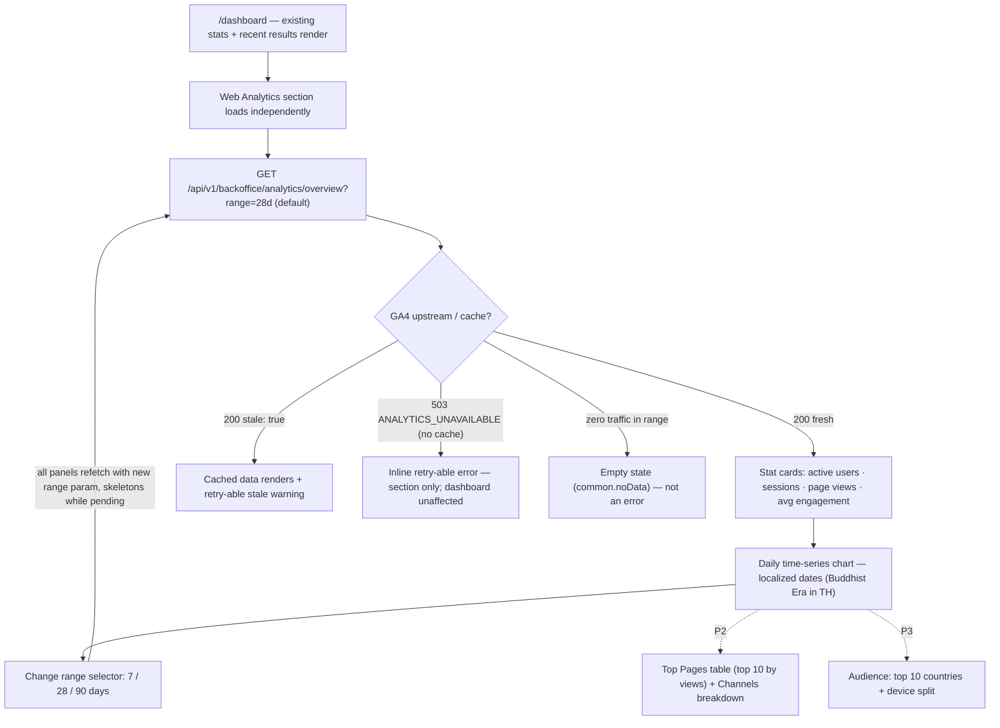
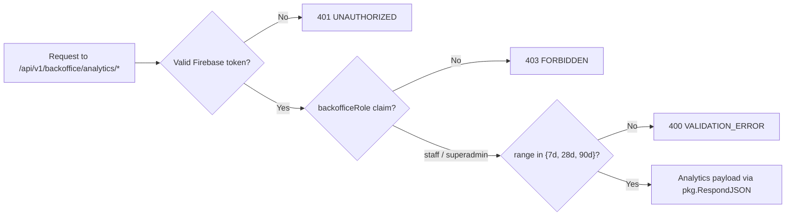

# Backoffice GA4 Analytics Dashboard — User Journeys

How backoffice users move through the Web Analytics section. See [README.md](./README.md)
for the design spec and [feature-spec.md](./feature-spec.md) for the formal requirements.

> Reflects the **Draft spec** — no implementation has been merged yet; Phase 1 (overview
> cards + chart + range selector) is in development on `feature/bo-dashboard-ga4`. The
> later-phase panels (Top Pages — P2, Channels — P2, Audience — P3) are shown dashed.

---

## Table of Contents

- [Backoffice staff — reviewing web analytics](#backoffice-staff--reviewing-web-analytics)
- [Unauthorized user — deny paths](#unauthorized-user--deny-paths)

---

## Backoffice staff — reviewing web analytics

A staff or super-admin user opens the existing backoffice dashboard; the Web Analytics
section loads independently below the platform stats, so a GA4 failure never breaks the
rest of the page.

**Guard(s):** client-side `BackofficeGuard` on `/dashboard`; server-side `FirebaseAuth` +
`RequireBackofficeRole("superadmin", "staff")` on every `/api/v1/backoffice/analytics/*`
route (both roles may view in v1 — read-only, aggregate, non-PII data); Cloudflare Access
adds the network-layer gate. The GA4 property ID and service-account key are server-side
config — the browser never talks to GA4.

---

## Unauthorized user — deny paths

Analytics endpoints leak nothing to callers outside the backoffice.

**Guard(s):** enforced server-side in the middleware chain + analytics handlers — see
[README.md § Security invariants](./README.md#security-invariants).

---

*See [README.md](./README.md) for the feature spec.*

---

*Version: 1.0.0*
*Last updated: 3 July 2026*
