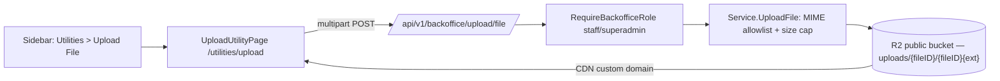

# Backoffice Upload Utility

**Status:** Implemented ·
[feature-spec.md](./feature-spec.md) · CR-008 in
[change-request-log.md](../../iso29110/change-request-log.md)

Adds a **Utilities** section to `web-backoffice` with an **Upload File** page:
staff/superadmin choose an image, PDF, or spreadsheet and get back a permanent
CDN URL to copy. Backed by a new `POST /api/v1/backoffice/upload/file`
endpoint that uploads directly through the backend — a small, standalone
addition alongside the existing [Upload Service](../upload/README.md), not a
step in its Phase 2/3 roadmap (see
[feature-spec.md § 1.3](./feature-spec.md#13-relationship-to-the-upload-service-roadmap)).

## Table of Contents

1. [App surfaces](#app-surfaces)
2. [Summary](#summary)
3. [Design overview](#design-overview)
4. [Security invariants](#security-invariants)
5. [Testing](#testing)
6. [References](#references)

## App surfaces

| web-app | web-official | web-backoffice | backend |
|:-------:|:------------:|:--------------:|:-------:|
| ⬩ | ⬩ | ✅ | ✅ |

## Summary

| Component | Description | Status |
|-----------|-------------|--------|
| **`Service.UploadFile`** | Validates content type (magic bytes) + size against a per-category allowlist (image/PDF/spreadsheet), uploads as-is to the public R2 bucket under `uploads/{fileID}/...`, no Firestore record | ✅ |
| **`POST /backoffice/upload/file`** | Multipart upload endpoint, gated by `RequireBackofficeRole("superadmin","staff")`, rate-limited 20/min per user | ✅ |
| **Utilities sidebar section** | New sidebar group (visible to all backoffice users) with an "Upload File" item | ✅ |
| **`/utilities/upload` page** | File picker → upload → CDN link with copy button; session-scoped list of recent uploads | ✅ |
| **i18n** | `nav.utilities`, `nav.uploadTool`, `uploadUtility.*` (TH/EN) | ✅ |

## Design overview

Object keys are content-addressed (`uploads/{fileID}/{fileID}{ext}`, `fileID`
a server-generated UUID) and cached `immutable` — unlike avatars, nothing ever
overwrites a given key, so a long cache lifetime is safe. No Firestore record
is written; the CDN URL is the only durable reference, matching a "utility"
tool rather than a tracked asset.

Files touched: `apps/backend/services/upload/` — `service.go` (`UploadFile`,
`sanitizeFilename`), `models.go` (allowlist/extensions/`FileResponse`),
`handler.go` (`UploadFile`, `BackofficeRoutes`) + tests; `apps/backend/main.go`
(route wiring); `apps/backend/middleware/ratelimit.go` (new
`RateLimitByUID`) + tests. `apps/web-backoffice/src/` — `pages/UploadUtilityPage.tsx`
(new) + test, `router.tsx`, `components/Sidebar.tsx`, `api/{backoffice,types}.ts`,
`lib/api.ts` (new `postForm`), `lib/i18n.tsx`.

## Security invariants

| Invariant | Where enforced |
|-----------|----------------|
| Only backoffice staff/superadmin may call the endpoint | `RequireBackofficeRole(authClient, "superadmin", "staff")` in `apps/backend/main.go` |
| Content type is verified from file bytes (magic bytes), not the client-declared `Content-Type` | `mimetype.Detect` in `Service.UploadFile` |
| Size is capped per category (image 10MB / PDF 50MB / spreadsheet 25MB) after type detection, not just a flat request-body cap | `generalUploadMaxBytes` in `models.go` |
| Object keys use a server-generated `fileID` — the client filename never reaches the R2 key | `Service.UploadFile` / `sanitizeFilename` |
| Per-user rate limit (20/min) on top of the existing global per-IP limiter | `middleware.RateLimitByUID` |

## Testing

Backend `services/upload`: 38.7% coverage (`-race`). `middleware`: 20.3%
coverage (`-race`, first tests for this package). Frontend: 53 tests / 11
files green; type-check and Biome clean. Cases in
[test-plan.md](./test-plan.md). Run:
`cd apps/backend && go test -race -cover ./services/upload/... ./middleware/...` ·
`pnpm --filter @repo/web-backoffice test`

## References

- [feature-spec.md](./feature-spec.md) · [test-plan.md](./test-plan.md) · [status.md](./status.md)
- [Upload Service](../upload/README.md) — the Phase 1/2/3 service this utility sits alongside
- CR-008 in [change-request-log.md](../../iso29110/change-request-log.md)
- [UploadUtilityPage](../../../apps/web-backoffice/src/pages/UploadUtilityPage.tsx)

*Version: 1.0.0*
*Last updated: 4 July 2026*
