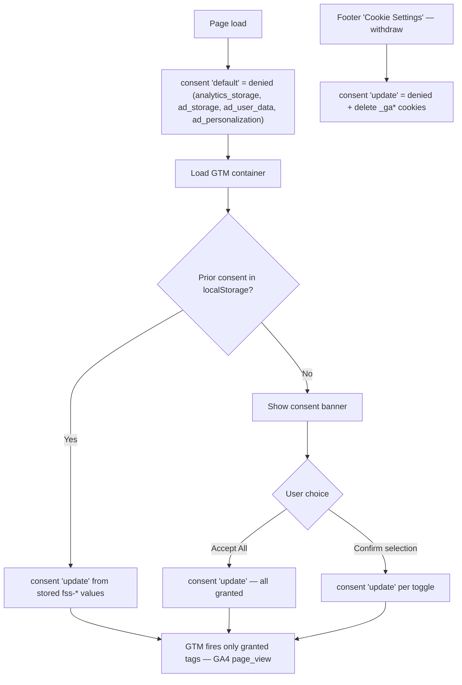

# Cookie Consent & Analytics — Feature Spec

**Status:** 📝 Draft — consent banner, settings modal, storage, and cross-app handoff are built; the GTM + Consent Mode v2 enforcement this spec adds is implemented in code (unit + e2e tests in place) but the acceptance criteria are not yet manually verified and the GTM container is not yet provisioned — see [status.md](./status.md).

---

## Table of Contents

1. [App surfaces](#app-surfaces)
2. [Summary](#summary)
3. [Goals & Non-Goals](#goals--non-goals)
4. [Current State](#current-state)
5. [Design Overview](#design-overview)
6. [Privacy & Security Invariants](#privacy--security-invariants)
7. [Acceptance Criteria](#acceptance-criteria)
8. [Testing](#testing)
9. [Open Items & Future Work](#open-items--future-work)
10. [References](#references)

---

> Wires the **existing** cookie-consent UI on `web-official` (and `web-app`) to Google Tag
> Manager + GA4 through **Google Consent Mode v2**, so tags only fire after the user grants
> the matching category. The banner and settings modal already persist choices to three
> `fss-*` localStorage keys, but at spec time those choices were never enforced — the
> official site loaded no tag at all and the app loaded GTM/GA unconditionally. This
> feature sets Consent Mode defaults to `denied` before the tag loads and pushes a consent
> `update` on every grant, confirm, or withdrawal.

This README is the design index for the Cookie Consent & Analytics feature. The formal
requirements live in the ISO 29110 SRS — see [feature-spec.md](./feature-spec.md). This
feature owns the banner, the settings modal, and the `fss-*` localStorage keys; the
`/cookies` policy document and the static `/cookie-settings` guidance page (browser-level
cookie instructions — not an interactive manager) are owned by the
[legal](../legal/README.md) feature.

---

## App surfaces

| web-app | web-official | backend |
|:-------:|:------------:|:-------:|
| ✅ | ✅ | — |

Both web surfaces have the consent UI built (banner, settings modal, `fss-*` storage,
official → app handoff); the Consent Mode v2 / GTM gating specified here was ⚠️/❌ at spec
time and has since been implemented — see [status.md](./status.md) for the honest
per-piece breakdown of what is built vs. verified. No backend
involvement: consent state is client-side only. Per-app flows live in
[user-journeys.md](./user-journeys.md).

---

## Summary

| Component | Description |
|-----------|-------------|
| **Consent banner + settings modal** (both apps) | First-visit banner and three-category modal (Essential / Analytics / Marketing) — already built, UI unchanged by this spec |
| **Consent storage** | Three `localStorage` keys: `fss-cookie-consent`, `fss-analytics-consent`, `fss-marketing-consent` — single source of truth |
| **Consent Mode bootstrap** (web-official) | Inline `<head>` script: `consent('default')` = denied → replay stored choice → load GTM — see [consent-mode.md](./consent-mode.md) |
| **Analytics loader gating** (web-app) | Fix `initAnalytics()` to push the denied defaults + replay before injecting GTM/GA — see [consent-mode.md](./consent-mode.md) |
| **`updateConsentMode()` helper** (both apps) | Pushes `consent('update')` on grant/withdrawal and deletes `_ga*` cookies on revocation — see [consent-mode.md](./consent-mode.md) |
| **GTM container** | One-time GTM UI configuration (GA4 tag, consent overview, third-party tag rules) — see [gtm-container.md](./gtm-container.md) |
| **Cross-app handoff** | `AppHandoff.tsx` + `web-app` boot script carry consent from the marketing site into the app — already built |

---

## Goals & Non-Goals

### Goals

- No analytics/marketing cookie or network call before explicit opt-in (PDPA-aligned).
- Single source of truth for consent: the three `fss-*` `localStorage` keys.
- Consent Mode v2 so Google's tag is _present_ but _throttled_ until granted (preserves cookieless pings / modelled conversions where applicable).
- Consistent behaviour across `web-official` and `web-app`; the labels the acceptance criteria reference (**Accept All**, **Confirm My Selection**) are identical, other copy is equivalent per surface.
- Toggle analytics off per-environment (staging already strips the IDs).

### Non-Goals

- Replacing the existing banner/modal UI (it stays as-is).
- Building a custom consent-management platform — we rely on GTM + Consent Mode.
- Tracking individual users' PII; GA4 runs in the default (non-PII) configuration.
- Server-side tagging, a Firestore consent audit trail, IP anonymisation beyond GA4 defaults, and non-Google vendors (Meta Pixel, LinkedIn, …) — future work, see [Open Items](#open-items--future-work).

---

## Current State

See [status.md](./status.md) for the per-component implementation checklist. Headline at
spec time: UI and storage ✅ built; official-site tag loader and Consent Mode wiring ❌
missing; app loader ⚠️ ungated. The wiring has since landed (bootstrap, helper, gated
loader, tests); manual AC verification and the GTM container remain outstanding.

---

## Design Overview

Ordering rule: the `consent('default', …)` call must execute **before** the GTM/gtag script
is appended — otherwise the first page-view can fire ungated. Strategy is **advanced
consent mode** (tag present, throttled to cookieless pings while denied; grants take effect
on the current page) — rationale and the basic-mode trade-off are in
[feature-spec.md §4](./feature-spec.md#4-recommended-approach--gtm--consent-mode-v2).

### Consent value model (localStorage — do not change)

| Key | Values |
|-----|--------|
| `fss-cookie-consent` | `"all"` (both on) · `"partial"` (one on) · `"essential"` (both off) |
| `fss-analytics-consent` | `"true"` / `"false"` |
| `fss-marketing-consent` | `"true"` / `"false"` |

Essential cookies are always active and never gated. No Firestore collection and no API
endpoint — consent never leaves the browser.

### Category → Consent Mode signal mapping

| Category | Consent Mode v2 signal(s) | Default | On grant |
|----------|---------------------------|---------|----------|
| Essential (always on) | `functionality_storage`, `security_storage` | `granted` | — |
| Analytics | `analytics_storage` | `denied` | `granted` |
| Marketing | `ad_storage`, `ad_user_data`, `ad_personalization` | `denied` | `granted` |

---

## Privacy & Security Invariants

| Invariant | Where enforced |
|-----------|----------------|
| All gated signals default to `denied` before any Google script loads | inline `<head>` script (official) · top of `initAnalytics()` (app) |
| No analytics/marketing cookie is written before explicit opt-in | Consent Mode v2 advanced mode |
| Withdrawal actively deletes existing `_ga` / `_ga_*` cookies (Consent Mode alone only stops future writes) | `updateConsentMode()` — see [consent-mode.md](./consent-mode.md) |
| Withdrawal is as easy as granting | footer "Cookie Settings" on both apps: official dispatches `OPEN_SETTINGS_EVENT` to reopen the modal; app opens the settings dialog directly |
| Staging never loads GTM/GA | IDs stripped from staging builds (`deploy-staging.yml`) |
| No GTM/GA ID committed to source | env vars only (`PUBLIC_GTM_ID`, `VITE_GTM_ID`) |

---

## Acceptance Criteria

Mirrors [feature-spec.md §8](./feature-spec.md#8-acceptance-criteria) — unchecked in the
spec (Draft); tick in [status.md](./status.md) as verified.

- [ ] On a first visit with the banner showing, **no** `analytics_storage` / `ad_storage` cookie is set and GA4 sends no granted hit (cookieless pings are expected and acceptable).
- [ ] Clicking **Accept All** fires `consent('update')` with all gated signals `granted`; GA4 dispatches a granted hit on the same page — visible in GTM Preview / GA4 Realtime.
- [ ] **Confirm My Selection** with only Analytics on → `analytics_storage: granted`, `ad_storage: denied`.
- [ ] Re-visiting after a choice replays it without showing the banner and without a denied first hit.
- [ ] Withdrawing via footer **Cookie Settings** sets the categories back to `denied` **and deletes existing `_ga` / `_ga_*` cookies**; none reappear on the next navigation.
- [ ] official → app handoff: consent chosen on the marketing site is honoured in the app on first load (no second banner, matching Consent Mode state).
- [ ] Staging build loads **no** GTM/GA (IDs absent).
- [ ] `make lint-web` and `make test-web` pass for both apps.

---

## Testing

From [feature-spec.md §9](./feature-spec.md#9-testing):

| Layer | Target | Notes |
|-------|--------|-------|
| Manual | DevTools cookies/localStorage · GTM Preview · GA4 DebugView | Walk each acceptance row in TH and EN |
| E2E (Playwright, `web-app`) | banner visible → dataLayer `consent default` denied → Accept All → `consent update` granted → `fss-*` persist → no banner on reload → handoff params seeded and stripped | `web-official` has Playwright (smoke/landing/navigation run against staging in CI) but no cookie-consent spec yet — optional follow-up |
| Unit (Vitest, both apps) | `updateConsentMode()` | Correct shape on mocked `gtag`; deletes `_ga*` cookies even when `gtag` is absent; revocation hits the deletion path |

---

## Open Items & Future Work

From [feature-spec.md §11](./feature-spec.md#11-future-work):

| # | Area | Description |
|---|------|-------------|
| 1 | Server-side GTM | sGTM for first-party, more durable measurement |
| 2 | Consent record | Timestamp + policy version persisted server-side for auditability |
| 3 | Re-prompt | Store a `consentVersion` alongside the `fss-*` keys; re-open the banner when it increments |
| 4 | More vendors | Meta Pixel / LinkedIn Insight under Marketing — need GTM additional consent checks + a consent-grant `dataLayer` trigger |
| 5 | web-official e2e | Cookie-consent Playwright spec for the marketing site (the Playwright setup itself exists — smoke/landing/navigation already run against staging in CI) |

---

## References

### Sub-documents

| Doc | Covers |
|-----|--------|
| [feature-spec.md](./feature-spec.md) | ISO 29110 SRS — formal requirements, full implementation detail |
| [status.md](./status.md) | Current implementation status per component |
| [user-journeys.md](./user-journeys.md) | Visitor flows (first visit · returning · withdrawal · handoff) |
| [consent-mode.md](./consent-mode.md) | Consent Mode v2 bootstrap + `updateConsentMode()` helper |
| [gtm-container.md](./gtm-container.md) | One-time GTM container configuration |
| [mockups/official.md](./mockups/official.md) | ASCII wireframes — banner + settings modal (web-app UI identical) |

### ISO 29110 artifacts

- Scope changes → [docs/iso29110/change-request-log.md](../../iso29110/change-request-log.md)
- New risks → [docs/iso29110/risk-register.md](../../iso29110/risk-register.md)

### Cross-references

- [Legal](../legal/README.md) — `/cookies` policy page + static `/cookie-settings` guidance page; keep GA4 cookie names/retention in the policy in sync with what GTM loads
- Existing UI: `apps/web-official/src/components/CookieConsent.tsx` · handoff: `apps/web-official/src/components/AppHandoff.tsx` · app loader: `apps/web-app/src/lib/analytics.ts`

### External standards

- Google Consent Mode v2: <https://developers.google.com/tag-platform/security/guides/consent>
- Thailand PDPA — พ.ร.บ. คุ้มครองข้อมูลส่วนบุคคล พ.ศ. 2562 (B.E. 2562 / 2019)

---

*Version: 1.0.2*
*Last updated: 4 July 2026*
