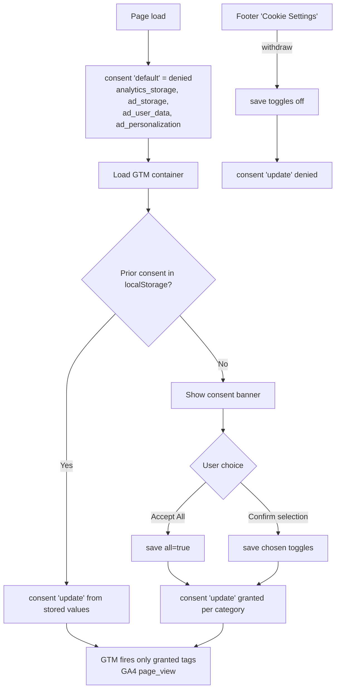

# Cookie Consent & Analytics — Feature Spec

> Wire the **existing** cookie-consent UI on `web-official` (and `web-app`)
> to **Google Tag Manager + Google Analytics 4** through **Google Consent Mode v2**,
> so tags only fire after the user grants the matching consent category.

---

## 1. Summary

The official marketing site already ships a first-visit consent banner and a
settings modal with three categories (Essential / Analytics / Marketing). Today
those choices are **persisted to `localStorage` but never enforced** — no
analytics tag loads on the official site at all, and the app loads GTM/GA
unconditionally.

This feature closes that gap:

1. Load Google's tag (GTM) on both sites.
2. Set **Consent Mode v2 defaults to `denied`** _before_ the tag loads.
3. Push a **consent `update`** whenever the user accepts / confirms / withdraws,
   driven by the consent state we already store.
4. Keep the cross-subdomain handoff (`official → app`) consistent so a choice
   made on the marketing site carries into the app.

**Out of scope:** server-side tagging, a consent-record audit trail in
Firestore, IP anonymisation config beyond GA4 defaults, and any non-Google
vendor (Meta Pixel, LinkedIn, etc.) — those are noted in [§11](#11-future-work).

---

## 2. Goals & Non-Goals

### Goals

- No analytics/marketing cookie or network call before explicit opt-in (PDPA-aligned).
- Single source of truth for consent: the three `fss-*` `localStorage` keys.
- Consent Mode v2 so Google's tag is _present_ but _throttled_ until granted
  (preserves cookieless pings / modelled conversions where applicable).
- Consistent behaviour across `web-official` and `web-app`; the labels the
  acceptance criteria reference (**Accept All**, **Confirm My Selection**) are
  identical, other copy is equivalent per surface.
- Toggle analytics off per-environment (staging already strips the IDs).

### Non-Goals

- Replacing the existing banner/modal UI (it stays as-is).
- Building a custom consent-management platform — we rely on GTM + Consent Mode.
- Tracking individual users' PII; GA4 runs in the default (non-PII) configuration.

---

## 3. Current State (as built)

> Snapshot at spec time (2026-06-10). The ⚠️/❌ gaps below have since been implemented —
> see [status.md](./status.md) for what is built vs. verified. One correction: the
> "Re-open settings from footer" row was listed ✅ but `OPEN_SETTINGS_EVENT` had no
> dispatcher on `web-official` (the footer linked only to the static `/cookie-settings`
> guidance page) — fixed 2026-07-04 by dispatching the event from the footer link.

| Piece | Location | Status |
|-------|----------|--------|
| Consent banner + settings modal | `apps/web-official/src/components/CookieConsent.tsx` | ✅ Built |
| Consent state (3 categories) | `localStorage`: `fss-cookie-consent`, `fss-analytics-consent`, `fss-marketing-consent` | ✅ Built |
| Re-open settings from footer | `OPEN_SETTINGS_EVENT` custom event | ✅ Built |
| Cross-app handoff (official → app) | `apps/web-official/src/components/AppHandoff.tsx` + `apps/web-app/index.html` boot script | ✅ Built |
| App analytics loader | `apps/web-app/src/lib/analytics.ts` (`VITE_GTM_ID`, `VITE_GA_MEASUREMENT_ID`) | ⚠️ Loads **without** consent gating |
| Official-site analytics loader | — | ❌ Missing |
| Consent Mode v2 (`gtag('consent', …)`) | — | ❌ Missing (both apps) |
| Staging IDs stripped from build | `.github/workflows/deploy-staging.yml` | ✅ Built |

### Consent value model (do not change)

`saveConsent(analytics, marketing)` writes:

| Key | Values |
|-----|--------|
| `fss-cookie-consent` | `"all"` (both on) · `"partial"` (one on) · `"essential"` (both off) |
| `fss-analytics-consent` | `"true"` / `"false"` |
| `fss-marketing-consent` | `"true"` / `"false"` |

Essential cookies are **always active** and never gated.

---

## 4. Recommended Approach — GTM + Consent Mode v2

**Decision: use GTM (a container) rather than wiring GA4 with `gtag` directly.**

| | GTM container (recommended) | GA4 direct (`gtag.js`) |
|---|---|---|
| Add tags without a redeploy | ✅ in GTM UI | ❌ code change each time |
| Consent Mode v2 built-in | ✅ native | ✅ via `gtag('consent', …)` |
| Marketing pixels later (Ads, Meta) | ✅ drop-in | ❌ more code |
| Setup overhead | Container + GA4 tag | Just GA4 |
| Risk of tag sprawl / governance | Needs discipline | Lower |

GTM wins because the marketing category exists specifically to allow ad/remarketing
tags later, and GTM lets marketing add them without touching the codebase. GA4 is
configured **as a tag inside the container**, gated by the built-in consent checks.

> GA4-direct (`gtag.js` without a container) is **not implemented** by this spec.
> The app's `analytics.ts` keeps its existing `VITE_GA_MEASUREMENT_ID` branch as
> legacy fallback code, but provisioning should always supply a GTM container ID.

### Consent strategy: advanced consent mode

We use **advanced consent mode**: the Google tag loads on every page with all
gated signals defaulted to `denied`. While denied, Google tags send only
**cookieless pings** (no cookies written, no identifiers stored); when the user
grants consent, the `consent('update')` takes effect **immediately on the
current page** — Google tags have built-in consent checks and dispatch the
granted hit without waiting for the next navigation.

We deliberately do **not** use basic mode (blocking tags with GTM "additional
consent checks") for Google tags: a tag blocked at trigger time is **not**
retroactively fired when consent is later granted, so the first page's
`page_view` would be lost until the next navigation. Additional consent checks
are reserved for **third-party marketing tags** (Meta Pixel, LinkedIn, …) that
have no built-in Consent Mode support — see [§7](#7-gtm-container-configuration-one-time-in-the-gtm-ui).

### Category → Consent Mode signal mapping

| Our category | Consent Mode v2 signal(s) | Default | On grant |
|--------------|---------------------------|---------|----------|
| Essential (always on) | `functionality_storage`, `security_storage` | `granted` | — |
| Analytics | `analytics_storage` | `denied` | `granted` |
| Marketing | `ad_storage`, `ad_user_data`, `ad_personalization` | `denied` | `granted` |

---

## 5. Data Flow



Key ordering rule: the **`consent('default', …)` call must execute before the
GTM/gtag script tag is appended** — otherwise the first page-view can fire
ungated. On the official (Astro) site this goes in an `is:inline` head script;
in the app it must run at the very top of `initAnalytics()` before injecting
the GTM `<script>`.

> `wait_for_update: 500` only matters for the **replay path** (returning visitor
> with stored consent): it holds the first hits up to 500 ms so the synchronous
> `update` lands before they go out. On a true first visit the user takes
> arbitrarily long to decide; after 500 ms the initial hits simply go out as
> denied cookieless pings — expected advanced-mode behaviour, not a bug.

---

## 6. Implementation

### 6.1 `web-official` (Astro) — new

**a. Consent Mode default + GTM bootstrap** — add an `is:inline` script to the
top of `<head>` in `apps/web-official/src/layouts/Layout.astro`, _before_ the
existing theme script, reading the new `PUBLIC_GTM_ID`:

```astro
---
const gtmId = import.meta.env.PUBLIC_GTM_ID ?? "";
---
<script is:inline define:vars={{ gtmId }}>
  (function () {
    window.dataLayer = window.dataLayer || [];
    function gtag() { dataLayer.push(arguments); }
    window.gtag = gtag;

    // 1. Defaults — DENY everything gated, before the tag loads.
    gtag('consent', 'default', {
      ad_storage: 'denied',
      ad_user_data: 'denied',
      ad_personalization: 'denied',
      analytics_storage: 'denied',
      functionality_storage: 'granted',
      security_storage: 'granted',
      wait_for_update: 500,
    });

    // 2. Re-apply a prior choice immediately (avoids a denied first hit).
    try {
      var a = localStorage.getItem('fss-analytics-consent') === 'true';
      var m = localStorage.getItem('fss-marketing-consent') === 'true';
      if (localStorage.getItem('fss-cookie-consent')) {
        gtag('consent', 'update', {
          analytics_storage: a ? 'granted' : 'denied',
          ad_storage: m ? 'granted' : 'denied',
          ad_user_data: m ? 'granted' : 'denied',
          ad_personalization: m ? 'granted' : 'denied',
        });
      }
    } catch (e) {}

    // 3. Load the GTM container — skipped when no ID is set (e.g. staging),
    //    so consent state stays consistent in every environment.
    if (!gtmId) return;
    (function (w, d, s, l, i) {
      w[l] = w[l] || []; w[l].push({ 'gtm.start': +new Date(), event: 'gtm.js' });
      var f = d.getElementsByTagName(s)[0], j = d.createElement(s);
      j.async = true; j.src = 'https://www.googletagmanager.com/gtm.js?id=' + encodeURIComponent(i);
      f.parentNode.insertBefore(j, f);
    })(window, document, 'script', 'dataLayer', gtmId);
  })();
</script>
```

The script renders unconditionally so the consent defaults and replay run even when no
container is configured; only the GTM injection is gated on `PUBLIC_GTM_ID`.

> `Date.now()`/`+new Date()` run in the browser here — fine. The project's
> server-side date rule does not apply to inline client scripts.

**b. Emit `consent('update')` from the existing modal.** Add a tiny helper and
call it from the three existing handlers in `CookieConsent.tsx` — no UI change:

```ts
// apps/web-official/src/lib/consent.ts
export function updateConsentMode(analytics: boolean, marketing: boolean) {
  const g = (window as { gtag?: (...a: unknown[]) => void }).gtag;
  if (g) {
    g("consent", "update", {
      analytics_storage: analytics ? "granted" : "denied",
      ad_storage: marketing ? "granted" : "denied",
      ad_user_data: marketing ? "granted" : "denied",
      ad_personalization: marketing ? "granted" : "denied",
    });
  }
  if (!analytics) deleteGoogleAnalyticsCookies();
}

// Consent Mode stops FUTURE cookie writes on revocation but leaves existing
// _ga / _ga_* cookies in place until expiry (~13 months). PDPA withdrawal
// should remove them actively. GA sets them on the eTLD+1, so expire against
// each ancestor domain.
function deleteGoogleAnalyticsCookies() {
  const expired = "expires=Thu, 01 Jan 1970 00:00:00 GMT; path=/";
  const hosts = window.location.hostname.split(".");
  const domains = hosts.map((_, i) => hosts.slice(i).join(".")).filter((d) => d.includes("."));
  for (const raw of document.cookie.split(";")) {
    const name = raw.split("=")[0]?.trim() ?? "";
    if (name !== "_ga" && !name.startsWith("_ga_")) continue;
    document.cookie = `${name}=; ${expired}`;
    for (const d of domains) document.cookie = `${name}=; ${expired}; domain=.${d}`;
  }
}
```

```tsx
// in handleAcceptAll:  saveConsent(true, true);  updateConsentMode(true, true);
// in handleConfirm:    saveConsent(analytics, marketing);  updateConsentMode(analytics, marketing);
```

**c. GTM `<noscript>` fallback** — add immediately after `<body>` in `Layout.astro`:

```astro
{gtmId && (
  <noscript set:html={`<iframe src="https://www.googletagmanager.com/ns.html?id=${encodeURIComponent(gtmId)}" height="0" width="0" style="display:none;visibility:hidden"></iframe>`} />
)}
```

### 6.2 `web-app` (React) — fix the gating gap

`lib/analytics.ts` currently loads GTM/GA **before** any consent signal. Update
`initAnalytics()` to push `consent('default', …)` (all gated categories `denied`)
**as its first action**, then replay stored consent via `consent('update', …)`,
then inject the GTM/GA script (existing code). Add an exported
`updateConsentMode(analytics, marketing)` — same shape as §6.1b **including the
`_ga*` cookie deletion on revocation** — and call it from the app's
`CookieConsent.tsx` handlers (which already call `trackEvent`). Keep the boot
script in `index.html` that seeds `localStorage` from the handoff query params —
it must run before `initAnalytics()` (it does: the inline script executes before
the app bundle, and `initAnalytics()` is called from `main.tsx`).

### 6.3 Environment variables

| Var | App | Notes |
|-----|-----|-------|
| `PUBLIC_GTM_ID` | `web-official` (Astro `PUBLIC_` prefix) | e.g. `GTM-XXXXXXX` |
| `VITE_GTM_ID` | `web-app` | already referenced |
| `VITE_GA_MEASUREMENT_ID` | `web-app` | legacy GA4-direct fallback in `analytics.ts` — `deploy-production.yml` injects it from repo vars if set; leave the var empty so GTM is the only loader (see §4) |

Add `PUBLIC_GTM_ID` to `apps/web-official/.env.example`. **Production only** —
staging builds already omit the IDs (commit `573cebe`), which means no tag loads
on staging. Never commit real IDs.

---

## 7. GTM Container Configuration (one-time, in the GTM UI)

1. Create a Web container; note the `GTM-XXXXXXX` ID → `PUBLIC_GTM_ID`.
2. Enable **Consent Mode** (Container Settings → "Enable consent overview").
3. Add the **GA4 Configuration tag** with the GA4 Measurement ID, firing on
   Initialization. **Do NOT add additional consent checks** — GA4 has built-in
   Consent Mode support (advanced mode, §4): while `analytics_storage` is
   `denied` it sends only cookieless pings and writes no cookies; on
   `consent('update')` to `granted` it dispatches the granted hit immediately
   on the current page. (An additional consent check would block the tag
   entirely, and a blocked tag is **not** retroactively fired on grant — the
   first page's `page_view` would be lost until the next navigation.)
4. Google Ads / Floodlight tags added later: same rule — built-in checks, no
   additional gating needed.
5. **Third-party marketing tags** (Meta Pixel, LinkedIn Insight, …) have no
   built-in Consent Mode support → these DO get additional consent checks
   (`ad_storage`, `ad_user_data`, `ad_personalization`), and need a
   `dataLayer` event pushed on consent grant as a firing trigger if they must
   fire on the consenting page itself.
6. Built-in **Consent Initialization** trigger fires first — our `default` call
   already ran in the head before GTM loaded, so GTM reads the correct state.
7. Publish. Verify with **GTM Preview** / **Tag Assistant**: while denied, GA4
   sends pings with `gcs=G100` and sets no `_ga*` cookie; after Accept All the
   hit carries `gcs=G111` and the cookie appears.

---

## 8. Acceptance Criteria

- [ ] On a first visit with the banner showing, **no** `analytics_storage` /
      `ad_storage` cookie is set and GA4 sends no granted hit (Consent Mode may
      send cookieless pings — that is expected and acceptable).
- [ ] Clicking **Accept All** fires `consent('update')` with all gated signals
      `granted`; GA4 dispatches a granted hit **on the same page** (no
      navigation needed) — visible in GTM Preview / GA4 Realtime.
- [ ] **Confirm My Selection** with only Analytics on → `analytics_storage:
      granted`, `ad_storage: denied`.
- [ ] Re-visiting after a choice replays it **without** showing the banner and
      **without** a denied first hit (the `update` runs before GA4's first call).
- [ ] Withdrawing via footer **Cookie Settings** → toggles off → `consent('update')`
      sets the categories back to `denied` **and existing `_ga` / `_ga_*` cookies
      are deleted**; none reappear on the next navigation.
- [ ] official → app handoff: consent chosen on the marketing site is honoured in
      the app on first load (no second banner, matching Consent Mode state).
- [ ] Staging build loads **no** GTM/GA (IDs absent).
- [ ] `make lint-web` and `make test-web` pass for both apps.

---

## 9. Testing

- **Manual:** Chrome DevTools → Application → Cookies / Local Storage; GTM Preview;
  GA4 DebugView. Walk each acceptance row in both TH and EN locales.
- **E2E (Playwright — `web-app`):** the app shares the same banner, storage
  keys, and consent flow, so cover the behaviour there: assert (1) banner
  visible on first load, (2) `window.dataLayer` contains a `consent default`
  entry with `analytics_storage: 'denied'`, (3) after **Accept All**, a
  `consent update` with `granted`, (4) the `fss-*` keys persist, (5) no banner
  on reload, (6) handoff query params seed consent and are stripped from the
  URL. (`web-official` has Playwright too — smoke/landing/navigation run
  against staging in CI — but no cookie-consent spec yet; adding one is
  optional follow-up, §11.)
- **Unit (Vitest, both apps):** `updateConsentMode()` pushes the correct shape
  onto a mocked `window.gtag`, still deletes `_ga*` cookies when `gtag` is
  absent, and revocation calls the cookie-deletion path.

---

## 10. Privacy & Compliance Notes (PDPA / GDPR)

- Default **deny** + explicit opt-in matches Thailand PDPA and EU GDPR consent
  expectations. Essential cookies need no consent.
- The `/privacy` and `/cookies` legal pages already describe the categories; keep
  the GA4 cookie names (`_ga`, `_ga_*`) and retention listed there in sync with
  what GTM actually loads.
- Withdrawal must be as easy as granting — satisfied by the persistent footer
  **Cookie Settings** entry point on both apps (official: dispatches
  `OPEN_SETTINGS_EVENT` to reopen the modal; app: opens the settings dialog
  directly). The static `/cookie-settings` page is guidance only and is not a
  withdrawal mechanism.
- **Residual cookies on withdrawal:** a Consent Mode `update` to `denied` only
  stops *future* cookie writes — existing `_ga` / `_ga_*` cookies would persist
  until expiry (~13 months). That's why `updateConsentMode()` actively deletes
  them on revocation (§6.1b). Withdrawal does not retract data already sent to
  GA4 while consent was granted; the `/privacy` page should state this.
- Consent Mode v2 (`ad_user_data`, `ad_personalization`) is required for any
  Google Ads / remarketing use; we set them now so marketing tags are compliant
  the day they're added.

---

## 11. Future Work

- Server-side GTM (sGTM) for first-party, more durable measurement.
- Consent-record trail (timestamp + version of policy) persisted server-side for
  auditability.
- Re-prompt on **policy version bump** (store a `consentVersion` alongside the
  `fss-*` keys and re-open the banner when it increments).
- Additional vendors (Meta Pixel, LinkedIn Insight) gated under Marketing —
  these need GTM additional consent checks + a consent-grant `dataLayer` event
  trigger (§7 step 5).
- Cookie-consent Playwright spec for `web-official` (the Playwright setup
  exists — smoke/landing/navigation already run against staging in CI) so the
  banner flow is exercised on the marketing site directly, not just in the app.

---

## 12. References

- Existing UI: [CookieConsent.tsx](../../../apps/web-official/src/components/CookieConsent.tsx)
- Handoff: [AppHandoff.tsx](../../../apps/web-official/src/components/AppHandoff.tsx)
- App analytics loader: [analytics.ts](../../../apps/web-app/src/lib/analytics.ts)
- Layout: [Layout.astro](../../../apps/web-official/src/layouts/Layout.astro)
- Google: Consent Mode v2 — <https://developers.google.com/tag-platform/security/guides/consent>

---

*Version: 1.1.2*
*Last updated: 4 July 2026*
