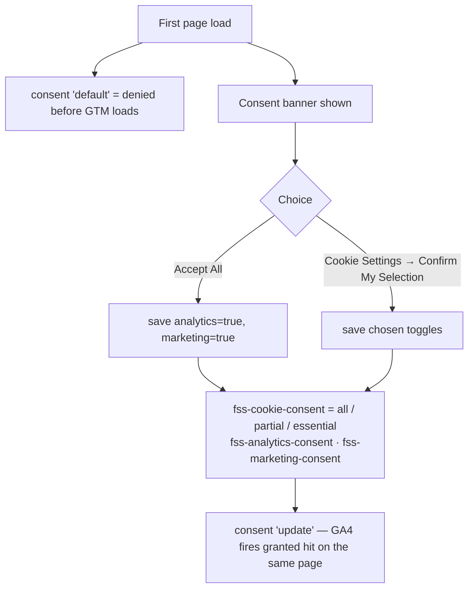
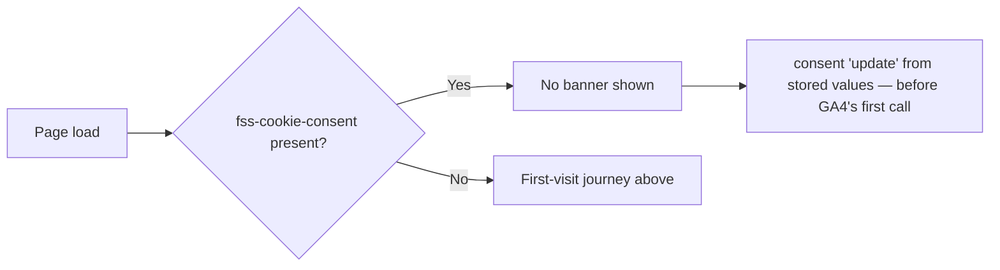
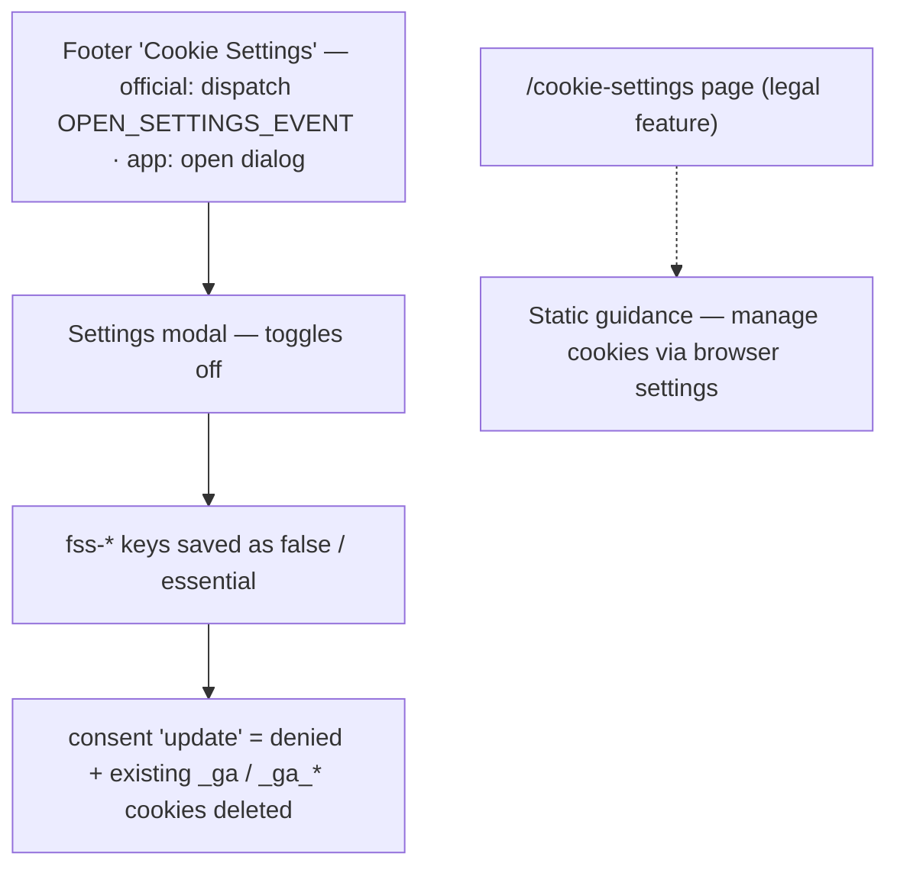
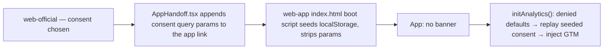

# Cookie Consent & Analytics — User Journeys

How visitors move through consent on both web surfaces. See [README.md](./README.md) for
the design spec and [feature-spec.md](./feature-spec.md) for the formal requirements.

> Reflects what is **built today** — the banner, modal, `fss-*` storage, official → app
> handoff, and the Consent Mode `default`/`update` signalling are all implemented in code.
> The consent-mode steps await manual acceptance-criteria verification and GTM container
> provisioning (spec status: Draft) — see [status.md](./status.md).

---

## Table of Contents

- [Visitor — first visit and consent choice](#visitor--first-visit-and-consent-choice)
- [Returning visitor — stored choice replayed](#returning-visitor--stored-choice-replayed)
- [Any user — withdrawing consent](#any-user--withdrawing-consent)
- [Visitor — official → app handoff](#visitor--official--app-handoff)

---

## Visitor — first visit and consent choice

A first-time visitor on either surface sees the banner; their choice lands in the three
`fss-*` localStorage keys.

**Guard(s):** none — public, client-side only; essential cookies are always active and
never gated. Detail in [consent-mode.md](./consent-mode.md).

---

## Returning visitor — stored choice replayed

A visitor who already chose sees no banner; their stored choice must be replayed before the
first analytics hit.

**Guard(s):** none. The replay runs in the same head script as the defaults so there is no
denied first hit — see [consent-mode.md](./consent-mode.md).

---

## Any user — withdrawing consent

Withdrawal must be as easy as granting: the footer "Cookie Settings" entry point is always
available on both apps — on `web-official` it dispatches `OPEN_SETTINGS_EVENT` to reopen
the modal in place; on `web-app` it opens the settings dialog directly. The static
`/cookie-settings` page owned by [legal](../legal/README.md) is browser-level guidance
only — it does not open the modal.

**Guard(s):** none. Withdrawal does not retract data already sent to GA4 while consent was
granted — the `/privacy` policy states this.

---

## Visitor — official → app handoff

A choice made on the marketing site carries into the app, so the user never sees a second
banner.

**Guard(s):** none. The boot script must run before `initAnalytics()` (it does, in
`main.tsx`). Detail in [consent-mode.md](./consent-mode.md).

---

*See [README.md](./README.md) for the feature spec.*

---

*Version: 1.0.2*
*Last updated: 4 July 2026*
