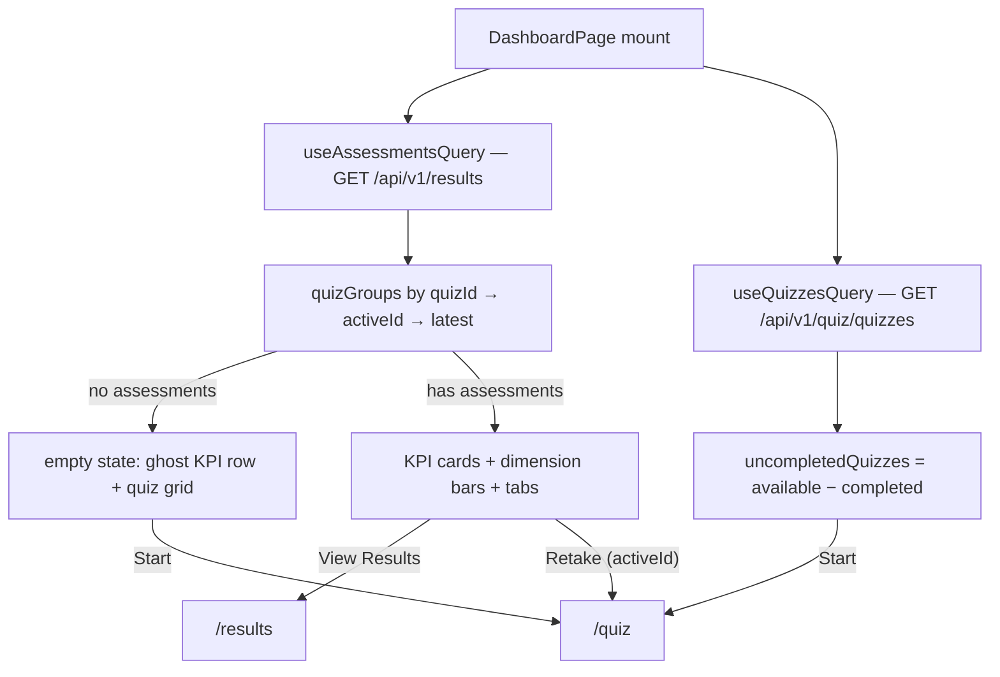

# Dashboard Page — Feature Spec

**Status:** ✅ Live — routed at `/dashboard`, in the nav, and the post-login landing page. Unit suite green; remaining work: the dashboard Playwright spec.

---

## Table of Contents

1. [App surfaces](#app-surfaces)
2. [Summary](#summary)
3. [Goals & Non-Goals](#goals--non-goals)
4. [Current State](#current-state)
5. [Design Overview](#design-overview)
6. [Build Sequence](#build-sequence)
7. [Acceptance Criteria](#acceptance-criteria)
8. [Testing](#testing)
9. [Open Items & Future Work](#open-items--future-work)
10. [References](#references)

---

> Post-login home screen for the authenticated `web-app` user: KPI stat cards for the
> active quiz (overall score, diagnosis level, attempts, date), a per-dimension score-bar
> panel, quick actions (View Results / Retake), and a list of quizzes not yet completed.
> Bilingual (TH/EN), no new backend endpoints — it reads `GET /results` and
> `GET /quiz/quizzes` through TanStack Query. A distinct backoffice dashboard (same file
> name, different app) is also live — see
> [backoffice/feature-spec.md](../backoffice/feature-spec.md).

This README is the design index for the Dashboard Page feature. The formal requirements
live in the ISO 29110 SRS — see [feature-spec.md](./feature-spec.md). Each non-trivial
component is documented in a dedicated sub-document; see [References](#references).

---

## App surfaces

| web-app | backend |
|:-------:|:-------:|
| ✅ | ⬩ |

`DashboardPage` (597 lines) is live: the file-based route
`routes/_authed/_registered/dashboard.tsx` mounts it at `/dashboard`, `Layout.tsx` lists
it first in the nav (and the sidebar logo links to it), and both `SignInPage` and
`RegisterPage` land users there. The backend is indirect only: the page reuses existing
authenticated endpoints and adds none of its own. Per-app flows live in
[user-journeys.md](./user-journeys.md).

---

## Summary

| Component | Description |
|-----------|-------------|
| **`DashboardPage`** (web-app) | Landing screen: quiz selector tabs, KPI stat cards, dimension score-bar panel, quick actions, uncompleted-quiz list, onboarding empty state, loading skeletons — see [dashboard-page.md](./dashboard-page.md) |
| **`StatCard` / `GhostStatCard`** (inline) | KPI tile and its dashed empty-state preview variant |
| **`DimensionRow`** (inline) | Per-dimension score bar, color-thresholded (≥4 emerald · ≥3 blue · ≥2 amber · <2 red) |

---

## Goals & Non-Goals

### Goals

- Latest score, diagnosis level, attempt count, and date per completed quiz — switchable via tabs.
- Per-dimension breakdown of the latest assessment with color-coded bars.
- One-tap paths to `/results`, a re-take of the active quiz, and every uncompleted quiz.
- Onboarding empty state (ghost KPI row + available-quiz grid) for new users.
- Bilingual (TH/EN) — all text through `useLocale()`.
- Server state via TanStack Query — no new API endpoints, no server data in Redux.

### Non-Goals

- Side-by-side assessment comparison (that is the Result page).
- Admin-level aggregate view (that is the backoffice dashboard).
- Score trending or historical charts (future work).
- Separate dashboard endpoint in the backend — existing `GET /results` and `GET /quiz/quizzes` are sufficient.

---

## Current State

See [status.md](./status.md) for the per-component checklist. Headline: the page is live
with a green 16-case Vitest suite; the only open work is the dashboard Playwright spec
([feature-spec.md § 10](./feature-spec.md#10-open-tasks)).

---

## Design Overview

Caching is owned by TanStack Query — back-navigation renders instantly from cache, and
the quiz-submit mutation invalidates `['results']` so a new assessment appears without a
manual refresh. Client state: `authSlice` (`profile.companyName`, read), `quizSlice`
(`resetQuiz`, `setQuizId`, dispatched), local `activeQuizId` for the tabs. Full UI
layout, component breakdown, i18n key map, and animation sequence are in
[feature-spec.md §§ 4–8, 11](./feature-spec.md#4-ui-layout).

### API contract

No new endpoints — the dashboard reuses two existing authenticated reads:

| Method | Path | Auth / Role | Purpose |
|--------|------|-------------|---------|
| `GET` | `/api/v1/results` | Bearer | All of the caller's assessments — see [result/feature-spec.md](../result/feature-spec.md) |
| `GET` | `/api/v1/quiz/quizzes` | Bearer | Available quiz list — see [quiz/feature-spec.md](../quiz/feature-spec.md) |

---

## Build Sequence

Shipped in two stages: the route/nav/redirect wiring landed with the TanStack Router
adoption (PR #25, 1 July 2026); the KPI/dimension redesign and TanStack Query wiring
landed in the Query rollout (2 July 2026). Remaining, from
[feature-spec.md § 10](./feature-spec.md#10-open-tasks):

| # | Task | File(s) | Status |
|---|------|---------|--------|
| 1 | Vitest unit suite — derivations, color thresholds, `handleStartQuiz`, state selection | `apps/web-app/src/pages/DashboardPage.test.tsx` | ✅ Done — 16 tests passing |
| 2 | Dashboard Playwright spec — empty state, KPI values, tabs, Start/Retake/View Results | `apps/web-app/e2e/dashboard.spec.ts` (new) | ❌ Open — needs seeded test accounts |
| 3 | i18n cleanup — `dashboard.times` key; `quiz.assessedOn` trailing space | `DashboardPage.tsx` + `lib/i18n.tsx` | ✅ Done |

---

## Acceptance Criteria

Tracked in [feature-spec.md § 13](./feature-spec.md#13-acceptance-criteria) — all
functional and unit-test criteria are met; only the Playwright-spec criterion remains open.

---

## Testing

Frontend-only — no Go suite. Cases in [test-plan.md](./test-plan.md):

| Suite | Target | Status |
|-------|--------|--------|
| Unit (Vitest) | `DashboardPage.test.tsx` — derivations · color thresholds · `DimensionRow` · `handleStartQuiz` dispatch sequence · state selection · tabs · KPI formatting | ✅ 16 tests passing |
| E2E (Playwright) | Post-login redirect to `/dashboard` | ✅ Exists (`e2e/login.spec.ts`) |
| E2E (Playwright) | Empty state · KPI values · tab switching · Start/Retake → `/quiz` · View Results → `/results` | ❌ Not written — needs seeded empty-state + multi-quiz accounts |

---

## Open Items & Future Work

| # | Area | Description |
|---|------|-------------|
| 1 | Tests | Dashboard Playwright spec per [test-plan.md](./test-plan.md) — the only gate left; needs seeded empty-state and multi-quiz test accounts |
| 2 | Future | Score trending / historical charts (explicit non-goal today) |

Formerly open decisions — both resolved in code: the retake card targets the **active**
quiz (`activeId`, `'shindan'` only as a defensive fallback), and `/dashboard` **is** the
post-login landing route.

---

## References

### Sub-documents

| Doc | Covers |
|-----|--------|
| [feature-spec.md](./feature-spec.md) | ISO 29110 SRS — formal requirements, UI layout, i18n key map, animation sequence |
| [test-plan.md](./test-plan.md) | ISO 29110 test plan — unit + E2E cases |
| [status.md](./status.md) | Current implementation status per component |
| [user-journeys.md](./user-journeys.md) | Factory-operator flow through the dashboard |
| [dashboard-page.md](./dashboard-page.md) | `DashboardPage` component contract |
| [mockups/app.md](./mockups/app.md) | ASCII wireframes — dashboard states (web-app) |

### Cross-references

- [Backoffice](../backoffice/feature-spec.md) — the distinct backoffice dashboard
- [Result](../result/feature-spec.md) — `GET /results` and the Result page the actions link to
- [Quiz](../quiz/feature-spec.md) — `GET /quiz/quizzes` and the quiz flow "Start"/"Retake" enter
- [Auth](../auth/feature-spec.md) — sign-in flow that lands on `/dashboard`

---

*Version: 2.1.0*
*Last updated: 4 July 2026*
