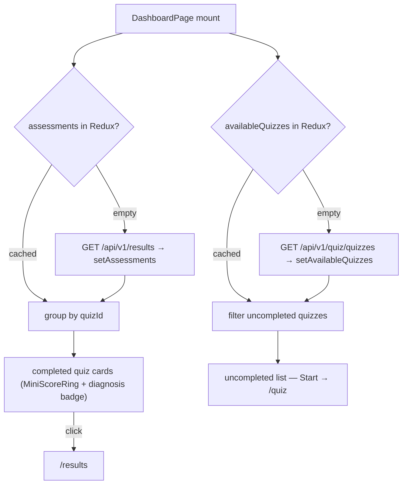

# Dashboard Page — Feature Spec

**Status:** ⚠️ Built, not routed — `DashboardPage.tsx` is fully implemented but has no route or nav link; unreachable in normal navigation.

---

## Table of Contents

1. [App surfaces](#app-surfaces)
2. [Summary](#summary)
3. [Goals & Non-Goals](#goals--non-goals)
4. [Current State](#current-state)
5. [Design Overview](#design-overview)
6. [Build Sequence](#build-sequence)
7. [Acceptance Criteria](#acceptance-criteria)
8. [Testing](#testing)
9. [Open Items & Future Work](#open-items--future-work)
10. [References](#references)

---

> Post-login home screen for the authenticated `web-app` user: all completed quiz cards
> with mini score rings and diagnosis badges, two quick-action cards (View Results /
> Retake Shindan), and a list of available quizzes not yet completed. Bilingual (TH/EN),
> no new backend endpoints — it reuses `GET /results` and `GET /quiz/quizzes` through the
> existing Redux slices. A distinct backoffice dashboard (same file name, different app)
> is already live — see [backoffice/feature-spec.md](../backoffice/feature-spec.md).

This README is the design index for the Dashboard Page feature. The formal requirements
live in the ISO 29110 SRS — see [feature-spec.md](./feature-spec.md). Each non-trivial
component is documented in a dedicated sub-document; see [References](#references).

---

## App surfaces

| web-app | backend |
|:-------:|:-------:|
| 📋 | ⬩ |

The `DashboardPage` component (436 lines) is fully built and exported but **not imported
in `router.tsx`** — it has no route path and cannot be reached, so the surface counts as
planned until wired. The backend is indirect only: the page reuses existing authenticated
endpoints and adds none of its own. Per-app flows live in
[user-journeys.md](./user-journeys.md).

---

## Summary

| Component | Description |
|-----------|-------------|
| **`DashboardPage`** (web-app) | Landing screen aggregating assessments by quiz variant: completed quiz cards, action cards, uncompleted list, empty state, loading skeleton — see [dashboard-page.md](./dashboard-page.md) |
| **`MiniScoreRing`** (inline) | SVG score ring (0–5, animated arc) rendered on each completed quiz card — see [dashboard-page.md](./dashboard-page.md) |
| **Route + nav wiring** | `/dashboard` route in `router.tsx` and a nav item in `Layout.tsx` — the blocking open task |

---

## Goals & Non-Goals

### Goals

- Show all completed quizzes grouped by quiz variant with the latest score and diagnosis at a glance.
- Provide one-tap access to full results (`/results`) and Shindan re-take (`/quiz`).
- List uncompleted quizzes with a direct "Start" path.
- Show a helpful empty state for users who have not taken any quiz yet.
- Bilingual (TH/EN) — all text through `useLocale()`.
- Reuse existing Redux state (`resultSlice`, `quizSlice`) — no new API endpoints.

### Non-Goals

- Side-by-side assessment comparison (that is the Result page).
- Admin-level aggregate view (that is the backoffice dashboard).
- Score trending or historical charts (future work).
- Separate dashboard endpoint in the backend — existing `GET /results` and `GET /quiz/quizzes` are sufficient.

---

## Current State

See [status.md](./status.md) for the per-component implementation checklist. Headline:
the page is built, the wiring is not — routing it is the primary open task
([feature-spec.md § 10](./feature-spec.md#10-open-tasks-before-shipping)).

---

## Design Overview

Both fetches are skipped when the respective Redux slice already has data — the dashboard
is instant when navigating back from `/results` or `/quiz`. Redux dependencies (all
existing actions, nothing new): `authSlice` (`profile.companyName`), `resultSlice`
(`assessments`, `loading`), `quizSlice` (`availableQuizzes`, `resetQuiz`, `setQuizId`).
Full UI layout, component breakdown, i18n key map, and animation sequence are in
[feature-spec.md §§ 4–8, 11](./feature-spec.md#4-ui-layout).

### API contract

No new endpoints — the dashboard reuses two existing authenticated reads:

| Method | Path | Auth / Role | Purpose |
|--------|------|-------------|---------|
| `GET` | `/api/v1/results` | Bearer | All of the caller's assessments — see [result/feature-spec.md](../result/feature-spec.md) |
| `GET` | `/api/v1/quiz/quizzes` | Bearer | Available quiz list for the uncompleted section — see [quiz/feature-spec.md](../quiz/feature-spec.md) |

---

## Build Sequence

The remaining work, from [feature-spec.md § 10](./feature-spec.md#10-open-tasks-before-shipping):

| # | Task | File(s) |
|---|------|---------|
| 1 | **BLOCKING** — import `DashboardPage` and add the `/dashboard` route inside `RegisterGuard` | `apps/web-app/src/router.tsx` |
| 2 | Add a "Dashboard" nav item | `apps/web-app/src/components/Layout.tsx` |
| 3 | Fix empty-state i18n — extract `dashboard.noResults` / `dashboard.noResultsDesc` keys, replace inline `locale === 'th' ? … : …` | `apps/web-app/src/lib/i18n.tsx` + `DashboardPage.tsx` |
| 4 | Resolve the hardcoded `'shindan'` retake target (keep + relabel, or derive from first completed quiz) | `apps/web-app/src/pages/DashboardPage.tsx` |
| 5 | Decide post-login navigation intent (`/` redirect, `useAuth` redirect, `SignInPage` redirect → `/dashboard`?) | `router.tsx` / `useAuth` / `SignInPage.tsx` |

---

## Acceptance Criteria

Verbatim from [feature-spec.md § 13](./feature-spec.md#13-acceptance-criteria) — none met
until the route lands:

- [ ] `DashboardPage` is importable via a route (e.g. `/dashboard`).
- [ ] Navigating to `/dashboard` shows the gradient header with the user's company name.
- [ ] Completed quiz cards appear — one per distinct `quizId` — each with `MiniScoreRing`, quiz name, diagnosis badge, and formatted submission date.
- [ ] Clicking a completed quiz card navigates to `/results`.
- [ ] "View Results" action card navigates to `/results`.
- [ ] "Retake Assessment" action card dispatches `resetQuiz()` + `setQuizId('shindan')` and navigates to `/quiz`.
- [ ] Uncompleted quizzes section lists quizzes not yet taken; each row's "Start" button dispatches `resetQuiz()` + `setQuizId(q.id)` and navigates to `/quiz`.
- [ ] When all quizzes are completed, the uncompleted section is hidden.
- [ ] When no assessments exist, the empty-state card renders instead of the quiz-card grid.
- [ ] Empty-state text renders in the active locale.
- [ ] Loading skeletons appear while `resultLoading` is true and `assessments` is empty.
- [ ] Navigating back to `/dashboard` from `/results` does not re-fetch results (uses Redux cache).
- [ ] `make lint-web` and `make test-web` pass.

---

## Testing

Frontend-only — no Go suite. Planned coverage from
[feature-spec.md § 14](./feature-spec.md#14-testing):

| Suite | Target | Notes |
|-------|--------|-------|
| Unit (Vitest) | `handleStartQuiz` dispatch sequence · `quizGroups` derivation · `uncompletedQuizzes` derivation · `MiniScoreRing` arc math | Not yet written |
| E2E (Playwright) | Empty state · populated cards · card → `/results` · Start → `/quiz` with correct `quizId` | Not yet written — requires the route to exist |

---

## Open Items & Future Work

### Blocked on other work

| # | Area | Description |
|---|------|-------------|
| 1 | Routing | `/dashboard` route + nav link — everything else in this feature is behind it |
| 2 | Data layer drift | The spec's data flow reads `resultSlice`; the result Redux slice has since been retired in the TanStack Query migration — revisit the fetch/caching wiring when routing the page |

### Open decisions

| # | Decision | Resolution |
|---|----------|------------|
| 1 | Retake target hardcoded to `'shindan'` | **Open**: keep hardcoded and relabel "Retake Shindan", or derive from the first completed quiz ID |
| 2 | Post-login landing | **Open**: should `/`, `useAuth` post-login, and `SignInPage` redirect to `/dashboard` instead of `/results`? |

---

## References

### Sub-documents

| Doc | Covers |
|-----|--------|
| [feature-spec.md](./feature-spec.md) | ISO 29110 SRS — formal requirements, UI layout, i18n key map, animation sequence |
| [status.md](./status.md) | Current implementation status per component |
| [user-journeys.md](./user-journeys.md) | Factory-operator flow through the dashboard |
| [dashboard-page.md](./dashboard-page.md) | `DashboardPage` + `MiniScoreRing` component contract |
| [mockups/app.md](./mockups/app.md) | ASCII wireframes — dashboard states (web-app) |

### Cross-references

- [Backoffice](../backoffice/feature-spec.md) — the distinct, already-live backoffice dashboard
- [Result](../result/feature-spec.md) — `GET /results` and the Result page the cards link to
- [Quiz](../quiz/feature-spec.md) — `GET /quiz/quizzes` and the quiz flow "Start"/"Retake" enter
- [Auth](../auth/feature-spec.md) — post-login redirect decisions

---

*Version: 1.0.0*
*Last updated: 3 July 2026*
