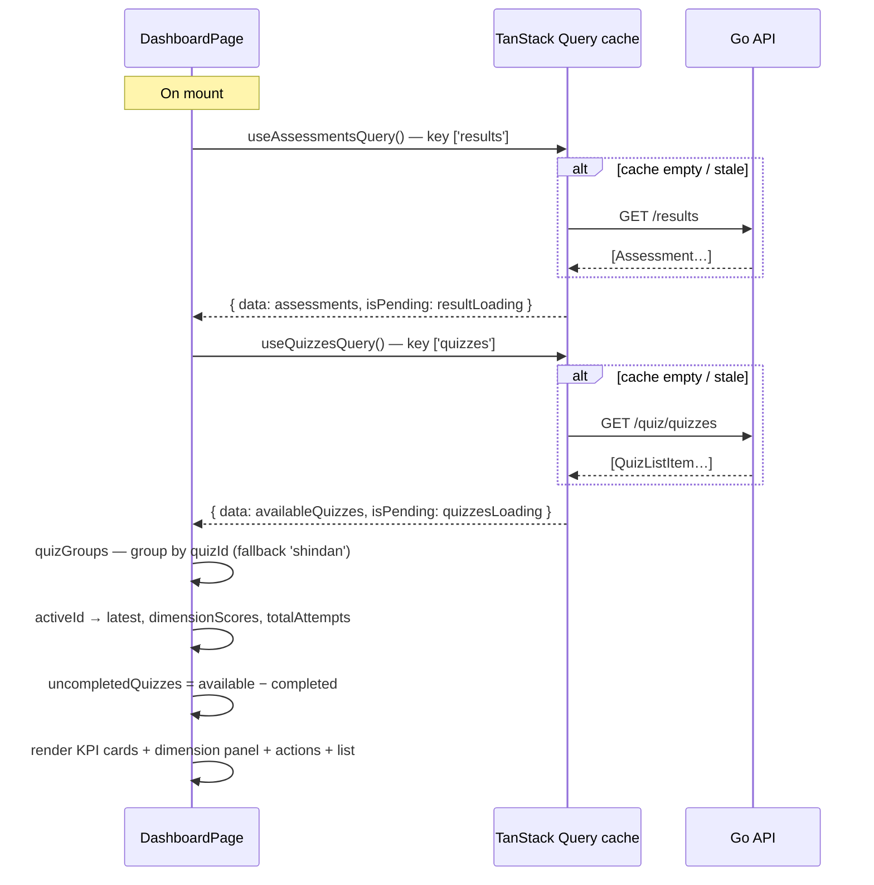

# Dashboard Page — Feature Spec

> Post-login home screen for the authenticated `web-app` user: KPI stat cards for the
> active quiz (overall score, level, attempt count, assessed-on date), a per-dimension
> score-bar panel, two quick-action cards (View Results / Retake), and a list of
> available quizzes not yet completed. Live at `/dashboard`.

> **Two separate dashboards exist** — this spec covers the `web-app` user dashboard
> (`DashboardPage.tsx`). The `web-backoffice` backoffice dashboard is a distinct page
> (same file name, different app) that shows platform-wide stats and a recent-results
> table. See [backoffice/feature-spec.md §4](../backoffice/feature-spec.md) for that page.

---

## 1. Summary

`DashboardPage` is the authenticated user's landing screen after sign-in. It presents
the latest assessment for one "active" quiz as a KPI board (score, diagnosis level,
attempts, date) with a per-dimension breakdown, lets the user switch between completed
quizzes via selector tabs, and offers fast paths to the Result page, a re-take, and any
quiz not yet taken. New users get an onboarding empty state: a ghost KPI row previewing
the dashboard plus a card grid of all available quizzes.

**Current status:** Live. The route shipped in the TanStack Router adoption (PR #25,
1 July 2026) and the page was rebuilt around TanStack Query and the KPI/dimension layout
in the Query rollout (`f626a67`, 2 July 2026). The component is
`apps/web-app/src/pages/DashboardPage.tsx` (597 lines), routed at
`/_authed/_registered/dashboard` with a nav item in `Layout.tsx`. Remaining work is test
coverage (§10).

---

## 2. Goals & Non-Goals

### Goals

- Show the latest score, diagnosis level, attempt count, and submission date for each
  completed quiz — one quiz at a time, switchable via tabs.
- Break the latest assessment down per dimension with color-coded score bars.
- Provide one-tap access to full results (`/results`), a re-take of the active quiz, and
  every uncompleted quiz.
- Onboard new users with a ghost-dashboard empty state and a "start here" quiz grid.
- Bilingual (TH/EN) — all text through `useLocale()`.
- Server state via TanStack Query (`useAssessmentsQuery`, `useQuizzesQuery`) — no new
  API endpoints.

### Non-Goals

- Side-by-side assessment comparison (that is the Result page).
- Admin-level aggregate view (that is the backoffice dashboard).
- Score trending or historical charts (future work).
- Separate dashboard endpoint in the backend — existing `GET /results` and
  `GET /quiz/quizzes` are sufficient.

---

## 3. Current State

| Component | Location | Status |
|-----------|----------|--------|
| Dashboard page | `apps/web-app/src/pages/DashboardPage.tsx` | ✅ Live |
| Route entry | `apps/web-app/src/routes/_authed/_registered/dashboard.tsx` | ✅ Live — file-based route |
| Nav link | `apps/web-app/src/components/Layout.tsx` (`getNavItems()`, first item; sidebar logo also links here) | ✅ Live |
| Post-login redirect | `SignInPage.tsx` (`<Navigate to="/dashboard" />`), `RegisterPage.tsx` (post-registration) | ✅ Live |
| i18n keys | `apps/web-app/src/lib/i18n.tsx` — all §8 keys present (TH + EN) | ✅ Done |
| Vitest unit tests | `apps/web-app/src/pages/DashboardPage.test.tsx` — 16 cases, all passing | ✅ Done |
| Dashboard Playwright spec | `apps/web-app/e2e/` — only the login redirect assertion exists | ⚠️ Partial |

---

## 4. UI Layout

Three mutually exclusive body states below a persistent gradient page header
(`quiz.welcomeBack` + `profile.companyName`, fallback `quiz.yourCompany`).

### Filled dashboard (has completed assessments)

```
┌─────────────────────────────────────────────────────────────┐
│  [gradient header]  ยินดีต้อนรับกลับ / Welcome back,         │
│  <Company Name>          ← authSlice profile.companyName    │
├─────────────────────────────────────────────────────────────┤
│  [Shindan] [Factory] …   ← selector tabs (only if >1 quiz)  │
├─────────────────────────────────────────────────────────────┤
│  KPI STAT CARDS (2-col mobile / 4-col desktop)              │
│  ┌──────────┐ ┌──────────┐ ┌──────────┐ ┌──────────┐        │
│  │ คะแนนรวม │ │ ระดับ     │ │ ครั้งที่  │ │ ประเมิน  │        │
│  │ 3.52     │ │[Establish│ │ ประเมิน  │ │ เมื่อ     │        │
│  │ / 5.00   │ │  badge]  │ │ 3 ครั้ง   │ │10 มิ.ย.69│        │
│  └──────────┘ └──────────┘ └──────────┘ └──────────┘        │
├───────────────────────────────────┬─────────────────────────┤
│  คะแนนรายมิติ / DIMENSION SCORES  │  QUICK ACTIONS          │
│  Dimension A  ▓▓▓▓▓▓▓░░░  3.5     │  ┌───────────────────┐  │
│  Dimension B  ▓▓▓▓▓▓▓▓▓░  4.5     │  │ 📊 View Results → │  │
│  …(8 rows, color by threshold)    │  ├───────────────────┤  │
│  (2/3 width)                      │  │ 🔄 Retake       → │  │
│                                   │  └───────────────────┘  │
├───────────────────────────────────┴─────────────────────────┤
│  แบบประเมินอื่น / OTHER ASSESSMENTS (hidden when none left)  │
│  ┌─────────────────────────────────────────────────────┐    │
│  │ 📋 Cybersecurity Assessment              Start →    │    │
│  └─────────────────────────────────────────────────────┘    │
└─────────────────────────────────────────────────────────────┘
```

### Empty state (no assessments)

```
┌─────────────────────────────────────────────────────────────┐
│  [gradient header]                                          │
├─────────────────────────────────────────────────────────────┤
│  GHOST KPI ROW — 4 dashed cards, value "--"                 │
│  (previews what appears after the first quiz)               │
├─────────────────────────────────────────────────────────────┤
│  [📊] ยังไม่มีผลประเมิน / No assessments yet                 │
│       เริ่มทำแบบประเมิน… / Start an assessment…              │
├─────────────────────────────────────────────────────────────┤
│  AVAILABLE QUIZZES — card grid (1/2/3-col responsive)       │
│  ┌──────────┐ ┌──────────┐ ┌──────────┐                     │
│  │ Shindan  │ │ Factory  │ │ Cyber…   │  each → Start →     │
│  └──────────┘ └──────────┘ └──────────┘                     │
└─────────────────────────────────────────────────────────────┘
```

### Loading (fetch pending, no cached assessments)

Skeleton mirror of the filled layout: 4 × `h-24` KPI skeletons, then a
`lg:grid-cols-3` row with an `h-64 lg:col-span-2` panel skeleton and an `h-64` actions
skeleton. The empty state's quiz grid shows its own 3 × `h-32` skeletons while
`quizzesLoading`.

---

## 5. Component Breakdown

All helpers are defined inline in `DashboardPage.tsx`.

### `StatCard` / `GhostStatCard`

`StatCard({ label, children })` — bordered `bg-card rounded-xl` KPI tile with an
uppercase label. `GhostStatCard({ label })` — dashed-border variant rendering a muted
`--` value; used only in the empty state to preview the KPI row.

### `DimensionRow`

`DimensionRow({ dim, locale })` — one horizontal score bar per `DimensionScore`:
locale-aware dimension name (`dimensionNameTh` / `dimensionName` with cross-fallback),
a track bar filled to `score / 5 × 100 %` (capped at 100), and the numeric score
(`toFixed(1)`). Bar and score colors come from shared thresholds:

| Score | Bar (`getDimBarColor`) | Text (`getDimScoreText`) |
|-------|------------------------|--------------------------|
| ≥ 4 | `bg-emerald-500` | emerald |
| ≥ 3 | `bg-blue-500` | blue |
| ≥ 2 | `bg-amber-500` | amber |
| < 2 | `bg-red-500` | red |

Bar width animates via `transition-all duration-700 ease-out`.

### Quiz selector tabs

Rendered only when `completedQuizIds.length > 1`. One pill button per completed quiz
(`getQuizName(qid)` resolves the locale-aware name from `availableQuizzes`, falling back
to the raw ID). Clicking sets `activeQuizId` (local `useState`); the active pill uses
`bg-primary text-white`.

### KPI stat cards

Four `StatCard`s in a `StaggerChildren` grid (stagger 0.06 s), all derived from
`latest` — the newest assessment of the active quiz:

1. **Overall score** — `latest.overallScore.toFixed(2)` + `/ 5.00`, tinted by diagnosis.
2. **Level** — `Badge` with `t('diagnosis.<latest.diagnosis>')`, colored by `diagnosisConfig`.
3. **Assessment count** — `totalAttempts` (+ ครั้ง/times unit).
4. **Assessed on** — `formatDateTime(latest.submittedAt, locale)` (Buddhist Era in TH).

`diagnosisConfig` maps Beginning → red, Developing → amber, Established → blue,
Advanced → emerald (light + dark variants); unknown diagnoses fall back to Beginning.

### Quick actions

Two `<button>` cards in the right column:

1. **View Results** — `navigate({ to: '/results' })`. Bar-chart icon, `--primary` accent.
2. **Retake** — `handleStartQuiz(activeId ?? 'shindan')` — re-takes the **active** quiz
   (the `'shindan'` fallback is unreachable defense: `activeId` is always set when the
   filled dashboard renders). Refresh icon, amber accent.

### Uncompleted quizzes list

`availableQuizzes` minus `completedQuizIds`; hidden when empty. Each row is a full-width
`<button>` calling `handleStartQuiz(q.id)`:

1. `dispatch(resetQuiz())`
2. `dispatch(setQuizId(q.id))`
3. `navigate({ to: '/quiz' })`

The empty state reuses the same handler from its quiz card grid.

---

## 6. Data Flow



Caching is owned by TanStack Query (`lib/queryClient.ts`): navigating back from
`/results` or `/quiz` renders instantly from cache, and the quiz-submit mutation
invalidates `['results']` so the dashboard refetches after a new assessment.

---

## 7. State Dependencies

| Owner | What | Used for |
|-------|------|----------|
| TanStack Query — `useAssessmentsQuery()` (`lib/queries.ts`) | `GET /results` → `Assessment[]` | quiz groups, KPI cards, dimension panel |
| TanStack Query — `useQuizzesQuery()` (`lib/queries.ts`) | `GET /quiz/quizzes` → `QuizListItem[]` | quiz names, uncompleted list, empty-state grid |
| Redux `authSlice` | `profile.companyName` (read) | header greeting |
| Redux `quizSlice` | `resetQuiz()`, `setQuizId()` (dispatched) | start/retake flow into `/quiz` |
| Local `useState` | `activeQuizId` | selector tabs |

The former `resultSlice` was retired in the TanStack Query rollout (CR-003); server data
is never mirrored into Redux.

---

## 8. i18n Key Map

All keys exist in `apps/web-app/src/lib/i18n.tsx` (TH + EN).

| Key | TH | EN |
|-----|----|----|
| `quiz.welcomeBack` | ยินดีต้อนรับกลับ | Welcome back |
| `quiz.yourCompany` | บริษัทของคุณ | Your Company |
| `result.overallScore` | คะแนนรวม | Overall Score |
| `dashboard.level` | ระดับ | Level |
| `dashboard.assessmentCount` | ครั้งที่ประเมิน | Assessments |
| `quiz.assessedOn` | ประเมินเมื่อ | Assessed on |
| `result.dimensionScores` | คะแนนรายมิติ | Dimension Scores |
| `quiz.noResults.title` | ยังไม่มีผลประเมิน | No assessments yet |
| `quiz.noResults.desc` | เริ่มทำแบบประเมินเพื่อตรวจสุขภาพโรงงานของคุณ | Start an assessment to check your factory health |
| `quiz.viewResults` / `Desc` / `Action` | ดูผลลัพธ์ / … | View Results / … |
| `quiz.retake` / `Desc` / `Action` | ทำแบบประเมินใหม่ / … | Retake Assessment / … |
| `dashboard.times` | ครั้ง | times |
| `quiz.otherAssessments` | แบบประเมินอื่น | Other Assessments |
| `quiz.startNewAssessment` | เริ่มทำแบบประเมินชุดใหม่ | Start this new assessment |
| `quiz.start` | เริ่มทำ | Start |
| `nav.dashboard` | แดชบอร์ด | Dashboard |
| `diagnosis.Beginning` / `Developing` / `Established` / `Advanced` | เริ่มต้น / กำลังพัฒนา / มั่นคง / ก้าวหน้า | Beginning / Developing / Established / Advanced |

The attempt-count unit uses `dashboard.times`; `quiz.assessedOn` has no trailing space
(both cleaned up 4 July 2026 — see §10.2). Quiz names (`q.nameTh` / `q.nameEn`) are API
data, not hardcoded strings — locale selection on them is expected.

---

## 9. Backend API

No dashboard-specific endpoints. The page reuses:

| Endpoint | Usage |
|----------|-------|
| `GET /api/v1/results` | All caller assessments, newest first (see [result/feature-spec.md](../result/feature-spec.md)) |
| `GET /api/v1/quiz/quizzes` | Available quiz list (see [quiz/feature-spec.md](../quiz/feature-spec.md)) |

Both require a Firebase Bearer token (route group `_authed`) and a completed profile
(`_registered`).

---

## 10. Open Tasks

### 10.1 Test coverage — the remaining gap

The Vitest unit suite is done: `DashboardPage.test.tsx` (16 cases covering UT-001–UT-017,
all passing). Still open: a dashboard Playwright spec (only `e2e/login.spec.ts` asserts
the post-login redirect lands on `/dashboard`). IT-002 (empty state) and IT-006
(≥2 completed quizzes) need dedicated test accounts in those data states — the single
`E2E_USER_EMAIL` account cannot cover both. See [test-plan.md](./test-plan.md).

### 10.2 Minor i18n cleanup — ✅ done (4 July 2026)

- The attempt-count unit now renders `t('dashboard.times')` (key added TH/EN); the
  inline `locale === 'th' ? 'ครั้ง' : 'times'` ternary is gone.
- `quiz.assessedOn` values no longer carry a trailing space; the `.trim()` calls were
  removed. Decorative SVGs also gained `aria-hidden="true"`, clearing the page's
  Biome a11y errors.

### 10.3 Resolved decisions (for the record)

| Former open decision | Resolution shipped |
|----------------------|--------------------|
| Retake target hardcoded to `'shindan'` | Retake now targets the active quiz (`activeId ?? 'shindan'`); fallback is defensive only |
| Post-login landing route | `/dashboard` — `SignInPage` redirects authenticated users there; `RegisterPage` navigates there after registration |

---

## 11. Animation Sequence

| Element | Wrapper | Delay / stagger |
|---------|---------|-----------------|
| Header (company name) | `FadeIn` | 0 s |
| Empty state (whole body) | `ScaleIn` | 0 s |
| Empty-state quiz grid | `StaggerChildren` | 0.07 s stagger |
| Filled dashboard (whole body) | `FadeIn` | 0 s |
| KPI stat cards | `StaggerChildren` | 0.06 s stagger |
| Dimension panel | `FadeIn` | 0.15 s |
| Quick actions | `FadeIn` | 0.2 s |
| Uncompleted quizzes | `FadeIn` | 0.3 s |
| Dimension bars | CSS `transition-all` | 700 ms ease-out |

---

## 12. Accessibility

- Every interactive card (quiz cards, quick actions, selector tabs, uncompleted rows) is
  a `<button type="button">` with visible focus rings via global Tailwind ring utilities.
- Dimension bars are decorative; each row carries the dimension name and numeric score as
  text (name also in `title` for truncation).
- Diagnosis badge and score colors have light/dark variants meeting contrast minimums.
- Labels are `text-sm`+, values `text-base`–`text-3xl` (≥ 17 px body — accessible for
  factory-floor workers).

---

## 13. Acceptance Criteria

- [x] `/dashboard` is a live route inside the `_authed/_registered` guard group, with a
      "Dashboard" nav item in `Layout.tsx`.
- [x] Signing in (or completing registration) lands the user on `/dashboard`.
- [x] The gradient header shows the profile company name, falling back to
      `quiz.yourCompany`.
- [x] With completed assessments: KPI cards show the active quiz's latest overall score
      (2 dp), diagnosis badge, attempt count, and `formatDateTime` submission date.
- [x] The dimension panel renders one color-thresholded bar per dimension score.
- [x] Selector tabs appear only when more than one quiz has been completed; switching
      tabs swaps all KPI/dimension data.
- [x] "View Results" navigates to `/results`; "Retake" dispatches `resetQuiz()` +
      `setQuizId(activeId)` and navigates to `/quiz`.
- [x] Uncompleted quizzes list rows start their quiz; the section hides when all quizzes
      are completed.
- [x] With no assessments: ghost KPI row, onboarding banner, and the available-quiz card
      grid render; all copy through `t()`.
- [x] Loading skeletons render while the assessments query is pending with no cached data.
- [x] Navigating back to `/dashboard` renders from the TanStack Query cache without a
      spinner; submitting a quiz invalidates `['results']`.
- [x] Vitest unit suite green (§10.1) — 16/16 in `DashboardPage.test.tsx`.
- [ ] Dashboard Playwright spec green (§10.1).
- [x] `make test-web` passes (96 tests); `DashboardPage.tsx` is Biome-clean (repo has unrelated pre-existing lint debt elsewhere).

---

## 14. Testing

Detailed cases in [test-plan.md](./test-plan.md). Summary:

- **Unit (Vitest)** ✅ — `DashboardPage.test.tsx`: derivations, color thresholds,
  `DimensionRow` width/fallback, `handleStartQuiz` dispatch sequence, state selection,
  tabs, KPI formatting. 16 cases, all passing.
- **E2E (Playwright)** ⚠️ — post-login redirect exists (`login.spec.ts`); the dashboard
  spec (empty state, KPI values, tabs, Start/Retake, View Results) is still to write and
  needs dedicated test accounts for the empty and multi-quiz states.

---

## 15. References

- Dashboard page: [DashboardPage.tsx](../../../apps/web-app/src/pages/DashboardPage.tsx)
- Route file: [dashboard.tsx](../../../apps/web-app/src/routes/_authed/_registered/dashboard.tsx)
- Layout nav: [Layout.tsx](../../../apps/web-app/src/components/Layout.tsx)
- Query hooks: [queries.ts](../../../apps/web-app/src/lib/queries.ts)
- i18n keys: [i18n.tsx](../../../apps/web-app/src/lib/i18n.tsx)
- Quiz slice: [quizSlice.ts](../../../apps/web-app/src/store/quizSlice.ts)
- Auth slice: [authSlice.ts](../../../apps/web-app/src/store/authSlice.ts)
- Result feature: [result/feature-spec.md](../result/feature-spec.md)
- Quiz feature: [quiz/feature-spec.md](../quiz/feature-spec.md)
- Auth feature: [auth/feature-spec.md](../auth/feature-spec.md)

---

*Version: 2.1.0*
*Last updated: 4 July 2026*
