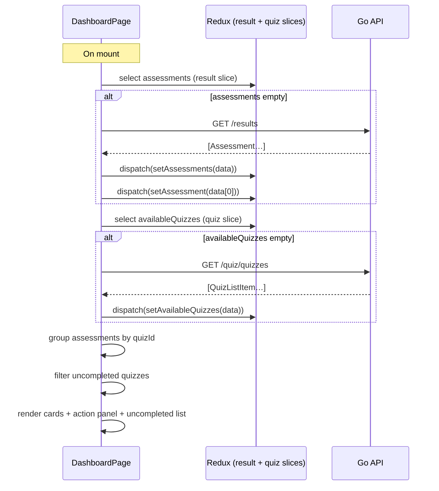

# Dashboard Page — Feature Spec

> Post-login home screen showing all completed quiz cards with mini score rings,
> two quick-action cards (View Results / Retake Shindan), and a list of available
> quizzes not yet completed. Currently built but not wired into the router.

> **Two separate dashboards exist** — this spec covers the `fs-app-web` user
> dashboard (`DashboardPage.tsx`). The `fs-backoffice-web` backoffice dashboard
> is a distinct page (same file name, different app) that is already **live and
> fully routed** at `/dashboard` — it shows platform-wide stats (projects, users,
> avg score, staff count) and a recent-results table. See
> [backoffice/feature-spec.md §4](../backoffice/feature-spec.md) for that page.

---

## 1. Summary

`DashboardPage` is designed to be the authenticated user's landing screen after
sign-in. It aggregates all assessment results by quiz variant and presents them as
an at-a-glance status board. Each completed quiz shows the latest score and
diagnosis. Two persistent action cards offer fast paths to the Result page and
Shindan re-take. Quizzes the user has not completed yet are listed below as
"Start" entries.

**Current status:** The component (`apps/fs-app-web/src/pages/DashboardPage.tsx`,
436 lines) is fully implemented and exported but **is not imported in `router.tsx`
and has no route path**. It cannot be reached through normal navigation. This is
the primary open task for the feature.

---

## 2. Goals & Non-Goals

### Goals

- Show all completed quizzes grouped by quiz variant with the latest score and
  diagnosis at a glance.
- Provide one-tap access to full results (`/results`) and Shindan re-take (`/quiz`).
- List uncompleted quizzes with a direct "Start" path.
- Show a helpful empty state for users who have not taken any quiz yet.
- Bilingual (TH/EN) — all text through `useLocale()`.
- Reuse existing Redux state (`resultSlice`, `quizSlice`) — no new API endpoints.

### Non-Goals

- Side-by-side assessment comparison (that is the Result page).
- Admin-level aggregate view (that is the Admin Dashboard).
- Score trending or historical charts (future work).
- Separate dashboard endpoint in the backend — existing `GET /results` and
  `GET /quiz/quizzes` are sufficient.

---

## 3. Current State

| Component | Location | Status |
|-----------|----------|--------|
| Dashboard page | `apps/fs-app-web/src/pages/DashboardPage.tsx` | ✅ Built — ❌ not routed |
| `MiniScoreRing` | Inline in `DashboardPage.tsx` | ✅ Built |
| Route entry in `router.tsx` | `apps/fs-app-web/src/router.tsx` | ❌ Missing |
| Nav link in `Layout.tsx` | `apps/fs-app-web/src/components/Layout.tsx` | ❌ Missing |
| Empty-state i18n keys | `apps/fs-app-web/src/lib/i18n.tsx` | ⚠️ Hardcoded TH/EN (not via `t()`) |
| `quiz.yourCompany` i18n key | `apps/fs-app-web/src/lib/i18n.tsx` | To verify |

---

## 4. UI Layout

```
┌─────────────────────────────────────────────────────────────┐
│  [gradient header]                                          │
│  ยินดีต้อนรับกลับ / Welcome back,                           │
│  <Company Name>  ← from Redux profile.companyName          │
├─────────────────────────────────────────────────────────────┤
│  คะแนนล่าสุด / LATEST SCORE                                 │
│                                                             │
│  ┌─────────────┐  ┌─────────────┐  ┌─────────────┐         │
│  │ [MiniRing]  │  │ [MiniRing]  │  │ [MiniRing]  │         │
│  │  3.5        │  │  4.1        │  │  …          │         │
│  │ Shindan     │  │ Factory     │  │ …           │         │
│  │ [Established│  │ [Advanced]  │  │             │         │
│  │  badge]     │  │  badge]     │  │             │         │
│  │ 10 มิ.ย. 69 │  │ 09 มิ.ย. 69 │  │             │         │
│  └─────────────┘  └─────────────┘  └─────────────┘         │
│  (clicking any card → /results)                             │
├─────────────────────────────────────────────────────────────┤
│  ACTION CARDS (2-column)                                    │
│                                                             │
│  ┌────────────────────────┐  ┌────────────────────────┐    │
│  │ 📊 ดูผลลัพธ์            │  │ 🔄 ทำแบบประเมินใหม่    │    │
│  │ View Results            │  │ Retake Assessment      │    │
│  │ [desc text]             │  │ [desc text]            │    │
│  │ View results →          │  │ Start over →           │    │
│  └────────────────────────┘  └────────────────────────┘    │
│  (left → /results)  (right → /quiz, quizId='shindan')       │
├─────────────────────────────────────────────────────────────┤
│  แบบประเมินอื่น / OTHER ASSESSMENTS                          │
│                                                             │
│  ┌─────────────────────────────────────────────────────┐    │
│  │ 📋 Cybersecurity Assessment     Start →             │    │
│  └─────────────────────────────────────────────────────┘    │
│  ┌─────────────────────────────────────────────────────┐    │
│  │ 📋 Lean Assessment              Start →             │    │
│  └─────────────────────────────────────────────────────┘    │
│  (clicking → /quiz, quizId=<id>)                            │
└─────────────────────────────────────────────────────────────┘
```

### Empty state (no assessments)

```
┌─────────────────────────────────────────────────────────────┐
│  [gradient header]                                          │
│  ยินดีต้อนรับกลับ / Welcome back,  <Company Name>          │
├─────────────────────────────────────────────────────────────┤
│  ACTION CARDS (2-column) — always visible                   │
├─────────────────────────────────────────────────────────────┤
│                                                             │
│              [ 📋 icon ]                                    │
│         ยังไม่มีผลประเมิน                                    │
│         No assessments yet                                  │
│  เริ่มทำแบบประเมินเพื่อตรวจสุขภาพโรงงานของคุณ               │
│  Start an assessment to check your factory health           │
│                                                             │
└─────────────────────────────────────────────────────────────┘
```

**Known issue:** Empty-state text (lines 423–428 in `DashboardPage.tsx`) uses
`locale === 'th' ? '...' : '...'` inline comparisons instead of `t()`. This
violates the project's i18n rule. Fix: extract to two i18n keys before the
dashboard is shipped (see §10).

---

## 5. Component Breakdown

### `MiniScoreRing`

An inline SVG component (defined within `DashboardPage.tsx`). Accepts `score`
(0–5) and optional `size` (default 64). Renders two concentric circles — a
background track using CSS variable `--border` and a filled arc using `--primary`.
Arc angle is proportional to `score / 5`. Stroke width is 5px. Arc animates via
`transition-all duration-1000 ease-out`.

The numeric score is rendered as an absolutely-positioned `<span>` centred over
the SVG (`absolute inset-0 flex items-center justify-center`).

### Completed quiz cards

Rendered by `Object.entries(quizGroups)` inside a `StaggerChildren` grid
(stagger 0.08 s). Each card is a `<button>` navigating to `/results` on click.
Shows: `MiniScoreRing`, quiz name (locale-aware), diagnosis badge, formatted
submitted date, and an assessment count line when `quizAssessments.length > 1`.

Diagnosis badge colours share the same `diagnosisConfig` lookup used by
`ResultPage`.

### Action cards

Two static `<button>` elements in a 2-column `StaggerChildren` (stagger 0.1 s):
1. **View Results** — navigates to `/results`. Icon: bar-chart SVG, colour: `--primary`.
2. **Retake Assessment** — hardcoded to `quizId='shindan'`. Calls `handleStartQuiz('shindan')`.
   Icon: refresh SVG, colour: `amber-600`.

Action cards are always rendered regardless of whether assessments exist.

### Uncompleted quizzes list

Derived by filtering `availableQuizzes` for IDs not in `completedQuizIds`. Each
row is a full-width `<button>`. Clicking calls `handleStartQuiz(q.id)` which:
1. `dispatch(resetQuiz())`
2. `dispatch(setQuizId(q.id))`
3. `navigate('/quiz')`

Uses `FadeIn` (delay 0.25 s). Hidden when all quizzes are completed.

### Loading skeleton

Shown when `resultLoading && assessments.length === 0`. Three `Skeleton`
components in a 3-column grid, each `h-44 rounded-xl`.

---

## 6. Data Flow



Both fetches are skipped when the respective Redux slice already has data — this
makes the dashboard instant when navigating back from `/results` or `/quiz`.

---

## 7. Redux State Dependencies

| Slice | Fields read | Fields written |
|-------|-------------|----------------|
| `authSlice` | `profile.companyName` | — |
| `resultSlice` | `assessments`, `loading` | `setAssessments`, `setAssessment`, `setLoading` |
| `quizSlice` | `availableQuizzes` | `setAvailableQuizzes`, `resetQuiz`, `setQuizId` |

No new slice actions are needed — all dispatched actions already exist.

---

## 8. i18n Key Map

All text flows through `t()` except the empty-state copy (known issue — see §10).

| Key | TH | EN |
|-----|----|----|
| `quiz.welcomeBack` | ยินดีต้อนรับกลับ | Welcome back |
| `quiz.yourCompany` | (fallback for missing companyName — to verify) | Your Company |
| `quiz.latestScore` | คะแนนล่าสุด | Latest Score |
| `quiz.totalAssessments` | `{count} ครั้ง` | `{count} assessments` |
| `quiz.viewResults` | ดูผลลัพธ์ | View Results |
| `quiz.viewResultsDesc` | ดูผลวิเคราะห์เชิงลึก กราฟเรดาร์ จุดแข็ง และข้อเสนอแนะ | View detailed analysis, radar chart, strengths & recommendations |
| `quiz.viewResultsAction` | ดูผลลัพธ์ | View results |
| `quiz.retake` | ทำแบบประเมินใหม่ | Retake Assessment |
| `quiz.retakeDesc` | ทำแบบประเมินใหม่อีกครั้งเพื่อเปรียบเทียบกับผลลัพธ์ก่อนหน้า | Take the assessment again and compare with your previous results |
| `quiz.retakeAction` | เริ่มทำใหม่ | Start over |
| `quiz.otherAssessments` | แบบประเมินอื่น | Other Assessments |
| `quiz.startNewAssessment` | (TH label in row body — to verify) | (EN label in row body — to verify) |
| `quiz.start` | (TH CTA — to verify) | Start |
| `diagnosis.Beginning` | เริ่มต้น | Beginning |
| `diagnosis.Developing` | กำลังพัฒนา | Developing |
| `diagnosis.Established` | มีระบบ | Established |
| `diagnosis.Advanced` | ก้าวหน้า | Advanced |

---

## 9. Backend API

No new backend endpoints. The dashboard reuses:

| Endpoint | Usage |
|----------|-------|
| `GET /api/v1/results` | Fetch all user assessments (see [result/feature-spec.md](../result/feature-spec.md)) |
| `GET /api/v1/quiz/quizzes` | Fetch available quiz list for uncompleted section (see [quiz/feature-spec.md](../quiz/feature-spec.md)) |

---

## 10. Open Tasks (before shipping)

### 10.1 Wire `DashboardPage` into the router — BLOCKING

`DashboardPage` has **zero references** in the app. It is exported from
`DashboardPage.tsx` but never imported anywhere.

Required changes in `apps/fs-app-web/src/router.tsx`:

```tsx
// 1. Import the page
import { DashboardPage } from '@/pages/DashboardPage';

// 2. Add route inside RegisterGuard
<Route path="/dashboard" element={<DashboardPage />} />
```

Also decide the navigation intent:
- Should `/` (for authenticated + registered users) redirect to `/dashboard`
  instead of `/results`?
- Should `useAuth`'s post-login redirect go to `/dashboard`?
- Should `SignInPage` redirect to `/dashboard` instead of `/results`?

### 10.2 Add dashboard link to Layout nav

The nav bar in `apps/fs-app-web/src/components/Layout.tsx` needs a "Dashboard"
nav item pointing to `/dashboard`.

### 10.3 Fix empty-state i18n

Lines 422–428 in `DashboardPage.tsx` use raw locale comparisons:

```tsx
// ❌ Current — violates project i18n rule
{locale === 'th' ? 'ยังไม่มีผลประเมิน' : 'No assessments yet'}
```

Fix: add `dashboard.noResults` and `dashboard.noResultsDesc` keys to
`apps/fs-app-web/src/lib/i18n.tsx` and replace with `t('dashboard.noResults')`.

### 10.4 Retake action hardcoded to `'shindan'`

The "Retake Assessment" action card calls `handleStartQuiz('shindan')` regardless
of which quizzes the user has completed. If the user has not completed the Shindan
quiz, this creates a re-take flow for a never-taken quiz.

Options:
- Keep hardcoded (`'shindan'` is the primary quiz) and clarify the label to
  "Retake Shindan".
- Derive the target from the first completed quiz ID.

---

## 11. Animation Sequence

| Element | Wrapper | Delay |
|---------|---------|-------|
| Header (company name) | `FadeIn` | 0 s |
| Completed quiz cards | `StaggerChildren` (stagger 0.08 s) | — |
| Action cards | `StaggerChildren` (stagger 0.1 s) | — |
| Uncompleted quizzes | `FadeIn` | 0.25 s |
| Empty state | `ScaleIn` | 0 s |

---

## 12. Accessibility

- All interactive cards are `<button type="button">` elements with visible focus
  rings (Tailwind ring utilities via global styles).
- `MiniScoreRing` SVG is purely decorative — the numeric score label adjacent to
  it provides the text equivalent.
- Diagnosis badge colours match the `diagnosisConfig` palette from `ResultPage`,
  which meets minimum contrast ratios in both light and dark modes.
- Base font size is `text-sm` for secondary labels and `text-base`/`text-lg` for
  card titles (≥ 17 px body — accessible for factory-floor workers).

---

## 13. Acceptance Criteria

- [ ] `DashboardPage` is importable via a route (e.g. `/dashboard`).
- [ ] Navigating to `/dashboard` shows the gradient header with the user's company name.
- [ ] Completed quiz cards appear — one per distinct `quizId` — each with `MiniScoreRing`, quiz name, diagnosis badge, and formatted submission date.
- [ ] Clicking a completed quiz card navigates to `/results`.
- [ ] "View Results" action card navigates to `/results`.
- [ ] "Retake Assessment" action card dispatches `resetQuiz()` + `setQuizId('shindan')` and navigates to `/quiz`.
- [ ] Uncompleted quizzes section lists quizzes not yet taken; each row's "Start" button dispatches `resetQuiz()` + `setQuizId(q.id)` and navigates to `/quiz`.
- [ ] When all quizzes are completed, the uncompleted section is hidden.
- [ ] When no assessments exist, the empty-state card renders instead of the quiz-card grid.
- [ ] Empty-state text renders in the active locale.
- [ ] Loading skeletons appear while `resultLoading` is true and `assessments` is empty.
- [ ] Navigating back to `/dashboard` from `/results` does not re-fetch results (uses Redux cache).
- [ ] `make lint-web` and `make test-web` pass.

---

## 14. Testing

- **Unit (Vitest):** `handleStartQuiz` dispatches `resetQuiz()`, `setQuizId(id)`, and calls `navigate('/quiz')`.
- **Unit (Vitest):** `quizGroups` derivation — assessments with the same `quizId` are grouped under the same key; the first entry is the latest.
- **Unit (Vitest):** `uncompletedQuizzes` derivation — excludes IDs present in `completedQuizIds`.
- **Unit (Vitest):** `MiniScoreRing` renders correct `strokeDashoffset` for a given score (e.g. score=2.5 → 50% arc).
- **E2E (Playwright):**
  - New user (no assessments) → `/dashboard` → assert empty-state card visible.
  - User with assessments → `/dashboard` → assert quiz cards present, assertion count label for repeat quizzes.
  - Click quiz card → assert navigation to `/results`.
  - Click "Start" on uncompleted quiz → assert navigation to `/quiz` with correct `quizId` in Redux state.

---

## 15. References

- Dashboard page: [DashboardPage.tsx](../../../apps/fs-app-web/src/pages/DashboardPage.tsx)
- Router: [router.tsx](../../../apps/fs-app-web/src/router.tsx)
- Layout nav: [Layout.tsx](../../../apps/fs-app-web/src/components/Layout.tsx)
- i18n keys: [i18n.tsx](../../../apps/fs-app-web/src/lib/i18n.tsx)
- Result slice: [resultSlice.ts](../../../apps/fs-app-web/src/store/resultSlice.ts)
- Quiz slice: [quizSlice.ts](../../../apps/fs-app-web/src/store/quizSlice.ts)
- Auth slice: [authSlice.ts](../../../apps/fs-app-web/src/store/authSlice.ts)
- Result feature: [result/feature-spec.md](../result/feature-spec.md)
- Quiz feature: [quiz/feature-spec.md](../quiz/feature-spec.md)
- Auth feature: [auth/feature-spec.md](../auth/feature-spec.md)
