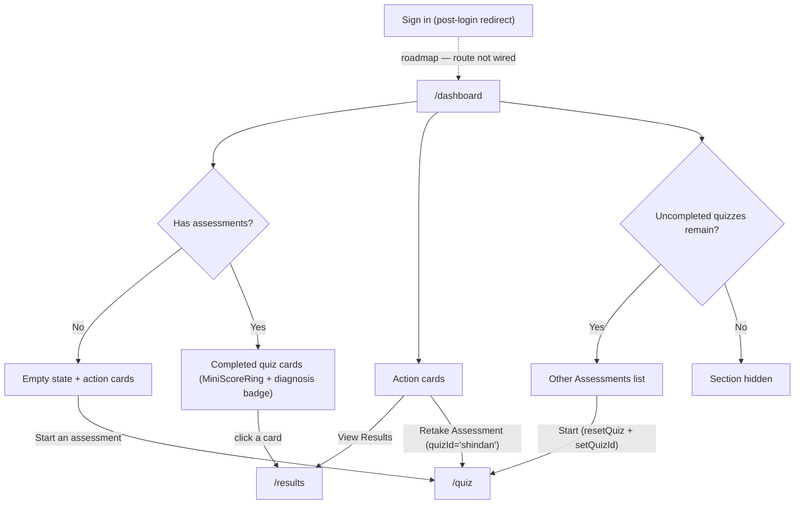

# Dashboard Page — User Journeys

How the authenticated user moves through the dashboard. See [README.md](./README.md) for
the design spec and [feature-spec.md](./feature-spec.md) for the formal requirements.

> Reflects what is **built today** — the component exists but the `/dashboard` route does
> not, so the entry step itself is roadmap (shown dashed). Everything after entry
> describes the built component's behavior once routed.

---

## Table of Contents

- [Factory operator — landing on the dashboard](#factory-operator--landing-on-the-dashboard)

---

## Factory operator — landing on the dashboard

A signed-in, registered operator lands on the dashboard to see all quiz scores at a
glance and jump to results or a new assessment.

**Guard(s):** requires an authenticated Firebase session and a completed profile — the
route is planned inside `RegisterGuard` in `router.tsx`; data comes from the
Bearer-authenticated `GET /results` and `GET /quiz/quizzes`. Detail in
[dashboard-page.md](./dashboard-page.md).

---

*See [README.md](./README.md) for the feature spec.*

---

*Version: 1.0.0*
*Last updated: 3 July 2026*
