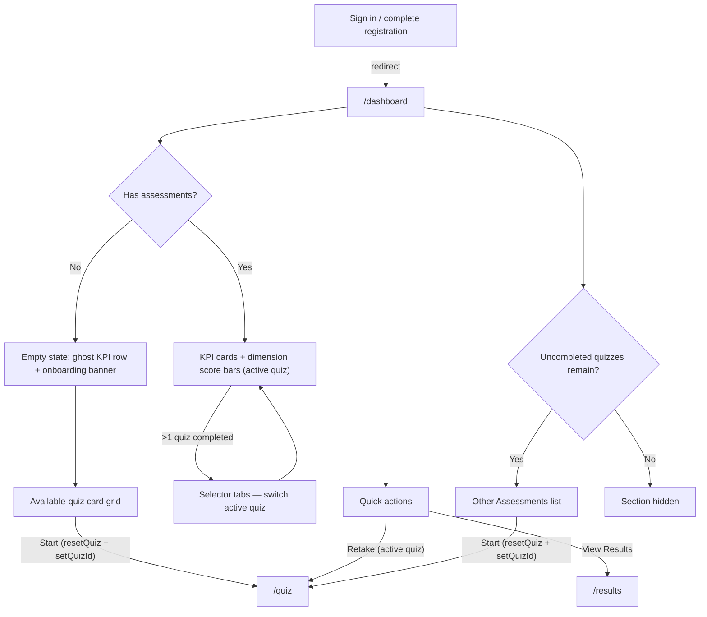

# Dashboard Page — User Journeys

How the authenticated user moves through the dashboard. See [README.md](./README.md) for
the design spec and [feature-spec.md](./feature-spec.md) for the formal requirements.

> Reflects what is **live today** — `/dashboard` is routed, in the nav, and the
> post-login landing page.

---

## Table of Contents

- [Factory operator — landing on the dashboard](#factory-operator--landing-on-the-dashboard)

---

## Factory operator — landing on the dashboard

A signed-in, registered operator lands on the dashboard to see the latest score at a
glance and jump to results, a re-take, or a new assessment.

**Guard(s):** requires an authenticated Firebase session and a completed profile — the
route lives in the `_authed/_registered` file-route group; data comes from the
Bearer-authenticated `GET /results` and `GET /quiz/quizzes` via TanStack Query, so
back-navigation from `/results` or `/quiz` renders instantly from cache. Detail in
[dashboard-page.md](./dashboard-page.md).

---

*See [README.md](./README.md) for the feature spec.*

---

*Version: 2.0.0*
*Last updated: 4 July 2026*
