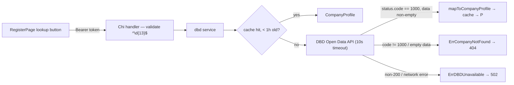

# DBD Integration — Feature Spec

**Status:** ✅ Shipped — backend proxy live with 1-hour in-process cache; consumed by the registration company lookup.

---

## Table of Contents

1. [App surfaces](#app-surfaces)
2. [Summary](#summary)
3. [Goals & Non-Goals](#goals--non-goals)
4. [Current State](#current-state)
5. [Design Overview](#design-overview)
6. [Security Invariants](#security-invariants)
7. [Acceptance Criteria](#acceptance-criteria)
8. [Testing](#testing)
9. [Open Items & Future Work](#open-items--future-work)
10. [References](#references)

---

> Backend proxy to Thailand's Department of Business Development (DBD) Open Data API.
> Resolves a 13-digit Thai company registration ID to a structured `CompanyProfile`,
> flattening the deeply nested, namespace-prefixed DBD response into a simple JSON shape.
> Results are cached in-process for 1 hour. Read-only — it never writes to DBD. Used
> exclusively by the registration flow's company lookup step, which auto-fills the
> company name.

This README is the design index for the DBD Integration feature. The formal requirements
live in the ISO 29110 SRS — see [feature-spec.md](./feature-spec.md). Each non-trivial
component is documented in a dedicated sub-document; see [References](#references).

---

## App surfaces

| web-app | backend |
|:-------:|:-------:|
| ⬩ | ✅ |

The feature has no UI of its own — the lookup button lives in the registration form
owned by the [register](../register/feature-spec.md) feature; this feature owns only the
backend proxy (`services/dbd/`). Where the data surfaces is covered in
[user-journeys.md](./user-journeys.md).

---

## Summary

| Component | Description |
|-----------|-------------|
| **DBD proxy** (backend) | `GET /api/v1/dbd/{regId}` — validates, fetches from DBD Open Data, maps to `CompanyProfile` — see [dbd-lookup.md](./dbd-lookup.md) |
| **In-memory cache** (backend) | `map[string]cacheEntry` + `sync.RWMutex`, 1-hour TTL, per process instance — see [dbd-lookup.md](./dbd-lookup.md) |
| **Registration call site** (web-app) | "ค้นหา / Lookup" button in `RegisterPage.tsx` pre-fills `companyName` with the returned `nameTh` |

---

## Goals & Non-Goals

### Goals

- Proxy `GET https://openapi.dbd.go.th/api/v1/juristic_person/{regId}` and simplify the response.
- Validate the `regId` path parameter as exactly 13 digits before making any upstream call.
- Cache results in memory for 1 hour with a read-write mutex (thread-safe).
- Map DBD error states (`status.code != "1000"` or empty `data`) to 404.
- Map upstream connectivity failures to 502 (`ErrDBDUnavailable`).
- Authenticate the caller via Firebase ID token (the endpoint is not public).

### Non-Goals

- Writing or updating DBD records.
- Persistent caching (Firestore/Redis) — in-process only, lost on restart.
- Batch lookups.
- Caching negative results (404s are not cached; repeated missing IDs always hit DBD).

---

## Current State

See [status.md](./status.md) for the per-component implementation checklist. Everything in
scope is shipped, including the handler and service test suites.

---

## Design Overview

No Firestore collections — the only state is the in-process cache (1-hour TTL, unbounded
size, no negative caching, lost on restart). Upstream response structure, address-mapping
fallbacks, and the timeout/error policy are detailed in
[feature-spec.md §§ 5–9](./feature-spec.md#5-dbd-upstream-api) and
[dbd-lookup.md](./dbd-lookup.md).

### API contract

| Method | Path | Auth / Role | Purpose |
|--------|------|-------------|---------|
| `GET` | `/api/v1/dbd/{regId}` | Bearer | Resolve a 13-digit registration ID to a `CompanyProfile` |

**200 response** (envelope `{"success": true, "data": {...}}`), fields all camelCase:
`juristicId`, `nameTh`, `nameEn`, `type`, `registerDate`, `status`, `objectiveCode`,
`objectiveTextTh`, `objectiveTextEn`, `registerCapital`, `branchName`, `address`,
`subDistrict`, `district`, `province`.

**Errors** (envelope `{"success": false, "error": {"code", "message"}}`):

| HTTP | Code | Condition |
|------|------|-----------|
| 400 | `VALIDATION_ERROR` | `regId` is not exactly 13 digits |
| 401 | `UNAUTHORIZED` | Missing/invalid Firebase token |
| 404 | `NOT_FOUND` | DBD returned `status.code != "1000"` or empty `data` array |
| 502 | `UPSTREAM_ERROR` | DBD API unreachable or returned non-200 |
| 500 | `INTERNAL_ERROR` | Unexpected error (e.g. JSON decode failure) |

---

## Security Invariants

| Invariant | Where enforced |
|-----------|----------------|
| Endpoint requires a verified Firebase ID token — anonymous callers get 401 | `middleware/` (`FirebaseAuth`) |
| `regId` validated against `^\d{13}$` before any upstream call | `services/dbd/handler.go` |
| Client never calls DBD directly — all traffic goes through the proxy | `apps/web-app/src/pages/RegisterPage.tsx` |
| Integration is read-only — never writes to the DBD system | `services/dbd/service.go` |
| Sentinel errors (`ErrCompanyNotFound`, `ErrDBDUnavailable`) mapped via `errors.Is`, wrapped with context | `services/dbd/` |

---

## Acceptance Criteria

Verbatim from [feature-spec.md § 10](./feature-spec.md#10-acceptance-criteria) — all met
(feature status: Done):

- [x] `GET /api/v1/dbd/0105550000001` returns a `CompanyProfile` with Thai name, type, address, and province.
- [x] `GET /api/v1/dbd/ABC123` (non-numeric or wrong length) returns 400.
- [x] A 12-digit ID or 14-digit ID returns 400.
- [x] An ID that does not exist in DBD returns 404.
- [x] A second call for the same valid `regId` within 1 hour does not make a second upstream HTTP request (served from cache).
- [x] When the DBD API is unavailable (network error), the endpoint returns 502.
- [x] An unauthenticated call returns 401.
- [x] `make test-api` passes (including `service_test.go` with injected `HTTPClient`).

---

## Testing

| Package | Target | Notes |
|---------|--------|-------|
| `services/dbd/service_test.go` | `Lookup` with injected `HTTPClient` mock | Valid ID → correct fields · `code != "1000"` / empty `data` → `ErrCompanyNotFound` · HTTP 500 / network error → `ErrDBDUnavailable` · cache hit → mock `Do` called once |
| `services/dbd/handler_test.go` | Handler error mapping | Non-13-digit param → 400 · `ErrCompanyNotFound` → 404 · `ErrDBDUnavailable` → 502 |

Coverage target: critical `services/` ≥ 80% (`go test ./... -cover`).

---

## Open Items & Future Work

No open tasks — the feature is shipped. Known limitations, all deliberate non-goals:

| # | Area | Description |
|---|------|-------------|
| 1 | Cache persistence | In-process only — cache is lost on restart; no Firestore/Redis backing |
| 2 | Cache size | Unbounded — grows with unique lookup count; time-based expiry only, stale entries overwritten on next miss |
| 3 | Negative caching | 404s are not cached — repeated lookups of a missing ID always hit DBD |

### Open decisions

None — changes go through a new CR.

---

## References

### Sub-documents

| Doc | Covers |
|-----|--------|
| [feature-spec.md](./feature-spec.md) | ISO 29110 SRS — formal requirements, upstream API shape, address mapping, error policy |
| [status.md](./status.md) | Current implementation status per component |
| [user-journeys.md](./user-journeys.md) | Where the DBD data surfaces — the registration lookup flow |
| [dbd-lookup.md](./dbd-lookup.md) | DBD service: handler contract, cache, upstream mapping |

### Cross-references

- [Register](../register/feature-spec.md) — owns the registration form and lookup UI that consumes this endpoint

### External standards

- DBD Open Data portal: https://www.dbd.go.th/

---

*Version: 1.0.0*
*Last updated: 3 July 2026*
