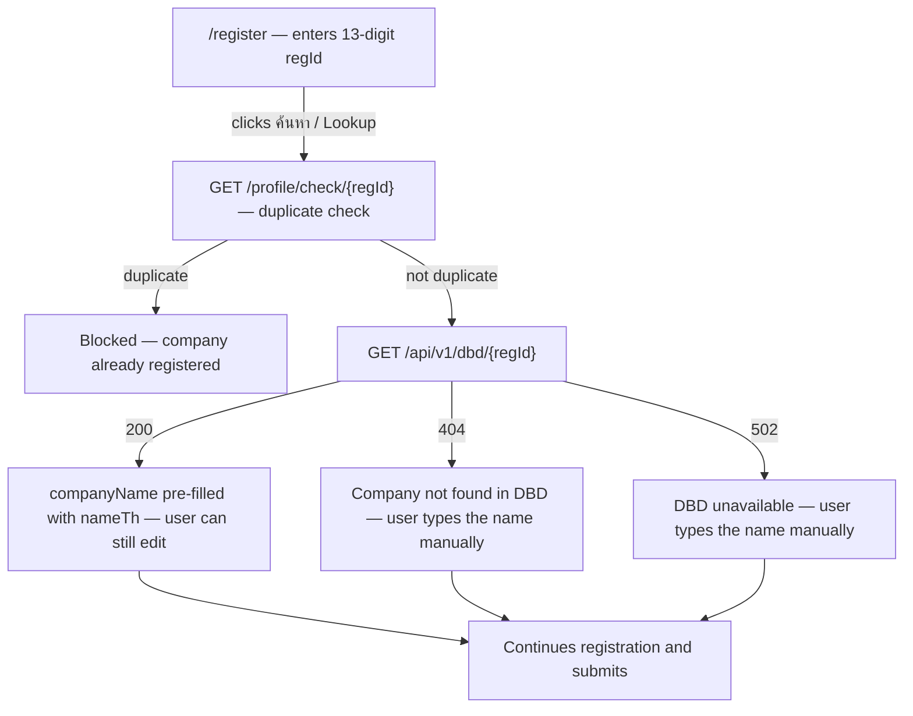

# DBD Integration — User Journeys

Where the DBD data surfaces for users. See [README.md](./README.md) for the design spec
and [feature-spec.md](./feature-spec.md) for the formal requirements.

> Reflects what is **built today** — the whole flow is shipped. The DBD integration has no
> UI of its own; its single surface is the company-lookup step inside the registration
> form (owned by the [register](../register/feature-spec.md) feature).

---

## Table of Contents

- [Factory operator — company lookup at registration](#factory-operator--company-lookup-at-registration)

---

## Factory operator — company lookup at registration

A new operator registering on `web-app` enters their 13-digit Thai company registration
ID and taps "ค้นหา / Lookup" to auto-fill the company name instead of typing it.

**Guard(s):** the lookup requires a Firebase session — the endpoint sits behind
`FirebaseAuth` middleware (anonymous callers get 401), and the handler validates
`regId` as `^\d{13}$` before any upstream call. Detail in
[dbd-lookup.md](./dbd-lookup.md).

---

*See [README.md](./README.md) for the feature spec.*

---

*Version: 1.0.0*
*Last updated: 3 July 2026*
