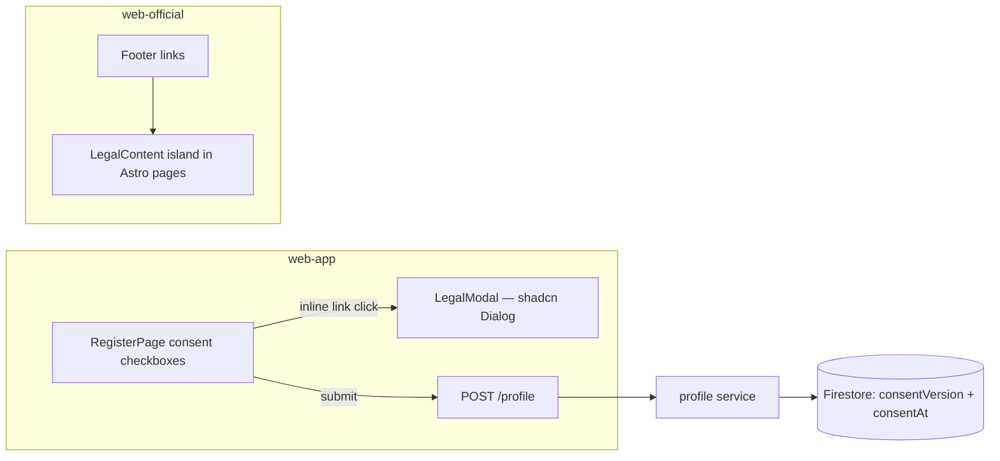

# Legal Documents — Feature Spec

**Status:** ✅ Shipped — all four policies live in both surfaces; consent captured at registration.

---

## Table of Contents

1. [App surfaces](#app-surfaces)
2. [Summary](#summary)
3. [Goals & Non-Goals](#goals--non-goals)
4. [Current State](#current-state)
5. [Design Overview](#design-overview)
6. [Security Invariants](#security-invariants)
7. [Acceptance Criteria](#acceptance-criteria)
8. [Testing](#testing)
9. [Open Items & Future Work](#open-items--future-work)
10. [References](#references)

---

> Four PDPA-aligned policies (Terms, Privacy, Cookie, Marketing) delivered in two surfaces:
> an in-app modal during registration on `web-app` and standalone full-page documents on the
> official marketing site. All content is bilingual (TH/EN). Consent to Terms + Privacy gates
> registration; marketing consent is separate and opt-in only (PDPA §19). The backend stores
> `consentVersion` + `consentAt` with each Firestore profile.

This README is the design index for the Legal Documents feature. The formal requirements
live in the ISO 29110 SRS — see [feature-spec.md](./feature-spec.md). Each non-trivial
component is documented in a dedicated sub-document; see [References](#references).

---

## App surfaces

| web-app | web-official | backend |
|:-------:|:------------:|:-------:|
| ✅ | ✅ | ⬩ |

`web-app` renders the consent checkboxes + `LegalModal` at registration; `web-official`
serves the five standalone policy routes; the backend only persists `consentVersion` /
`consentAt` on profile creation (no legal-specific endpoint). Per-app flows live in
[user-journeys.md](./user-journeys.md).

---

## Summary

| Component | Description |
|-----------|-------------|
| **`LegalModal`** (web-app) | shadcn/ui `Dialog` opened from inline links in the registration consent checkboxes; renders any of the four policies in the active locale — see [legal-modal.md](./legal-modal.md) |
| **`LegalContent`** (web-official) | Single React island rendering all five legal pages inside Astro layouts (`/terms` `/privacy` `/cookies` `/marketing` `/cookie-settings`) — see [legal-content.md](./legal-content.md) |
| **Consent capture** (web-app + backend) | `acceptTerms` blocks form submit (Zod `z.literal(true)`); `consentVersion` + `consentAt` stored in the Firestore profile |

---

## Goals & Non-Goals

### Goals

- Expose all four policy documents in TH and EN.
- Gate registration on acceptance of Terms + Privacy.
- Capture marketing consent separately and optionally.
- Align with Thailand PDPA (พ.ร.บ. คุ้มครองข้อมูลส่วนบุคคล พ.ศ. 2562).
- Keep content in one authoritative place per surface — no duplication between the modal and the pages.
- Provide a standalone cookie-settings page for users to manage preferences without re-visiting the banner.

### Non-Goals

- Server-side consent audit trail (current version stores only `consentVersion` + `consentAt`).
- Automatic re-consent prompt on version bump (future work — see [Open Items](#open-items--future-work)).
- Legal review / professional sign-off process (ops concern, not this spec).

---

## Current State

See [status.md](./status.md) for the per-component implementation checklist. Everything in
scope is shipped; remaining items are future work only.

---

## Design Overview

Both surfaces render the same bundled policy text (no network call); locale comes from
`useLocale()` / `LocaleProvider`. Full document structure (sections per policy, data
categories, PDPA rights, cookie categories) is specified in
[feature-spec.md § 4](./feature-spec.md#4-four-policy-documents).

### Data model

| Collection | Document ID | Key fields | Notes |
|------------|-------------|------------|-------|
| `profiles` | `<userID>` | `consentVersion: string` · `consentAt: string (ISO 8601)` | Set once at profile creation; no index needed |

Cookie consent state lives in `localStorage` (`fss-cookie-consent`, `fss-analytics-consent`,
`fss-marketing-consent`) — owned by the [cookie-consent](../cookie-consent/feature-spec.md)
feature.

### API contract

No legal-specific endpoint. Consent fields ride on the existing profile creation:

| Method | Path | Auth / Role | Purpose |
|--------|------|-------------|---------|
| `POST` | `/api/v1/profile` | Bearer | Creates profile; persists `consentVersion`, sets `consentAt` server-side |

---

## Security Invariants

| Invariant | Where enforced |
|-----------|----------------|
| UID taken from `middleware.GetUID(r)`, never the request body/path | `services/profile/handler.go` |
| `consentAt` timestamp is set by the backend service, not accepted from the client | `services/profile/service.go` |
| `acceptTerms` must be `true` before the form can submit | `RegisterPage.tsx` (Zod `z.literal(true)`) |
| Marketing consent is opt-in only — unchecked by default, never required (PDPA §19) | `RegisterPage.tsx` |

---

## Acceptance Criteria

Verbatim from [feature-spec.md § 11](./feature-spec.md#11-acceptance-criteria):

**Consent gating (web-app)** — see [legal-modal.md](./legal-modal.md)
- [x] The registration form cannot be submitted without checking the Terms + Privacy checkbox.
- [x] Marketing consent is optional — a user can register without checking it and still complete registration.
- [x] `consentVersion` and `consentAt` are stored in the Firestore profile on successful registration.

**In-app modal (web-app)** — see [legal-modal.md](./legal-modal.md)
- [x] Clicking "Terms and Conditions" or "Privacy Policy" in the consent label opens the correct modal.
- [x] Clicking "Marketing Policy" in the marketing consent label opens the correct modal.
- [x] Closing the modal (Escape / backdrop / ✕) returns focus to the registration form without losing any input.
- [x] The modal title and content match the active locale (TH / EN).

**Standalone pages (web-official)** — see [legal-content.md](./legal-content.md)
- [x] `/terms`, `/privacy`, `/cookies`, `/marketing` routes each render the correct policy.
- [x] `/cookie-settings` renders the cookie preference manager.
- [x] All routes render in both TH and EN via the locale switcher.

---

## Testing

Static bilingual content — no backend service of its own, so no Go suite. Verification is
lint + the acceptance criteria above exercised manually per release.

| Check | Target | Notes |
|-------|--------|-------|
| `make lint-web` | both apps | Passes |
| Registration consent gating | `RegisterPage.tsx` Zod schema | Covered by register feature tests — see [register/feature-spec.md](../register/feature-spec.md) |

---

## Open Items & Future Work

From [feature-spec.md § 10](./feature-spec.md#10-future-work):

| # | Area | Description |
|---|------|-------------|
| 1 | Re-consent | Prompt re-acceptance when `consentVersion` increments (version already stored per profile) |
| 2 | Audit trail | Persist timestamped consent grant/withdrawal records in Firestore for PDPA audit |
| 3 | Profile sync | Write registration-time `marketingConsent` to the Firestore profile for campaign targeting |
| 4 | Unsubscribe | One-click token-based unsubscribe URL in marketing emails (no sign-in required) |
| 5 | web-app footer | Expose `/cookies` and `/marketing` standalone pages on `web-app` (currently official-site only) |

### Open decisions

None — feature is shipped; changes go through a new CR.

---

## References

### Sub-documents

| Doc | Covers |
|-----|--------|
| [feature-spec.md](./feature-spec.md) | ISO 29110 SRS — formal requirements, full policy document structure |
| [status.md](./status.md) | Current implementation status per component |
| [user-journeys.md](./user-journeys.md) | Per-app user flows (operator registration · public visitor) |
| [legal-modal.md](./legal-modal.md) | `LegalModal` component (web-app) |
| [legal-content.md](./legal-content.md) | `LegalContent` island + Astro routes (web-official) |
| [mockups/app.md](./mockups/app.md) | ASCII wireframes — registration consent + modal (web-app) |
| [mockups/official.md](./mockups/official.md) | ASCII wireframes — standalone policy pages (web-official) |

### ISO 29110 artifacts

- Feature logged before the ISO process introduced per-feature test plans; consent gating is covered by the register feature's tests.
- Scope changes → [docs/iso29110/change-request-log.md](../../iso29110/change-request-log.md)
- New risks → [docs/iso29110/risk-register.md](../../iso29110/risk-register.md)

### Cross-references

- [Cookie consent](../cookie-consent/feature-spec.md) — owns the banner, settings modal, and `fss-*` localStorage keys
- [Register](../register/feature-spec.md) — owns the registration form the consent checkboxes live in
- [Architecture overview](../../architecture/overview.md)

### External standards

- Thailand PDPA — พ.ร.บ. คุ้มครองข้อมูลส่วนบุคคล พ.ศ. 2562 (B.E. 2562 / 2019)

---

*Version: 1.0.0*
*Last updated: 3 July 2026*
