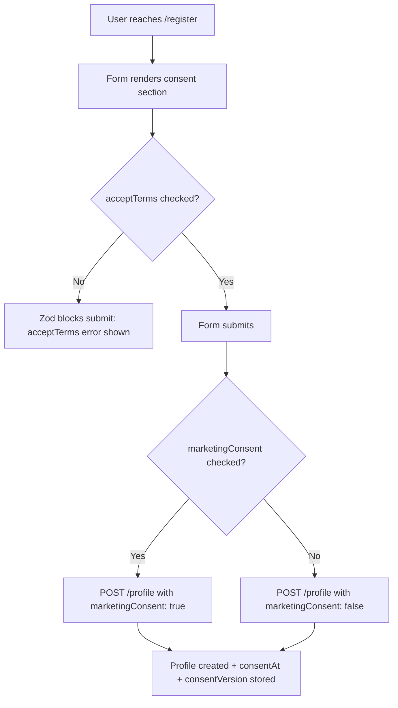

# Legal Documents — Feature Spec

> Four PDPA-aligned policies (Terms, Privacy, Cookie, Marketing) delivered in
> two surfaces: an in-app modal during registration and standalone full-page
> documents on the official marketing site. All content is bilingual (TH/EN).

---

## 1. Summary

Legal content exists in two surfaces:

| Surface | Location | When shown |
|---------|----------|------------|
| **In-app modal** (`LegalModal`) | `web-app` | During registration — inline links in the consent checkboxes |
| **Standalone pages** (`LegalContent`) | `web-official` | Public-facing URLs; linked from footer |

Both surfaces render the same policy text. The in-app modal uses a shadcn/ui
`Dialog`; the official-web pages use a full-page `LegalContent` React island
inside an Astro layout.

Consent is captured at registration:
- **Terms + Privacy** — required checkbox; blocks form submission.
- **Marketing** — optional checkbox; opt-in only (PDPA §19).

The `consentVersion` string is stored with every Firestore profile document so
a future policy bump can detect users on older versions.

---

## 2. Goals & Non-Goals

### Goals

- Expose all four policy documents in TH and EN.
- Gate registration on acceptance of Terms + Privacy.
- Capture marketing consent separately and optionally.
- Align with Thailand PDPA (พ.ร.บ. คุ้มครองข้อมูลส่วนบุคคล พ.ศ. 2562).
- Keep content in one authoritative place per surface — no duplication between the modal and the pages.
- Provide a standalone cookie-settings page for users to manage preferences without re-visiting the banner.

### Non-Goals

- Server-side consent audit trail (current version stores only `consentVersion` + `consentAt` in Firestore).
- Automatic re-consent prompt on version bump (future work — see §10).
- Legal review / professional sign-off process (ops concern, not this spec).

---

## 3. Current State

| Component | Location | Status |
|-----------|----------|--------|
| In-app `LegalModal` | `apps/web-app/src/components/LegalModal.tsx` | ✅ Built |
| Official-web `LegalContent` | `apps/web-official/src/components/legal/LegalContent.tsx` | ✅ Built |
| `/terms` page | `apps/web-official/src/pages/terms.astro` | ✅ Built |
| `/privacy` page | `apps/web-official/src/pages/privacy.astro` | ✅ Built |
| `/cookies` page | `apps/web-official/src/pages/cookies.astro` | ✅ Built |
| `/marketing` page | `apps/web-official/src/pages/marketing.astro` | ✅ Built |
| `/cookie-settings` page | `apps/web-official/src/pages/cookie-settings.astro` | ✅ Built |
| Consent checkboxes in registration | `apps/web-app/src/pages/RegisterPage.tsx` | ✅ Built |
| `consentVersion` stored in Firestore | `apps/backend/services/profile/service.go` | ✅ Built |
| Contact email | `info@factorysyncsolutions.com` | ✅ Active |

---

## 4. Four Policy Documents

### 4.1 Terms and Conditions (`terms`)

> TH: ข้อกำหนดและเงื่อนไขการใช้งาน · Last updated: 7 มีนาคม 2568 / March 7, 2025

| Section | Topic |
|---------|-------|
| 1 | Acceptance of Terms |
| 2 | Description of Service (8-dimension factory assessment) |
| 3 | User Accounts (Google Sign-In required; accurate data required) |
| 4 | Acceptable Use (factory assessment only; no false data; no unauthorized access) |
| 5 | Intellectual Property (content, questions, criteria are provider property) |
| 6 | Assessment Results (reference only; no professional advice; user's own responsibility) |
| 7 | Limitation of Liability ("as is"; no warranty) |
| 8 | Suspension or Termination |
| 9 | Changes to Terms |
| 10 | Governing Law (Kingdom of Thailand) |
| 11 | Contact: info@factorysyncsolutions.com |

**Consent requirement:** Accepting Terms is a blocking condition at
registration — the form cannot be submitted without the `acceptTerms`
checkbox set to `true` (Zod `z.literal(true)`).

---

### 4.2 Privacy Policy (`privacy`)

> TH: นโยบายความเป็นส่วนตัว · Aligned with PDPA พ.ศ. 2562

| Section | Topic |
|---------|-------|
| 1 | Information We Collect (see §4.2.1 below) |
| 2 | How We Use Your Data |
| 3 | Legal Basis |
| 4 | Data Sharing (third-party vendors — see §4.2.2) |
| 5 | Cookies and Tracking Technologies |
| 6 | Data Retention |
| 7 | Your Rights under PDPA (see §4.2.3) |
| 8 | Data Security (HTTPS, GCP, access controls) |
| 9 | Changes to Policy |
| 10 | Contact: info@factorysyncsolutions.com |

#### 4.2.1 Data collected

| Category | Fields |
|----------|--------|
| Account | Name, email, profile picture (from Google OAuth) |
| Company | Company name, registration ID, industry type, company size |
| Contact | Contact name, email, phone number |
| Assessment | Quiz answers, scores, analysis results |
| Usage | Pages visited, actions taken (via Google Analytics) |
| Technical | IP address, browser type, OS (via cookies) |

#### 4.2.2 Third-party data sharing

| Vendor | Purpose |
|--------|---------|
| Google — Firebase Authentication | User authentication |
| Google — Analytics & Tag Manager | Usage analytics |
| Google Cloud Platform | Data storage and processing (Firestore) |
| Cloudflare | Security, CDN, bot protection (Turnstile) |

We never sell personal data to third parties.

#### 4.2.3 PDPA user rights

Users may exercise the following rights by emailing info@factorysyncsolutions.com:

- Access personal data
- Rectify inaccurate data
- Request deletion
- Object to processing
- Request data portability
- Withdraw consent

#### 4.2.4 Legal basis mapping

| Processing activity | Legal basis |
|--------------------|-------------|
| Registration and assessment | Consent |
| Delivering assessment results | Contract |
| Service analytics and improvement | Legitimate interest |
| Marketing communications | Consent (separate, optional) |

---

### 4.3 Cookie Policy (`cookies`)

> TH: นโยบายคุกกี้

| Section | Topic |
|---------|-------|
| 1 | What Are Cookies |
| 2 | Types of Cookies We Use (see §4.3.1) |
| 3 | Managing Cookie Preferences |
| 4 | Retention Period |
| 5 | Changes to This Policy |
| 6 | Contact |

#### 4.3.1 Cookie categories

| Category | Can be disabled | Cookies / tools |
|----------|----------------|-----------------|
| **Essential** | No | Firebase Auth session · `fss-locale` (language) · `fss-cookie-consent` (consent state) |
| **Security** | No | Cloudflare Turnstile (registration bot check) · Cloudflare CDN |
| **Analytics** | Yes (opt-out) | Google Analytics 4 (`_ga`, `_ga_*`) · Google Tag Manager |
| **Marketing** | Yes (opt-in required) | GA4 ad signals · future marketing tags |

Cookie retention:
- Session cookies: deleted on browser close.
- Persistent cookies: up to 2 years (`_ga` / `_ga_*`).

Management entry points:
1. **First-visit banner** — shown on the official-web landing page.
2. **Footer "Cookie Settings"** — reopens the settings modal at any time.
3. **`/cookie-settings` page** — standalone management page for direct linking.
4. **Browser settings** — deletes cookies but may break site functionality.

---

### 4.4 Marketing Policy (`marketing`)

> TH: นโยบายทางการตลาด · Legal basis: Consent only

| Section | Topic |
|---------|-------|
| 1 | Data Used for Marketing |
| 2 | Marketing Purposes |
| 3 | Legal Basis (consent only; withholding does not affect core service) |
| 4 | Communication Channels |
| 5 | Granting and Withdrawing Consent |
| 6 | Data Sharing for Marketing |
| 7 | Retention Period |
| 8 | Your Rights |
| 9 | Changes to Policy |
| 10 | Contact |

#### 4.4.1 Data used for marketing

- Contact data: name, email, phone.
- Company data: company name, industry type, size.
- Usage data: assessment results, scores, website behaviour.

#### 4.4.2 Marketing channels

- **Email:** newsletters, service updates, special offers.
- **In-app notifications:** new features or service improvements.

#### 4.4.3 Consent mechanics

Marketing consent is separate from Terms/Privacy consent:

| Action | Where |
|--------|-------|
| **Grant** | `marketingConsent` checkbox in registration form (optional, unchecked by default) |
| **Grant** | Enable "Marketing Cookies" in cookie-settings modal |
| **Withdraw** | Disable "Marketing Cookies" via footer "Cookie Settings" |
| **Withdraw** | Click "Unsubscribe" link in marketing emails |
| **Withdraw** | Email info@factorysyncsolutions.com |

Withdrawal is prospective — it does not retroactively affect data processed
while consent was active.

---

## 5. In-App Modal (`LegalModal`)

File: `apps/web-app/src/components/LegalModal.tsx`

```
LegalType = 'terms' | 'privacy' | 'cookies' | 'marketing' | null
```

Rendered inside a shadcn/ui `Dialog` (max-w-2xl, max-h-[80vh], scrollable).
The correct TH or EN content component is selected by checking `locale` from
`useLocale()`. No network call is made — content is bundled inline.

### Open triggers in `RegisterPage`

| Trigger | Opens |
|---------|-------|
| Click "ข้อกำหนดและเงื่อนไข" / "Terms and Conditions" link | `'terms'` |
| Click "นโยบายความเป็นส่วนตัว" / "Privacy Policy" link | `'privacy'` |
| Click "นโยบายทางการตลาด" / "Marketing Policy" link in marketing consent label | `'marketing'` |

Closing (Escape, backdrop click, ✕ button) calls `onClose()` which sets
`legalModal` state back to `null`.

### Modal title map

| Type | TH | EN |
|------|----|----|
| `terms` | ข้อกำหนดและเงื่อนไขการใช้งาน | Terms and Conditions |
| `privacy` | นโยบายความเป็นส่วนตัว | Privacy Policy |
| `cookies` | นโยบายคุกกี้ | Cookie Policy |
| `marketing` | นโยบายทางการตลาด | Marketing Policy |

---

## 6. Official-Web Standalone Pages

File: `apps/web-official/src/components/legal/LegalContent.tsx`

A single `LegalContent` React island renders all five legal pages. The Astro
page passes a `page` prop to select which document to render.

### Route map

| URL | `page` prop | Document |
|-----|-------------|----------|
| `/terms` | `"terms"` | Terms and Conditions |
| `/privacy` | `"privacy"` | Privacy Policy |
| `/cookies` | `"cookies"` | Cookie Policy |
| `/marketing` | `"marketing"` | Marketing Policy |
| `/cookie-settings` | `"cookie-settings"` | Cookie preference manager |

Each Astro page passes two environment variables as props:

| Prop | Env var | Default |
|------|---------|---------|
| `appUrl` | `PUBLIC_APP_URL` | `"#"` |
| `version` | `PUBLIC_APP_VERSION` | `"dev"` |

---

## 7. Consent Storage

### At registration (Firestore profile)

| Field | Type | Value |
|-------|------|-------|
| `consentVersion` | string | e.g. `"1.0"` (passed from form) |
| `consentAt` | string (ISO 8601) | Set by backend service at creation time |

`acceptTerms` (the checkbox value) is **not** persisted — its presence in the
request body is proof the user checked the box; the act of creating a profile
is the consent record. `marketingConsent` from the registration form is
**not** currently persisted in the profile (handled separately via the cookie
consent system).

### Cookie consent (localStorage)

Managed by the cookie-consent feature. See
[cookie-consent/feature-spec.md](../cookie-consent/feature-spec.md).

| Key | Values |
|-----|--------|
| `fss-cookie-consent` | `"all"` · `"partial"` · `"essential"` |
| `fss-analytics-consent` | `"true"` / `"false"` |
| `fss-marketing-consent` | `"true"` / `"false"` |

---

## 8. Consent Flow at Registration



The user can open the Terms, Privacy, or Marketing modal at any point before
submitting without losing form state (modal is rendered outside the form).

---

## 9. Bilingual Content

All legal content exists in both Thai (TH) and English (EN). The active locale
is read from `useLocale()` in the app and from the `LocaleProvider` in the
official-web React island. Switching locale re-renders the content component
immediately — no page reload required.

Last updated date is rendered as a hardcoded string per locale:
- TH: `แก้ไขล่าสุด: 7 มีนาคม 2568`
- EN: `Last updated: March 7, 2025`

When a policy is updated, this string must be changed in **both** surfaces
(`LegalModal.tsx` and `LegalContent.tsx`).

---

## 10. Future Work

- **Re-consent prompt on version bump** — store a `consentVersion` alongside
  the `fss-*` localStorage keys and re-open the banner or require the user to
  re-accept if the version increments (see `consentVersion` field already in
  the Firestore profile).
- **Server-side consent audit trail** — persist a timestamped record of every
  consent grant/withdrawal in Firestore for PDPA audit purposes.
- **`marketingConsent` sync to profile** — write the registration-time
  marketing consent boolean to the Firestore profile so it is queryable for
  email campaign targeting.
- **Unsubscribe endpoint** — a one-click token-based unsubscribe URL in
  marketing emails that calls the API to revoke marketing consent without
  requiring sign-in.
- **`/cookies` and `/marketing` footer links** on `web-app` — currently
  only the official site exposes standalone legal pages.

---

## 11. Acceptance Criteria

- [ ] The registration form cannot be submitted without checking the Terms + Privacy checkbox.
- [ ] Clicking "Terms and Conditions" or "Privacy Policy" in the consent label opens the correct modal.
- [ ] Clicking "Marketing Policy" in the marketing consent label opens the correct modal.
- [ ] Closing the modal (Escape / backdrop / ✕) returns focus to the registration form without losing any input.
- [ ] The modal title and content match the active locale (TH / EN).
- [ ] `/terms`, `/privacy`, `/cookies`, `/marketing` routes on `web-official` each render the correct policy.
- [ ] `/cookie-settings` renders the cookie preference manager.
- [ ] All routes render in both TH and EN via the locale switcher.
- [ ] `consentVersion` and `consentAt` are stored in the Firestore profile on successful registration.
- [ ] Marketing consent is optional — a user can register without checking it and still complete registration.
- [ ] `make lint-web` passes for both apps.

---

## 12. References

- In-app modal: [LegalModal.tsx](../../../apps/web-app/src/components/LegalModal.tsx)
- Official-web content: [LegalContent.tsx](../../../apps/web-official/src/components/legal/LegalContent.tsx)
- Terms page: [terms.astro](../../../apps/web-official/src/pages/terms.astro)
- Privacy page: [privacy.astro](../../../apps/web-official/src/pages/privacy.astro)
- Cookies page: [cookies.astro](../../../apps/web-official/src/pages/cookies.astro)
- Marketing page: [marketing.astro](../../../apps/web-official/src/pages/marketing.astro)
- Cookie settings: [cookie-settings.astro](../../../apps/web-official/src/pages/cookie-settings.astro)
- Registration (consent checkboxes): [RegisterPage.tsx](../../../apps/web-app/src/pages/RegisterPage.tsx)
- Profile model (consentVersion): [models.go](../../../apps/backend/services/profile/models.go)
- Cookie consent feature: [cookie-consent/feature-spec.md](../cookie-consent/feature-spec.md)
- Register feature: [register/feature-spec.md](../register/feature-spec.md)
- Design index: [README.md](./README.md) · status: [status.md](./status.md) · journeys: [user-journeys.md](./user-journeys.md)

---

*Version: 1.1.0*
*Last updated: 3 July 2026*
