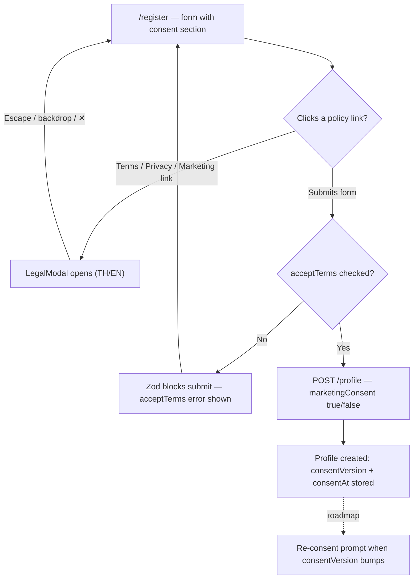
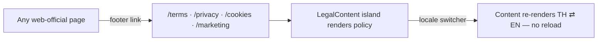
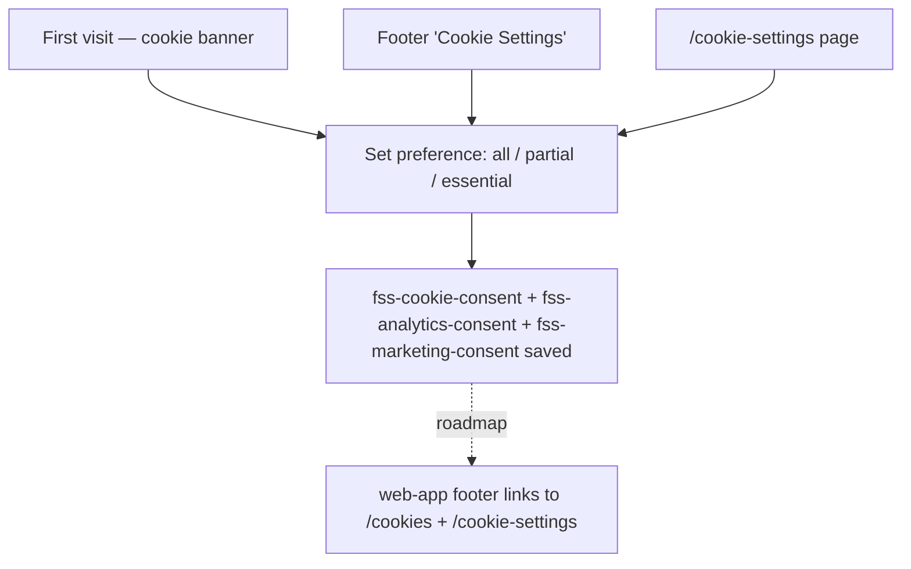

# Legal Documents — User Journeys

How each app's users move through the legal content. See [README.md](./README.md) for the
design spec and [feature-spec.md](./feature-spec.md) for the formal requirements.

> Reflects what is **built today** — all journeys below are fully shipped. Roadmap steps
> (re-consent on version bump, web-app footer links) are shown dashed.

---

## Table of Contents

- [Factory operator — consent at registration](#factory-operator--consent-at-registration)
- [Public visitor — reading a policy on the official site](#public-visitor--reading-a-policy-on-the-official-site)
- [Any user — managing cookie preferences](#any-user--managing-cookie-preferences)

---

## Factory operator — consent at registration

A new operator signing up on `web-app` must accept Terms + Privacy before the form submits;
they can read any policy inline without losing form state.

**Guard(s):** registration requires a verified Firebase session; the backend takes the UID
from `middleware.GetUID(r)` and sets `consentAt` server-side. Detail in
[legal-modal.md](./legal-modal.md).

---

## Public visitor — reading a policy on the official site

An unauthenticated visitor on `web-official` reaches the standalone policy pages from the
footer (or a direct link, e.g. from the registration modal's context).

**Guard(s):** none — public pages, no auth. Detail in [legal-content.md](./legal-content.md).

---

## Any user — managing cookie preferences

Three entry points converge on the same preference state (`fss-*` localStorage keys, owned
by the [cookie-consent](../cookie-consent/feature-spec.md) feature).

**Guard(s):** none — client-side preference, no auth.

---

*See [README.md](./README.md) for the feature spec.*

---

*Version: 1.0.0*
*Last updated: 3 July 2026*
