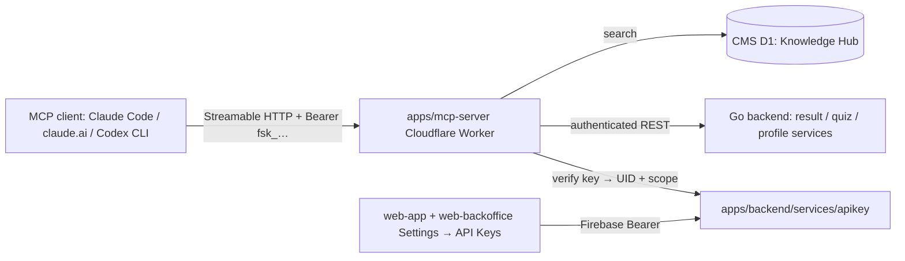

# FactorySync MCP Server

**Status:** Draft — not yet implemented · [feature-spec.md](./feature-spec.md) ·
CR-005 in [change-request-log.md](../../iso29110/change-request-log.md)

A remote [Model Context Protocol](https://modelcontextprotocol.io) server that lets any
MCP-capable AI agent — Claude Code, Claude Desktop / claude.ai, OpenAI Codex CLI, Cursor,
Windsurf — read FactorySync data on a user's behalf: factory health-check results, the quiz
catalog, and Knowledge Hub articles. Endpoints and snippets below are the *target*
interface; they go live with Phase 1.

## Table of Contents

1. [App surfaces](#app-surfaces)
2. [Summary](#summary)
3. [Goals & non-goals](#goals--non-goals)
4. [Current state](#current-state)
5. [Design overview](#design-overview)
6. [Build sequence](#build-sequence)
7. [Security invariants](#security-invariants)
8. [Acceptance criteria](#acceptance-criteria)
9. [Testing](#testing)
10. [Client onboarding](#client-onboarding)
11. [Open items & future work](#open-items--future-work)
12. [References](#references)

## App surfaces

| web-app | web-official | web-backoffice | backend | mcp-server *(new)* |
|:-------:|:------------:|:--------------:|:-------:|:------------------:|
| ✅ | ⬩ | ✅ | ✅ | ✅ |

`web-app` and `web-backoffice` gain an *API Keys* settings section; `apps/mcp-server` is a
new Cloudflare Worker (SDD Option A); the backend gains a `services/apikey` service.

## Summary

| Component | Description | Phase |
|-----------|-------------|-------|
| **MCP Worker** | `apps/mcp-server` Cloudflare Worker (Agents SDK / `McpAgent`) — Streamable HTTP transport, tool registry, auth + error mapping | P1 |
| **API key service** | `apps/backend/services/apikey` — issuance (hash + prefix), verification, revocation, server-derived scope | P1 |
| **Key management UI** | *Settings → API Keys* in web-app (end users) and web-backoffice (staff), plaintext-once display, TH/EN i18n | P1 |
| **OAuth 2.1** | Dynamic client registration replacing manual keys for desktop clients | P2 |
| **Backoffice tools** | Cross-user analytics / staff-scoped MCP tools (`scope: backoffice` keys future-proof this) | Later CR |

| Environment | Endpoint |
|---|---|
| Production | `https://mcp.factorysyncsolutions.com/mcp` |
| Staging | `https://mcp-staging.factorysyncsolutions.com/mcp` |

**Transport:** Streamable HTTP · **Auth:** API key (`Authorization: Bearer fsk_…`).
Catalog/knowledge tools work without a key; result/profile tools require one.

## Goals & non-goals

### Goals

- Let a factory operator (or their consultant) connect any MCP-capable agent to
  FactorySync and read their own results, the quiz catalog, and Knowledge Hub content —
  one server implementation for every client, no screen-scraping.
- Keep every data tool scoped to the verified key owner's UID with hashed, revocable,
  plaintext-once API keys.
- Fit the existing Cloudflare deploy pipeline (`cms.…` pattern) and backend conventions
  (response helpers, sentinel errors, audit logging).

### Non-goals

- Write tools (submitting quiz answers, editing profile) — read-only first, by design.
- OAuth 2.1 / dynamic client registration in v1 (Phase 2; API keys are the MVP auth).
- Backoffice-scoped **tools** in v1 — staff can already *create* keys in Phase 1, but
  staff-only tools ship in a follow-up CR.
- MCP resources/prompts beyond tools, sampling, elicitation, stdio-only distribution
  (stdio clients bridge via `mcp-remote`).

## Current state

No implementation has been started yet in this branch. The feature remains at **Draft**
in design and test-planning stage (CR-005 pending approval). The placement decision is
fixed to **Option A** — a dedicated Worker in front of the Go backend — in
[mcp-server-design.md](../../architecture/mcp-server-design.md). Feature completion is
tracked in [status.md](./status.md).

## Design overview



MCP transport (new host):

| Method | Path | Auth | Purpose |
|--------|------|------|---------|
| `POST` | `https://mcp.factorysyncsolutions.com/mcp` | Bearer `fsk_…` (optional for public tools) | JSON-RPC: initialize, tools/list, tools/call |
| `GET` | `https://mcp.factorysyncsolutions.com/mcp` | same | SSE stream for server → client messages |

Key management (backend API, serves both apps):

| Endpoint | Method | Auth | Purpose |
|----------|--------|------|---------|
| `/api/v1/apikeys` | `POST` | Firebase Bearer | create key — plaintext returned once, scope server-derived |
| `/api/v1/apikeys` | `GET` | Firebase Bearer | list own keys (prefix, label, scope, lastUsedAt) |
| `/api/v1/apikeys/{keyID}` | `DELETE` | Firebase Bearer | revoke own key |

### Tools (Phase 1)

| Tool | Auth | Description |
|---|---|---|
| `list_quizzes` | public | Active quiz variants (TH/EN titles, dimensions, question counts) |
| `get_quiz` | public | Dimensions + questions of one variant (no rubric internals) |
| `search_knowledge` | public | Search published Knowledge Hub articles |
| `list_results` | API key | Your assessments (variant, date, overall score) |
| `get_result` | API key | Full 8-dimension scores, levels, recommendations |
| `get_profile` | API key | Your factory profile (non-sensitive fields) |

## Build sequence

### Phase 1 — MVP (read-only, API keys)

| # | Task | File(s) |
|---|------|--------|
| 1 | API key models, service (generate/hash/verify/revoke, scope derivation, max-5 limit), sentinel errors | `apps/backend/services/apikey/models.go`, `service.go` |
| 2 | Key management handlers + routes, swagger annotations | `apps/backend/services/apikey/handler.go`, `main.go` |
| 3 | Backend unit + handler tests | `apps/backend/services/apikey/service_test.go`, `handler_test.go` |
| 4 | Scaffold `apps/mcp-server` Worker: transport, handshake, tool registry | `apps/mcp-server/src/index.ts`, `wrangler.jsonc` |
| 5 | Implement six Phase-1 tools + auth/error mapping + rate limiting + audit calls | `apps/mcp-server/src/tools/*` |
| 6 | Worker unit tests (schemas, auth gating, error mapping) | `apps/mcp-server/src/**/*.test.ts` |
| 7 | *Settings → API Keys* UI in web-app and web-backoffice + i18n copy | `apps/web-app/src/pages/settings/`, `apps/web-backoffice/src/pages/settings/` |
| 8 | Frontend component tests + Playwright coverage | `apps/*/src/**/*.test.tsx`, e2e suites |
| 9 | Deploy workflow for `mcp(-staging).factorysyncsolutions.com` | `.github/workflows/` |

## Security invariants

| Invariant | Where enforced |
|-----------|----------------|
| Acting UID derives only from the verified API key — never from tool input | `apps/mcp-server` auth layer + `services/apikey` verification |
| Key `scope` is server-derived from verified claims at creation; `backoffice` scope re-verified against the live `backofficeRole` claim on use | `apps/backend/services/apikey/service.go` |
| Keys stored hashed (SHA-256), plaintext shown exactly once, prefix-only in logs/UI | `services/apikey` + audit sink |
| Other users' resources return **not-found**, not forbidden — no existence leak | Worker error mapping mirroring `ErrResultNotFound` |
| Revoked keys stop working within ≤ 60s (cache TTL); role removal disables `backoffice` keys | Worker key cache + re-verification |
| `get_profile` excludes `citizenId` and DBD payloads even when populated | Worker tool response shaping |
| Tool inputs validated against JSON schema before reaching the backend | `apps/mcp-server/src/tools/*` |
| Key management responses use `pkg.RespondJSON` / `pkg.RespondError`; UID via `middleware.GetUID(r)` | `apps/backend/services/apikey/handler.go` |

## Acceptance criteria

- `claude mcp add --transport http` connects: `initialize` succeeds and `tools/list`
  returns all six Phase-1 tools with JSON schemas.
- A valid key returns only the owner's results; revoked/unknown keys get
  `UNAUTHENTICATED` on protected tools while public tools keep working.
- Key creation shows the plaintext exactly once; the stored record holds hash + prefix +
  server-derived scope; the 6th active key is rejected.
- Unknown tool → JSON-RPC `-32601`; malformed body → `-32700`; backend failure surfaces
  as a structured tool error, never a hung stream.
- Key-management UI is bilingual via `useLocale()` with dates through `formatDateTime()`.

## Testing

| Package / suite | Target | Notes |
|-----------------|--------|-------|
| `apps/backend/services/apikey/service_test.go` | ≥ 80% | key lifecycle, scope derivation, limits, sentinel errors |
| `apps/backend/services/apikey/handler_test.go` | ≥ 60% | auth, validation, plaintext-once contract |
| `apps/mcp-server` unit tests (Vitest) | ≥ 70% | handshake, schemas, auth gating, error mapping |
| Frontend key-management tests | key paths | plaintext-once UI, revoke dialog, limit error, locale |
| Playwright e2e | — | create → connect-snippet → revoke flow, both apps |

Full cases in [test-plan.md](./test-plan.md).

## Client onboarding

### Connect from Claude Code

```bash
claude mcp add --transport http factorysync \
  https://mcp.factorysyncsolutions.com/mcp \
  --header "Authorization: Bearer fsk_YOUR_KEY"
```

Then in a session: *"Use factorysync to pull my latest health-check result and summarize the
weakest dimensions."*

### Connect from Claude Desktop / claude.ai

Add a **custom connector** (Settings → Connectors → Add custom connector) with the endpoint
URL above. Until OAuth lands (Phase 2), desktop users can also bridge with `mcp-remote` in
`claude_desktop_config.json`:

```json
{
  "mcpServers": {
    "factorysync": {
      "command": "npx",
      "args": [
        "-y", "mcp-remote",
        "https://mcp.factorysyncsolutions.com/mcp",
        "--header", "Authorization: Bearer fsk_YOUR_KEY"
      ]
    }
  }
}
```

### Connect from OpenAI Codex CLI

Codex configures MCP servers in `~/.codex/config.toml`. Use the `mcp-remote` stdio bridge:

```toml
[mcp_servers.factorysync]
command = "npx"
args = [
  "-y", "mcp-remote",
  "https://mcp.factorysyncsolutions.com/mcp",
  "--header", "Authorization: Bearer fsk_YOUR_KEY",
]
```

### Connect from Cursor / Windsurf

Both accept the same shape in their MCP config (`.cursor/mcp.json` /
`~/.codeium/windsurf/mcp_config.json`) — use the `mcp-remote` block from the Codex example,
or native HTTP where supported:

```json
{
  "mcpServers": {
    "factorysync": {
      "url": "https://mcp.factorysyncsolutions.com/mcp",
      "headers": { "Authorization": "Bearer fsk_YOUR_KEY" }
    }
  }
}
```

### Key handling notes

- Keys are scoped to **your own data** — a key can never read another user's results.
- Treat `fsk_…` keys like passwords: they are shown once at creation; revoke lost keys
  immediately in *Settings → API Keys* (web-app or backoffice — revocation propagates
  within 60 s). Staff keys stop working as soon as the staff role is removed.
- Never commit keys to a repo; pass them via your client's env/header config.

## Open items & future work

### Open decisions

| # | Decision | Suggested default |
|---|----------|------------------|
| 1 | Rate-limit thresholds per key / per IP | 60 calls/min per key; stricter per-IP for anonymous traffic |
| 2 | Knowledge search backend (D1 direct vs backend proxy) | Direct D1 read from the Worker (same Cloudflare account) |

### Future work

- OAuth 2.1 + dynamic client registration (Phase 2) — removes manual key copy-paste.
- Backoffice-scoped tools (cross-user analytics, transcripts) once staff use-cases firm up.
- Write tools (submit answers, edit profile) after read-only v1 proves out.

## References

- [feature-spec.md](./feature-spec.md) — SRS, requirements + tool surface (SI.O1)
- [test-plan.md](./test-plan.md) — test cases (SI.O4/O5)
- [status.md](./status.md) — build progress tracker
- [mcp-server-design.md](../../architecture/mcp-server-design.md) — SDD, Worker-vs-in-backend decision
- CR-005 in [change-request-log.md](../../iso29110/change-request-log.md)
- [MCP specification](https://modelcontextprotocol.io/specification)

*Version: 0.3.0*
*Last updated: 3 July 2026*
