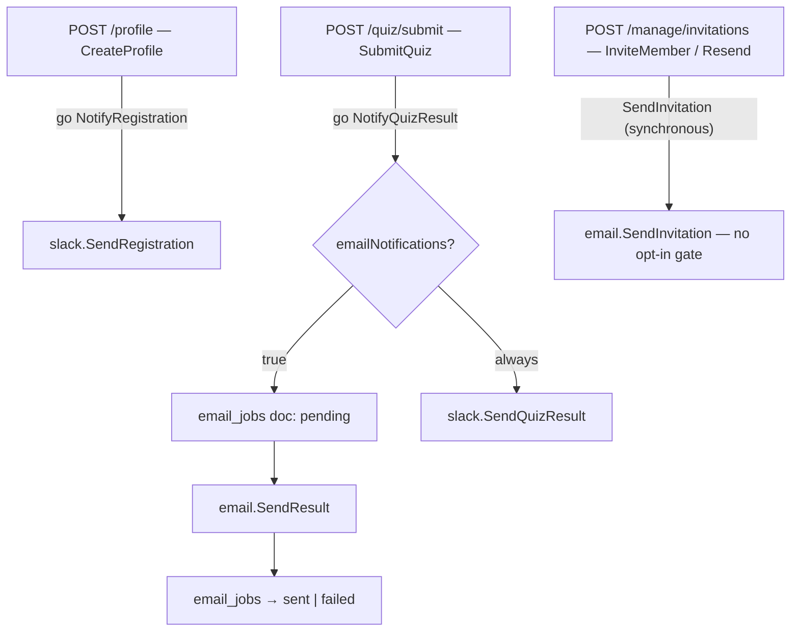

# Notification Service — Feature Spec

**Status:** ✅ Shipped — all three events live (registration → Slack, quiz result → email + Slack, invitation → email); fire-and-forget with `email_jobs` audit trail.

---

## Table of Contents

1. [App surfaces](#app-surfaces)
2. [Summary](#summary)
3. [Goals & Non-Goals](#goals--non-goals)
4. [Current State](#current-state)
5. [Design Overview](#design-overview)
6. [Security Invariants](#security-invariants)
7. [Acceptance Criteria](#acceptance-criteria)
8. [Testing](#testing)
9. [Open Items & Future Work](#open-items--future-work)
10. [References](#references)

---

> Backend-only service (`services/notification/`) that sends notifications across two
> channels: email via Resend and Slack via Incoming Webhooks. Three events fire it — new
> registration (Slack), quiz result submitted (opt-in email + Slack), and member
> invitation (email — the email *is* the invitation). Everything is fire-and-forget:
> failures are logged but never surface to the API caller, and each config degrades
> gracefully when its env var is absent. Result-email attempts are audited in the
> `email_jobs` Firestore collection.

This README is the design index for the Notification Service feature. The formal
requirements live in the ISO 29110 SRS — see [feature-spec.md](./feature-spec.md). Each
non-trivial component is documented in a dedicated sub-document; see
[References](#references).

---

## App surfaces

| web-app | backend |
|:-------:|:-------:|
| — | ✅ |

Pure backend service — no frontend surface (no in-app toasts, bell, or preference UI).
Users touch it only through their inbox and via the `emailNotifications` profile flag, so
there is no user-journeys doc for this feature.

---

## Summary

| Event | Email | Slack |
|-------|-------|-------|
| **New registration** | — | ✅ Always |
| **Quiz result submitted** | ✅ Opt-in (user's `emailNotifications` flag) | ✅ Always |
| **Member invitation sent** | ✅ Always (email IS the delivery mechanism) | — |

| Component | Description |
|-----------|-------------|
| **Notification service** | Orchestrates the three events; guards on `nil` email client — `services/notification/service.go` |
| **Email channel** (Resend) | Transport + result and bilingual invitation templates + `email_jobs` audit trail — see [email-channel.md](./email-channel.md) |
| **Slack channel** (webhooks) | Registration and quiz-result posts to two Incoming Webhook URLs — see [slack-channel.md](./slack-channel.md) |

---

## Goals & Non-Goals

### Goals

- Notify the internal team on every new user registration (Slack).
- Deliver a formatted assessment result email to the user after quiz submission, if they opted in.
- Notify the internal team on every quiz result (Slack).
- Persist an `EmailJob` record per email attempt for auditability.
- Isolate failures so that a broken Resend/Slack config never fails an API request.
- Send a bilingual (TH + EN) invitation email with company name, role, and a 24-hour expiry notice when a member is invited.

### Non-Goals

- Frontend notification UI (in-app toasts or notification bell).
- Scheduling / queuing / retrying failed emails (fire-and-forget only).
- User-facing unsubscribe link or preference management via API.
- Marketing / campaign emails (only transactional events are handled here).
- SMS or push notifications.

---

## Current State

See [status.md](./status.md) for the per-component implementation checklist. All in-scope
components are shipped; retry and self-service opt-out remain future work.

---

## Design Overview

`NotifyRegistration` and `NotifyQuizResult` run in goroutines; `SendInvitation` is called
synchronously but its failure is only logged — no path blocks or changes the HTTP
response. When `RESEND_API_KEY` is absent, `emailClient == nil` and both email paths are
silently skipped; an empty webhook URL makes `SlackClient.post` return `nil` immediately.
The full failure-handling matrix is in
[feature-spec.md § 11](./feature-spec.md#11-failure-handling).

### Data model

| Collection | Document ID | Key fields | Notes |
|------------|-------------|------------|-------|
| `email_jobs` | `<uuid>` | `id`, `uid`, `assessmentId`, `status: "pending" \| "sent" \| "failed"`, `createdAt`, `sentAt?`, `error?` | Written twice per **result** email (pending → sent/failed); not used for invitation or registration events |
| `invitations` | `<uid>` | `uid`, `email`, `role`, `invitedBy`, `invitedAt`, `expiresAt` (= `invitedAt + 24h`), `companyName`, `companyRegId`, `industryType`, `companySize` | Deleted on accept (single-use); owned jointly with the admin service |

### API contract

No notification-specific endpoints — the service is triggered from existing handlers:

| Method | Path | Auth / Role | Notification behavior |
|--------|------|-------------|----------------------|
| `POST` | `/api/v1/profile` | Bearer | Fires `NotifyRegistration` (Slack) after the profile write |
| `POST` | `/api/v1/quiz/submit` | Bearer | Fires `NotifyQuizResult` (opt-in email + Slack) after the assessment write |
| `POST` | `/api/v1/manage/invitations` | Bearer · admin | Sends the invitation email; writes `invitations/{uid}` with 24h expiry |
| `POST` | `/api/v1/manage/invitations/{uid}/resend` | Bearer · admin | Resets `expiresAt` to a fresh 24h and re-sends the email |
| `POST` | `/api/v1/invitations/accept` | Bearer | Checks `expiresAt` (`410 INVITATION_EXPIRED` if past); deletes the doc on success |

### Configuration

| Variable | Required | Purpose |
|----------|----------|---------|
| `RESEND_API_KEY` | No (email disabled if absent) | Resend API key — shared by result and invitation emails |
| `SLACK_WEBHOOK_REGISTRATION` | No (Slack skipped if empty) | Incoming webhook URL for registration events |
| `SLACK_WEBHOOK_QUIZ_RESULT` | No (Slack skipped if empty) | Incoming webhook URL for quiz result events |

---

## Security Invariants

| Invariant | Where enforced |
|-----------|----------------|
| `RESEND_API_KEY` and webhook URLs come from env only — never in source | `apps/backend/main.go` (`os.Getenv`) |
| Email HTML assembled via `html/template` (auto-escaping) — no raw string interpolation into HTML | `services/notification/email_*.go` |
| Notification failure never changes an API response (fire-and-forget) | `services/notification/service.go` + calling handlers |
| Result email gated by the user's `emailNotifications` opt-in; Slack is internal-only | `services/notification/service.go` |
| Invitation link expires 24h after (re)send; accept after expiry → `410 INVITATION_EXPIRED` | `invitations/{uid}.expiresAt` + `AcceptInvitation` |
| Invitation is single-use — the Firestore doc is deleted on accept | `services/admin/` (`AcceptInvitation`) |

---

## Acceptance Criteria

Verbatim from [feature-spec.md § 13](./feature-spec.md#13-acceptance-criteria) — all met
(feature status: Done):

- [x] A new user completing registration triggers a Slack message to `SLACK_WEBHOOK_REGISTRATION` containing company name, contact name, industry, and timestamp.
- [x] A user with `emailNotifications: true` submitting a quiz receives an email from `no-reply@factorysyncsolutions.com` with subject `FactorySync Solutions Result — {diagnosis} ({score}/5.00)`.
- [x] The result email contains: overall score, diagnosis, dimension scores table, strengths list (if any), weaknesses list (if any).
- [x] A user with `emailNotifications: false` does not receive an email but the Slack post still fires.
- [x] Submitting a quiz always posts to `SLACK_WEBHOOK_QUIZ_RESULT` with company, score, diagnosis, and timestamp.
- [x] An `email_jobs` Firestore document is created for each result email attempt, transitioning from `pending` to `sent` or `failed`.
- [x] A Resend API failure does not cause the quiz submission endpoint to return an error.
- [x] A Slack webhook failure does not cause the quiz submission or registration endpoint to return an error.
- [x] When `RESEND_API_KEY` is absent, no email attempt is made and no `email_jobs` document is created.
- [x] `POST /api/v1/manage/invitations` sends a bilingual (TH + EN) invitation email to the supplied address.
- [x] The invitation email subject is bilingual (TH + EN).
- [x] The email body contains: inviter email, company name, role (TH + EN display names), CTA button (branded `/auth/action` password setup link), and expiry timestamp.
- [x] The `invitations/{uid}` Firestore document stores `expiresAt` as `invitedAt + 24h`.
- [x] `POST /api/v1/manage/invitations/{uid}/resend` resets `expiresAt` to a fresh 24 hours and sends a new invitation email.
- [x] `POST /api/v1/invitations/accept` returns `410 INVITATION_EXPIRED` if the invitation's `expiresAt` is in the past.
- [x] `POST /api/v1/invitations/accept` deletes the `invitations/{uid}` doc on success, making the invitation single-use.
- [x] When `RESEND_API_KEY` is absent, `SendInvitation` is silently skipped; the invitation doc is still created.
- [x] `make test-api` passes.

---

## Testing

Planned coverage per [feature-spec.md § 14](./feature-spec.md#14-testing). Note: the
dedicated notification test files described there are **not yet present on disk** — see
[status.md](./status.md).

| Package | Target | Notes |
|---------|--------|-------|
| `services/notification/service_test.go` | `NotifyRegistration` / `NotifyQuizResult` / `SendInvitation` | opt-in vs. opt-out paths; `emailClient == nil` logs warn, no error |
| `services/notification/email_invite_test.go` | `buildInviteEmailHTML` | TH + EN sections; all four role display names; formatted `expiresAt` |
| `services/notification/email_result_test.go` | `buildResultEmailHTML` | empty `strengths` / `weaknesses` sections omitted |
| Integration | quiz submit with `emailNotifications: true` | assert `email_jobs` doc exists with `status: "sent"` |

Coverage target: critical `services/` ≥ 80% (`go test ./... -cover`).

---

## Open Items & Future Work

From [feature-spec.md § 12](./feature-spec.md#12-open-tasks):

| # | Area | Description |
|---|------|-------------|
| 1 | Email retry / DLQ | Failed result emails (`status: "failed"`) are never retried — a background worker (Cloud Run Job / Cloud Tasks) could retry up to N times |
| 2 | Self-service opt-out | No unsubscribe link; `emailNotifications` is admin-only today — add `PUT /api/v1/profile/notifications` + a signed one-click footer link |
| 3 | Result email bilingual | `email_result.go` is English-only (invitation email is already bilingual) — store locale at registration, or default to a bilingual layout |
| 4 | Registration welcome email | New registrations post to Slack only — an `email.SendRegistration` welcome email could be added if needed |

### Open decisions

None — the shipped scope is stable; the items above go through new CRs.

---

## References

### Sub-documents

| Doc | Covers |
|-----|--------|
| [feature-spec.md](./feature-spec.md) | ISO 29110 SRS — formal requirements, event details, templates, failure matrix |
| [status.md](./status.md) | Current implementation status per component |
| [email-channel.md](./email-channel.md) | Resend transport, result + invitation templates, `email_jobs` audit trail |
| [slack-channel.md](./slack-channel.md) | Slack Incoming Webhook client and message formats |

### Cross-references

- [Register](../register/feature-spec.md) — registration flow that fires `NotifyRegistration`
- [Quiz](../quiz/feature-spec.md) — quiz submission that fires `NotifyQuizResult`
- [Result](../result/feature-spec.md) — the assessment data rendered in the result email
- [Admin API](../../api/admin.md) — invitation endpoints that call `SendInvitation`

---

*Version: 1.0.0*
*Last updated: 3 July 2026*
