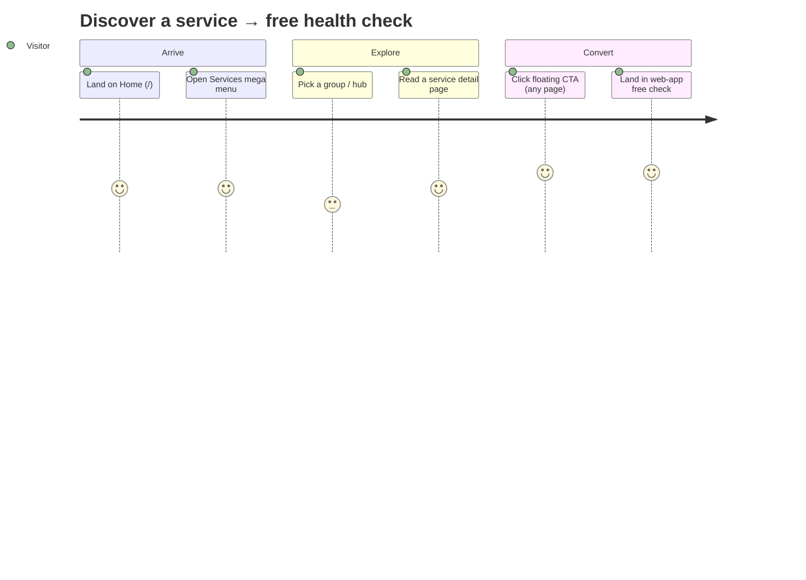
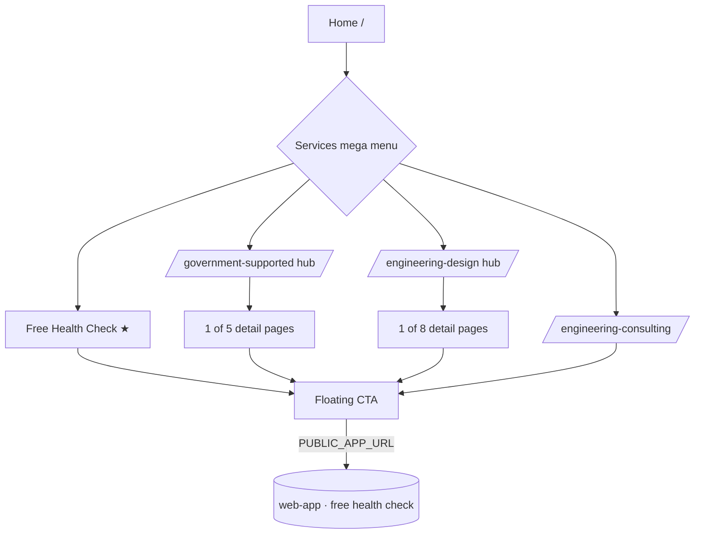
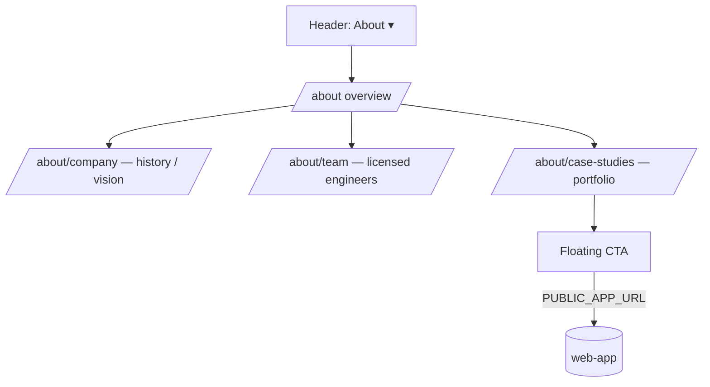
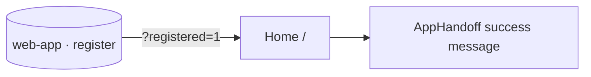

# Official Site Restructure — User Journeys

How public visitors move through the restructured marketing site. See [README.md](./README.md) for the
design spec, [sitemap.md](./sitemap.md) for the IA, and [feature-spec.md](./feature-spec.md) for the
formal requirements.

> Reflects the **target** IA (Phase 0 approved, not yet built). Roadmap steps are shown dashed (`-.->`).
> The only actor is the anonymous public visitor — `web-official` has no authenticated users.

---

## Table of Contents

- [Visitor — discover a service and start the free health check](#visitor--discover-a-service-and-start-the-free-health-check)
- [Visitor — research via the Knowledge Hub](#visitor--research-via-the-knowledge-hub)
- [Visitor — evaluate the company (About)](#visitor--evaluate-the-company-about)
- [Returning lead — post-registration handoff](#returning-lead--post-registration-handoff)

---

## Visitor — discover a service and start the free health check

A factory owner lands on Home, explores the service catalogue via the mega menu, and converts on the
flagship free health check — the primary goal of the site.



Branching path through navigation:



---

## Visitor — research via the Knowledge Hub

A visitor not yet ready to convert reads articles to build trust, then reaches the CTA.

```mermaid
flowchart LR
  Nav[Header: Knowledge] --> Hub[/knowledge listing/]
  Hub --> Cat[/knowledge/category/[category]/]
  Hub --> Article[/knowledge/[slug]/]
  Cat --> Article
  Article -. articles fetched at build .-> CMS[(web-cms · SonicJS)]
  Article --> CTA[Floating CTA] -->|PUBLIC_APP_URL| App[(web-app)]
```

---

## Visitor — evaluate the company (About)

A prospective client checks credibility before engaging — company vision, engineer credentials, and
case studies.



---

## Returning lead — post-registration handoff

After registering in `web-app`, the visitor is returned to `web-official` with `?registered=1` and sees a
brief success acknowledgement. This is the only cross-app communication and exists today.



---

*Version: 0.1.0*
*Last updated: 30 June 2026*
