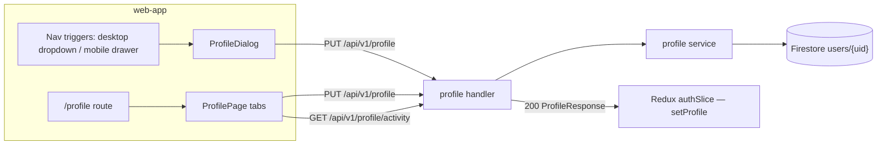

# User Profile — Feature Spec

**Status:** ✅ Shipped — both editing surfaces live; Activity tab needs date-formatting cleanup; `emailNotifications` not yet exposed in the form UI.

---

## Table of Contents

1. [App surfaces](#app-surfaces)
2. [Summary](#summary)
3. [Goals & Non-Goals](#goals--non-goals)
4. [Current State](#current-state)
5. [Design Overview](#design-overview)
6. [Security Invariants](#security-invariants)
7. [Acceptance Criteria](#acceptance-criteria)
8. [Testing](#testing)
9. [Open Items & Future Work](#open-items--future-work)
10. [References](#references)

---

> Authenticated users keep their company and contact information current after
> registration and review their own activity log. Two editing surfaces exist for the same
> action: a `ProfileDialog` opened from the nav (desktop dropdown / mobile drawer) and a
> routed `ProfilePage` at `/profile` with account, profile, notification, activity, and
> security tabs. Both call `PUT /api/v1/profile` and update Redux (`authSlice.setProfile`)
> on success. All copy is bilingual (TH/EN).

This README is the design index for the User Profile feature. The formal requirements
live in the ISO 29110 SRS — see [feature-spec.md](./feature-spec.md). Each non-trivial
component is documented in a dedicated sub-document; see [References](#references).

---

## App surfaces

| web-app | backend |
|:-------:|:-------:|
| ✅ | ✅ |

`web-app` renders `ProfileDialog` (mounted once in `Layout`) and `ProfilePage` at
`/profile`; the backend serves the `services/profile/` endpoints. No `web-official`
surface. Per-app flows live in [user-journeys.md](./user-journeys.md).

---

## Summary

| Component | Description |
|-----------|-------------|
| **`ProfileDialog`** (web-app) | Three-section modal (Account / Contact Person / Company Profile) opened from nav triggers; the current primary editing surface — see [profile-dialog.md](./profile-dialog.md) |
| **`ProfilePage`** (web-app) | Standalone `/profile` page with Profile, Notifications, Activity, and Security tabs; Activity is the user-facing audit log — see [profile-page.md](./profile-page.md) |
| **Profile API** (backend) | `PUT /api/v1/profile` selective-field update + `GET /api/v1/profile/activity` personal audit log, both UID-scoped from context |

**Immutable fields** (set at registration — never editable via this feature):
`companyRegId`, `uid`, `email`, `displayName`, `role`, `consentVersion`, `consentAt`.

---

## Goals & Non-Goals

### Goals

- Allow updating: company name, industry type, company size, contact name, contact email, contact phone.
- Pre-fill the form with the user's current profile from Redux; disable "Save Changes" until the form is dirty.
- 3-second success banner on save; inline error message on failure.
- Update Redux `authSlice` (`setProfile`) immediately on success — no reload needed for the nav to reflect the new company name.
- Track `profile_open`, `profile_save`, `profile_save_success`, `profile_save_error` via analytics (dialog only).
- Show each user their own recent activity log from `GET /api/v1/profile/activity`.
- Bilingual (TH/EN) via `useLocale()`.

### Non-Goals

- Changing the company registration ID — immutable after registration.
- Changing the Google account (email, display name, avatar) — managed by Google.
- Managing email notification preferences in the UI — the `emailNotifications` field exists in the backend model but is not exposed in the form (future work).
- Deleting the account or profile; profile picture upload (Google avatar is read-only).
- Viewing another user's activity from `web-app` — only backoffice superadmins can inspect other users' activity.

---

## Current State

See [status.md](./status.md) for the per-component implementation checklist. Both
surfaces and all backend endpoints are shipped; the Activity tab date-formatting cleanup
and the `emailNotifications` toggle remain open.

---

## Design Overview

Opening the dialog resets the form to the **latest profile in Redux**, so a re-open after
another device/tab updated the profile never shows stale data. The backend does a
selective field update (`omitempty` per field), not a full document replace. Full form
fields, Zod/backend validation rules, and the submit sequence are specified in
[feature-spec.md § 5–7](./feature-spec.md#5-form-fields).

### Data model

| Collection | Document ID | Key fields | Notes |
|------------|-------------|------------|-------|
| `users` | `<userID>` | `companyName` · `industryType` · `companySize` · `contactName` · `contactEmail` · `contactPhone` · `emailNotifications: bool` · `updatedAt` | Mutable via editor; `updatedAt` set by the service on every update. Full mutability matrix in [feature-spec.md § 9](./feature-spec.md#9-firestore-document-usersuid) |

### API contract

| Method | Path | Auth / Role | Purpose |
|--------|------|-------------|---------|
| `PUT` | `/api/v1/profile` | Bearer | Update mutable profile fields (selective update; all fields `omitempty`) |
| `GET` | `/api/v1/profile` | Bearer | Return the current user's profile (used by `useAuth` on sign-in, not by the editor) |
| `GET` | `/api/v1/profile/check/{regId}` | Bearer | Registration-time duplicate check — owned by the register flow, not the editor |
| `GET` | `/api/v1/profile/activity` | Bearer | The caller's own activity log (`limit` ≤ 100, `before` cursor, optional `eventType`) |
| `POST` | `/api/v1/profile/activity/login` | Bearer | Record a `user.login` event; client ignores failures so login UX is never blocked |

Errors follow the standard envelope — `400 VALIDATION_ERROR`, `401 UNAUTHORIZED`,
`404 NOT_FOUND` (`ErrProfileNotFound`), `500 INTERNAL_ERROR`. Full request/response
shapes in [feature-spec.md § 8](./feature-spec.md#8-backend-api).

---

## Security Invariants

| Invariant | Where enforced |
|-----------|----------------|
| UID taken from `middleware.GetUID(r)`, never the request body/path (including the activity endpoints) | `services/profile/handler.go` |
| Immutable fields (`companyRegId`, `role`, `consentVersion`, …) are never written by `UpdateProfile` | `services/profile/service.go` (selective field update) |
| Activity log returns only events where the caller is actor or target | `services/profile/service.go` |
| `updatedAt` is set server-side on every update, not accepted from the client | `services/profile/service.go` |

---

## Acceptance Criteria

Mirrors [feature-spec.md § 13](./feature-spec.md#13-acceptance-criteria):

**ProfileDialog** — see [profile-dialog.md](./profile-dialog.md)
- [x] Opening `ProfileDialog` pre-fills all fields with the current Redux profile data.
- [x] Re-opening the dialog after external changes resets the form to the latest Redux data.
- [x] The "Save Changes" button is disabled when the form has no unsaved changes; changing any field enables it.
- [x] Submitting calls `PUT /api/v1/profile` and dispatches `setProfile` on success.
- [x] A 3-second success banner appears after a successful save.
- [x] The nav immediately reflects the updated company name / contact name after save.
- [x] An inline error message appears when the API returns a non-2xx response.
- [x] The registration ID and email fields are read-only and not included in the PUT body.
- [x] Closing the dialog via ✕, backdrop, or Escape discards unsaved changes without an API call.
- [x] All copy renders in the active locale (TH/EN).

**ProfilePage / Activity tab** — see [profile-page.md](./profile-page.md)
- [x] `/profile` Activity tab calls `GET /api/v1/profile/activity`.
- [x] Activity tab only displays the authenticated user's own actor/target events.
- [ ] Activity timestamps use `formatDateTime()` from `@/lib/dayjs` (currently raw `toLocaleString()` — cleanup open).
- [ ] `make lint-web` and `make test-api` pass with the Activity loading/empty/error tests added.

---

## Testing

From [feature-spec.md § 14](./feature-spec.md#14-testing):

| Suite | Target | Notes |
|-------|--------|-------|
| Vitest — `ProfileDialog` | Pre-fill, re-open reset, dirty/submitting button states, `setProfile` dispatch, error path | |
| `services/profile/service_test.go` | `UpdateProfile`: `ErrProfileNotFound`, immutable fields untouched, `updatedAt` refreshed | |
| Playwright E2E | Open dialog → save → banner + nav update; pristine submit disabled; 500 error message; Activity loading/empty/localized states | Activity-tab tests still to be added (open task) |

Coverage target: critical `services/` ≥ 80% (`go test ./... -cover`).

---

## Open Items & Future Work

From [feature-spec.md § 10](./feature-spec.md#10-open-tasks):

| # | Area | Description |
|---|------|-------------|
| 1 | Activity tab cleanup | Replace raw `toLocaleString()` with `formatDateTime()`; align icons; add loading/empty/error tests |
| 2 | `emailNotifications` UI | Backend already persists the field — add a shadcn `Switch` in the form so users can opt in/out without contacting support |
| 3 | De-duplicate form logic | `ProfileDialog` and `ProfilePage` share identical Zod schema and submit logic — extract a shared `useProfileForm` hook or `<ProfileForm>` component |

### Open decisions

None — changes go through a new CR.

---

## References

### Sub-documents

| Doc | Covers |
|-----|--------|
| [feature-spec.md](./feature-spec.md) | ISO 29110 SRS — formal requirements, form fields, API shapes, i18n keys |
| [status.md](./status.md) | Current implementation status per component |
| [user-journeys.md](./user-journeys.md) | Per-app user flows (edit profile · review activity) |
| [profile-dialog.md](./profile-dialog.md) | `ProfileDialog` component (web-app) |
| [profile-page.md](./profile-page.md) | `ProfilePage` + Activity tab (web-app) |
| [mockups/app.md](./mockups/app.md) | ASCII wireframes — dialog + `/profile` page (web-app) |

### ISO 29110 artifacts

- Scope changes → [docs/iso29110/change-request-log.md](../../iso29110/change-request-log.md)
- New risks → [docs/iso29110/risk-register.md](../../iso29110/risk-register.md)

### Cross-references

- [Register](../register/feature-spec.md) — creates the profile these surfaces edit
- [Auth](../auth/feature-spec.md) — `GetProfile` on sign-in populates Redux
- [Backoffice](../backoffice/feature-spec.md) — FactorySync staff view of all profiles
- [Architecture overview](../../architecture/overview.md)

---

*Version: 1.0.0*
*Last updated: 3 July 2026*
