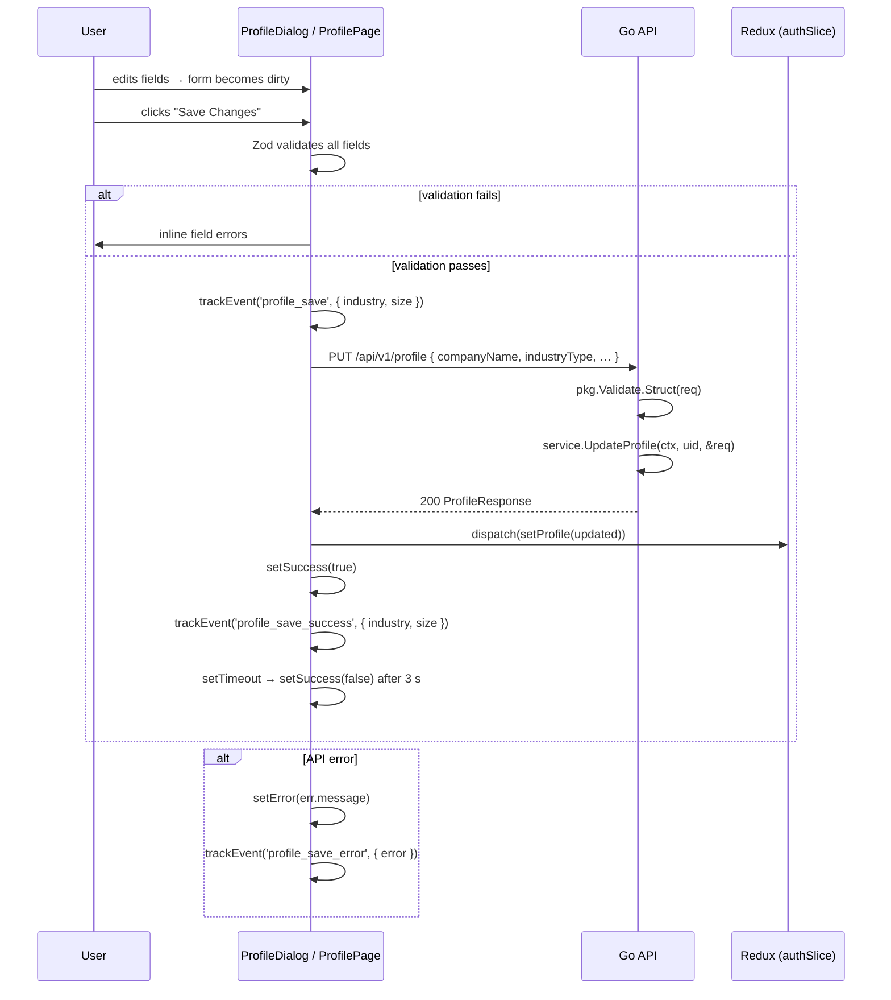

# User Profile — Feature Spec

> Authenticated users can update their company and contact information after
> registration and review their own activity log. Two editing surfaces exist:
> a **`ProfileDialog`** opened from navigation and a routed **`ProfilePage`** at
> `/profile`. Both call `PUT /api/v1/profile` and update Redux on success.

---

## 1. Summary

The profile feature lets registered users keep their company and contact
information up to date. Registration captures these fields once; the profile
editor allows changing them at any time without re-registering. The standalone
profile page also shows a personal activity log backed by audit events.

Two surfaces exist for the same action:

| Surface | File | Access | Status |
|---------|------|--------|--------|
| `ProfileDialog` | `apps/web-app/src/components/ProfileDialog.tsx` | Nav dropdown / mobile drawer | ✅ Active — mounted in `Layout` |
| `ProfilePage` | `apps/web-app/src/pages/ProfilePage.tsx` | `/profile` | ✅ Active |

`ProfileDialog` is the current editing surface. It is opened by the user's
avatar/name in the nav header or by the "Profile" link in the mobile drawer.
`ProfilePage` contains account, profile, notification, activity, and security
tabs. The Activity tab is the user-facing audit log for that authenticated user.

**Immutable fields** (set at registration — never editable via this feature):
`companyRegId`, `uid`, `email`, `displayName`, `role`, `consentVersion`, `consentAt`.

---

## 2. Goals & Non-Goals

### Goals

- Allow updating: company name, industry type, company size, contact name,
  contact email, contact phone.
- Pre-fill the form with the user's current profile from Redux.
- Submit button disabled until the form has unsaved changes (`isDirty`).
- Display a 3-second success banner on save; show an inline error message on failure.
- Update Redux `authSlice` (`setProfile`) immediately on success — no page
  reload needed for the nav to reflect the new company name.
- Track `profile_save`, `profile_save_success`, `profile_save_error` via analytics.
- Show each user their own recent activity log from `GET /api/v1/profile/activity`.
- Bilingual (TH/EN) via `useLocale()`.

### Non-Goals

- Changing the company registration ID — immutable after registration.
- Changing the Google account (email, display name, avatar) — managed by Google.
- Managing email notification preferences — `emailNotifications` field exists in
  the backend model but is not exposed in the form UI (future work, see §10).
- Deleting the account or profile.
- Profile picture upload (Google avatar is shown read-only).
- Viewing another user's activity from `web-app`; only backoffice superadmins
  can inspect other users' activity.

---

## 3. Current State

| Component | Location | Status |
|-----------|----------|--------|
| `ProfileDialog` | `apps/web-app/src/components/ProfileDialog.tsx` | ✅ Built + mounted in Layout |
| `ProfilePage` | `apps/web-app/src/pages/ProfilePage.tsx` | ✅ Built + routed at `/profile` |
| Backend `UpdateProfile` handler | `apps/backend/services/profile/handler.go` | ✅ Built |
| Backend `GetActivity` handler | `apps/backend/services/profile/handler.go` | ✅ Built |
| Profile Activity tab | `apps/web-app/src/pages/ProfilePage.tsx` | ✅ Built - date formatting cleanup needed |
| `UpdateProfileRequest` model | `apps/backend/services/profile/models.go` | ✅ Built |
| `emailNotifications` field | `UpdateProfileRequest` + `Profile` struct | ✅ Backend — ❌ not in form UI |

---

## 4. UI Layout

### `ProfileDialog` (three-section modal)

```
┌─────────────────────────────────────────────────────────────┐
│  Update Profile                                             │
│  Edit your company and contact information                  │
├─────────────────────────────────────────────────────────────┤
│  ─── ACCOUNT ────────────────────────────────────────────── │
│  ┌─────────────────────────────────────────────────────┐    │
│  │ [Avatar]  Display Name                   [Google]   │    │
│  │           email@example.com                         │    │
│  │  ─────────────────────────────────────────────────  │    │
│  │  Registration ID    0123456789012                    │    │
│  └─────────────────────────────────────────────────────┘    │
├─────────────────────────────────────────────────────────────┤
│  ─── CONTACT PERSON ─────────────────────────────────────── │
│  [Contact Name input]                                       │
│  [Contact Email input]   [Contact Phone input]              │
├─────────────────────────────────────────────────────────────┤
│  ─── COMPANY PROFILE ────────────────────────────────────── │
│  [Company Name input]                                       │
│  [Industry Type ▾]       [Company Size ▾]                   │
├─────────────────────────────────────────────────────────────┤
│  [✓ Saved successfully!]  ←  3 s success banner             │
│  [Save Changes]           ←  disabled if no changes         │
└─────────────────────────────────────────────────────────────┘
```

Max width: `max-w-lg`. Max height: `max-h-[90vh]` with `overflow-y-auto`.

### `ProfilePage` (standalone account page)

```
┌──────────────────────────────────────────────────────────────┐
│  Update Profile                                              │
│  Edit your company and contact information                   │
│                                                              │
│  Account summary card                                        │
│  [Profile] [Notifications] [Activity] [Security]             │
│                                                              │
│  Profile tab: company/contact form                           │
│  Activity tab: recent audit events for this signed-in user    │
│  Security tab: sign-in methods and password controls          │
└──────────────────────────────────────────────────────────────┘
```

Max width: `max-w-2xl`. Activity events render newest first with localized
labels and timestamps formatted through `formatDateTime()` from `@/lib/dayjs`.

---

## 5. Form Fields

| Field | Input type | Zod rule | Backend rule |
|-------|-----------|----------|--------------|
| `companyName` | `text` | `min(1)` | `omitempty,min=2,max=200` |
| `industryType` | `SelectField` | `min(1)` | `omitempty` |
| `companySize` | `SelectField` | `min(1)` | `omitempty,oneof=small medium large` |
| `contactName` | `text` | `min(1)` | `omitempty,min=2,max=100` |
| `contactEmail` | `email` | `email()` | `omitempty,email` |
| `contactPhone` | `text` | `min(9)` | `omitempty` |

Validation is `omitempty` on the backend — any field can be omitted individually.
The frontend sends all six fields; it doesn't do partial sends.

`industryType` options: `manufacturing`, `food`, `automotive`, `electronics`,
`textile`, `chemical`, `construction`, `agriculture`, `logistics`, `energy`,
`pharma`, `plastics`, `printing`, `metal`, `wood`, `other`.

`companySize` options: `small`, `medium`, `large`.

---

## 6. Open / Close Trigger (`ProfileDialog`)

`ProfileDialog` is mounted once, permanently, at the bottom of `Layout`. It
receives `open` / `onOpenChange` props. Three triggers exist in the nav:

| Trigger | Context | Analytics event |
|---------|---------|-----------------|
| User avatar / name button in desktop nav dropdown | `NavDesktop` component | `profile_open { source: 'desktop_dropdown' }` |
| User summary row in mobile drawer | `NavMobile` component | `profile_open { source: 'mobile_drawer' }` |
| "Profile" nav link in mobile drawer | `NavMobile` component | `profile_open { source: 'mobile_nav' }` |

Opening the dialog resets the form to the **latest profile in Redux** (via
`useEffect([open, profile, reset])`). This ensures that if another device/tab
updated the profile, the dialog doesn't show stale data when re-opened.

---

## 7. Submit Flow



---

## 8. Backend API

### PUT `/api/v1/profile`

Update mutable fields on the authenticated user's profile.

**Auth:** Firebase ID token (Bearer). UID is extracted from context — never from
the request body.

**Request body**

```jsonc
{
  "companyName": "Acme Co.",
  "industryType": "manufacturing",
  "companySize": "medium",
  "contactName": "Jane Doe",
  "contactEmail": "jane@acme.com",
  "contactPhone": "0812345678"
}
```

All fields are optional (`omitempty`). Fields not present in the body are not
modified in Firestore (the service does a selective field update, not a full
document replace).

**Response — 200** (`ProfileResponse`)
```jsonc
{
  "success": true,
  "data": {
    "uid": "firebase-uid",
    "email": "jane@gmail.com",
    "displayName": "Jane Doe",
    "companyName": "Acme Co.",
    "companyRegId": "0123456789012",
    "industryType": "manufacturing",
    "companySize": "medium",
    "contactName": "Jane Doe",
    "contactEmail": "jane@acme.com",
    "contactPhone": "0812345678",
    "role": "user",
    "consentVersion": "1.0",
    "emailNotifications": false,
    "createdAt": "2026-06-01T08:00:00Z"
  }
}
```

**Errors**

| HTTP | Code | Condition |
|------|------|-----------|
| 400 | `VALIDATION_ERROR` | Body parse failure or field validation error |
| 401 | `UNAUTHORIZED` | Missing/invalid token |
| 404 | `NOT_FOUND` | Profile does not exist for this UID (`ErrProfileNotFound`) |
| 500 | `INTERNAL_ERROR` | Firestore write failed |

---

### GET `/api/v1/profile`

Return the current user's profile. Used by `useAuth` on sign-in to populate
Redux. Not called by the profile editor directly (Redux already holds the data).

**Response — 200:** same `ProfileResponse` shape as above.

**Errors**

| HTTP | Code | Condition |
|------|------|-----------|
| 401 | `UNAUTHORIZED` | Missing/invalid token |
| 404 | `NOT_FOUND` | Profile not found — triggers `RegisterGuard` redirect |

---

### GET `/api/v1/profile/check/{regId}`

Check whether a 13-digit company registration ID is already registered. Used
exclusively by `RegisterPage` during the DBD lookup step. Not used by the
profile editor.

---

### GET `/api/v1/profile/activity`

Return the authenticated user's own activity log. The API must use the UID from
`middleware.GetUID(r)` and must never accept a UID in the request body or path.

Events include actions where the caller is the actor and actions where the
caller is the target of another actor, such as a superadmin changing their role.

**Query params**

| Param | Default | Description |
|-------|---------|-------------|
| `limit` | `50` | Max `100` |
| `before` | none | RFC3339 cursor for older events |
| `eventType` | none | Optional exact event type |

**Response - 200**
```jsonc
{
  "success": true,
  "data": [
    {
      "id": "uuid",
      "eventType": "user.profile_updated",
      "resourceType": "profile",
      "resourceID": "firebase-uid",
      "targetUID": "firebase-uid",
      "projectID": "0105567001234",
      "metadata": { "changedFields": ["contactPhone"] },
      "createdAt": "2026-06-14T08:30:00Z"
    }
  ],
  "total": 1
}
```

---

### POST `/api/v1/profile/activity/login`

Record a `user.login` event for the authenticated user. The frontend calls this
after successful Firebase auth/profile bootstrap. Failures should be ignored by
the client so login UX is not blocked by audit logging.

---

## 9. Firestore Document (`users/{uid}`)

| Field | Type | Mutable via editor |
|-------|------|-------------------|
| `uid` | string | ❌ |
| `email` | string | ❌ |
| `displayName` | string | ❌ |
| `companyName` | string | ✅ |
| `companyRegId` | string | ❌ |
| `industryType` | string | ✅ |
| `companySize` | string | ✅ |
| `contactName` | string | ✅ |
| `contactEmail` | string | ✅ |
| `contactPhone` | string | ✅ |
| `role` | string | ❌ (admin-only via `SetUserRole`) |
| `consentVersion` | string | ❌ |
| `consentAt` | string | ❌ |
| `emailNotifications` | bool | ✅ (backend only — not in form yet) |
| `createdAt` | string | ❌ |
| `updatedAt` | string | ✅ (set by service on every update) |

---

## 10. Open Tasks

### 10.1 Activity tab cleanup

`ProfilePage` already includes an Activity tab. Before shipping it as the main
personal audit surface:

- Replace raw `new Date(...).toLocaleString()` with `formatDateTime()` from
  `@/lib/dayjs`.
- Replace icon emoji with consistent icon components if the surrounding profile
  UI moves to icon buttons.
- Add loading, empty, and error tests.

### 10.2 Expose `emailNotifications` in the UI

`UpdateProfileRequest` already accepts `emailNotifications *bool` and the
backend persists it. Neither `ProfileDialog` nor `ProfilePage` renders a toggle
for it. Add a checkbox or toggle (shadcn `Switch`) to let users opt in/out of
email notifications without contacting support.

### 10.3 De-duplicate form logic

`ProfileDialog` and `ProfilePage` share identical Zod schema, `industryKeys`,
`sizeKeys`, and `onSubmit` logic. Extract to a shared
`useProfileForm(profile, onSuccess)` hook or a `<ProfileForm>` component to
avoid drift.

---

## 11. Analytics Events

| Event | Trigger | Properties |
|-------|---------|------------|
| `profile_open` | Dialog opened from nav | `{ source: 'desktop_dropdown' \| 'mobile_drawer' \| 'mobile_nav' }` |
| `profile_save` | Form submitted (before API call) | `{ industry, size }` |
| `profile_save_success` | API returns 200 | `{ industry, size }` |
| `profile_save_error` | API call fails | `{ error: string }` |

> `ProfilePage` does **not** track analytics events — only `ProfileDialog` has
> `trackEvent` calls.

---

## 12. i18n Key Map

| Key | TH (approx.) | EN |
|-----|-------------|----|
| `profile.title` | อัปเดตโปรไฟล์ | Update Profile |
| `profile.subtitle` | แก้ไขข้อมูลบริษัทและผู้ติดต่อ | Edit your company and contact information |
| `profile.email` | อีเมล | Email |
| `profile.regId` | เลขนิติบุคคล | Registration ID |
| `profile.userSection` | บัญชีผู้ใช้ | Account |
| `profile.contactSection` | ผู้ติดต่อ | Contact Person |
| `profile.companySection` | ข้อมูลบริษัท | Company Profile |
| `profile.save` | บันทึกการเปลี่ยนแปลง | Save Changes |
| `profile.saving` | กำลังบันทึก… | Saving… |
| `profile.saved` | บันทึกสำเร็จแล้ว | Saved successfully! |
| `profile.error` | เกิดข้อผิดพลาด กรุณาลองใหม่ | An error occurred, please try again |
| `profile.tabActivity` | กิจกรรม | Activity |
| `profile.activityEmpty` | ยังไม่มีประวัติการใช้งาน | No activity yet. |
| `profile.activity.user_login` | เข้าสู่ระบบ | Signed in |
| `profile.activity.user_registered` | ลงทะเบียนบัญชี | Registered account |
| `profile.activity.user_profile_updated` | อัปเดตข้อมูลโปรไฟล์ | Updated profile |
| `profile.activity.user_role_changed` | เปลี่ยนสิทธิ์ผู้ใช้ | Role changed |
| `profile.activity.assessment_submitted` | ส่งแบบประเมิน | Submitted assessment |

---

## 13. Acceptance Criteria

- [ ] Opening `ProfileDialog` pre-fills all fields with the current Redux profile data.
- [ ] Re-opening the dialog after external changes resets the form to the latest Redux data.
- [ ] The "Save Changes" button is disabled when the form has no unsaved changes.
- [ ] Changing any field enables the button.
- [ ] Submitting the form calls `PUT /api/v1/profile` and dispatches `setProfile` on success.
- [ ] A 3-second success banner appears after a successful save.
- [ ] The nav immediately reflects the updated company name / contact name after save.
- [ ] An inline error message appears when the API returns a non-2xx response.
- [ ] The registration ID and email fields are read-only and not included in the PUT body.
- [ ] Closing the dialog via X, backdrop, or Escape discards unsaved changes without an API call.
- [ ] All copy renders in the active locale (TH/EN).
- [ ] `/profile` Activity tab calls `GET /api/v1/profile/activity`.
- [ ] Activity tab only displays the authenticated user's own actor/target events.
- [ ] Activity timestamps use `formatDateTime()` from `@/lib/dayjs`.
- [ ] `make lint-web` and `make test-api` pass.

---

## 14. Testing

- **Unit (Vitest — ProfileDialog):**
  - Opening with a profile pre-fills defaultValues correctly.
  - Re-opening resets form to the latest profile (useEffect `[open, profile, reset]` dependency).
  - `isSubmitting` disables the button; `!isDirty` disables the button when form is pristine.
  - `onSubmit` dispatches `setProfile` on 200 and sets `success: true`.
  - `onSubmit` sets `error` on `ApiError`.
- **Integration (service_test.go):**
  - `UpdateProfile` returns `ErrProfileNotFound` for a UID with no profile document.
  - `UpdateProfile` does not overwrite `companyRegId` or `role` when they are absent from the request.
  - `UpdateProfile` sets `updatedAt` to a new ISO timestamp.
- **E2E (Playwright):**
  - Open dialog from nav → assert `data-testid="profile-dialog"` visible.
  - Change company name → click save → assert success banner visible and nav company name updated.
  - Submit without changes → assert button is `disabled`.
  - API returns 500 → assert error message visible.
  - Activity tab loading state renders while `/profile/activity` is pending.
  - Activity tab renders localized labels and formatted timestamps.
  - Empty activity response renders `profile.activityEmpty`.

---

## 15. References

- Profile dialog: [ProfileDialog.tsx](../../../apps/web-app/src/components/ProfileDialog.tsx)
- Profile page: [ProfilePage.tsx](../../../apps/web-app/src/pages/ProfilePage.tsx)
- Backend handler: [handler.go](../../../apps/backend/services/profile/handler.go)
- Profile models: [models.go](../../../apps/backend/services/profile/models.go)
- Auth slice (`setProfile`): [authSlice.ts](../../../apps/web-app/src/store/authSlice.ts)
- Layout (dialog mount + triggers): [Layout.tsx](../../../apps/web-app/src/components/Layout.tsx)
- Register feature (initial profile creation): [register/feature-spec.md](../register/feature-spec.md)
- Auth feature (`GetProfile` on sign-in): [auth/feature-spec.md](../auth/feature-spec.md)
- Backoffice user/profile management (FactorySync staff view of all profiles): [backoffice/feature-spec.md §4](../backoffice/feature-spec.md)
