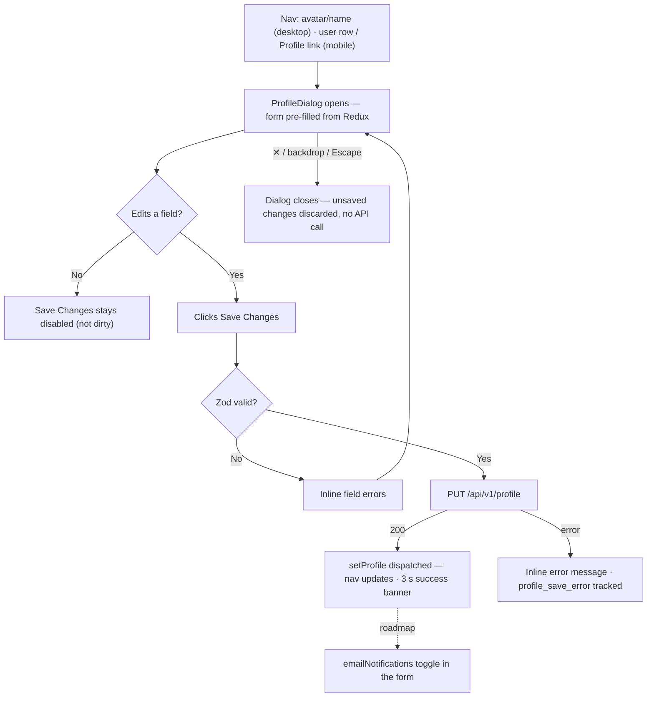
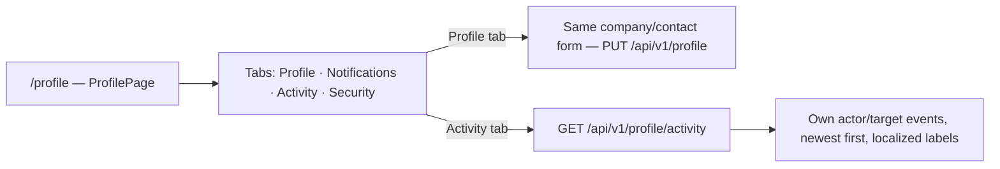

# User Profile — User Journeys

How each app's users move through the profile feature. See [README.md](./README.md) for
the design spec and [feature-spec.md](./feature-spec.md) for the formal requirements.

> Reflects what is **built today** — both journeys are shipped. The one roadmap step
> (`emailNotifications` toggle) is shown dashed.

---

## Table of Contents

- [Factory operator — editing the profile from the nav](#factory-operator--editing-the-profile-from-the-nav)
- [Factory operator — reviewing activity on /profile](#factory-operator--reviewing-activity-on-profile)

---

## Factory operator — editing the profile from the nav

A signed-in operator updates company/contact details without leaving their current page,
via the `ProfileDialog` mounted in `Layout`.

**Guard(s):** authenticated app — Firebase session required; the backend takes the UID
from `middleware.GetUID(r)` and only ever updates the caller's own document. Detail in
[profile-dialog.md](./profile-dialog.md).

---

## Factory operator — reviewing activity on /profile

The same operator visits the standalone `/profile` page to edit the profile in a tab
layout and review their own activity log.

**Guard(s):** authenticated route; the activity endpoint scopes to
`middleware.GetUID(r)` — a UID is never accepted in the body or path, so a user can only
ever see their own events. Detail in [profile-page.md](./profile-page.md).

---

*See [README.md](./README.md) for the feature spec.*

---

*Version: 1.0.0*
*Last updated: 3 July 2026*
