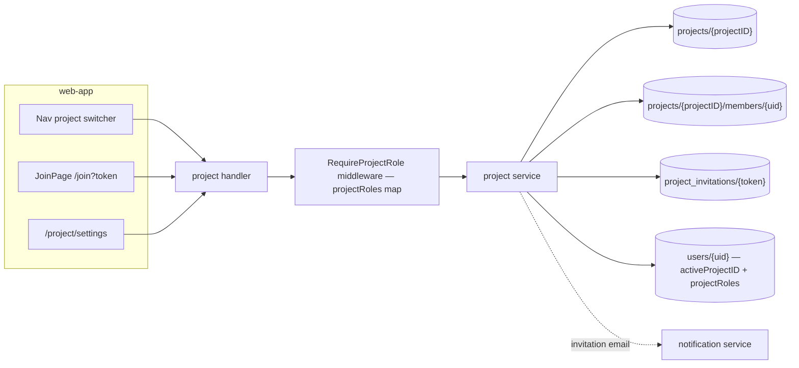

# Project & RBAC — Feature Spec

**Status:** ⚠️ Partially implemented — the end-user surface is still planned (`services/project/` does not exist), but the foundations are live: registration already creates `projects/{companyRegId}` + the Owner member subdoc + the `users/{uid}.projectRoles` map (`services/profile/repository.go`), the backoffice manages projects/members (`/api/v1/backoffice/projects…`), and the backfill exists (`cmd/backfill-projects/main.go`). This folder is the approved design for the rest.

---

## Table of Contents

1. [App surfaces](#app-surfaces)
2. [Summary](#summary)
3. [Goals & Non-Goals](#goals--non-goals)
4. [Current State](#current-state)
5. [Design Overview](#design-overview)
6. [Build Sequence](#build-sequence)
7. [Security Invariants](#security-invariants)
8. [Acceptance Criteria](#acceptance-criteria)
9. [Testing](#testing)
10. [Open Items & Future Work](#open-items--future-work)
11. [References](#references)

---

> Introduces the **Project** — a shared workspace scoped to one company
> (`companyRegId`). Every user owns a home project created at registration and becomes
> its Owner; Owners/System Admins invite existing users into their project with a
> per-project role (Owner / System Admin / Manager / General User). Users can belong to
> many projects with one marked **active**, which scopes all API calls; assessments gain
> a `projectID` so Managers+ can see all member results in a project. A user without an
> account must register (creating their own project) before accepting any invitation.

This README is the design index for the Project & RBAC feature. The formal requirements
live in the ISO 29110 SRS — see [feature-spec.md](./feature-spec.md). Each non-trivial
component is documented in a dedicated sub-document; see [References](#references).

---

## App surfaces

| web-app | backend |
|:-------:|:-------:|
| 📋 | ⚠️ |

Backend foundations exist (projects/members created at registration; backoffice
administration). Planned: `web-app` gains a project switcher in the nav, a public
`JoinPage` at `/join`, and `/project/settings` (General + Members tabs); the backend
gains `services/project/` plus a `RequireProjectRole` middleware. No `web-official`
surface. Planned per-app flows live in [user-journeys.md](./user-journeys.md).

---

## Summary

| Component | Description |
|-----------|-------------|
| **`services/project/`** (backend) | Projects, members subcollection, invitations — full REST surface under `/api/v1/project` |
| **Invitation lifecycle** (backend) | Token-based invites with `pending / accepted / expired / revoked` states, 7-day TTL, single use — see [invitation-lifecycle.md](./invitation-lifecycle.md) |
| **`RequireProjectRole` middleware** (backend) | Per-project RBAC guard reading the `projectRoles` map on the user doc; `X-Project-ID` header override — see [project-role-middleware.md](./project-role-middleware.md) |
| **Project switcher** (web-app) | Nav dropdown listing all memberships with roles; switches `activeProjectID` |
| **`JoinPage`** (web-app) | Public `/join?token=…` — preview, sign-in, register-first, and accept states |
| **Project settings + members pages** (web-app) | `/project/settings` General tab (Owner/System Admin) + Members tab with invite modal, role changes, removal |
| **Migration** (ops) | ✅ Implemented as `cmd/backfill-projects/main.go` — group existing users by `companyRegId`, earliest registrant becomes Owner, backfill `projectID` onto assessments |

**Roles (per project):** Owner · System Admin · Manager · General User. A member can
only assign roles up to their own level; full permission matrix in
[feature-spec.md § 3](./feature-spec.md#3-roles--permission-matrix).

---

## Goals & Non-Goals

### Goals

- One project per `companyRegId` — uniqueness enforced at registration; first registrant becomes Owner.
- Every user owns exactly one home project — there is no user without a project.
- Invite existing users by `projectID` + `role`; unregistered invitees must register their own project first (`403 PROFILE_REQUIRED` otherwise).
- Multi-project membership with one **active** project per user driving API scope; nav switcher to change it.
- Four project roles with clear permission boundaries; members page for role changes and removal; settings page for company profile fields.
- Assessments scoped to the active project — Managers+ see all member assessments (`GET /results?scope=project`); General Users see only their own.
- Bilingual (TH/EN) via `useLocale()`.

### Non-Goals

- SSO / directory sync (SAML, LDAP).
- Per-quiz permission overrides.
- Public / guest access to results.
- Billing or seat limits per project.
- Project deletion (deactivation only — itself future work).

---

## Current State

See [status.md](./status.md) — registration-side foundations and the backfill are
done; the end-user API, middleware, and all web-app surfaces are ❌ not started.
[Build Sequence](#build-sequence) below has the file-level task breakdown.

---

## Design Overview

Registration (`POST /api/v1/profile`, body unchanged) already creates the project +
owner member doc today; the `409 PROJECT_ALREADY_EXISTS` on a taken `companyRegId` is a
**planned change** (today the registrant silently joins the existing project).
Membership writes always update the `members` subdoc (source of truth) and the
denormalized `users/{uid}.projectRoles` map in the same Firestore transaction — the map
avoids a second read on every project-scoped call. Full flows in
[feature-spec.md § 5–6](./feature-spec.md#5-registration--join-flow).

### Data model

| Collection | Document ID | Key fields | Notes |
|------------|-------------|------------|-------|
| `projects` | `<companyRegId>` (13-digit) | `name` · `companyRegId` · `industryType` · `companySize` · `ownerUID` · `memberCount` · `isActive` | Project ID = companyRegId (already unique per company) |
| `projects/{projectID}/members` | `<userID>` | `projectRole` · `joinMethod: "self_registered" \| "invited"` · `invitedBy` · `invitationToken` · `joinedAt` · `isActive` | Source of truth for roles + join history |
| `project_invitations` | `<token>` (UUID v4) | `projectID` · `role` · `email` · `status: pending/accepted/expired/revoked` · `expiresAt` · `acceptedByUID` · `emailSentAt` | 7-day TTL, single use — see [invitation-lifecycle.md](./invitation-lifecycle.md) |
| `users` | `<userID>` | **new:** `activeProjectID: string` · `projectRoles: map<projectID, role>` | Denormalized mirror, written transactionally with the member subdoc |

### API contract

| Method | Path | Auth / Role | Purpose |
|--------|------|-------------|---------|
| `POST` | `/api/v1/profile` | Bearer | (existing — creates project + Owner membership today; planned: `409 PROJECT_ALREADY_EXISTS` on duplicate) |
| `GET` | `/api/v1/project` | Bearer | Active project details incl. caller's `myRole` |
| `GET` | `/api/v1/project/memberships` | Bearer | All projects the caller belongs to |
| `PUT` | `/api/v1/project/active` | Bearer · member | Switch active project (validates membership) |
| `PUT` | `/api/v1/project` | Bearer · `owner`/`system_admin` | Update project settings (name, industry, size) |
| `GET` | `/api/v1/project/members` | Bearer · `manager`+ | List members of the active project |
| `PUT` | `/api/v1/project/members/{uid}/role` | Bearer · `owner`/`system_admin` | Change a member's role (≤ own level) |
| `DELETE` | `/api/v1/project/members/{uid}` | Bearer · `owner`/`system_admin` | Deactivate membership; fixes `activeProjectID` if needed |
| `POST` | `/api/v1/project/invitations` | Bearer · `manager`+ in target project | Create invitation (`email` + `projectID` + `role`) |
| `GET` | `/api/v1/project/invitations` | Bearer · `owner`/`system_admin` | List pending invitations |
| `DELETE` | `/api/v1/project/invitations/{token}` | Bearer · `owner`/`system_admin` | Revoke an invitation |
| `GET` | `/api/v1/project/join/{token}` | Public | Preview invitation (project name, inviter, role, expiry) |
| `POST` | `/api/v1/project/join` | Bearer · profile required | Accept invitation atomically; `403 PROFILE_REQUIRED` without a profile |
| `POST` | `/api/v1/project/transfer` | Bearer · `owner` | Transfer ownership; caller becomes `system_admin` |

Sentinel errors (all in `services/project/`): `ErrProjectNotFound`,
`ErrProjectAlreadyExists`, `ErrMemberNotFound`, `ErrAlreadyMember`,
`ErrInvitationNotFound`, `ErrInvitationAlreadyUsed`, `ErrInvitationExpired`,
`ErrInsufficientRole`, `ErrCannotRemoveOwner`, `ErrNotAMember`, `ErrProfileRequired`.
Full shapes in [feature-spec.md § 8–9](./feature-spec.md#8-backend-api).

### Result scoping

`GET /api/v1/results?scope=project` returns all assessments for the active project for
Manager+; assessments gain a `projectID` field for the Firestore filter
([feature-spec.md § 11](./feature-spec.md#11-result-scoping-changes)).

---

## Build Sequence

Mirrors [feature-spec.md § 19](./feature-spec.md#19-build-order); tracked in
[status.md](./status.md).

| # | Task | File(s) | Depends on |
|---|------|---------|-----------|
| 1 | Project, Member, Invitation structs (⚠️ project/member structs exist in `profile` + `backoffice`; consolidate) | `apps/backend/services/project/models.go` | — |
| 2 | CRUD for projects + members + invitations (⚠️ registration txn + backoffice CRUD exist; invitations new) | `apps/backend/services/project/repository.go` | 1 |
| 3 | Business logic + sentinel errors | `apps/backend/services/project/service.go` | 2 |
| 4 | All REST endpoints | `apps/backend/services/project/handler.go` | 3 |
| 5 | `RequireProjectRole` middleware | `apps/backend/middleware/project_role.go` | 3 |
| 6 | ✅ Create project on first register (remaining: `409` guard + `activeProjectID`) | `apps/backend/services/profile/repository.go` | 2 |
| 7 | `?scope=project` + `projectID` filter | `apps/backend/services/result/handler.go` | 5 |
| 8 | `isProjectMember` via `projectRoles` map | `firestore.rules` | 2 |
| 9 | ✅ Migration script | `apps/backend/cmd/backfill-projects/main.go` | 2 |
| 10 | `activeProjectID`, `projectRoles`, `projectMemberships` | `apps/web-app/src/store/authSlice.ts` | — |
| 11 | `selectActiveProjectRole` selector | `apps/web-app/src/store/authSlice.ts` | 10 |
| 12 | `ProjectRoleGuard` | `apps/web-app/src/components/` | 11 |
| 13 | `JoinPage` (new + existing users) | `apps/web-app/src/pages/JoinPage.tsx` | 10 |
| 14 | Project switcher in nav | `apps/web-app/src/components/` | 10 |
| 15 | `ProjectSettingsPage` (General tab) | `apps/web-app/src/pages/ProjectSettingsPage.tsx` | 12 |
| 16 | `ProjectMembersPage` + `InviteModal` | `apps/web-app/src/pages/ProjectMembersPage.tsx` | 12 |
| 17 | Invitation email template | `apps/backend/services/notification/` | 4 |

---

## Security Invariants

| Invariant | Where enforced |
|-----------|----------------|
| UID taken from `middleware.GetUID(r)`, never the request body/path | `services/project/handler.go` |
| Role checks read `users/{uid}.projectRoles` server-side; `403 FORBIDDEN` on insufficient role or non-membership | `middleware/project_role.go` |
| Role assignment capped at the caller's own level; Owner cannot be removed or demoted (transfer first) | `services/project/service.go` |
| Invitation acceptance is a single Firestore transaction — concurrent accepts of one token cannot duplicate a member | `services/project/service.go` |
| Token validation order: not-found → already-used → expired (used wins over expired) | `services/project/service.go` (`ValidateInvitationToken`) |
| Accepting requires an existing profile — `403 PROFILE_REQUIRED` otherwise | `services/project/service.go` |
| Public join preview reveals only project name, inviter name, role, expiry — never members or assessments | `services/project/handler.go` |
| Firestore rules: `projects` + `members` readable by members only (via `projectRoles` map), writable by backend only; `project_invitations` backend-only | `firestore.rules` |

---

## Acceptance Criteria

Mirrors [feature-spec.md § 18](./feature-spec.md#18-acceptance-criteria) — all open
(foundations exist but none of the criteria are test-verified yet):

**Registration & join** — see [invitation-lifecycle.md](./invitation-lifecycle.md)
- [ ] Registering with a new `companyRegId` creates a project; user becomes Owner.
- [ ] Registering with an existing `companyRegId` returns `409 PROJECT_ALREADY_EXISTS` directing the user to request an invitation.
- [ ] `POST /project/invitations` requires `projectID` + `role`; caller must hold at least Manager in that project.
- [ ] A user with an existing profile can accept an invitation and gain a second membership without losing the first.
- [ ] `POST /project/join` returns `403 PROFILE_REQUIRED` when the caller has no profile.
- [ ] `JoinPage` shows the register-first state with a "Create my project →" link to `/register?next=/join?token=<t>`.
- [ ] Invite link previews project name and role before sign-in; reveals no member list or assessment data.
- [ ] An expired token returns `410 INVITATION_EXPIRED`; an already-used token returns `409 INVITATION_ALREADY_USED` even if also expired.
- [ ] Accepting is atomic — a concurrent second accept of the same token returns `409 INVITATION_ALREADY_USED` with no duplicate member.

**RBAC & scoping** — see [project-role-middleware.md](./project-role-middleware.md)
- [ ] `PUT /project/active` switches the scoped project; subsequent API calls use the new context.
- [ ] The nav switcher shows all memberships with roles; the active project is checked.
- [ ] Owner can invite, remove, and change roles for any member; System Admin cannot assign or surpass Owner.
- [ ] Manager can invite but cannot remove members or change roles; General User sees no project management UI and cannot access `/project/settings`.
- [ ] `GET /api/v1/results?scope=project` returns all active-project assessments for Manager+.
- [ ] Removing a member also removes their `projectRoles[projectID]` entry and updates `activeProjectID` if needed.
- [ ] Role changes update the `members` subdoc and `users/{uid}.projectRoles` atomically.
- [ ] All copy renders in TH/EN via `useLocale()`; `make lint` and `make test` pass.

---

## Testing

The test plan lives in [test-plan.md](./test-plan.md) (ISO 29110 SI.4-5) — write tests
TDD-first before implementation. Expected suites follow the build sequence:

| Package | Target | Notes |
|---------|--------|-------|
| `services/project/service_test.go` | Invitation validation order, transactional accept, role-cap rules, owner protection | Table-driven; assert every sentinel-error deny path |
| `services/project/handler_test.go` | 401/403/404/409/410 mapping per endpoint | Incl. `PROFILE_REQUIRED` and public preview |
| Vitest / Playwright | Switcher, `JoinPage` three states, settings/members pages, `ProjectRoleGuard` redirects | |

Coverage target: critical `services/` ≥ 80% (`go test ./... -cover`).

---

## Open Items & Future Work

From [feature-spec.md § 17](./feature-spec.md#17-open-tasks):

| # | Area | Description |
|---|------|-------------|
| 1 | Project deactivation | Owner can deactivate (not delete) a project; hidden from the switcher. Backoffice-side deactivate/reactivate already exists — this is the Owner-facing control |
| 2 | Bulk invite | CSV upload of emails + roles for batch invitations |
| 3 | Email preferences per role | Managers get an email summary of new assessments, configurable per member |
| 4 | Cross-project admin view | System admin (`role == "admin"`) inspects any project without membership |

### Blocked on other features

| # | Area | Description |
|---|------|-------------|
| 1 | Migration | ✅ Done — `cmd/backfill-projects/main.go` groups existing users into projects and backfills `projectID` onto assessments; result scoping is unblocked |

### Open decisions

None recorded in the spec — implementation starts at Build Sequence step 1.

---

## References

### Sub-documents

| Doc | Covers |
|-----|--------|
| [feature-spec.md](./feature-spec.md) | ISO 29110 SRS — formal requirements, permission matrix, full API + data model |
| [status.md](./status.md) | Current implementation status per component |
| [test-plan.md](./test-plan.md) | ISO 29110 test plan — unit / integration / e2e cases (SI.4-5) |
| [user-journeys.md](./user-journeys.md) | Planned per-app user flows (all roadmap) |
| [invitation-lifecycle.md](./invitation-lifecycle.md) | Invitation token states, TTL, validation order (backend) |
| [project-role-middleware.md](./project-role-middleware.md) | `RequireProjectRole` middleware + `projectRoles` map (backend) |
| [mockups/app.md](./mockups/app.md) | ASCII wireframes — switcher, join page, settings, invite modal (planned) |

### ISO 29110 artifacts

- Test plan: [test-plan.md](./test-plan.md)
- Scope changes → [docs/iso29110/change-request-log.md](../../iso29110/change-request-log.md)
- New risks → [docs/iso29110/risk-register.md](../../iso29110/risk-register.md)

### Cross-references

- [Register](../register/feature-spec.md) — registration creates the home project
- [Auth](../auth/feature-spec.md) — guards + system-level roles
- [Profile](../profile/feature-spec.md) — `users/{uid}` doc gaining `activeProjectID` + `projectRoles`
- [Admin](../admin/feature-spec.md) — system-level admin remains separate from project RBAC
- [Result](../result/feature-spec.md) — assessment scoping (`?scope=project`)
- [Notification](../notification/feature-spec.md) — invitation email delivery

---

*Version: 1.1.0*
*Last updated: 4 July 2026*
