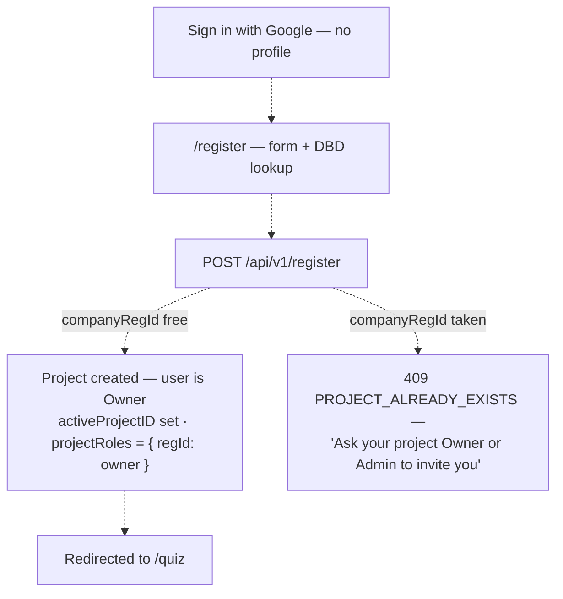
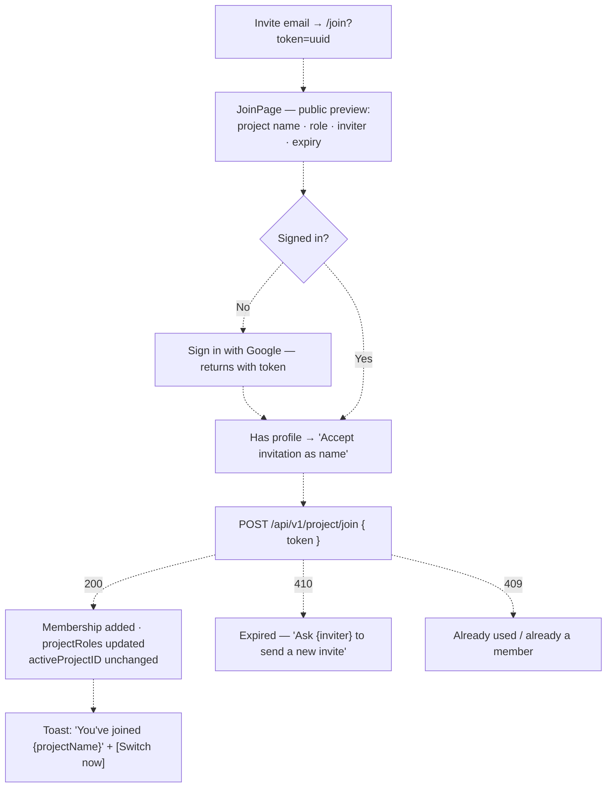
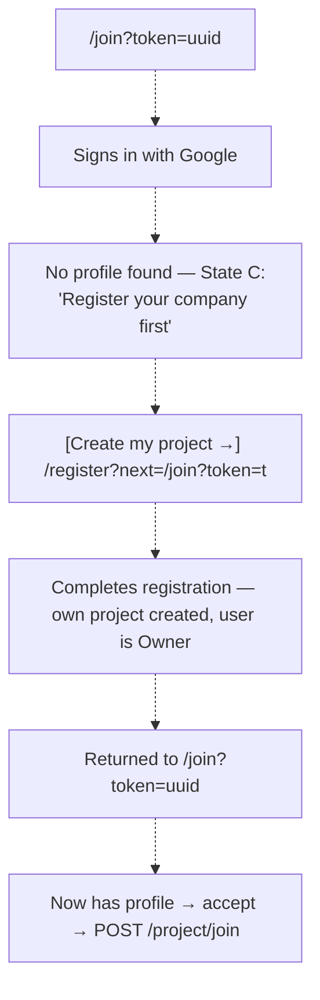
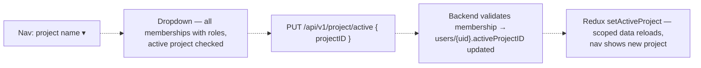
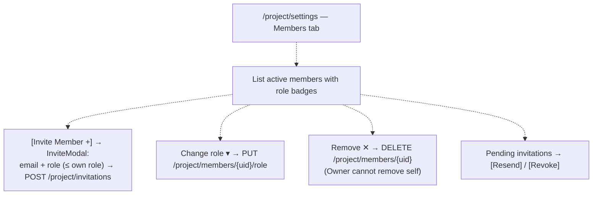

# Project & RBAC — User Journeys

How each app's users will move through projects. See [README.md](./README.md) for the
design spec and [feature-spec.md](./feature-spec.md) for the formal requirements.

> **Nothing below is built today** — the entire feature is planned (📋), so every flow
> is roadmap and shown dashed.

---

## Table of Contents

- [Factory operator — registering creates their own project](#factory-operator--registering-creates-their-own-project)
- [Invited user — already has an account](#invited-user--already-has-an-account)
- [Invited user — no account yet](#invited-user--no-account-yet)
- [Any member — switching the active project](#any-member--switching-the-active-project)
- [Owner / System Admin — managing members](#owner--system-admin--managing-members)

---

## Factory operator — registering creates their own project

Every user's first step — there is no user without a project.

**Guard(s):** Firebase session required; project uniqueness enforced server-side on
`companyRegId`. Detail in [feature-spec.md § 5.1](./feature-spec.md#5-registration--join-flow).

---

## Invited user — already has an account

An existing user gains a second membership; their active project does not change
automatically.

**Guard(s):** Bearer token required to accept; the join transaction is atomic (token,
member doc, `projectRoles` map). Detail in
[invitation-lifecycle.md](./invitation-lifecycle.md).

---

## Invited user — no account yet

Registration first — there is no path that creates a user profile from an invitation.

**Guard(s):** `POST /project/join` returns `403 PROFILE_REQUIRED` while no
`users/{uid}` document exists. Detail in
[invitation-lifecycle.md](./invitation-lifecycle.md).

---

## Any member — switching the active project

One project is active per user and scopes all API calls.

**Guard(s):** backend rejects non-members with `403` (`ErrNotAMember`). Role for the
new context comes from `projectRoles[activeProjectID]` — see
[project-role-middleware.md](./project-role-middleware.md).

---

## Owner / System Admin — managing members

Member administration is scoped to the active project.

**Guard(s):** route gated by `ProjectRoleGuard` (Members: `manager`+; Settings:
`system_admin`+); every mutation re-checked server-side by `RequireProjectRole`. Detail
in [project-role-middleware.md](./project-role-middleware.md).

---

*See [README.md](./README.md) for the feature spec.*

---

*Version: 1.0.0*
*Last updated: 3 July 2026*
