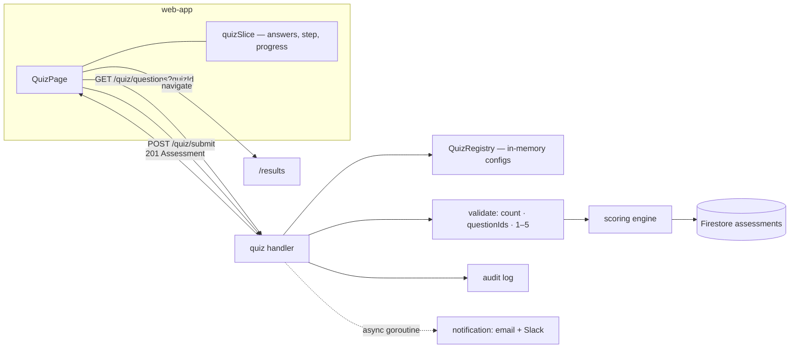

# Quiz (Assessment) — Feature Spec

**Status:** ✅ Shipped — five quiz variants live end to end: config-driven questions, server-side scoring, Firestore persistence, notifications, audit log.

---

## Table of Contents

1. [App surfaces](#app-surfaces)
2. [Summary](#summary)
3. [Goals & Non-Goals](#goals--non-goals)
4. [Current State](#current-state)
5. [Design Overview](#design-overview)
6. [Security Invariants](#security-invariants)
7. [Acceptance Criteria](#acceptance-criteria)
8. [Testing](#testing)
9. [Open Items & Future Work](#open-items--future-work)
10. [References](#references)

---

> Multi-variant, dimension-based factory health assessment — the core domain of the
> platform. A factory operator answers rubric-graded questions grouped by dimension
> (tabs); the backend validates, computes weighted scores, assigns a diagnosis
> (Beginning → Advanced), stores the result in Firestore, and fires email + Slack
> notifications plus an audit log entry. The question set is driven entirely by JSON
> configs — five variants are registered, with the 8-dimension Shindan quiz as default.
> All content is bilingual (TH/EN).

This README is the design index for the Quiz feature. The formal requirements live in
the ISO 29110 SRS — see [feature-spec.md](./feature-spec.md). Each non-trivial component
is documented in a dedicated sub-document; see [References](#references).

---

## App surfaces

| web-app | backend |
|:-------:|:-------:|
| ✅ | ✅ |

`web-app` renders `QuizPage` (dimension tabs, question cards, progress bar) backed by
`quizSlice`; the backend serves `services/quiz/` + `services/scoring/` and the bundled
question configs. No `web-official` surface. Per-app flows live in
[user-journeys.md](./user-journeys.md).

---

## Summary

| Component | Description |
|-----------|-------------|
| **Quiz configs + registry** (backend) | Five `questions*.json` variants loaded into `scoring.QuizRegistry` at startup — no hard-coded questions — see [quiz-config.md](./quiz-config.md) |
| **Scoring engine** (backend) | Weighted dimension averages, overall score, strengths/weaknesses, diagnosis — computed server-side only — see [scoring-engine.md](./scoring-engine.md) |
| **`QuizPage` + `quizSlice`** (web-app) | Dimension-tabbed single-page quiz with free navigation, progress bar, rubric/grade rendering, exit confirmation — see [quiz-page.md](./quiz-page.md) |
| **Submit pipeline** (backend) | Validate → score → persist `assessments` doc → audit log → async email + Slack via `notification.Service.NotifyQuizResult` |

**Quiz variants** (all registered at startup; default `"shindan"`):

| Quiz ID | File | Version | Dimensions | Questions |
|---------|------|---------|------------|-----------|
| `shindan` | `questions.json` | 2.0.0 | 8 | 43 |
| `factory` | `questions-factory.json` | 1.0.0 | 7 | 49 |
| `cybersecurity` | `questions-cybersecurity.json` | 1.0.0 | 8 | 51 |
| `lean` | `questions-lean.json` | 1.0.0 | 12 | 29 |
| `iso29110` | `questions-iso29110.json` | 1.0.0 | 8 | 38 |

---

## Goals & Non-Goals

### Goals

- Single-page, dimension-tabbed quiz UX with animated step transitions and free navigation between dimensions.
- Rubric-graded answers (per-question descriptors) or numeric scale (1–5); grade labels A–F for the `factory` variant.
- Real-time progress bar; submit blocked until every question is answered.
- Scoring computed server-side (never on the client) — weighted average per dimension, overall average, strengths/weaknesses, diagnosis.
- Result persisted in Firestore and returned in the submit response.
- Email + Slack notification and an audit log entry on every successful submission.
- TH/EN bilingual — questions, rubric labels, dimension names.

### Non-Goals

- Saving partial progress between sessions (answers live in Redux; a hard refresh resets them).
- Re-taking the quiz without admin intervention (result is stored once; re-submission would need a separate assessment ID strategy).
- Question branching / conditional logic.
- Time limits.

---

## Current State

See [status.md](./status.md) for the per-component implementation checklist. Everything
in scope is shipped.

---

## Design Overview

Questions load once per session (`questionsLoaded` in Redux, reset by `resetQuiz()`).
The full load/submit sequences are in [feature-spec.md § 9](./feature-spec.md#9-data-flow);
the config format is in [quiz-config.md](./quiz-config.md); the algorithm is in
[scoring-engine.md](./scoring-engine.md).

### Scoring at a glance

| Step | Rule |
|------|------|
| Dimension score | `Σ(answer × weight) / Σ(weight)`, rounded to 2 dp, max 5.0 |
| Overall score | Mean of dimension scores, rounded to 2 dp |
| Strength / weakness | ≥ 3.50 strength · < 2.50 weakness · between = neutral (not listed) |
| Diagnosis | ≥ 4.00 Advanced · ≥ 3.00 Established · ≥ 2.00 Developing · < 2.00 Beginning |

### Data model

| Collection | Document ID | Key fields | Notes |
|------------|-------------|------------|-------|
| `assessments` | UUID v4 | `uid` · `quizId` · `answers: [{questionId, value}]` · `scores: [{dimensionId, dimensionName, dimensionNameTh, score, maxScore}]` · `overallScore` · `strengths` · `weaknesses` · `diagnosis` · `submittedAt` | Full answer log stored alongside computed scores |

### API contract

| Method | Path | Auth / Role | Purpose |
|--------|------|-------------|---------|
| `GET` | `/api/v1/quiz/quizzes` | Bearer | List available quiz variants (`id`, `nameTh`, `nameEn`) |
| `GET` | `/api/v1/quiz/questions?quizId=shindan` | Bearer | Full config for one variant — dimensions + questions + rubrics |
| `POST` | `/api/v1/quiz/submit` | Bearer | Validate answers, score, persist; returns `201` with the full assessment |

Sentinel errors: `ErrIncompleteAnswers` (400 — answer count mismatch), `ErrInvalidAnswer`
(400 — unknown questionId or value outside 1–5), `ErrQuizNotFound` (404 — unknown
`quizId`). Full request/response shapes in
[feature-spec.md § 11](./feature-spec.md#11-backend-api).

---

## Security Invariants

| Invariant | Where enforced |
|-----------|----------------|
| UID taken from `middleware.GetUID(r)`, never the request body/path | `services/quiz/handler.go` |
| Scoring is computed server-side only — the client never sends scores or a diagnosis | `services/quiz/service.go` + `services/scoring/scoring.go` |
| Every submission is validated: answer count == expected, all questionIds known, values 1–5 | `services/quiz/service.go` |
| Notifications are fired async (goroutine) — a notification failure never blocks or leaks into the submit response | `services/quiz/service.go` |

---

## Acceptance Criteria

Mirrors [feature-spec.md § 16](./feature-spec.md#16-acceptance-criteria):

**Quiz UX (web-app)** — see [quiz-page.md](./quiz-page.md)
- [x] Questions and dimensions load on `/quiz` for the default `shindan` quiz.
- [x] A Skeleton is shown while loading; the quiz renders only after `questionsLoaded` is true.
- [x] Each dimension tab shows a checkmark badge when all its questions are answered.
- [x] Progress bar reflects total answered / total questions across all dimensions.
- [x] Answered question cards show a highlighted border and a filled question number badge.
- [x] The "Submit" button is disabled until every question across all dimensions is answered.
- [x] Clicking "✕ Exit" opens a confirmation dialog; "Leave" resets answers and redirects to `/`.
- [x] For the `factory` quiz, rubric options render A → F (best to worst); for all others, 1 → 5.
- [x] Questions with no rubric render 5 compact numeric buttons (1–5).
- [x] Prev/Next navigation scrolls to the top of the page.
- [x] All dimension names, question text, and rubric labels render in the active locale (TH/EN).

**Submit pipeline (backend)** — see [scoring-engine.md](./scoring-engine.md)
- [x] Submitting sends all answers to `POST /quiz/submit` with the correct `quizId`.
- [x] On success, the user is navigated to `/results` and `hasCompletedQuiz` is set to `true`.
- [x] Slack and email notifications fire after successful submission (async — does not block the response).
- [x] An audit log entry is written for every submission.
- [x] `make test-api` passes (scoring unit tests cover edge cases).

---

## Testing

From [feature-spec.md § 17](./feature-spec.md#17-testing):

| Suite | Target | Notes |
|-------|--------|-------|
| `services/scoring/scoring_test.go` | `ComputeScores` (all 5s → Advanced; mixed → correct strengths/weaknesses); `DetermineDiagnosis` boundaries (1.99 / 2.00 / 3.00 / 4.00) | |
| Vitest — `quizSlice.test.ts` | `setAnswer`, `resetQuiz`, `setCurrentStep`, derived `allAnswered` | |
| `services/quiz/service_test.go` | Correct count → 201; wrong count → `ErrIncompleteAnswers`; unknown quizId → `ErrQuizNotFound`; value 0 or 6 → `ErrInvalidAnswer` | |
| Playwright E2E | Answer all → submit → `/results` shows diagnosis; one unanswered → submit stays disabled | |

Coverage target: critical `services/` ≥ 80% (`go test ./... -cover`).

---

## Open Items & Future Work

Non-goals that may become future work (no committed roadmap in the spec):

| # | Area | Description |
|---|------|-------------|
| 1 | Draft save | Persist partial progress between sessions (answers currently reset on hard refresh) |
| 2 | Re-take strategy | Allow re-submission with a separate assessment ID instead of admin intervention |

### Open decisions

None — feature is shipped; changes go through a new CR.

---

## References

### Sub-documents

| Doc | Covers |
|-----|--------|
| [feature-spec.md](./feature-spec.md) | ISO 29110 SRS — formal requirements, full dimension tables, API shapes |
| [status.md](./status.md) | Current implementation status per component |
| [user-journeys.md](./user-journeys.md) | Per-app user flows (operator taking the assessment) |
| [quiz-config.md](./quiz-config.md) | Question config format + `QuizRegistry` (backend) |
| [scoring-engine.md](./scoring-engine.md) | Scoring algorithm — weighted averages, diagnosis (backend) |
| [quiz-page.md](./quiz-page.md) | `QuizPage` + `quizSlice` — UX, navigation, rendering rules (web-app) |
| [mockups/app.md](./mockups/app.md) | ASCII wireframes — quiz screens and states (web-app) |

### ISO 29110 artifacts

- Scope changes → [docs/iso29110/change-request-log.md](../../iso29110/change-request-log.md)
- New risks → [docs/iso29110/risk-register.md](../../iso29110/risk-register.md)

### Cross-references

- [Result](../result/feature-spec.md) — renders the stored assessment on `/results`
- [Notification](../notification/feature-spec.md) — email + Slack delivery on submission
- [Audit](../audit/feature-spec.md) — `EventAssessmentSubmitted` log entries
- [User flow](../user-flow.md) — end-to-end platform flow
- [Architecture overview](../../architecture/overview.md)

---

*Version: 1.0.0*
*Last updated: 3 July 2026*
