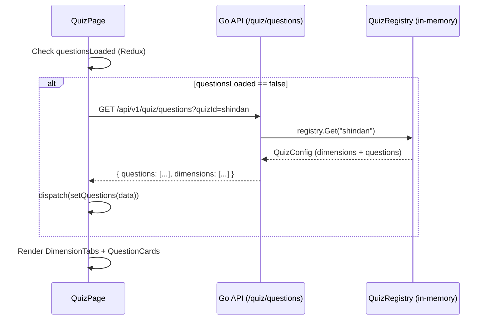
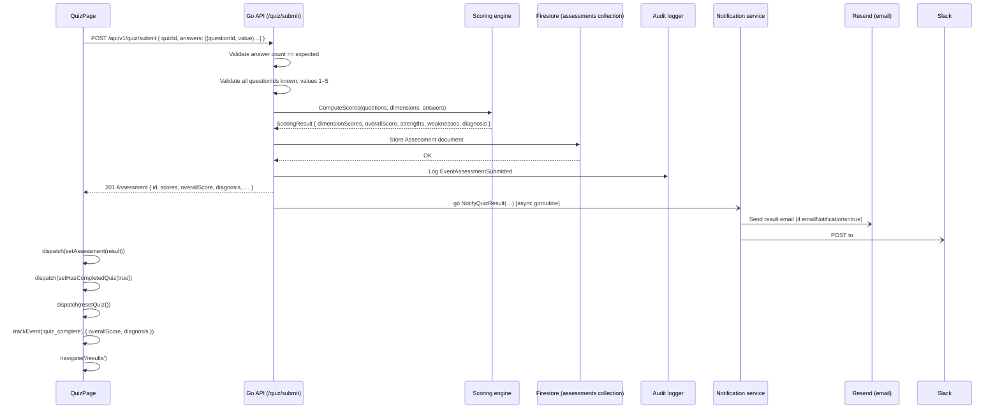

# Quiz (Assessment) — Feature Spec

> Multi-variant, dimension-based factory health assessment. Users answer a set
> of rubric-graded questions grouped by dimension; the backend computes weighted
> scores, assigns a diagnosis, and stores the result in Firestore.

---

## 1. Summary

The quiz is a step-by-step assessment consisting of dimensions (tabs) and
questions (cards). The user navigates dimension by dimension, selects one
answer per question, and submits when all questions are answered. The backend
validates, scores, and persists the result, then fires notifications
(email + Slack).

The question set and dimension structure are driven entirely by a JSON config
file — no hard-coded questions in the codebase. Multiple quiz variants are
supported via a `quizId` parameter; the default is `"shindan"`.

---

## 2. Goals & Non-Goals

### Goals

- Single-page, dimension-tabbed quiz UX with animated step transitions.
- Rubric-graded answers (per-question descriptors) or numeric scale (1–5).
- Real-time progress bar tracking total answered / total questions.
- Free navigation between dimensions — users can jump to any tab at any time.
- Submit blocked until every question is answered.
- Scoring computed server-side (never on the client) — weighted average per dimension, overall average, strengths/weaknesses, diagnosis.
- Result persisted in Firestore and returned in the submit response.
- Email + Slack notification on successful submission.
- Audit log entry on every submission.
- TH/EN bilingual — questions, rubric labels, dimension names.
- Grade label rendering (A/B/C/D/F) for the `factory` quiz variant.

### Non-Goals

- Saving partial progress between sessions (answers live in Redux; a hard refresh resets them).
- Re-taking the quiz without admin intervention (result is stored once; future re-submission would need a separate assessment ID strategy).
- Question branching / conditional logic.
- Time limits.

---

## 3. Current State

| Component | Location | Status |
|-----------|----------|--------|
| Quiz page | `apps/fs-app-web/src/pages/QuizPage.tsx` | ✅ Built |
| Quiz Redux slice | `apps/fs-app-web/src/store/quizSlice.ts` | ✅ Built |
| Backend handler | `apps/fs-backend/services/quiz/handler.go` | ✅ Built |
| Backend service | `apps/fs-backend/services/quiz/service.go` | ✅ Built |
| Quiz models | `apps/fs-backend/services/quiz/models.go` | ✅ Built |
| Scoring engine | `apps/fs-backend/services/scoring/scoring.go` | ✅ Built |
| Scoring models | `apps/fs-backend/services/scoring/models.go` | ✅ Built |
| Quiz configs | `apps/fs-backend/config/questions*.json` | ✅ Built (5 variants) |
| Quiz registry | `scoring.QuizRegistry` in `scoring.go` | ✅ Built |
| Notifications (email + Slack) | `notification.Service.NotifyQuizResult` | ✅ Built |
| Audit logging | `audit.Logger.Log` on submit | ✅ Built |

---

## 4. Quiz Variants

Five quiz configs are bundled in `apps/fs-backend/config/`. All are registered
in the `QuizRegistry` at startup.

| Quiz ID | File | Version | Dimensions | Questions | Display name |
|---------|------|---------|------------|-----------|--------------|
| `shindan` | `questions.json` | 2.0.0 | 8 | 43 | FactorySync Solutions (Shindan) |
| `factory` | `questions-factory.json` | 1.0.0 | 7 | 49 | Factory Assessment |
| `cybersecurity` | `questions-cybersecurity.json` | 1.0.0 | 8 | 51 | Cybersecurity Assessment |
| `lean` | `questions-lean.json` | 1.0.0 | 12 | 29 | Lean Business Assessment |
| `iso29110` | `questions-iso29110.json` | 1.0.0 | 8 | 38 | ISO 29110 Software Process Assessment |

**Default quiz:** `"shindan"` — set as `quizId` initial state in `quizSlice`.

### Shindan dimensions (default quiz)

| # | Dimension ID | TH | EN | Questions |
|---|-------------|----|----|-----------|
| 1 | `basic-management` | การจัดการงานเบื้องต้น | Basic Management | 6 |
| 2 | `work-improvement` | การปรับปรุงการทำงาน | Work Improvement | 4 |
| 3 | `coordination` | การประสานงาน | Coordination | 4 |
| 4 | `maintenance` | การบำรุงรักษา | Maintenance (TPM) | 4 |
| 5 | `quality-control` | การควบคุมคุณภาพ/การประกันคุณภาพ | Quality Control & Assurance | 6 |
| 6 | `production-delivery` | การผลิต การควบคุม การส่งมอบ | Production, Control & Delivery | 8 |
| 7 | `material-control` | การควบคุมวัสดุ | Material Control | 5 |
| 8 | `cost-control` | การควบคุมต้นทุน | Cost Control | 6 |

### Factory dimensions

| # | Dimension ID | EN | Questions |
|---|-------------|----|-----------|
| 1 | `vision-leadership` | Vision & Leadership | 7 |
| 2 | `financial-stability` | Financial & Business Stability | 7 |
| 3 | `production-efficiency` | Production Process & Operational Efficiency | 7 |
| 4 | `supply-chain` | Supply Chain & Logistics Management | 7 |
| 5 | `quality-safety` | Quality, Safety & Compliance Management | 7 |
| 6 | `technology-digital` | Technology, Digital & Data Management | 7 |
| 7 | `people-capability` | People, Organization & Capability Development | 7 |

---

## 5. Question Config Format

Each question in `questions*.json` has the following shape:

```jsonc
{
  "id": "bm-1",                     // unique, kebab-case
  "dimensionId": "basic-management",// must match a dimension id
  "textTh": "5 ส.",
  "textEn": "5S (Sort, Set, Shine, Standardize, Sustain)",
  "descriptionTh": "...",           // optional — shown as a note below the question
  "descriptionEn": "...",
  "weight": 1.0,                    // per-question weight for weighted average
  "rubric": {                       // optional — if omitted, numeric buttons (1–5) are shown
    "1": { "th": "สับสน",            "en": "Confused / no system" },
    "2": { "th": "กำลังวางแผน",     "en": "Planning stage" },
    "3": { "th": "ลงมือทำแต่ยังไม่สมบูรณ์", "en": "Implementing but not yet complete" },
    "4": { "th": "มีการตรวจเช็คและยกระดับ", "en": "Check and raise standards" },
    "5": { "th": "มีการแก้ไขและป้องกัน",    "en": "Corrective and preventive actions" }
  }
}
```

---

## 6. Answer Scale & Rendering

Every answer is an integer 1–5. How the options are rendered depends on
whether the question has a rubric and which quiz is active.

| Condition | Rendering | Option labels |
|-----------|-----------|---------------|
| Has rubric + `quizId != 'factory'` | Descriptive buttons (full rubric text), rendered 1 → 5 | Numeric `1`–`5` |
| Has rubric + `quizId == 'factory'` | Descriptive buttons, rendered 5 → 1 (best first) | Grade `A`–`F` |
| No rubric | 5 compact numeric buttons | `1`–`5` |

Grade label map (factory quiz only):

| Value | Label |
|-------|-------|
| 5 | A |
| 4 | B |
| 3 | C |
| 2 | D |
| 1 | F |

---

## 7. UI Layout & Navigation

```
┌─────────────────────────────────────────────────────┐
│ Quiz title              [answered/total] [✕ Exit]   │
│ ▓▓▓▓▓▓▓▓▓▓▓▒▒▒▒▒▒▒▒▒▒  ← progress bar              │
│                                                     │
│ [Dim 1✓] [Dim 2✓] [Dim 3 active] [Dim 4] …         │  ← DimensionTabs
│                                                     │
│ Dimension name (EN/TH)              answered/total  │  ← DimensionHeader
│                                                     │
│ ┌───────────────────────────────────────────────┐   │
│ │ [1] Question text (primary locale)            │   │  ← QuestionCard
│ │     Question text (secondary locale)          │   │
│ │     [optional description]                    │   │
│ │                                               │   │
│ │  [A] Rubric option A                          │   │
│ │  [B] Rubric option B  ← selected             │   │
│ │  [C] Rubric option C                          │   │
│ └───────────────────────────────────────────────┘   │
│ ┌───────────────────────────────────────────────┐   │
│ │ [2] Next question …                           │   │
│ └───────────────────────────────────────────────┘   │
│                                                     │
│ [← Previous]                    [Next →] / [Submit] │  ← QuizNavigation
└─────────────────────────────────────────────────────┘
```

### Navigation rules

| State | Behaviour |
|-------|-----------|
| First dimension | "Previous" button is disabled |
| Last dimension | "Next" replaced by "Submit" |
| Submit button | Disabled until all questions across ALL dimensions are answered |
| Any dimension tab | Clickable at any time — free navigation |
| Step change | `window.scrollTo({ top: 0 })` on prev/next |
| Dimension tab complete | Green badge + checkmark icon on the tab |

### Exit confirmation

Clicking "✕ Exit" opens a shadcn/ui `Dialog` asking the user to confirm.
Confirming calls `dispatch(resetQuiz())` then `navigate('/')`.
Answers are lost — there is no draft save.

---

## 8. Redux State (`quizSlice`)

```ts
interface QuizState {
  quizId:          string               // active quiz variant ("shindan" by default)
  questions:       QuizQuestion[]       // loaded from API
  dimensions:      QuizDimension[]      // loaded from API
  answers:         Record<string, number>  // questionId → value (1–5)
  currentStep:     number               // index into dimensions[]
  isSubmitting:    boolean
  questionsLoaded: boolean
  availableQuizzes: QuizListItem[]
}
```

### Actions

| Action | Effect |
|--------|--------|
| `setQuizId(id)` | Switch active quiz variant |
| `setQuestions({ questions, dimensions })` | Populate from API response; sets `questionsLoaded = true` |
| `setAvailableQuizzes(list)` | Populate quiz picker |
| `setAnswer({ questionId, value })` | Record or update one answer |
| `setCurrentStep(n)` | Jump to dimension `n` |
| `setSubmitting(bool)` | Toggle submit spinner |
| `resetQuiz()` | Clear answers, step, submitting, questionsLoaded (keeps `quizId`) |

---

## 9. Data Flow

### 9.1 Loading questions



Questions are loaded once per session. `questionsLoaded` is reset by
`resetQuiz()` so re-entering the quiz page fetches fresh data.

### 9.2 Submitting



---

## 10. Scoring Algorithm

Implemented in `apps/fs-backend/services/scoring/scoring.go`.

### Step 1 — Dimension score

For each dimension, compute a **weighted average** of its questions:

```
dimensionScore = Σ(answer.value × question.weight) / Σ(question.weight)
```

Rounded to 2 decimal places. `maxScore` is always `5.0`.

### Step 2 — Overall score

```
overallScore = Σ(dimensionScore) / numberOfDimensions
```

Rounded to 2 decimal places.

### Step 3 — Strengths and weaknesses

| Condition | Classification |
|-----------|----------------|
| `dimensionScore >= 3.50` | Strength |
| `dimensionScore < 2.50` | Weakness |
| `2.50 ≤ score < 3.50` | Neutral (not listed) |

### Step 4 — Diagnosis

| Overall score | Diagnosis |
|--------------|-----------|
| ≥ 4.00 | `"Advanced"` |
| ≥ 3.00 | `"Established"` |
| ≥ 2.00 | `"Developing"` |
| < 2.00 | `"Beginning"` |

---

## 11. Backend API

### GET `/api/v1/quiz/quizzes` — List available quizzes

**Auth:** Firebase ID token (Bearer)

**Response — 200**
```jsonc
{
  "success": true,
  "data": [
    { "id": "shindan", "nameTh": "แบบประเมินสุขภาพโรงงาน (ชินดัน)", "nameEn": "FactorySync Solutions (Shindan)" },
    { "id": "factory", "nameTh": "...", "nameEn": "Factory Assessment" }
  ]
}
```

---

### GET `/api/v1/quiz/questions?quizId=shindan` — Get questions

**Auth:** Firebase ID token (Bearer)

**Query params**

| Param | Default | Description |
|-------|---------|-------------|
| `quizId` | `"shindan"` | Which quiz config to return |

**Response — 200**
```jsonc
{
  "success": true,
  "data": {
    "id": "shindan",
    "version": "2.0.0",
    "nameTh": "...",
    "nameEn": "...",
    "dimensions": [
      { "id": "basic-management", "nameTh": "...", "nameEn": "Basic Management", "weight": 1.0 }
    ],
    "questions": [
      {
        "id": "bm-1",
        "dimensionId": "basic-management",
        "textTh": "5 ส.",
        "textEn": "5S (Sort, Set, Shine, Standardize, Sustain)",
        "weight": 1.0,
        "rubric": { "1": { "th": "...", "en": "..." }, … }
      }
    ]
  }
}
```

**Errors**

| HTTP | Code | Condition |
|------|------|-----------|
| 401 | `UNAUTHORIZED` | Missing/invalid token |
| 404 | `NOT_FOUND` | Unknown `quizId` |

---

### POST `/api/v1/quiz/submit` — Submit answers

**Auth:** Firebase ID token (Bearer)

**Request body**
```jsonc
{
  "quizId": "shindan",
  "answers": [
    { "questionId": "bm-1", "value": 4 },
    { "questionId": "bm-2", "value": 3 }
    // … one entry for every question
  ]
}
```

**Response — 201**
```jsonc
{
  "success": true,
  "data": {
    "id": "uuid-v4",
    "uid": "firebase-uid",
    "quizId": "shindan",
    "overallScore": 3.47,
    "diagnosis": "Established",
    "strengths": ["Quality Control & Assurance"],
    "weaknesses": ["Cost Control"],
    "scores": [
      {
        "dimensionId": "basic-management",
        "dimensionName": "Basic Management",
        "dimensionNameTh": "การจัดการงานเบื้องต้น",
        "score": 3.83,
        "maxScore": 5.0
      }
    ],
    "submittedAt": "2026-06-10T09:00:00Z"
  }
}
```

**Errors**

| HTTP | Code | Condition |
|------|------|-----------|
| 400 | `VALIDATION_ERROR` | Answer count != expected, unknown questionId, value outside 1–5 |
| 401 | `UNAUTHORIZED` | Missing/invalid token |
| 404 | `NOT_FOUND` | Unknown `quizId` |
| 500 | `INTERNAL_ERROR` | Firestore write failure |

---

## 12. Firestore Document (Assessment)

Collection: `assessments` · Document ID: UUID v4

| Field | Type | Notes |
|-------|------|-------|
| `id` | string | UUID v4, same as doc ID |
| `uid` | string | Firebase UID |
| `quizId` | string | Quiz variant |
| `answers` | array | `[{ questionId, value }]` — full answer log |
| `scores` | array | `[{ dimensionId, dimensionName, dimensionNameTh, score, maxScore }]` |
| `overallScore` | float | Rounded to 2 dp |
| `strengths` | array of string | Dimension names (EN) with score ≥ 3.50 |
| `weaknesses` | array of string | Dimension names (EN) with score < 2.50 |
| `diagnosis` | string | `"Advanced"` / `"Established"` / `"Developing"` / `"Beginning"` |
| `submittedAt` | string | ISO 8601 UTC |

---

## 13. Analytics Events

| Event | Trigger | Properties |
|-------|---------|------------|
| `quiz_next_step` | Click "Next →" | `{ step, dimension }` |
| `quiz_submit` | Click "Submit" | `{ quiz_id, total_questions, answered }` |
| `quiz_complete` | 201 response received | `{ quiz_id, overall_score, diagnosis }` |
| `quiz_submit_error` | API error on submit | — |

---

## 14. Error States

| Scenario | UX |
|----------|----|
| Questions fail to load | Red error banner inside the skeleton container |
| Submit fails (network / 5xx) | Red error banner below question list; spinner stops |
| All questions answered but no token | Cannot happen — answered count is checked before enabling submit |

---

## 15. Sentinel Errors (Backend)

| Error | HTTP | Condition |
|-------|------|-----------|
| `ErrIncompleteAnswers` | 400 | `len(answers) != len(questions)` |
| `ErrInvalidAnswer` | 400 | Unknown questionId or value outside 1–5 |
| `ErrQuizNotFound` | 404 | `quizId` not in registry |

---

## 16. Acceptance Criteria

- [ ] Questions and dimensions load on `/quiz` for the default `shindan` quiz.
- [ ] A Skeleton is shown while loading; the quiz renders only after `questionsLoaded` is true.
- [ ] Each dimension tab shows a checkmark badge when all its questions are answered.
- [ ] Progress bar reflects total answered / total questions across all dimensions.
- [ ] Answered question cards show a highlighted border and a filled question number badge.
- [ ] The "Submit" button is disabled until every question across all dimensions is answered.
- [ ] Clicking "✕ Exit" opens a confirmation dialog; "Leave" resets answers and redirects to `/`.
- [ ] For `factory` quiz, rubric options render A → F (best to worst); for all others, 1 → 5.
- [ ] Questions with no rubric render 5 compact numeric buttons (1–5).
- [ ] Prev/Next navigation scrolls to the top of the page.
- [ ] Submitting sends all answers to `POST /quiz/submit` with the correct `quizId`.
- [ ] On success, the user is navigated to `/results` and `hasCompletedQuiz` is set to `true`.
- [ ] Slack and email notifications fire after successful submission (async — does not block response).
- [ ] An audit log entry is written for every submission.
- [ ] All dimension names, question text, and rubric labels render in the active locale (TH/EN).
- [ ] `make test-api` passes (scoring unit tests cover edge cases).

---

## 17. Testing

- **Unit (scoring_test.go):** `ComputeScores` with all 5s → Advanced; mixed scores → correct strength/weakness/diagnosis; `DetermineDiagnosis` boundary values (1.99 → Beginning, 2.00 → Developing, 3.00 → Established, 4.00 → Advanced).
- **Unit (Vitest — quizSlice.test.ts):** `setAnswer`, `resetQuiz`, `setCurrentStep`, derived booleans (allAnswered).
- **Integration (service_test.go):** `SubmitQuiz` with correct count → 201; wrong count → `ErrIncompleteAnswers`; unknown quizId → `ErrQuizNotFound`; value 0 or 6 → `ErrInvalidAnswer`.
- **E2E (Playwright):** Load quiz → answer all questions across all dimensions → submit → land on `/results` with correct diagnosis displayed. Also: attempt submit with one unanswered → confirm button remains disabled.

---

## 18. References

- Quiz page: [QuizPage.tsx](../../../apps/fs-app-web/src/pages/QuizPage.tsx)
- Quiz slice: [quizSlice.ts](../../../apps/fs-app-web/src/store/quizSlice.ts)
- Backend handler: [handler.go](../../../apps/fs-backend/services/quiz/handler.go)
- Backend service: [service.go](../../../apps/fs-backend/services/quiz/service.go)
- Scoring engine: [scoring.go](../../../apps/fs-backend/services/scoring/scoring.go)
- Scoring models: [models.go](../../../apps/fs-backend/services/scoring/models.go)
- Shindan config: [questions.json](../../../apps/fs-backend/config/questions.json)
- Factory config: [questions-factory.json](../../../apps/fs-backend/config/questions-factory.json)
- Cybersecurity config: [questions-cybersecurity.json](../../../apps/fs-backend/config/questions-cybersecurity.json)
- Lean config: [questions-lean.json](../../../apps/fs-backend/config/questions-lean.json)
- ISO 29110 config: [questions-iso29110.json](../../../apps/fs-backend/config/questions-iso29110.json)
- User flow: [user-flow.md](../user-flow.md)
- Result feature: (see `docs/product/result/` — to be created)
