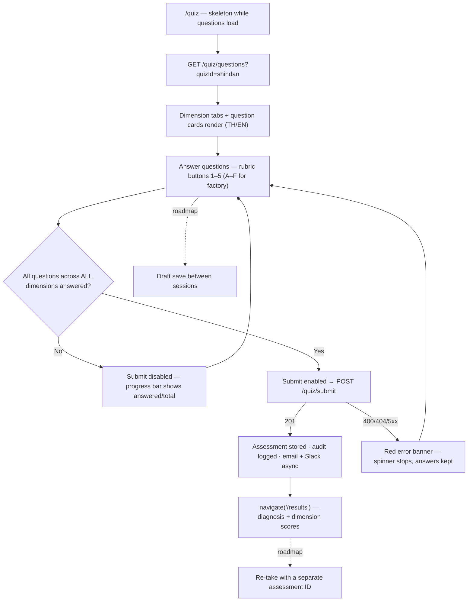
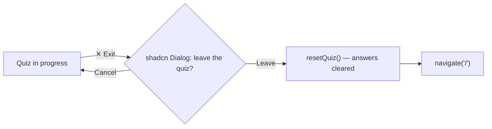

# Quiz (Assessment) — User Journeys

How each app's users move through the assessment. See [README.md](./README.md) for the
design spec and [feature-spec.md](./feature-spec.md) for the formal requirements.

> Reflects what is **built today** — the full journey is shipped. Roadmap ideas (draft
> save, re-take) are shown dashed.

---

## Table of Contents

- [Factory operator — taking the assessment](#factory-operator--taking-the-assessment)
- [Factory operator — exiting mid-quiz](#factory-operator--exiting-mid-quiz)

---

## Factory operator — taking the assessment

A registered operator on `web-app` completes the dimension-tabbed quiz and lands on
their result. Free navigation — any dimension tab is clickable at any time.

**Guard(s):** authenticated app route — Firebase Bearer token required on all three quiz
endpoints; the backend takes the UID from `middleware.GetUID(r)` and scores server-side
only. Detail in [quiz-page.md](./quiz-page.md) and
[scoring-engine.md](./scoring-engine.md).

---

## Factory operator — exiting mid-quiz

Answers live only in Redux — leaving the quiz is destructive, so it is guarded by a
confirmation dialog.

**Guard(s):** none beyond the authenticated route — the dialog is UX protection against
losing answers (no draft save exists). Detail in [quiz-page.md](./quiz-page.md).

---

*See [README.md](./README.md) for the feature spec.*

---

*Version: 1.0.0*
*Last updated: 3 July 2026*
