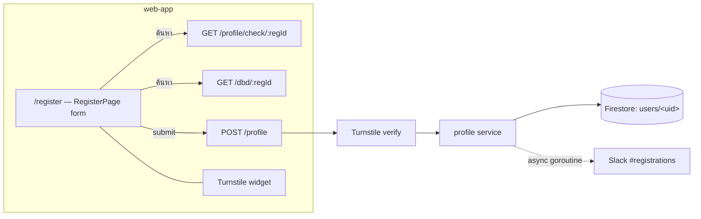

# Company Registration — Feature Spec

**Status:** ✅ Shipped — one-time onboarding form live end to end (DBD lookup, Turnstile, consent, Slack notify).

---

## Table of Contents

1. [App surfaces](#app-surfaces)
2. [Summary](#summary)
3. [Goals & Non-Goals](#goals--non-goals)
4. [Current State](#current-state)
5. [Design Overview](#design-overview)
6. [Security Invariants](#security-invariants)
7. [Acceptance Criteria](#acceptance-criteria)
8. [Testing](#testing)
9. [Open Items & Future Work](#open-items--future-work)
10. [References](#references)

---

> One-time onboarding form that creates a user profile after Google Sign-In, linking a
> verified Firebase user to a company so they can proceed to the factory health-check quiz.
> Touches the `profile` service (create + duplicate check), the `dbd` service (company
> lookup + size estimation) and the `notification` service (Slack). Primary actor: a factory
> operator registering on `web-app`. Bot protection via Cloudflare Turnstile; PDPA consent
> capture rides on the same form (owned by the [legal](../legal/README.md) feature).

This README is the design index for the Company Registration feature. The formal
requirements live in the ISO 29110 SRS — see [feature-spec.md](./feature-spec.md). Each
non-trivial component is documented in a dedicated sub-document; see
[References](#references).

---

## App surfaces

| web-app | backend |
|:-------:|:-------:|
| ✅ | ✅ |

`web-app` renders the `/register` form (with DBD lookup, Turnstile and the consent
checkboxes); the backend `profile` service creates the Firestore document and fires the
Slack notification. No `web-official` surface. Per-app flows live in
[user-journeys.md](./user-journeys.md).

---

## Summary

| Component | Description |
|-----------|-------------|
| **Registration form** (web-app) | Single-page form at `/register` — company, contact and consent sections validated with Zod — see [registration-form.md](./registration-form.md) |
| **DBD lookup** (web-app + backend) | 13-digit registration ID → auto-fill company name + estimated size from the DBD Open Data API; duplicate-ID pre-check with a blue notice — see [dbd-lookup.md](./dbd-lookup.md) |
| **Turnstile widget** (web-app + backend) | Cloudflare Turnstile bot protection; skipped when `VITE_CF_TURNSTILE_SITE_KEY` is absent — see [turnstile-widget.md](./turnstile-widget.md) |
| **Profile creation** (backend) | `POST /api/v1/profile` creates the `users/<uid>` Firestore document and responds with the full profile |
| **Slack notification** (backend) | `NotifyRegistration()` posts to #registrations on every new sign-up (async goroutine) |
| **Consent capture** (web-app) | Terms + Privacy checkbox blocks submit; marketing consent optional — detail owned by [legal](../legal/README.md) |

---

## Goals & Non-Goals

From [feature-spec.md § 2](./feature-spec.md#2-goals--non-goals):

### Goals

- Collect the minimum company data required to run the Shindan assessment.
- Auto-fill from the DBD API to reduce manual typing for factory operators.
- Validate the 13-digit registration ID format client- and server-side.
- Prevent duplicate registrations — a re-used `companyRegId` creates a second profile for a different Firebase UID but links it to the same company context.
- Protect the endpoint against bots with Cloudflare Turnstile.
- Capture PDPA consent (terms + privacy) and optional marketing consent.
- Notify the #registrations Slack channel on every new sign-up.
- TH/EN bilingual — all copy goes through `useLocale()`.

### Non-Goals

- Email verification (Firebase/Google handles identity).
- In-form company search by name (registration ID is the lookup key).
- Self-service account deletion (admin operation only).
- Multi-step wizard — the form is a single scrollable page.

---

## Current State

See [status.md](./status.md) for the per-component implementation checklist. Everything in
scope is shipped; no open build items.

---

## Design Overview

Form fields, industry-type enum (16 values) and the DBD register-capital → company-size
mapping are specified in [feature-spec.md § 4](./feature-spec.md#4-form-fields). The DBD
lookup and submit sequences are in [feature-spec.md § 5–6](./feature-spec.md#5-dbd-lookup-flow).

### Data model

| Collection | Document ID | Key fields | Notes |
|------------|-------------|------------|-------|
| `users` | `<userID>` (Firebase UID) | `companyName` · `companyRegId` · `industryType` · `companySize` · `contactName/Email/Phone` · `role: "user"` · `consentVersion` · `consentAt` · `emailNotifications: bool` · `createdAt` / `updatedAt` | Timestamps + `role` + `consentAt` set by the service, never the client — full field table in [feature-spec.md § 9](./feature-spec.md#9-firestore-document) |

### API contract

| Method | Path | Auth / Role | Purpose |
|--------|------|-------------|---------|
| `POST` | `/api/v1/profile` | Bearer | Create profile → `201 {"success": true, "data": ProfileResponse}` · `400 VALIDATION_ERROR / CAPTCHA_FAILED` · `401` · `409 CONFLICT` (`ErrAlreadyRegistered`) |
| `GET` | `/api/v1/profile/check/:regId` | Bearer | Duplicate-ID pre-check → `{registered: bool, companyName?, industryType?, companySize?}` |
| `GET` | `/api/v1/dbd/:regId` | Bearer | DBD Open Data company lookup (owned by the [dbd](../dbd/feature-spec.md) feature) |

### Route guard

`/register` is guarded synchronously before any form renders: unauthenticated → `/`;
registered → `/quiz` (or `/results` if the quiz is complete). The Redux `auth` slice
provides `isRegistered` and `hasCompletedQuiz`
([feature-spec.md § 7](./feature-spec.md#7-route-guard-logic)).

---

## Security Invariants

| Invariant | Where enforced |
|-----------|----------------|
| UID taken from `middleware.GetUID(r)`, never the request body/path | `services/profile/handler.go` |
| Turnstile token verified server-side before the profile is created | `services/profile/handler.go` + `pkg/turnstile.go` |
| `role`, `consentAt`, `createdAt`, `updatedAt` set by the service, not accepted from the client | `services/profile/service.go` |
| One profile per UID — duplicate create returns `409` (`ErrAlreadyRegistered`) | `services/profile/service.go` |
| 13-digit `companyRegId` validated client- (Zod) and server-side | `RegisterPage.tsx` + `services/profile/` |
| Contact email pre-filled from the Firebase token and not editable | `RegisterPage.tsx` (disabled field) |

---

## Acceptance Criteria

Verbatim from [feature-spec.md § 13](./feature-spec.md#13-acceptance-criteria); the spec
marks the feature Done, so all are ticked:

- [x] Unauthenticated users who navigate to `/register` are redirected to `/`.
- [x] Already-registered users are redirected to `/quiz` (or `/results` if quiz done).
- [x] Entering a valid 13-digit reg ID and clicking ค้นหา fetches company info from DBD and pre-fills company name and estimated size.
- [x] If the reg ID is already in use, a blue notice is shown and the form is pre-filled with the existing company data; the user can still complete registration.
- [x] All required fields show validation errors when submitted empty.
- [x] The 13-digit reg ID field rejects non-numeric and <13 or >13 digit values.
- [x] Contact email is pre-filled from Firebase and cannot be edited.
- [x] Accepting terms is mandatory — the form cannot be submitted without checking the box.
- [x] Marketing consent is optional and defaults unchecked.
- [x] When `VITE_CF_TURNSTILE_SITE_KEY` is set, the Turnstile widget is rendered and the form cannot be submitted without a valid token.
- [x] A successful submission dispatches `setProfile` to Redux, navigates to `/quiz`, and fires `registration_success`.
- [x] A Slack notification is sent to #registrations after every successful registration.
- [x] All copy is rendered in the active locale (TH/EN) — no hardcoded strings.
- [x] `make lint-web` and `make test-web` pass.

---

## Testing

From [feature-spec.md § 14](./feature-spec.md#14-testing):

| Suite | Target | Notes |
|-------|--------|-------|
| Unit (Vitest) | `estimateCompanySize` edge cases (zero, boundary values); Zod schema valid/invalid payloads | web-app |
| Integration (`handler_test.go`) | `POST /profile` → 201 valid · 409 duplicate UID · 400 missing fields · Turnstile failure path | `services/profile/` |
| E2E (Playwright) | Happy path to `/quiz` · DBD prefill · empty-form validation · already-registered redirect guard | web-app |

Coverage target: critical `services/` ≥ 80% (`go test ./... -cover`).

---

## Open Items & Future Work

None — the feature is shipped; changes go through a new CR in
[docs/iso29110/change-request-log.md](../../iso29110/change-request-log.md).

---

## References

### Sub-documents

| Doc | Covers |
|-----|--------|
| [feature-spec.md](./feature-spec.md) | ISO 29110 SRS — formal requirements, field tables, sequence diagrams |
| [status.md](./status.md) | Current implementation status per component |
| [user-journeys.md](./user-journeys.md) | Factory-operator registration flow |
| [registration-form.md](./registration-form.md) | `RegisterPage` form, Zod schema, submit flow, analytics events |
| [dbd-lookup.md](./dbd-lookup.md) | DBD lookup + duplicate-ID check + company-size estimation |
| [turnstile-widget.md](./turnstile-widget.md) | Cloudflare Turnstile widget + skip behaviour |
| [mockups/app.md](./mockups/app.md) | ASCII wireframes — `/register` states (web-app) |

### Cross-references

- [Legal](../legal/README.md) — owns the consent checkboxes' policy content and the `LegalModal` opened from the form
- [DBD](../dbd/feature-spec.md) — owns the `GET /api/v1/dbd/:regId` company lookup endpoint
- [Notification](../notification/feature-spec.md) — owns `NotificationService` / Slack delivery
- [Profile](../profile/feature-spec.md) — owns the profile document lifecycle after registration
- [User flow](../user-flow.md) — app-wide navigation map
- [Architecture overview](../../architecture/overview.md)

### External standards

- DBD Open Data API (Thai Department of Business Development company registry)
- Thailand PDPA — พ.ร.บ. คุ้มครองข้อมูลส่วนบุคคล พ.ศ. 2562 (consent capture)

---

*Version: 1.0.0*
*Last updated: 3 July 2026*
